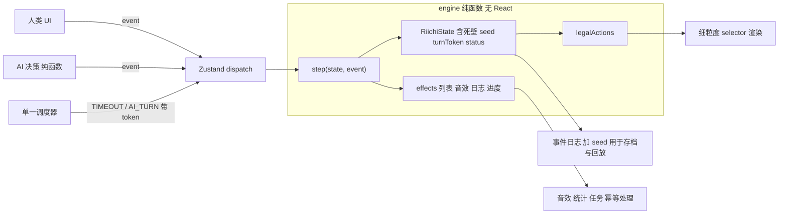

# 日麻部分评估与优化改进计划

## 一、现状评估（结论先行）

- **算分内核：良好。** 和了判定和符番点都交给 `riichi-rs-bundlers`（WASM），赤宝牌、里宝牌、本场、立直棒、不听罚符都已接入。16 个日麻测试文件共 121 个用例全部通过。
- **规则完整度：中等偏弱。** 缺死壁建模、双立直/天地和、kuikae（食替）、双响/三家和、流局满贯、包牌、西入终局。另外有多个确定的 bug，下文列出。
- **引擎架构：可维护性差。** 状态放在 Zustand，但推进一局要靠 `flows/*` 里的多个 `useEffect` + `setTimeout`。人类、AI、超时三条路径各自拼一份 `setGame`，定时回调还会直接写回闭包里捕获的旧 `game`。结果是改一条规则要改 2 到 3 处，而且没法脱离 React 模拟一整局。
- **AI：偏弱。** 不立直时基本是摸什么打什么，见 [drawAiFlowAfterDraw.ts](src/pages/mahjong/japanese/flows/drawAiFlowAfterDraw.ts)；立直按 35% 随机决定；手牌评价不看向听数；防守只有现物和筋。
- **体验：桌面端闭环已经完整**（听牌提示、振听显示、计时、结算明细、回退、日志都有）。缺的是立直横置牌、自动和了/自动过开关、键盘操作、危险牌提示和出牌动效。
- **i18n 与无障碍：** 页面里有大量硬编码中文（index、RulesView、GuidePanel、Modals、日志和振听原因），缺失的 key 会静默回退成中文；viewport 设置了 `user-scalable=no`；弹窗没有焦点管理。
- **性能：** 250ms 的时钟会触发整页重渲染；`canDeclareRiichi` 没有缓存，每次渲染都跑一遍 WASM；牌图集约 2.1MB，WAV 音频约 4.6MB（其中 `ron.wav` 2.8MB）。
- **存档：** 没有中途存档，也没有牌谱。洗牌直接用 `Math.random()`，无法注入随机种子。
- **现有测试失败 1 个：** [tests/pages-games.test.tsx](tests/pages-games.test.tsx) 第 160 行，断言的 aria-label 和 [RiichiDesktopStage.tsx](src/pages/mahjong/japanese/components/RiichiDesktopStage.tsx) 的实际值不一致。

### 已核实的高优先级 bug

1. **没有死壁**：[gameState.ts](src/pages/mahjong/japanese/gameState.ts) 第 30-32 行只取走 2 张，剩下 81 张全当牌山。结果是多摸约 12 张，岭上牌、杠宝牌从普通牌山取，海底/河底时机也错。
2. **一发自摸被提前清掉**：[drawFlowTransitions.ts](src/pages/mahjong/japanese/shared/drawFlowTransitions.ts) 第 18-20 行在摸牌时就把 `ippatsuPossible` 置为 false，而自摸判定在这之后才发生。
3. **立直不锁舍牌**：`doRiichi` 只检查"存在某种听牌打法"，不校验最后实际打出的牌，也不检查牌山是否还有至少 4 张；`riichiDiscard` 字段从来没有被写入。AI 也有同样的问题。
4. **有副露时暗杠失败**：暗杠处写死了 `h0.length !== 10`（`useRiichiWinSpecialActions.ts` 第 91 行，AI 路径同样如此）。
5. **立直后暗杠不检查听牌是否改变**；AI 的暗杠分支放在立直锁定判断之前。
6. **牌山剩 1 张时加杠会卡死**：`applyKakanRinshanAfterPass` 牌不够时直接返回原状态，一直停在 claim 阶段。明杠也有类似的校验不一致。
7. **AI 荣和被人类的 `canRon` 拦住**：[useRiichiClaimFlow.ts](src/pages/mahjong/japanese/flows/useRiichiClaimFlow.ts) 第 89 行的条件导致 AI 超时后被判"放弃荣和"并进入振听。
8. **抢杠窗口仍显示吃/碰/杠按钮**，而且点击后不会清掉 `lastClaimWasKakan`。
9. **途中流局判定先于荣和窗口**（四家立直、四风连打、四开杠），导致该响的荣和被跳过。
10. **流局或终局后流程没有冻结**：AI 和人类的摸牌 effect 不检查 `ryuukyoku`/`matchEnd`，会在弹窗背后继续推进。
11. **进入西场后不会终局**：`riichiGameEnd.ts` 只判断东 4 和南 4。另外南 4 流局庄家听牌时会被误判为和了止め。
12. **AI 吃碰后的舍牌固定是 `hand[0]`**，策略算出的 `discardTile` 没有被使用。

## 二、目标架构

要点：

- 所有变化都通过 `dispatch(event)` → `step` 完成。人类和 AI 只负责产出事件。
- 定时回调必须带上 `turnToken`/`claimToken`，token 不匹配就丢弃，不再写回旧状态。
- `status: 'playing' | 'roundEnd' | 'matchEnd'` 合并掉现在分散的 `ryuukyoku`/`winResult`/`matchEnd` 三个字段。

## 三、分阶段计划

### 阶段 0：基线准备
- 修复那个 aria-label 测试失败。
- 新增测试用的牌面记法解析器，例如 `tiles('123m456p789s11z')` 放在 `tests/helpers/riichiTiles.ts`；在 [rstest.config.ts](rstest.config.ts) 里开启覆盖率。
- 让 `createRiichiDeck`/`initRiichiGame` 支持注入 RNG，写一个带种子的 `mulberry32`。

### 阶段 1：抽出纯函数引擎（在 `src/pages/mahjong/japanese/engine/`）
- `state.ts`：引入死壁（14 张：岭上 4 张、宝牌/里宝牌指示牌各 5 张）、`turnToken`、`status`、`firstTurnUninterrupted`、`kuikaeForbidden`、`riichiDiscardIndex`。
- `events.ts` 定义这些事件：DRAW、DISCARD、RIICHI、CHI、PON、MINKAN、ANKAN、KAKAN、RON、TSUMO、PASS、KYUUSHU、TIMEOUT、NEXT_ROUND。
- `step.ts`：`step(state, event, rules) -> { state, effects }`；`legalActions(state, seat)` 作为唯一的合法性来源，UI 和 AI 共用。
- `rules.ts`：规则配置，默认对齐雀魂段位场：双响开启、三家和流局、包牌、复合役满开启、切上满贯关闭、西入/和了止め开启。
- 把 `actions/*`、`flows/*` 缩减成薄层：一个调度 hook，加上 AI 与超时驱动。去掉 `shared/*` 里重复的状态转换。
- 删除 [mahjongRiichi.ts](src/lib/mahjongRiichi.ts) 里旧的 TS 算分代码（`calcFu`/`calcScore`/`computeYaku` 等）。它们结果是错的，而且现在也不在生产路径上。
- 验收：`tests/riichi-engine-sim.test.ts` 用固定种子 + AI 无头跑完整半庄 N 局，每一步都检查不变量（136 张守恒、点数守恒、不卡死）。

### 阶段 2：在引擎上修规则
- 修复第一节列出的 12 个 bug。
- 补齐缺失规则：双立直/天和/地和/人和（传入 `first_take`）、kuikae、双响/三家和、流局满贯、包牌、西入终局、南 4 和了止め的判定修正。
- 开杠后追加里宝牌指示牌；支持用手里已有的第 4 张做加杠。
- 每一条修复都配一条先写好的失败测试：抢杠、岭上、海底/河底、立直后暗杠、双响、kuikae、各种听牌人数下的不听罚符、连续本场、多张赤五。

### 阶段 3：AI 棋力
- 实现向听数计算和有效进张统计（新文件 `src/lib/riichiShanten.ts`，纯函数，可缓存）。
- 舍牌：先比向听数，再比进张数，最后看打点和役（役牌、断幺、混一色倾向）。
- 立直判断：综合待牌枚数、打点、巡目、亲子关系和点差，去掉随机成分。
- 防守：在现物/筋的基础上加入壁、字牌已见枚数、立直宣言牌和早巡筋，把对副露手的威胁也算进来，并按"攻守价值比"决定是否弃和。
- 鸣牌：只有副露后向听数下降并且确实有役时才鸣；吃碰后按策略舍牌。
- 可选的难度档位（初级 / 标准），通过规则配置切换。

### 阶段 4：性能
- 计时拆成独立的小组件自行订阅，停止 250ms 触发整页重渲染；不在对局中时不启动 interval。
- 在引擎层按手牌的规范化 key 对待牌、立直可行性、结算预览做 memo 缓存；听牌提示只在侧栏打开时计算。
- `riichi-rs-bundlers` 改为动态 import，并在进入对局前预热。
- 牌图集转 WebP/AVIF；音频转 OGG/MP3 并按需加载；桌布去掉 WebP + SVG 两层背景重复叠加。

### 阶段 5：对局体验
- 立直宣言牌横置；鸣牌的来源方向按座位显示。
- 设置开关：自动和了、不鸣牌、自动摸切、鸣牌前确认，存到玩家档案里。
- 键盘操作：左右键选牌、Enter/Space 打出，快捷键 R/T/C/P/K/Esc。
- 选中牌时高亮同种牌；立直后显示危险度（复用 AI 的防守评分，作为可开关的训练辅助）。
- 动效：出牌飞入牌河、鸣牌摊开、立直棒落桌、宝牌翻开，遵守 reduced-motion 设置。

### 阶段 6：i18n 与无障碍
- 把页面、组件、日志、振听原因、`formatPoints` 里的硬编码文案全部迁到 [i18n.ts](src/lib/i18n.ts)。引擎产出的日志只带 key 和参数，不带成品文案。
- 开发环境下缺失 key 时打出 warn，不再静默回退；牌名的 aria-label 跟随当前语言。
- 去掉 `user-scalable=no`；菜单和结果弹窗改用 shadcn Dialog（带焦点陷阱、Esc 关闭、关闭后焦点回到原处）；按钮点击区域至少 44px。

### 阶段 7：存档与回放
- 存档内容为 `{ seed, rules, events[] }`（写入 localStorage），重放即可恢复局面；进入页面时提示"继续上次对局"。
- 撤销改为回退事件，同时恢复 token 和计时；进度相关副作用按 `roundId` 保证幂等，避免重复领奖。
- 牌谱查看器：逐步前进/后退、跳到某局；支持导出和导入 JSON。

## 四、执行顺序与风险

- 阶段 0 到 2 是地基，必须按顺序做；阶段 3 到 6 之间互相独立，可以并行或调整顺序；阶段 7 依赖阶段 1 的事件模型。
- 阶段 1 是风险最大的一步。重构期间保留现有 121 个测试作为回归护栏，最后一步再切换 UI 接线，每个阶段结束时都跑 `pnpm run check` 和 `pnpm run test`。
- 文档同步：完成后更新 [docs/PLAN.md](docs/PLAN.md) 和 [docs/AGENTS.md](docs/AGENTS.md) 里的测试数量，以及日麻规则范围说明。