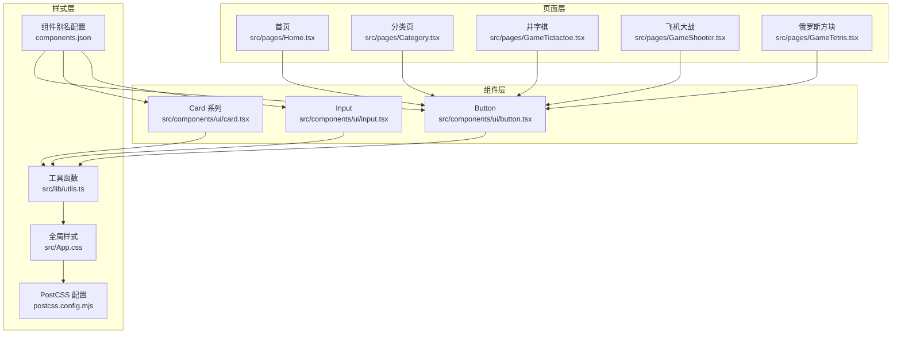
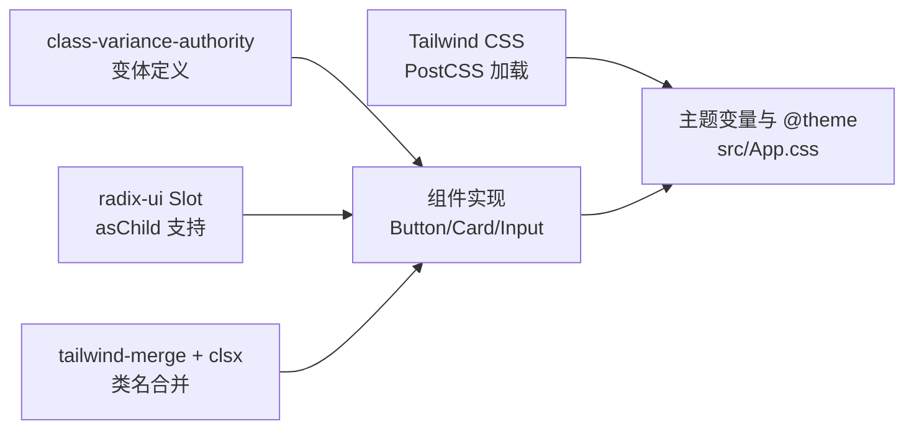
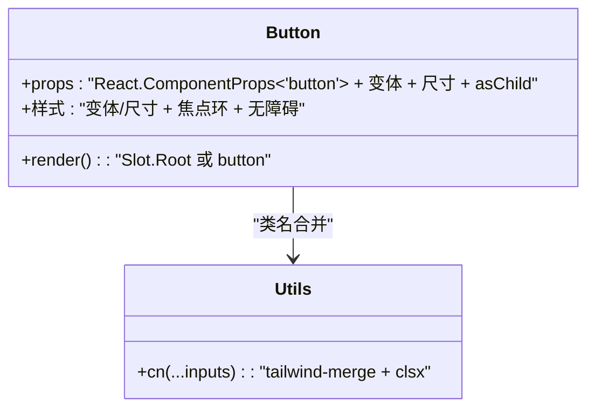
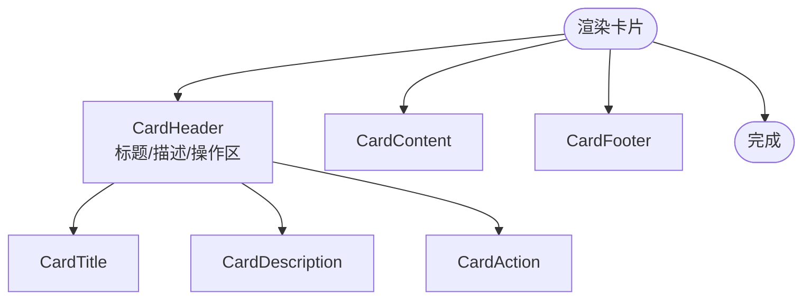
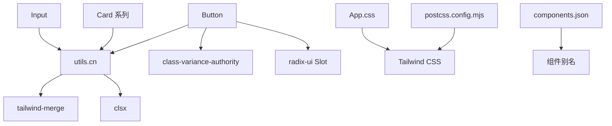

# UI组件库

<cite>
**本文引用的文件**
- [button.tsx](file://src/components/ui/button.tsx)
- [card.tsx](file://src/components/ui/card.tsx)
- [input.tsx](file://src/components/ui/input.tsx)
- [utils.ts](file://src/lib/utils.ts)
- [Home.tsx](file://src/pages/Home.tsx)
- [Category.tsx](file://src/pages/Category.tsx)
- [GameTictactoe.tsx](file://src/pages/GameTictactoe.tsx)
- [GameShooter.tsx](file://src/pages/GameShooter.tsx)
- [GameTetris.tsx](file://src/pages/GameTetris.tsx)
- [App.css](file://src/App.css)
- [postcss.config.mjs](file://postcss.config.mjs)
- [components.json](file://components.json)
- [package.json](file://package.json)
- [games.ts](file://src/data/games.ts)
</cite>

## 目录
1. [简介](#简介)
2. [项目结构](#项目结构)
3. [核心组件](#核心组件)
4. [架构总览](#架构总览)
5. [组件详解](#组件详解)
6. [依赖关系分析](#依赖关系分析)
7. [性能考量](#性能考量)
8. [故障排查指南](#故障排查指南)
9. [结论](#结论)
10. [附录](#附录)

## 简介
本文件为 Rsbuild2 项目的 UI 组件库文档，聚焦可复用的基础 UI 组件（按钮、卡片、输入框）的设计原则与实现方式，涵盖属性接口、事件处理、样式定制、响应式与无障碍支持，并结合游戏页面示例说明组件在不同场景中的正确使用方法。同时阐述 Tailwind CSS 与 PostCSS 的集成方式、样式系统与主题变量的使用规范，以及扩展新组件的最佳实践。

## 项目结构
UI 组件集中位于 src/components/ui 目录，采用按功能拆分的文件组织方式；样式系统通过 Tailwind CSS 与自定义主题变量统一管理；各页面通过路由引入组件并组合使用。

**图表来源**
- [button.tsx](file://src/components/ui/button.tsx#L1-L65)
- [card.tsx](file://src/components/ui/card.tsx#L1-L93)
- [input.tsx](file://src/components/ui/input.tsx#L1-L22)
- [utils.ts](file://src/lib/utils.ts#L1-L7)
- [Home.tsx](file://src/pages/Home.tsx#L1-L43)
- [Category.tsx](file://src/pages/Category.tsx#L1-L132)
- [GameTictactoe.tsx](file://src/pages/GameTictactoe.tsx#L1-L92)
- [GameShooter.tsx](file://src/pages/GameShooter.tsx#L1-L53)
- [GameTetris.tsx](file://src/pages/GameTetris.tsx#L1-L21)
- [App.css](file://src/App.css#L1-L245)
- [postcss.config.mjs](file://postcss.config.mjs#L1-L6)
- [components.json](file://components.json#L1-L22)

**章节来源**
- [button.tsx](file://src/components/ui/button.tsx#L1-L65)
- [card.tsx](file://src/components/ui/card.tsx#L1-L93)
- [input.tsx](file://src/components/ui/input.tsx#L1-L22)
- [utils.ts](file://src/lib/utils.ts#L1-L7)
- [Home.tsx](file://src/pages/Home.tsx#L1-L43)
- [Category.tsx](file://src/pages/Category.tsx#L1-L132)
- [GameTictactoe.tsx](file://src/pages/GameTictactoe.tsx#L1-L92)
- [GameShooter.tsx](file://src/pages/GameShooter.tsx#L1-L53)
- [GameTetris.tsx](file://src/pages/GameTetris.tsx#L1-L21)
- [App.css](file://src/App.css#L1-L245)
- [postcss.config.mjs](file://postcss.config.mjs#L1-L6)
- [components.json](file://components.json#L1-L22)

## 核心组件
- 按钮 Button：支持多种语义与尺寸变体，具备无障碍与焦点可见性样式，支持作为容器节点渲染。
- 卡片 Card 系列：提供卡片容器与标题、描述、内容、操作、页脚等子区域，便于快速搭建信息区块。
- 输入框 Input：统一的输入样式与焦点环、无效状态样式，适配表单场景。

以上组件均通过工具函数进行类名合并，确保样式可组合、可覆盖。

**章节来源**
- [button.tsx](file://src/components/ui/button.tsx#L1-L65)
- [card.tsx](file://src/components/ui/card.tsx#L1-L93)
- [input.tsx](file://src/components/ui/input.tsx#L1-L22)
- [utils.ts](file://src/lib/utils.ts#L1-L7)

## 架构总览
组件库遵循“原子化样式 + 变体系统 + 工具函数”的架构模式：
- 使用 class-variance-authority 定义变体（variant/size），生成稳定的基类集合。
- 使用 radix-ui 的 Slot 实现 asChild 渲染，提升可组合性。
- 使用 tailwind-merge 与 clsx 合并类名，避免冲突与重复。
- Tailwind CSS 通过 PostCSS 插件加载，配合主题变量与 @theme 指令实现深浅色主题切换与色彩一致性。

**图表来源**
- [button.tsx](file://src/components/ui/button.tsx#L1-L65)
- [card.tsx](file://src/components/ui/card.tsx#L1-L93)
- [input.tsx](file://src/components/ui/input.tsx#L1-L22)
- [utils.ts](file://src/lib/utils.ts#L1-L7)
- [App.css](file://src/App.css#L1-L245)
- [postcss.config.mjs](file://postcss.config.mjs#L1-L6)

## 组件详解

### 按钮 Button
- 设计原则
  - 语义化变体：default、destructive、outline、secondary、ghost、link。
  - 尺寸体系：default、xs、sm、lg、icon 及其变体 icon-xs/icon-sm/icon-lg。
  - 可组合渲染：支持 asChild 使用 Slot Root 包裹非 button 元素。
  - 无障碍与焦点：内置 focus-visible ring 与 aria-invalid 样式，保证键盘可达性与错误状态反馈。
- 关键实现要点
  - 使用 cva 生成变体基类，再通过 cn 合并传入 className。
  - 支持透传原生 button 属性，如 onClick、disabled、type 等。
- 在页面中的使用示例
  - 首页入口按钮、分类页“开始游戏/返回首页”按钮、井字棋“重开/返回列表”按钮、飞机大战/俄罗斯方块中的控制按钮。

**图表来源**
- [button.tsx](file://src/components/ui/button.tsx#L1-L65)
- [utils.ts](file://src/lib/utils.ts#L1-L7)

**章节来源**
- [button.tsx](file://src/components/ui/button.tsx#L1-L65)
- [Home.tsx](file://src/pages/Home.tsx#L31-L33)
- [Category.tsx](file://src/pages/Category.tsx#L107-L121)
- [GameTictactoe.tsx](file://src/pages/GameTictactoe.tsx#L77-L85)
- [GameShooter.tsx](file://src/pages/GameShooter.tsx#L3-L53)
- [GameTetris.tsx](file://src/pages/GameTetris.tsx#L1-L21)

### 卡片 Card 系列
- 设计原则
  - 结构化布局：CardHeader/CardTitle/CardDescription/CardAction/CardContent/CardFooter 组合使用，形成清晰的信息层次。
  - 响应式网格：部分区域使用 @container 指令与 CSS Grid，实现复杂布局下的自适应。
  - 可插拔操作区：CardAction 支持放置按钮或图标等操作元素。
- 关键实现要点
  - 每个子组件均设置 data-slot，便于调试与测试定位。
  - 通过 cn 合并传入 className，允许外部覆盖样式。
- 在页面中的使用示例
  - 分类页每个游戏卡片的标题、描述、标签与按钮组合。

**图表来源**
- [card.tsx](file://src/components/ui/card.tsx#L1-L93)

**章节来源**
- [card.tsx](file://src/components/ui/card.tsx#L1-L93)
- [Category.tsx](file://src/pages/Category.tsx#L64-L124)

### 输入框 Input
- 设计原则
  - 统一样式：统一的边框、内边距、字体大小与过渡动画。
  - 焦点与无效状态：聚焦时的 ring 效果与 aria-invalid 的错误边框。
  - 文件选择器与占位符：针对 file 类型与 placeholder 文案的样式适配。
- 关键实现要点
  - 透传原生 input 属性，如 type、value、onChange、onBlur 等。
  - 使用 cn 合并类名，支持外部覆盖。
- 在页面中的使用示例
  - 表单场景（如搜索、筛选、登录等）可直接复用该组件。

**章节来源**
- [input.tsx](file://src/components/ui/input.tsx#L1-L22)

## 依赖关系分析
- 组件依赖
  - Button/ Input 依赖 utils.cn 进行类名合并。
  - Button 使用 class-variance-authority 与 radix-ui Slot。
  - Card 系列组件内部组合，不跨文件依赖。
- 样式依赖
  - App.css 引入 Tailwind 与动画库，定义主题变量与 @theme。
  - postcss.config.mjs 通过 @tailwindcss/postcss 加载 Tailwind。
  - components.json 提供组件别名与 Tailwind 配置路径，便于工具链识别。

**图表来源**
- [button.tsx](file://src/components/ui/button.tsx#L1-L65)
- [input.tsx](file://src/components/ui/input.tsx#L1-L22)
- [card.tsx](file://src/components/ui/card.tsx#L1-L93)
- [utils.ts](file://src/lib/utils.ts#L1-L7)
- [App.css](file://src/App.css#L1-L245)
- [postcss.config.mjs](file://postcss.config.mjs#L1-L6)
- [components.json](file://components.json#L1-L22)

**章节来源**
- [package.json](file://package.json#L15-L41)
- [components.json](file://components.json#L1-L22)
- [postcss.config.mjs](file://postcss.config.mjs#L1-L6)
- [App.css](file://src/App.css#L1-L245)

## 性能考量
- 类名合并优化
  - 使用 tailwind-merge 合并类名，避免重复与冲突，减少运行时样式抖动。
- 变体渲染
  - cva 生成的变体类是静态字符串，渲染成本低；尽量避免在渲染路径中动态拼接大量类名。
- asChild 渲染
  - 使用 Slot Root 包裹可减少不必要的 DOM 层级，降低渲染开销。
- 样式体积
  - 通过 Tailwind 的 purge 机制与按需引入，避免打包冗余样式。

[本节为通用指导，无需列出具体文件来源]

## 故障排查指南
- 按钮焦点环与无障碍问题
  - 若发现焦点环不生效或颜色异常，检查是否正确应用 focus-visible 样式与主题变量。
  - 若 aria-invalid 不生效，确认父容器是否传递 aria-invalid 属性。
- 类名覆盖失效
  - 确认传入的 className 是否在 cn 合并后仍处于最后位置，避免被默认样式覆盖。
- 变体/尺寸未生效
  - 检查 variant 与 size 参数是否拼写正确，以及是否与组件默认值冲突。
- 卡片布局错乱
  - 检查 @container 与 CSS Grid 的使用是否正确，确认 data-slot 未被意外覆盖。
- Tailwind 样式未加载
  - 确认 App.css 正确引入 Tailwind，postcss.config.mjs 已启用 @tailwindcss/postcss，且构建工具已启用 PostCSS。

**章节来源**
- [button.tsx](file://src/components/ui/button.tsx#L1-L65)
- [card.tsx](file://src/components/ui/card.tsx#L1-L93)
- [input.tsx](file://src/components/ui/input.tsx#L1-L22)
- [utils.ts](file://src/lib/utils.ts#L1-L7)
- [App.css](file://src/App.css#L1-L245)
- [postcss.config.mjs](file://postcss.config.mjs#L1-L6)

## 结论
Rsbuild2 的 UI 组件库以简洁、可组合为核心设计目标，借助 class-variance-authority、radix-ui 与 Tailwind CSS，实现了高一致性的视觉与交互体验。通过统一的类名合并工具与主题变量体系，组件在不同页面中得以稳定复用。建议在新增组件时遵循现有模式：定义清晰的变体与尺寸、提供 asChild 支持、保持无障碍与焦点可见性，并通过工具函数进行类名合并，以确保可维护性与一致性。

[本节为总结性内容，无需列出具体文件来源]

## 附录

### 组件属性与事件接口概览
- Button
  - 属性：className、variant、size、asChild、原生 button 属性（onClick、disabled、type 等）
  - 事件：onClick 等原生事件透传
- Card 系列
  - 属性：className、原生 div 属性
  - 子组件：CardHeader/CardTitle/CardDescription/CardAction/CardContent/CardFooter
- Input
  - 属性：className、type、原生 input 属性（onChange、onBlur、value 等）

**章节来源**
- [button.tsx](file://src/components/ui/button.tsx#L41-L62)
- [card.tsx](file://src/components/ui/card.tsx#L5-L82)
- [input.tsx](file://src/components/ui/input.tsx#L5-L19)

### 样式系统与 Tailwind 集成
- 主题变量与 @theme
  - 在 App.css 中定义 CSS 变量与 @theme 规则，支持深浅色主题切换。
- PostCSS 配置
  - 通过 @tailwindcss/postcss 插件加载 Tailwind。
- 组件别名
  - components.json 提供组件、工具与 UI 的别名映射，便于工具链识别与自动导入。

**章节来源**
- [App.css](file://src/App.css#L1-L245)
- [postcss.config.mjs](file://postcss.config.mjs#L1-L6)
- [components.json](file://components.json#L1-L22)

### 响应式设计与无障碍支持
- 响应式
  - 使用 Tailwind 断点与 @container 指令实现多端自适应布局。
- 无障碍
  - 按钮内置 focus-visible ring 与 aria-invalid 样式，确保键盘可达性与错误状态可见。

**章节来源**
- [button.tsx](file://src/components/ui/button.tsx#L7-L39)
- [input.tsx](file://src/components/ui/input.tsx#L10-L15)

### 组件使用示例与最佳实践
- 示例页面
  - 首页：使用 Button 展示“进入”入口。
  - 分类页：卡片组合 + Button 控制“开始游戏/返回首页”。
  - 井字棋：使用 Button 进行“重开/返回列表”。
  - 飞机大战/俄罗斯方块：使用 Button 进行控制与导航。
- 最佳实践
  - 优先使用组件提供的变体与尺寸，避免直接硬编码样式。
  - 使用 asChild 包裹非 button 元素，提升可组合性。
  - 通过 data-slot 与 className 调试与覆盖样式，保持最小化覆盖。

**章节来源**
- [Home.tsx](file://src/pages/Home.tsx#L17-L36)
- [Category.tsx](file://src/pages/Category.tsx#L64-L124)
- [GameTictactoe.tsx](file://src/pages/GameTictactoe.tsx#L47-L88)
- [GameShooter.tsx](file://src/pages/GameShooter.tsx#L15-L53)
- [GameTetris.tsx](file://src/pages/GameTetris.tsx#L1-L21)

### 扩展新组件指南
- 设计步骤
  - 明确定义变体与尺寸，参考 Button 的变体系统。
  - 提供 asChild 支持，增强可组合性。
  - 保持无障碍与焦点可见性样式一致。
- 实现步骤
  - 在 src/components/ui 新建组件文件，导出默认组件与变体类型。
  - 使用 utils.cn 合并类名，确保可覆盖性。
  - 在 App.css 中补充必要的主题变量或 @theme 规则。
- 测试与验证
  - 在页面中引入组件进行功能与样式验证。
  - 使用 data-slot 辅助调试，确保结构清晰。

**章节来源**
- [button.tsx](file://src/components/ui/button.tsx#L1-L65)
- [utils.ts](file://src/lib/utils.ts#L1-L7)
- [App.css](file://src/App.css#L1-L245)