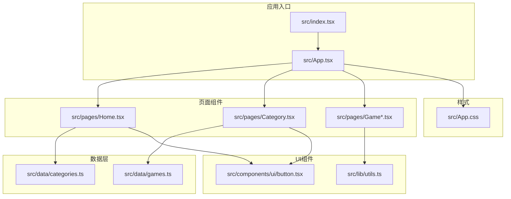
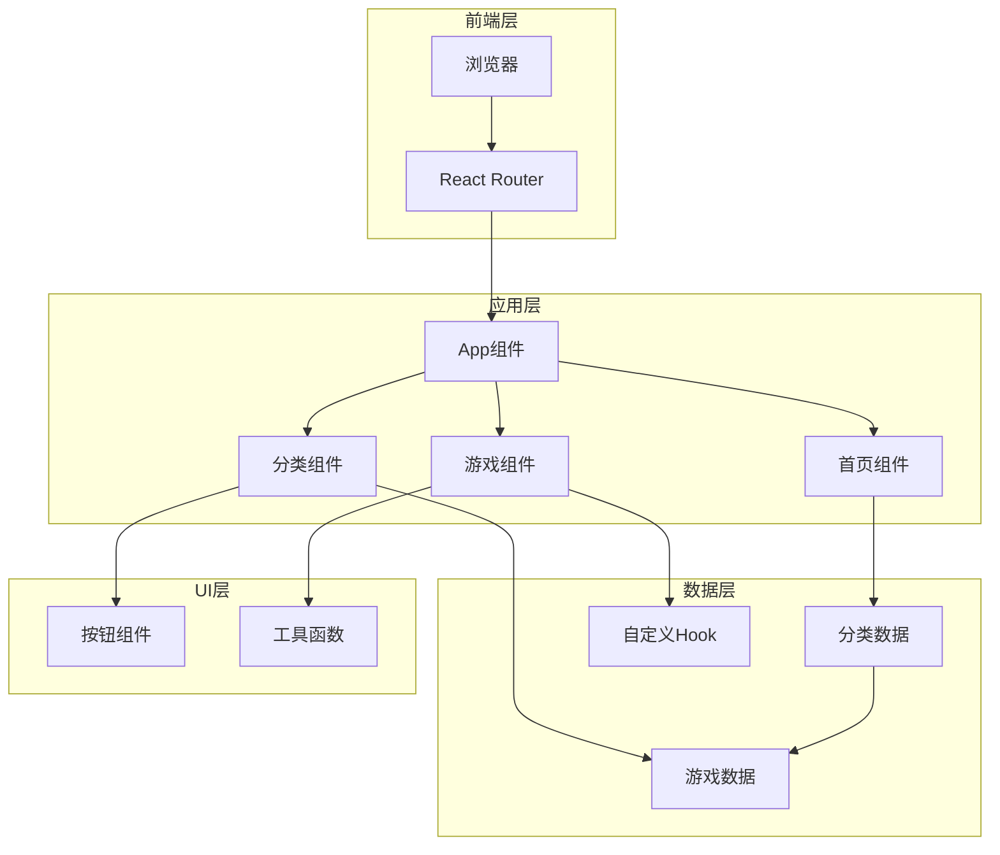
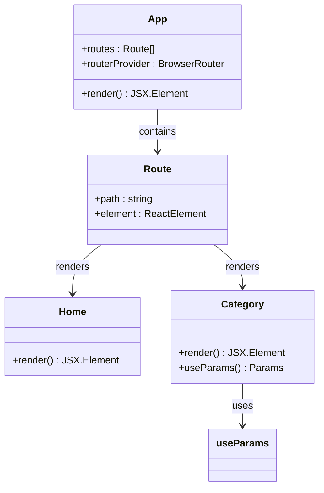
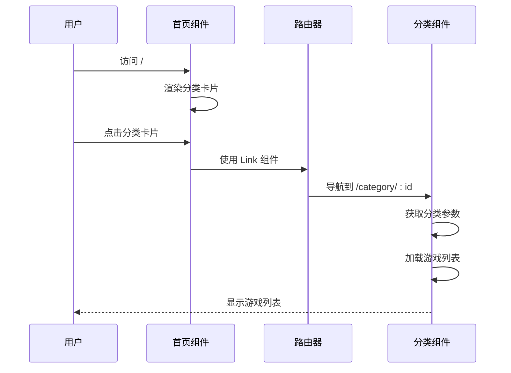
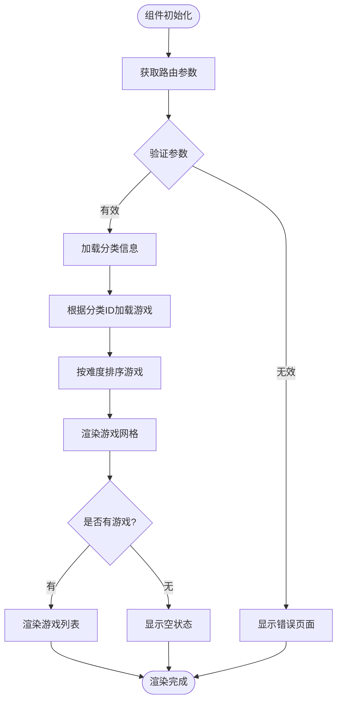
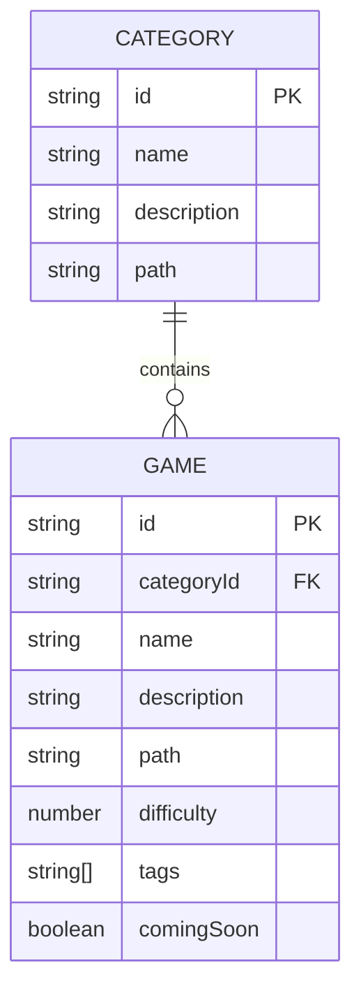
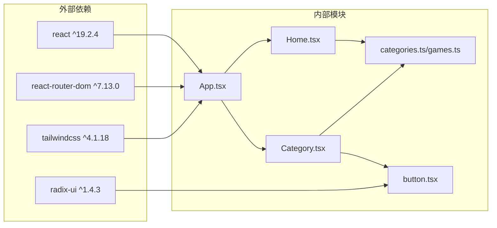

# 导航系统

<cite>
**本文档引用的文件**
- [src/App.tsx](file://src/App.tsx)
- [src/index.tsx](file://src/index.tsx)
- [src/pages/Home.tsx](file://src/pages/Home.tsx)
- [src/pages/Category.tsx](file://src/pages/Category.tsx)
- [src/pages/GameMahjongChinese.tsx](file://src/pages/GameMahjongChinese.tsx)
- [src/data/categories.ts](file://src/data/categories.ts)
- [src/data/games.ts](file://src/data/games.ts)
- [src/components/ui/button.tsx](file://src/components/ui/button.tsx)
- [src/lib/utils.ts](file://src/lib/utils.ts)
- [src/App.css](file://src/App.css)
- [rsbuild.config.ts](file://rsbuild.config.ts)
- [package.json](file://package.json)
</cite>

## 目录
1. [简介](#简介)
2. [项目结构](#项目结构)
3. [核心组件](#核心组件)
4. [架构概览](#架构概览)
5. [详细组件分析](#详细组件分析)
6. [依赖关系分析](#依赖关系分析)
7. [性能考虑](#性能考虑)
8. [故障排除指南](#故障排除指南)
9. [结论](#结论)

## 简介

Rsbuild2项目的导航系统基于React Router构建，提供了一个完整的单页应用导航解决方案。该系统实现了清晰的页面层次结构，包括首页设计、游戏分类页面和动态路由处理，支持用户在不同游戏类别之间的无缝跳转。

导航系统的核心特点包括：
- 基于React Router的声明式路由配置
- 动态路由参数处理（如分类ID）
- 类型安全的游戏数据管理
- 响应式UI组件集成
- SEO友好的URL结构

## 项目结构

项目采用模块化的文件组织方式，导航相关的代码主要分布在以下目录：

**图表来源**
- [src/index.tsx](file://src/index.tsx#L1-L14)
- [src/App.tsx](file://src/App.tsx#L1-L42)
- [src/pages/Home.tsx](file://src/pages/Home.tsx#L1-L43)
- [src/pages/Category.tsx](file://src/pages/Category.tsx#L1-L132)

**章节来源**
- [src/index.tsx](file://src/index.tsx#L1-L14)
- [src/App.tsx](file://src/App.tsx#L1-L42)

## 核心组件

导航系统的核心组件包括路由配置、页面组件和数据管理模块。每个组件都有明确的职责分工和清晰的接口定义。

### 路由配置组件

应用的路由配置集中在主应用组件中，使用React Router的声明式语法定义了完整的路由树：

- **首页路由**：`/` - 显示游戏分类入口
- **分类路由**：`/category/:categoryId` - 动态处理游戏分类
- **游戏路由**：`/game/:gameId` - 处理具体游戏页面

### 页面组件架构

系统包含三个主要页面组件，每个都针对特定的导航场景进行了优化：

1. **首页组件**：提供游戏分类的概览界面
2. **分类组件**：根据分类ID动态加载对应的游戏列表
3. **游戏组件**：处理具体游戏的交互逻辑

### 数据管理模块

数据层通过类型安全的接口管理游戏和分类信息，确保导航过程中的数据一致性。

**章节来源**
- [src/App.tsx](file://src/App.tsx#L18-L39)
- [src/data/categories.ts](file://src/data/categories.ts#L1-L34)
- [src/data/games.ts](file://src/data/games.ts#L1-L197)

## 架构概览

导航系统的整体架构采用了分层设计模式，确保了良好的可维护性和扩展性：

**图表来源**
- [src/App.tsx](file://src/App.tsx#L1-L42)
- [src/pages/Home.tsx](file://src/pages/Home.tsx#L1-L43)
- [src/pages/Category.tsx](file://src/pages/Category.tsx#L1-L132)
- [src/data/categories.ts](file://src/data/categories.ts#L1-L34)

### 路由配置策略

应用使用BrowserRouter作为路由容器，Routes组件定义了完整的路由树。这种设计提供了以下优势：

- **声明式配置**：路由规则以声明方式定义，易于理解和维护
- **嵌套路由**：支持复杂的页面层次结构
- **动态参数**：通过`:categoryId`实现动态路由参数处理

### 页面组件组织

页面组件按照功能进行模块化组织，每个组件都遵循单一职责原则：

- **Home组件**：负责游戏分类的展示和导航
- **Category组件**：处理分类筛选和游戏列表渲染
- **Game组件**：实现具体游戏的交互逻辑

**章节来源**
- [src/App.tsx](file://src/App.tsx#L18-L39)
- [src/pages/Home.tsx](file://src/pages/Home.tsx#L5-L40)
- [src/pages/Category.tsx](file://src/pages/Category.tsx#L12-L129)

## 详细组件分析

### App组件分析

App组件是整个导航系统的核心，负责路由配置和全局布局管理。

**图表来源**
- [src/App.tsx](file://src/App.tsx#L18-L39)
- [src/pages/Category.tsx](file://src/pages/Category.tsx#L13-L14)

App组件的主要职责包括：

1. **路由容器**：使用BrowserRouter包装整个应用
2. **路由定义**：通过Routes组件定义所有可用路由
3. **组件映射**：将路由路径映射到对应的页面组件

### 首页组件分析

首页组件提供了游戏分类的概览界面，采用卡片网格布局展示所有可用的分类。

**图表来源**
- [src/pages/Home.tsx](file://src/pages/Home.tsx#L19-L35)
- [src/pages/Category.tsx](file://src/pages/Category.tsx#L13-L17)

首页组件的关键特性：

- **响应式布局**：使用CSS Grid实现自适应的卡片网格
- **类型安全**：通过TypeScript接口确保数据结构正确性
- **无障碍访问**：提供语义化的HTML结构和适当的ARIA属性

### 分类组件分析

分类组件是导航系统中最复杂的组件，负责处理动态路由参数和游戏列表渲染。

**图表来源**
- [src/pages/Category.tsx](file://src/pages/Category.tsx#L13-L17)
- [src/pages/Category.tsx](file://src/pages/Category.tsx#L19-L37)

分类组件的核心功能：

1. **动态参数处理**：使用useParams Hook获取路由参数
2. **数据筛选**：根据分类ID过滤游戏数据
3. **排序算法**：按难度级别对游戏进行排序
4. **条件渲染**：根据游戏状态显示不同的UI元素

### 数据模型分析

导航系统使用强类型的数据模型确保数据的一致性和完整性。

**图表来源**
- [src/data/categories.ts](file://src/data/categories.ts#L1-L6)
- [src/data/games.ts](file://src/data/games.ts#L3-L13)

数据模型的设计考虑：

- **类型安全**：使用TypeScript接口定义数据结构
- **关联关系**：通过categoryId建立分类和游戏的关联
- **扩展性**：预留字段支持未来功能扩展

**章节来源**
- [src/pages/Home.tsx](file://src/pages/Home.tsx#L1-L43)
- [src/pages/Category.tsx](file://src/pages/Category.tsx#L1-L132)
- [src/data/categories.ts](file://src/data/categories.ts#L1-L34)
- [src/data/games.ts](file://src/data/games.ts#L1-L197)

## 依赖关系分析

导航系统的依赖关系相对简单，主要依赖于React Router和相关的UI库。

**图表来源**
- [package.json](file://package.json#L15-L24)
- [src/App.tsx](file://src/App.tsx#L1-L16)

### 依赖注入模式

应用采用了简单的依赖注入模式，通过导入语句管理模块间的依赖关系。

### 循环依赖检测

经过分析，导航系统没有发现循环依赖问题，各模块职责清晰，依赖关系单向。

**章节来源**
- [package.json](file://package.json#L15-L24)
- [rsbuild.config.ts](file://rsbuild.config.ts#L1-L16)

## 性能考虑

导航系统的性能优化主要体现在以下几个方面：

### 路由懒加载
虽然当前实现使用了静态导入，但React Router支持路由级别的懒加载，可以在大型应用中进一步优化性能。

### 组件渲染优化
- **条件渲染**：根据数据状态选择性渲染组件
- **列表优化**：使用key属性优化列表渲染性能
- **样式优化**：通过CSS变量和Tailwind类减少样式计算

### 内存管理
- **清理副作用**：在组件卸载时清理定时器和事件监听器
- **状态管理**：合理管理组件状态，避免不必要的重新渲染

## 故障排除指南

### 常见问题及解决方案

#### 路由不生效
**症状**：点击链接后页面不跳转
**原因**：可能缺少BrowserRouter包装或Link组件使用不当
**解决**：确保App组件被BrowserRouter包围，Link组件使用正确的to属性

#### 分类参数获取失败
**症状**：分类页面显示为空或错误
**原因**：useParams Hook返回undefined或参数不匹配
**解决**：检查路由参数名称是否一致，添加参数验证逻辑

#### 游戏列表不显示
**症状**：分类页面显示"暂无游戏"
**原因**：游戏数据过滤逻辑错误或数据格式不匹配
**解决**：验证categoryId与games数组中的值是否一致

### 调试技巧

1. **使用React DevTools**：检查组件层级和状态变化
2. **浏览器开发者工具**：监控网络请求和路由变化
3. **日志输出**：在关键位置添加console.log进行调试

**章节来源**
- [src/pages/Category.tsx](file://src/pages/Category.tsx#L19-L37)

## 结论

Rsbuild2项目的导航系统展现了现代React应用的最佳实践。通过合理的架构设计、清晰的组件分离和类型安全的数据管理，系统实现了高效、可维护的导航体验。

### 主要优势

1. **架构清晰**：分层设计使得系统易于理解和维护
2. **类型安全**：TypeScript的使用确保了数据的一致性
3. **响应式设计**：适配不同屏幕尺寸的用户界面
4. **可扩展性**：模块化的组件设计支持功能扩展

### 改进建议

1. **路由懒加载**：对于大型应用可以考虑实现路由级别的代码分割
2. **状态管理**：对于复杂的状态管理需求，可以考虑引入专门的状态管理库
3. **SEO优化**：可以添加React Helmet等库来改善搜索引擎优化
4. **测试覆盖**：增加单元测试和集成测试来提高代码质量

该导航系统为类似的游戏集合应用提供了一个优秀的参考实现，其设计理念和最佳实践值得其他项目借鉴。