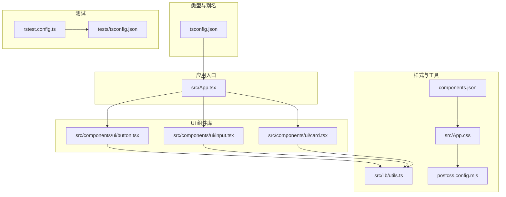
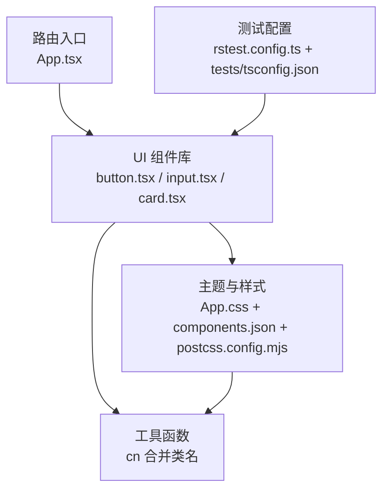
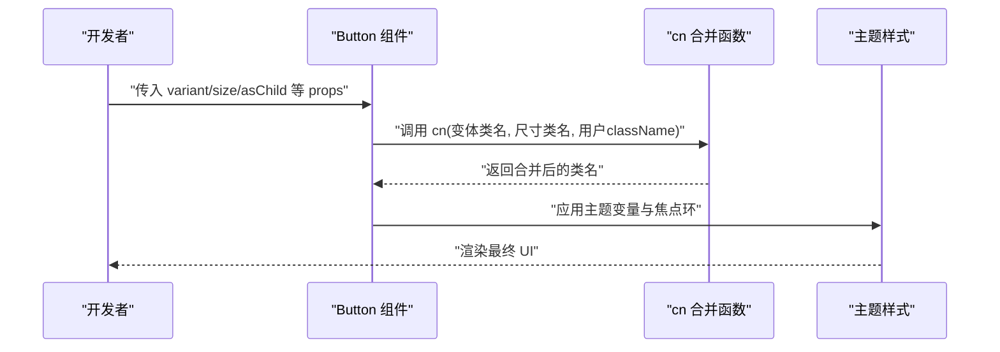
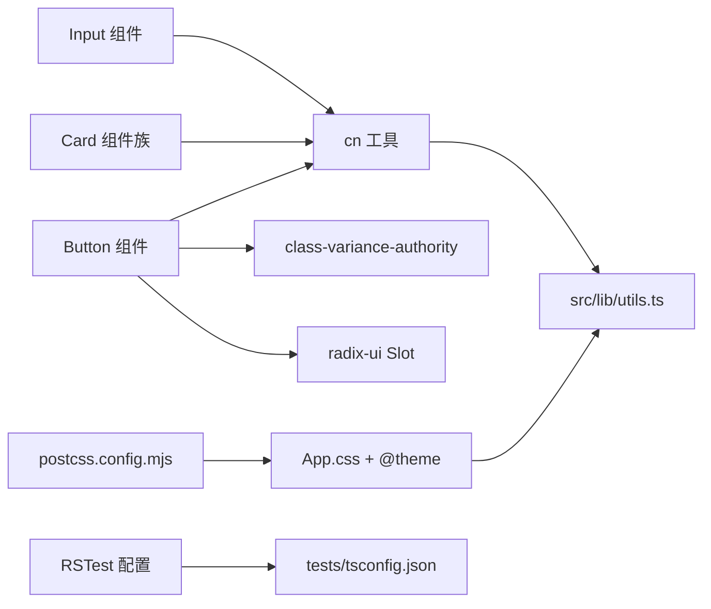

# UI组件扩展

<cite>
**本文引用的文件**
- [README.md](file://README.md)
- [package.json](file://package.json)
- [tsconfig.json](file://tsconfig.json)
- [postcss.config.mjs](file://postcss.config.mjs)
- [components.json](file://components.json)
- [src/lib/utils.ts](file://src/lib/utils.ts)
- [src/App.css](file://src/App.css)
- [src/App.tsx](file://src/App.tsx)
- [src/components/ui/button.tsx](file://src/components/ui/button.tsx)
- [src/components/ui/card.tsx](file://src/components/ui/card.tsx)
- [src/components/ui/input.tsx](file://src/components/ui/input.tsx)
- [tests/tsconfig.json](file://tests/tsconfig.json)
- [rstest.config.ts](file://rstest.config.ts)
</cite>

## 目录
1. [简介](#简介)
2. [项目结构](#项目结构)
3. [核心组件](#核心组件)
4. [架构总览](#架构总览)
5. [组件详解与扩展指南](#组件详解与扩展指南)
6. [依赖关系分析](#依赖关系分析)
7. [性能考量](#性能考量)
8. [故障排查指南](#故障排查指南)
9. [结论](#结论)
10. [附录](#附录)

## 简介
本指南面向在 Rsbuild2 项目中基于现有 UI 组件库进行“可复用 UI 组件扩展”的开发者。内容涵盖组件设计原则与命名约定、Tailwind CSS 样式与自定义扩展、组件 props 设计与事件/状态管理、测试与文档编写、一致性与可维护性保障、无障碍访问与跨浏览器兼容、以及复用最佳实践与性能优化建议。文中所有实现细节均以仓库现有组件为依据，并提供从设计到实现的完整流程示例。

## 项目结构
Rsbuild2 使用 Rsbuild 构建工具链，采用 React 19 + TypeScript + Tailwind CSS v4 的技术栈。UI 组件集中于 src/components/ui，通用工具函数位于 src/lib/utils，样式入口为 src/App.css，路由入口为 src/App.tsx。测试框架通过 RSTest 配合 Rsbuild 适配器运行。

图表来源
- [src/App.tsx](file://src/App.tsx#L1-L42)
- [src/components/ui/button.tsx](file://src/components/ui/button.tsx#L1-L65)
- [src/components/ui/card.tsx](file://src/components/ui/card.tsx#L1-L93)
- [src/components/ui/input.tsx](file://src/components/ui/input.tsx#L1-L22)
- [src/lib/utils.ts](file://src/lib/utils.ts#L1-L7)
- [src/App.css](file://src/App.css#L1-L245)
- [postcss.config.mjs](file://postcss.config.mjs#L1-L6)
- [components.json](file://components.json#L1-L22)
- [tsconfig.json](file://tsconfig.json#L1-L29)
- [rstest.config.ts](file://rstest.config.ts#L1-L9)
- [tests/tsconfig.json](file://tests/tsconfig.json#L1-L7)

章节来源
- [README.md](file://README.md#L1-L37)
- [package.json](file://package.json#L1-L43)
- [src/App.tsx](file://src/App.tsx#L1-L42)
- [src/App.css](file://src/App.css#L1-L245)
- [postcss.config.mjs](file://postcss.config.mjs#L1-L6)
- [components.json](file://components.json#L1-L22)
- [tsconfig.json](file://tsconfig.json#L1-L29)

## 核心组件
本节对现有 UI 组件进行深入解析，作为扩展新组件的参考模型。

- Button 组件
  - 特点：使用 class-variance-authority 定义变体与尺寸，结合 radix-ui 的 Slot 支持“asChild”渲染；通过 cn 合并类名并合并冲突的 Tailwind 类；提供 data-slot、data-variant、data-size 属性便于主题与测试定位。
  - 关键实现路径：[src/components/ui/button.tsx](file://src/components/ui/button.tsx#L1-L65)
  - 工具函数：[src/lib/utils.ts](file://src/lib/utils.ts#L1-L7)

- Input 组件
  - 特点：统一输入框基础样式，内置聚焦环、无效态、暗色模式等通用交互；通过 data-slot 标识元素槽位；使用 cn 合并 Tailwind 类。
  - 关键实现路径：[src/components/ui/input.tsx](file://src/components/ui/input.tsx#L1-L22)
  - 工具函数：[src/lib/utils.ts](file://src/lib/utils.ts#L1-L7)

- Card 组件族
  - 特点：由 Card、CardHeader、CardTitle、CardDescription、CardAction、CardContent、CardFooter 组成卡片容器与子块，使用 data-slot 标识各子区域；利用容器查询与网格布局实现响应式排版；支持 Action 区域的自动列布局。
  - 关键实现路径：[src/components/ui/card.tsx](file://src/components/ui/card.tsx#L1-L93)
  - 工具函数：[src/lib/utils.ts](file://src/lib/utils.ts#L1-L7)

章节来源
- [src/components/ui/button.tsx](file://src/components/ui/button.tsx#L1-L65)
- [src/components/ui/input.tsx](file://src/components/ui/input.tsx#L1-L22)
- [src/components/ui/card.tsx](file://src/components/ui/card.tsx#L1-L93)
- [src/lib/utils.ts](file://src/lib/utils.ts#L1-L7)

## 架构总览
Rsbuild2 的 UI 扩展遵循以下架构原则：
- 组件层：按功能拆分，每个组件职责单一，导出类型化 props 与默认样式。
- 样式层：以 Tailwind CSS v4 为核心，通过 CSS 变量与 @theme 声明主题；使用 tw-merge 与 clsx 合并类名，避免冲突。
- 工具层：cn 函数统一类名合并策略；Radix UI 提供无障碍与可组合的语义容器。
- 测试层：RSTest + Rsbuild 适配器，配合 Testing Library 进行 DOM 断言与可访问性测试。

图表来源
- [src/App.tsx](file://src/App.tsx#L1-L42)
- [src/components/ui/button.tsx](file://src/components/ui/button.tsx#L1-L65)
- [src/components/ui/input.tsx](file://src/components/ui/input.tsx#L1-L22)
- [src/components/ui/card.tsx](file://src/components/ui/card.tsx#L1-L93)
- [src/lib/utils.ts](file://src/lib/utils.ts#L1-L7)
- [src/App.css](file://src/App.css#L1-L245)
- [components.json](file://components.json#L1-L22)
- [postcss.config.mjs](file://postcss.config.mjs#L1-L6)
- [rstest.config.ts](file://rstest.config.ts#L1-L9)
- [tests/tsconfig.json](file://tests/tsconfig.json#L1-L7)

## 组件详解与扩展指南

### 设计原则与命名约定
- 单一职责：每个组件只负责一种可视或交互行为。
- 可组合性：优先使用 asChild 或子组件（如 CardHeader/CardContent）实现组合。
- 语义化槽位：使用 data-slot 标识组件内部结构，便于主题覆盖与测试定位。
- 变体与尺寸：通过变体（variant）与尺寸（size）参数控制外观与密度，保持一致的视觉层级。
- 命名约定：
  - 文件名：小驼峰，如 button.tsx、card.tsx、input.tsx
  - 组件导出：与文件同名，如 Button、Card、Input
  - 子组件：CardHeader、CardTitle 等
  - 类名：以 Tailwind 实用类为主，必要时添加语义化前缀（如 “btn-”，“card-”）

章节来源
- [src/components/ui/button.tsx](file://src/components/ui/button.tsx#L1-L65)
- [src/components/ui/card.tsx](file://src/components/ui/card.tsx#L1-L93)
- [src/components/ui/input.tsx](file://src/components/ui/input.tsx#L1-L22)

### Tailwind CSS 使用与自定义扩展
- 主题变量与 @theme
  - 项目通过 CSS 变量声明主题色板，并在 :root 与 .dark 中分别定义浅色/深色主题；随后通过 @theme 将变量映射为 Tailwind 可用的颜色与半径。
  - 路径参考：[src/App.css](file://src/App.css#L6-L115)
- 合并策略
  - 使用 cn 函数统一合并类名，确保用户传入的 className 与默认样式正确叠加，且不产生冲突。
  - 路径参考：[src/lib/utils.ts](file://src/lib/utils.ts#L1-L7)
- PostCSS 集成
  - 通过 @tailwindcss/postcss 插件启用 Tailwind CSS v4，无需额外 tailwind.config.js。
  - 路径参考：[postcss.config.mjs](file://postcss.config.mjs#L1-L6)
- 组件别名与主题配置
  - components.json 指定 UI 别名为 "@/components/ui"，工具函数别名为 "@/lib/utils"，并启用 TSX 与 lucide 图标库。
  - 路径参考：[components.json](file://components.json#L1-L22)

章节来源
- [src/App.css](file://src/App.css#L1-L245)
- [src/lib/utils.ts](file://src/lib/utils.ts#L1-L7)
- [postcss.config.mjs](file://postcss.config.mjs#L1-L6)
- [components.json](file://components.json#L1-L22)

### Props 设计、事件处理与状态管理
- Props 设计
  - 优先透传原生 HTML 属性（如 input 的 type），并在必要时提供受控/非受控两种形态（例如受控输入可通过 value/onChange 实现）。
  - 对于复杂组件（如带表单校验的 Input），可新增 aria-*、aria-invalid 等属性以增强可访问性。
- 事件处理
  - 保持与原生事件一致的回调签名（如 onClick、onChange、onFocus、onBlur），并允许用户传入自定义处理器。
- 状态管理
  - 简单 UI 组件尽量无内部状态，通过外部 props 控制；复杂交互组件（如可折叠卡片）可引入受控/非受控模式，或使用 Radix UI 的状态容器（如 Collapsible）。
- 示例参考
  - Button：支持 asChild 渲染与变体/尺寸切换，适合演示 props 与渲染组合的模式。
    - 路径参考：[src/components/ui/button.tsx](file://src/components/ui/button.tsx#L1-L65)
  - Input：内置聚焦环与无效态，适合演示受控输入与可访问性属性。
    - 路径参考：[src/components/ui/input.tsx](file://src/components/ui/input.tsx#L1-L22)
  - Card：通过多个子组件组合形成卡片结构，适合演示组合式 UI 的设计。
    - 路径参考：[src/components/ui/card.tsx](file://src/components/ui/card.tsx#L1-L93)

章节来源
- [src/components/ui/button.tsx](file://src/components/ui/button.tsx#L1-L65)
- [src/components/ui/input.tsx](file://src/components/ui/input.tsx#L1-L22)
- [src/components/ui/card.tsx](file://src/components/ui/card.tsx#L1-L93)

### 组件测试与文档编写
- 测试框架
  - 使用 RSTest + Rsbuild 适配器，测试入口由 rstest.config.ts 配置，测试环境通过 tests/tsconfig.json 扩展类型。
  - 路径参考：[rstest.config.ts](file://rstest.config.ts#L1-L9)，[tests/tsconfig.json](file://tests/tsconfig.json#L1-L7)
- 测试建议
  - 结构断言：验证 data-slot 是否存在，确保主题与测试可定位。
  - 行为断言：验证变体/尺寸切换、焦点环、无效态等视觉反馈。
  - 可访问性：使用 @testing-library/jest-dom 与 aria-* 属性断言，确保键盘可达与屏幕阅读器友好。
- 文档编写
  - 组件 README 或 Storybook 条目应包含：用途、API（props）、事件、变体/尺寸、无障碍注意事项、示例代码链接（指向源码路径）。
  - 示例代码链接：[src/components/ui/button.tsx](file://src/components/ui/button.tsx#L1-L65)

章节来源
- [rstest.config.ts](file://rstest.config.ts#L1-L9)
- [tests/tsconfig.json](file://tests/tsconfig.json#L1-L7)

### 一致性与可维护性
- 样式系统设计原则
  - 使用 CSS 变量与 @theme 统一主题色板，避免硬编码颜色。
  - 通过 cn 合并与 tw-merge 避免类名冲突，保证样式可叠加与可覆盖。
- 响应式布局
  - 使用容器查询与网格布局（如 CardHeader 的 @container 与 grid-rows）实现响应式排版。
  - 参考路径：[src/components/ui/card.tsx](file://src/components/ui/card.tsx#L18-L29)
- 可维护性
  - 组件拆分清晰、职责单一；通过 data-slot 与语义化类名提升可维护性。
  - 使用 Radix UI 提供的语义容器，减少重复造轮子。

章节来源
- [src/App.css](file://src/App.css#L6-L115)
- [src/lib/utils.ts](file://src/lib/utils.ts#L1-L7)
- [src/components/ui/card.tsx](file://src/components/ui/card.tsx#L18-L29)

### 无障碍访问与跨浏览器兼容
- 无障碍访问
  - 内置 aria-* 属性（如 aria-invalid）与焦点环（focus-visible），确保键盘可达与状态提示。
  - 参考路径：[src/components/ui/input.tsx](file://src/components/ui/input.tsx#L11-L15)
- 跨浏览器兼容
  - 项目目标为现代浏览器（lib: ["DOM","ES2020"]），建议在新增特性前确认兼容性，必要时提供降级方案或 polyfill。
  - 参考路径：[tsconfig.json](file://tsconfig.json#L7-L11)

章节来源
- [src/components/ui/input.tsx](file://src/components/ui/input.tsx#L11-L15)
- [tsconfig.json](file://tsconfig.json#L7-L11)

### 复用最佳实践与性能优化
- 复用最佳实践
  - 使用 asChild 与 Slot 容器实现渲染组合，避免不必要的 DOM 包裹。
  - 通过变体与尺寸参数控制外观，减少重复组件。
  - 将通用逻辑抽象为 Hook（如 useMahjongGame），组件仅负责 UI。
- 性能优化
  - 避免在渲染路径中创建新对象/函数；使用 useMemo/useCallback 缓存昂贵计算。
  - 合理拆分组件，避免不必要的重渲染。
  - 使用 cn 合并类名时，尽量减少动态类名数量，降低样式抖动风险。

章节来源
- [src/components/ui/button.tsx](file://src/components/ui/button.tsx#L51-L61)
- [src/hooks/useMahjongGame.ts](file://src/hooks/useMahjongGame.ts)

### 从设计到实现的完整流程示例（以 Button 为例）
- 设计阶段
  - 明确用途：用于触发操作，支持多种视觉风格与尺寸。
  - 确定变体：default、destructive、outline、secondary、ghost、link。
  - 确定尺寸：default、xs、sm、lg、icon、icon-xs、icon-sm、icon-lg。
  - 无障碍：提供焦点环与键盘可达性。
- 实现阶段
  - 定义变体与尺寸：参考 [src/components/ui/button.tsx](file://src/components/ui/button.tsx#L7-L39)
  - 合并类名：参考 [src/lib/utils.ts](file://src/lib/utils.ts#L1-L7)
  - 渲染与组合：参考 [src/components/ui/button.tsx](file://src/components/ui/button.tsx#L41-L62)
- 测试阶段
  - 断言变体/尺寸渲染正确，焦点环与无效态生效。
  - 参考测试配置：[rstest.config.ts](file://rstest.config.ts#L1-L9)，[tests/tsconfig.json](file://tests/tsconfig.json#L1-L7)

图表来源
- [src/components/ui/button.tsx](file://src/components/ui/button.tsx#L7-L39)
- [src/lib/utils.ts](file://src/lib/utils.ts#L1-L7)
- [src/App.css](file://src/App.css#L6-L115)

## 依赖关系分析
- 组件依赖
  - Button、Input、Card 均依赖 cn 工具函数进行类名合并。
  - Button 使用 class-variance-authority 与 radix-ui 的 Slot。
- 样式依赖
  - App.css 通过 @theme 与 CSS 变量提供主题；postcss.config.mjs 启用 Tailwind v4。
- 测试依赖
  - RSTest 适配 Rsbuild，测试类型由 tests/tsconfig.json 注入。

图表来源
- [src/components/ui/button.tsx](file://src/components/ui/button.tsx#L1-L65)
- [src/components/ui/input.tsx](file://src/components/ui/input.tsx#L1-L22)
- [src/components/ui/card.tsx](file://src/components/ui/card.tsx#L1-L93)
- [src/lib/utils.ts](file://src/lib/utils.ts#L1-L7)
- [src/App.css](file://src/App.css#L1-L245)
- [postcss.config.mjs](file://postcss.config.mjs#L1-L6)
- [rstest.config.ts](file://rstest.config.ts#L1-L9)
- [tests/tsconfig.json](file://tests/tsconfig.json#L1-L7)

章节来源
- [src/components/ui/button.tsx](file://src/components/ui/button.tsx#L1-L65)
- [src/components/ui/input.tsx](file://src/components/ui/input.tsx#L1-L22)
- [src/components/ui/card.tsx](file://src/components/ui/card.tsx#L1-L93)
- [src/lib/utils.ts](file://src/lib/utils.ts#L1-L7)
- [src/App.css](file://src/App.css#L1-L245)
- [postcss.config.mjs](file://postcss.config.mjs#L1-L6)
- [rstest.config.ts](file://rstest.config.ts#L1-L9)
- [tests/tsconfig.json](file://tests/tsconfig.json#L1-L7)

## 性能考量
- 渲染性能
  - 避免在 props 中传入频繁变化的对象/函数；必要时使用 useMemo/useCallback。
  - 合理拆分组件，减少无关重渲染。
- 样式性能
  - 使用 cn 合并类名，减少重复样式；优先使用原子化样式而非内联样式。
  - 避免过度使用动态类名，减少样式抖动。
- 构建与打包
  - 使用 Rsbuild 的 Tree Shaking 与按需加载；确保未使用的组件不会被打包进产物。

## 故障排查指南
- 样式不生效
  - 检查 App.css 是否被正确引入；确认 @theme 与 CSS 变量是否正确。
  - 参考路径：[src/App.css](file://src/App.css#L1-L245)
- 类名冲突
  - 使用 cn 合并类名，确保 tw-merge 正常工作；避免在同一元素上重复设置相同样式属性。
  - 参考路径：[src/lib/utils.ts](file://src/lib/utils.ts#L1-L7)
- 测试失败
  - 确认 RSTest 配置与测试类型已正确加载；检查 data-slot 与 aria-* 属性断言。
  - 参考路径：[rstest.config.ts](file://rstest.config.ts#L1-L9)，[tests/tsconfig.json](file://tests/tsconfig.json#L1-L7)
- 路由与入口
  - 确认 App.tsx 路由配置正确，页面组件可正常渲染。
  - 参考路径：[src/App.tsx](file://src/App.tsx#L1-L42)

章节来源
- [src/App.css](file://src/App.css#L1-L245)
- [src/lib/utils.ts](file://src/lib/utils.ts#L1-L7)
- [rstest.config.ts](file://rstest.config.ts#L1-L9)
- [tests/tsconfig.json](file://tests/tsconfig.json#L1-L7)
- [src/App.tsx](file://src/App.tsx#L1-L42)

## 结论
Rsbuild2 的 UI 组件扩展以“可组合、可变体、可访问”为核心理念，借助 Tailwind CSS v4、class-variance-authority、Radix UI 与 cn 合并策略，构建了高一致性与可维护性的组件体系。遵循本文的设计原则、命名约定与测试/文档规范，可在不破坏整体风格的前提下快速扩展高质量的可复用 UI 组件。

## 附录
- 快速开始
  - 开发新组件：参考 Button/Input/Card 的实现方式，使用 cn 合并类名，提供 data-slot 与 aria-* 属性。
  - 样式扩展：在 App.css 中完善主题变量与 @theme，确保与现有组件一致。
  - 测试与文档：使用 RSTest 编写结构与行为测试，补充组件文档条目。
- 参考路径
  - Button：[src/components/ui/button.tsx](file://src/components/ui/button.tsx#L1-L65)
  - Input：[src/components/ui/input.tsx](file://src/components/ui/input.tsx#L1-L22)
  - Card：[src/components/ui/card.tsx](file://src/components/ui/card.tsx#L1-L93)
  - 工具函数：[src/lib/utils.ts](file://src/lib/utils.ts#L1-L7)
  - 样式入口：[src/App.css](file://src/App.css#L1-L245)
  - PostCSS：[postcss.config.mjs](file://postcss.config.mjs#L1-L6)
  - 组件别名：[components.json](file://components.json#L1-L22)
  - 类型别名：[tsconfig.json](file://tsconfig.json#L1-L29)
  - 测试配置：[rstest.config.ts](file://rstest.config.ts#L1-L9)，[tests/tsconfig.json](file://tests/tsconfig.json#L1-L7)