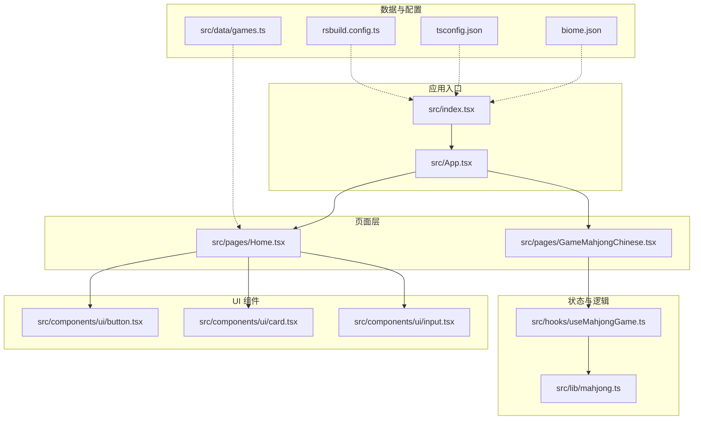
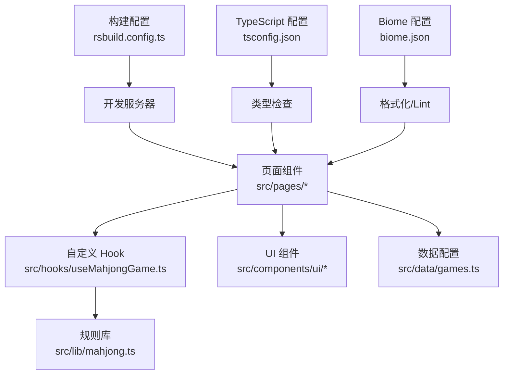
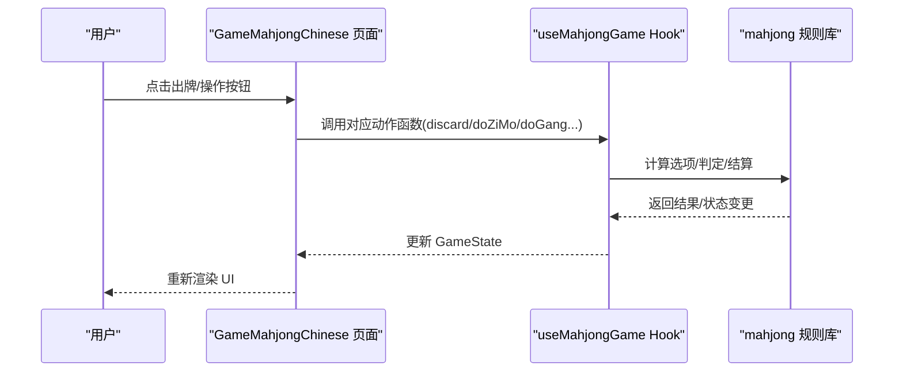
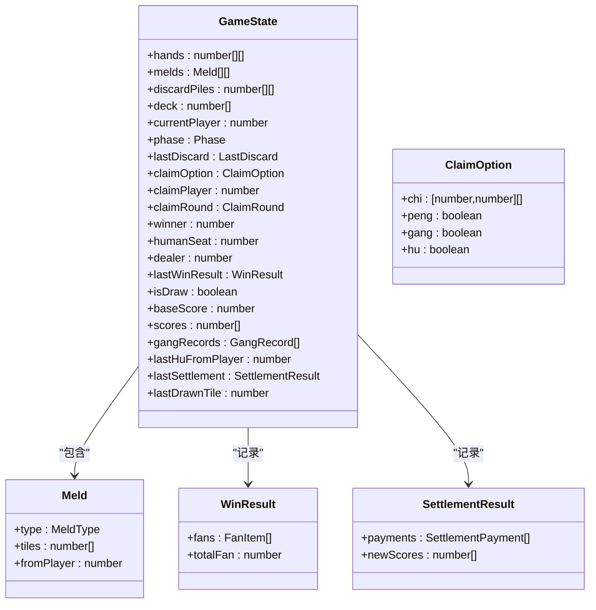
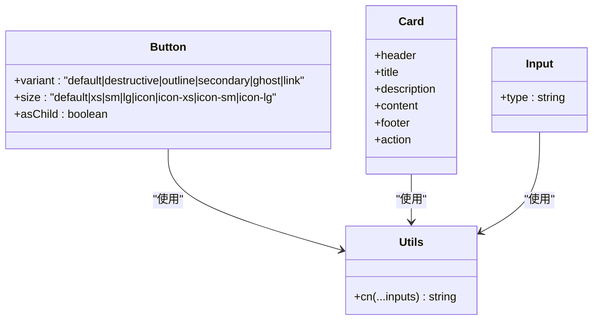
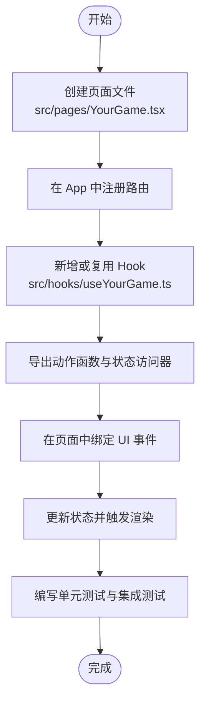
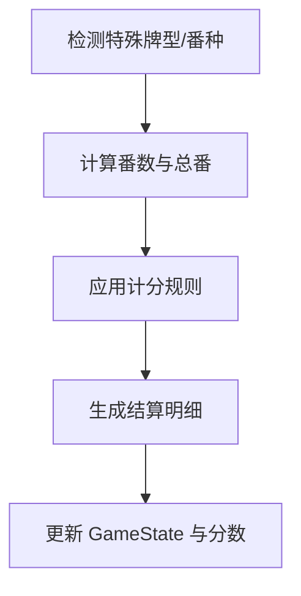
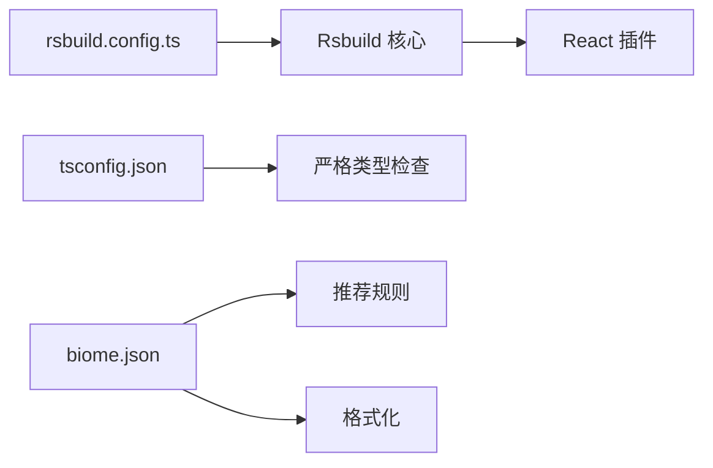

# 开发指南

<cite>
**本文引用的文件**
- [README.md](file://README.md)
- [package.json](file://package.json)
- [rsbuild.config.ts](file://rsbuild.config.ts)
- [tsconfig.json](file://tsconfig.json)
- [biome.json](file://biome.json)
- [src/App.tsx](file://src/App.tsx)
- [src/index.tsx](file://src/index.tsx)
- [src/pages/Home.tsx](file://src/pages/Home.tsx)
- [src/pages/GameMahjongChinese.tsx](file://src/pages/GameMahjongChinese.tsx)
- [src/hooks/useMahjongGame.ts](file://src/hooks/useMahjongGame.ts)
- [src/lib/mahjong.ts](file://src/lib/mahjong.ts)
- [src/lib/utils.ts](file://src/lib/utils.ts)
- [src/components/ui/button.tsx](file://src/components/ui/button.tsx)
- [src/components/ui/card.tsx](file://src/components/ui/card.tsx)
- [src/components/ui/input.tsx](file://src/components/ui/input.tsx)
- [src/data/games.ts](file://src/data/games.ts)
</cite>

## 目录
1. [简介](#简介)
2. [项目结构](#项目结构)
3. [核心组件](#核心组件)
4. [架构总览](#架构总览)
5. [详细组件分析](#详细组件分析)
6. [依赖关系分析](#依赖关系分析)
7. [性能考量](#性能考量)
8. [调试与排错指南](#调试与排错指南)
9. [结论](#结论)
10. [附录](#附录)

## 简介
本指南面向在 Rsbuild2 项目中新增游戏功能的开发者，目标是提供一套统一的开发规范、最佳实践与可复用的模板，帮助团队在保持一致性的前提下快速扩展新的游戏页面与状态管理逻辑。同时覆盖 UI 组件复用原则、麻将规则扩展方法、代码组织与命名约定、调试技巧、性能优化建议、代码审查清单与质量标准，以及版本控制与协作流程。

## 项目结构
项目采用基于功能域的目录组织方式，核心模块如下：
- src/pages：游戏页面，每个游戏一个页面文件，负责 UI 呈现与用户交互
- src/hooks：自定义 Hook，封装游戏状态与业务逻辑
- src/lib：纯函数库，包含游戏规则、状态模型与工具函数
- src/components/ui：可复用 UI 组件，遵循设计系统与原子化样式
- src/data：静态数据与配置，如游戏列表、分类等
- 根配置：Rsbuild 构建配置、TypeScript 路径别名、Biome Lint/格式化配置

**图表来源**
- [src/index.tsx](file://src/index.tsx)
- [src/App.tsx](file://src/App.tsx)
- [src/pages/Home.tsx](file://src/pages/Home.tsx)
- [src/pages/GameMahjongChinese.tsx](file://src/pages/GameMahjongChinese.tsx)
- [src/hooks/useMahjongGame.ts](file://src/hooks/useMahjongGame.ts)
- [src/lib/mahjong.ts](file://src/lib/mahjong.ts)
- [src/components/ui/button.tsx](file://src/components/ui/button.tsx)
- [src/components/ui/card.tsx](file://src/components/ui/card.tsx)
- [src/components/ui/input.tsx](file://src/components/ui/input.tsx)
- [src/data/games.ts](file://src/data/games.ts)
- [rsbuild.config.ts](file://rsbuild.config.ts)
- [tsconfig.json](file://tsconfig.json)
- [biome.json](file://biome.json)

**章节来源**
- [rsbuild.config.ts](file://rsbuild.config.ts#L1-L16)
- [tsconfig.json](file://tsconfig.json#L1-L30)
- [biome.json](file://biome.json#L1-L35)

## 核心组件
- 应用路由与入口：通过 React Router 管理页面路由，统一在 App 中注册各游戏页面
- 游戏页面：以函数组件形式实现，使用自定义 Hook 管理状态与交互
- 状态 Hook：集中封装游戏状态、回合推进、AI 决策与结算逻辑
- 规则库：提供洗牌、发牌、吃碰杠胡判断、番种计算、记牌与听牌检测等纯函数
- UI 组件：基于设计系统，提供按钮、卡片、输入等通用组件，支持变体与尺寸

**章节来源**
- [src/App.tsx](file://src/App.tsx#L1-L42)
- [src/pages/GameMahjongChinese.tsx](file://src/pages/GameMahjongChinese.tsx#L1-L469)
- [src/hooks/useMahjongGame.ts](file://src/hooks/useMahjongGame.ts#L1-L866)
- [src/lib/mahjong.ts](file://src/lib/mahjong.ts#L1-L494)
- [src/components/ui/button.tsx](file://src/components/ui/button.tsx#L1-L65)
- [src/components/ui/card.tsx](file://src/components/ui/card.tsx#L1-L93)
- [src/components/ui/input.tsx](file://src/components/ui/input.tsx#L1-L22)

## 架构总览
Rsbuild2 采用前端单页应用架构，页面层负责 UI 与交互，状态层通过自定义 Hook 抽象，规则层以纯函数实现，UI 组件遵循设计系统。构建与开发体验由 Rsbuild 提供，TypeScript 与 Biome 保障类型安全与代码风格。

**图表来源**
- [src/pages/GameMahjongChinese.tsx](file://src/pages/GameMahjongChinese.tsx#L1-L469)
- [src/hooks/useMahjongGame.ts](file://src/hooks/useMahjongGame.ts#L1-L866)
- [src/lib/mahjong.ts](file://src/lib/mahjong.ts#L1-L494)
- [src/components/ui/button.tsx](file://src/components/ui/button.tsx#L1-L65)
- [src/data/games.ts](file://src/data/games.ts#L1-L197)
- [rsbuild.config.ts](file://rsbuild.config.ts#L1-L16)
- [tsconfig.json](file://tsconfig.json#L1-L30)
- [biome.json](file://biome.json#L1-L35)

## 详细组件分析

### 麻将游戏页面与状态管理
- 页面职责：渲染牌桌、手牌、弃牌区、玩家信息、操作按钮；根据状态展示提示与结算面板
- 状态管理：通过 useMahjongGame Hook 管理 GameState，封装开始、出牌、要牌轮次、吃碰杠胡、自摸、杠牌、结算等动作
- AI 逻辑：在要牌轮次中对胡/杠/碰/吃进行决策，支持吃法评分与概率策略
- 规则集成：调用规则库进行吃/碰/杠选项计算、胡牌判定、番种计算与结算

**图表来源**
- [src/pages/GameMahjongChinese.tsx](file://src/pages/GameMahjongChinese.tsx#L121-L469)
- [src/hooks/useMahjongGame.ts](file://src/hooks/useMahjongGame.ts#L209-L866)
- [src/lib/mahjong.ts](file://src/lib/mahjong.ts#L136-L494)

**章节来源**
- [src/pages/GameMahjongChinese.tsx](file://src/pages/GameMahjongChinese.tsx#L121-L469)
- [src/hooks/useMahjongGame.ts](file://src/hooks/useMahjongGame.ts#L209-L866)
- [src/lib/mahjong.ts](file://src/lib/mahjong.ts#L136-L494)

### 麻将规则库与数据模型
- 数据模型：GameState、Meld、ClaimOption、WinResult、SettlementResult 等
- 关键能力：洗牌、发牌、吃/碰/杠选项计算、胡牌判定、番种计算、听牌检测、记牌统计、结算
- 设计要点：纯函数、不可变更新、清晰的类型约束，便于测试与扩展

**图表来源**
- [src/lib/mahjong.ts](file://src/lib/mahjong.ts#L26-L448)

**章节来源**
- [src/lib/mahjong.ts](file://src/lib/mahjong.ts#L1-L494)

### UI 组件复用与设计原则
- 组件设计：基于变体与尺寸的原子化样式，支持 asChild、数据属性标记，便于主题与无障碍适配
- 复用原则：语义化标签、最小暴露接口、通过 className 与变体组合实现差异化
- 示例组件：Button、Card、Input，均通过 cn 工具合并条件类名，保证样式一致性

**图表来源**
- [src/components/ui/button.tsx](file://src/components/ui/button.tsx#L41-L65)
- [src/components/ui/card.tsx](file://src/components/ui/card.tsx#L5-L93)
- [src/components/ui/input.tsx](file://src/components/ui/input.tsx#L5-L22)
- [src/lib/utils.ts](file://src/lib/utils.ts#L1-L7)

**章节来源**
- [src/components/ui/button.tsx](file://src/components/ui/button.tsx#L1-L65)
- [src/components/ui/card.tsx](file://src/components/ui/card.tsx#L1-L93)
- [src/components/ui/input.tsx](file://src/components/ui/input.tsx#L1-L22)
- [src/lib/utils.ts](file://src/lib/utils.ts#L1-L7)

### 新增游戏页面开发模板与状态管理模式
- 页面模板步骤
  - 在 pages 目录新增页面文件，导入路由与 UI 组件
  - 在 App 中注册路由，确保路径唯一且与数据配置一致
  - 如需复杂状态，新建或复用 Hook，导出动作函数与状态访问器
  - 将动作函数绑定到 UI 事件，更新状态并触发重渲染
- 状态管理模式
  - 使用 useState 管理本地状态，必要时拆分为多个状态片段
  - 使用 useCallback 包装动作函数，减少子组件重渲染
  - 将纯逻辑抽离至 lib，保持页面与 Hook 的薄层职责
  - 通过类型约束明确状态结构，避免运行期错误

**图表来源**
- [src/App.tsx](file://src/App.tsx#L18-L39)
- [src/pages/Home.tsx](file://src/pages/Home.tsx#L1-L43)
- [src/hooks/useMahjongGame.ts](file://src/hooks/useMahjongGame.ts#L209-L239)

**章节来源**
- [src/App.tsx](file://src/App.tsx#L18-L39)
- [src/pages/Home.tsx](file://src/pages/Home.tsx#L1-L43)
- [src/hooks/useMahjongGame.ts](file://src/hooks/useMahjongGame.ts#L209-L239)

### 麻将规则扩展方法
- 新增番种：在规则库中扩展番种判断与计分逻辑，返回 WinResult
- 新增牌型：扩展胡牌判定与特殊牌型识别，确保与现有逻辑兼容
- 新增规则变体：通过参数化 GameState 或引入配置项，支持不同规则集
- AI 策略：在 Hook 中增加策略分支或权重调整，保持与现有决策流程一致

**图表来源**
- [src/lib/mahjong.ts](file://src/lib/mahjong.ts#L381-L414)
- [src/lib/mahjong.ts](file://src/lib/mahjong.ts#L451-L491)

**章节来源**
- [src/lib/mahjong.ts](file://src/lib/mahjong.ts#L381-L414)
- [src/lib/mahjong.ts](file://src/lib/mahjong.ts#L451-L491)

### 代码组织与命名约定
- 文件命名：页面文件使用大驼峰，如 GameMahjongChinese.tsx；Hook 使用 useXxx；工具函数小驼峰
- 目录组织：按功能域划分，页面、Hook、库、组件、数据分离
- 路径别名：统一使用 @/*，在 tsconfig 与 Rsbuild 中配置
- 类型与常量：规则相关常量集中于 lib，类型定义统一导出

**章节来源**
- [tsconfig.json](file://tsconfig.json#L3-L6)
- [rsbuild.config.ts](file://rsbuild.config.ts#L7-L11)
- [src/lib/mahjong.ts](file://src/lib/mahjong.ts#L1-L22)

## 依赖关系分析
- 构建与开发：Rsbuild 提供开发服务器与打包能力，开启 historyApiFallback 支持 SPA
- 类型系统：TypeScript 严格模式，启用路径映射与模块解析
- 代码质量：Biome 启用 Lint 与格式化，自动组织导入，VCS 集成

**图表来源**
- [rsbuild.config.ts](file://rsbuild.config.ts#L1-L16)
- [tsconfig.json](file://tsconfig.json#L23-L27)
- [biome.json](file://biome.json#L28-L33)

**章节来源**
- [package.json](file://package.json#L6-L14)
- [rsbuild.config.ts](file://rsbuild.config.ts#L1-L16)
- [tsconfig.json](file://tsconfig.json#L1-L30)
- [biome.json](file://biome.json#L1-L35)

## 性能考量
- 渲染优化
  - 使用 useCallback 包装动作函数，避免子组件不必要的重渲染
  - 将可复用 UI 组件抽象为独立模块，减少重复计算
- 状态更新
  - 避免深层可变更新，优先使用不可变拷贝与局部更新
  - 合理拆分状态，降低无关状态变化带来的重渲染
- 规则计算
  - 对复杂算法（如番种计算）进行缓存或剪枝，避免重复计算
  - 在 Hook 中集中处理副作用，配合 useEffect 清理定时器与订阅
- 构建与体积
  - 利用 Rsbuild 的 Tree Shaking 与按需加载，减少包体积
  - 使用 Tailwind 原子化类名，避免未使用的样式

[本节为通用指导，无需列出具体文件来源]

## 调试与排错指南
- 开发环境
  - 启动开发服务器，访问 http://localhost:3000 查看页面效果
  - 使用浏览器开发者工具检查网络请求与状态更新
- 日志与断点
  - 在 Hook 的动作函数中添加日志，观察状态变化轨迹
  - 对规则函数进行单元测试，验证边界条件与异常场景
- 常见问题
  - 路由不生效：检查 App 中路由注册与路径是否匹配
  - 样式异常：确认 Tailwind 类名拼接与 cn 工具使用正确
  - 状态未更新：检查 setState 调用是否在正确的分支与时机

**章节来源**
- [README.md](file://README.md#L11-L29)
- [src/hooks/useMahjongGame.ts](file://src/hooks/useMahjongGame.ts#L241-L262)

## 结论
通过统一的页面模板、状态管理模式与规则库抽象，Rsbuild2 项目能够高效扩展新的游戏功能。遵循本文的开发规范、组件复用原则与质量标准，可在保证一致性的同时提升开发效率与可维护性。

[本节为总结性内容，无需列出具体文件来源]

## 附录

### 新增游戏页面开发清单
- 在 pages 创建页面文件，实现基本 UI 与交互
- 在 App 注册路由，确保路径唯一
- 如需复杂状态，新增或复用 Hook，导出动作函数
- 使用 UI 组件库，保持视觉与交互一致性
- 编写测试，覆盖关键逻辑与边界条件
- 提交前执行格式化与 Lint，确保代码质量

**章节来源**
- [src/App.tsx](file://src/App.tsx#L18-L39)
- [src/pages/Home.tsx](file://src/pages/Home.tsx#L1-L43)
- [biome.json](file://biome.json#L28-L33)

### 代码审查清单与质量标准
- 代码风格：符合 Biome 推荐规则，导入顺序与格式统一
- 类型安全：TypeScript 严格模式下无未使用变量/参数，类型定义完整
- 可测试性：关键逻辑可被单元测试覆盖，避免过度耦合
- 可维护性：规则与状态逻辑清晰分离，注释与命名表达意图
- 性能：避免不必要的重渲染与重复计算，合理拆分状态

**章节来源**
- [biome.json](file://biome.json#L28-L33)
- [tsconfig.json](file://tsconfig.json#L24-L27)

### 版本控制与协作工作流
- 分支策略：主分支保护，特性分支开发，提交信息清晰
- 提交规范：遵循 Conventional Commits，关联 Issue/PR
- 代码评审：PR 至主干前至少一次审查，关注可读性与测试
- CI/CD：自动化 Lint、格式化与测试，确保合并质量

[本节为通用协作流程说明，无需列出具体文件来源]