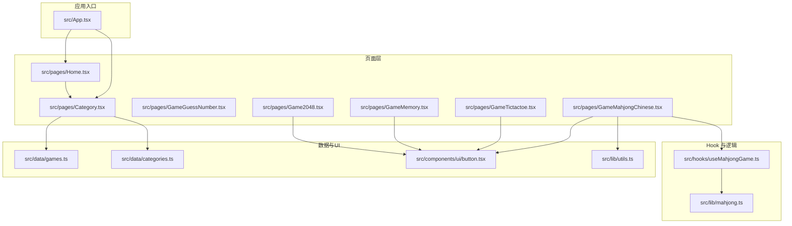
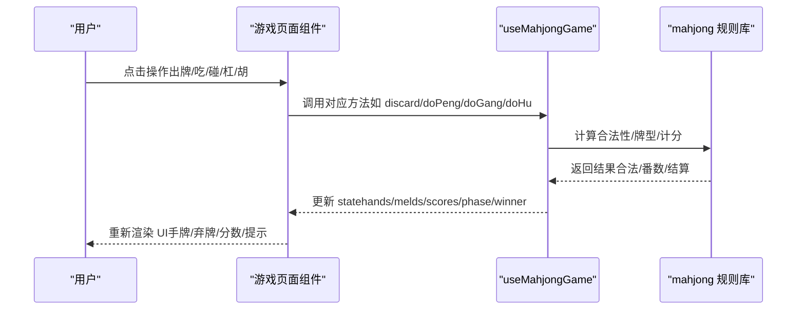
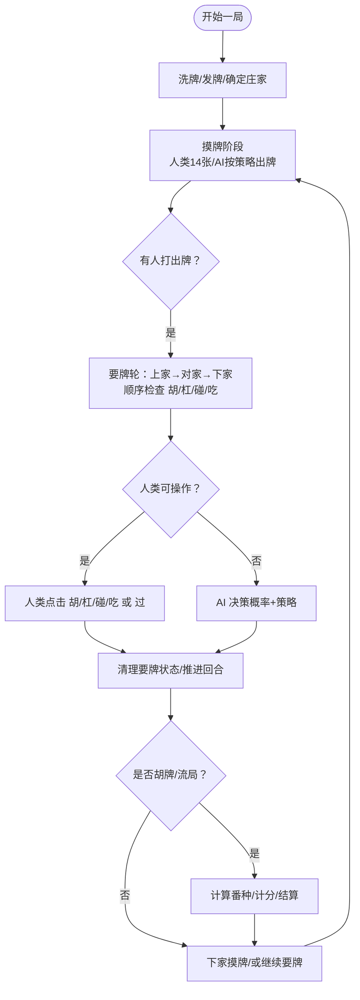
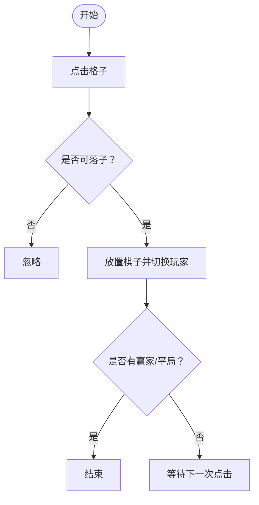
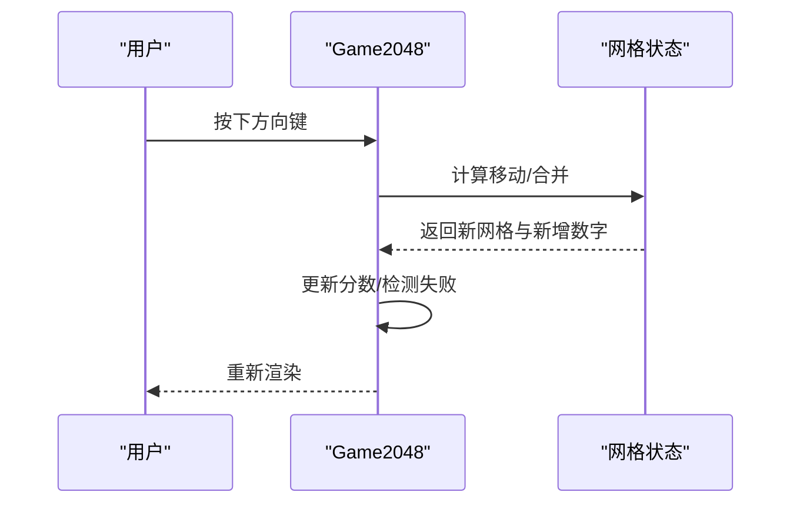
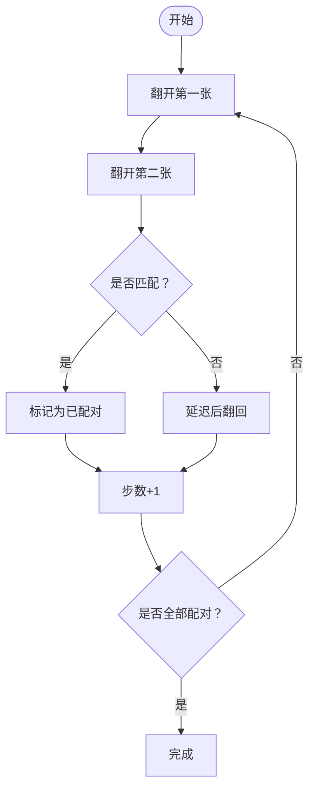
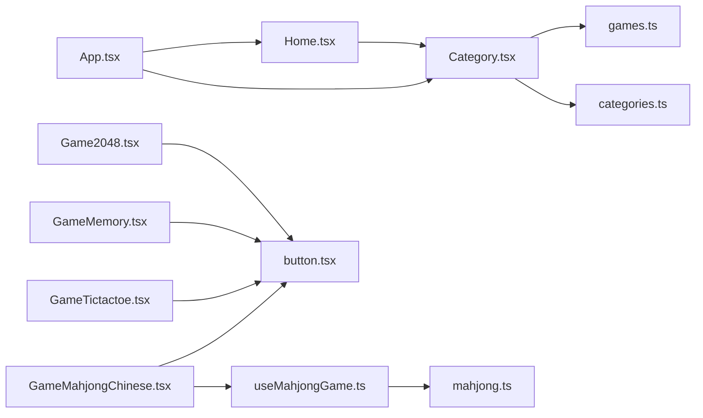

# 新增游戏功能

<cite>
**本文引用的文件**
- [README.md](file://README.md)
- [package.json](file://package.json)
- [src/App.tsx](file://src/App.tsx)
- [src/data/games.ts](file://src/data/games.ts)
- [src/data/categories.ts](file://src/data/categories.ts)
- [src/hooks/useMahjongGame.ts](file://src/hooks/useMahjongGame.ts)
- [src/lib/mahjong.ts](file://src/lib/mahjong.ts)
- [src/lib/utils.ts](file://src/lib/utils.ts)
- [src/pages/Home.tsx](file://src/pages/Home.tsx)
- [src/pages/Category.tsx](file://src/pages/Category.tsx)
- [src/pages/GameMahjongChinese.tsx](file://src/pages/GameMahjongChinese.tsx)
- [src/pages/GameTictactoe.tsx](file://src/pages/GameTictactoe.tsx)
- [src/pages/Game2048.tsx](file://src/pages/Game2048.tsx)
- [src/pages/GameMemory.tsx](file://src/pages/GameMemory.tsx)
- [src/pages/GameBreakout.tsx](file://src/pages/GameBreakout.tsx)
- [src/pages/GameSnake.tsx](file://src/pages/GameSnake.tsx)
- [src/pages/GameShooter.tsx](file://src/pages/GameShooter.tsx)
- [src/components/ui/button.tsx](file://src/components/ui/button.tsx)
</cite>

## 目录
1. [简介](#简介)
2. [项目结构](#项目结构)
3. [核心组件](#核心组件)
4. [架构总览](#架构总览)
5. [详细组件分析](#详细组件分析)
6. [依赖关系分析](#依赖关系分析)
7. [性能考量](#性能考量)
8. [故障排查指南](#故障排查指南)
9. [结论](#结论)
10. [附录](#附录)

## 简介
本指南面向在 Rsbuild2 项目中新增游戏功能的开发者，目标是帮助你从零开始创建一个新游戏页面组件，涵盖以下方面：
- 游戏页面的开发模板与结构规范
- 使用 React Hooks 模式进行游戏状态管理的最佳实践
- 游戏逻辑实现（事件处理、状态更新、用户交互）
- 游戏页面路由配置与导航集成
- 游戏规则实现示例（以麻将为例，含牌型判断与计分）
- AI 对手集成与异步游戏逻辑处理
- 完整的新游戏创建流程（组件结构、状态管理、样式设计、交互逻辑）

## 项目结构
项目采用按页面与功能模块组织的结构，主要目录与职责如下：
- src/pages：存放各游戏页面组件，每个游戏一个独立文件
- src/hooks：存放可复用的自定义 Hook，如 useMahjongGame
- src/lib：存放游戏核心算法与工具函数，如麻将规则、工具函数
- src/data：存放静态数据与配置，如游戏列表、分类
- src/components/ui：存放通用 UI 组件，如 Button
- 根目录：构建配置、脚本与文档

图表来源
- [src/App.tsx](file://src/App.tsx#L1-L42)
- [src/pages/Home.tsx](file://src/pages/Home.tsx#L1-L43)
- [src/pages/Category.tsx](file://src/pages/Category.tsx#L1-L37)
- [src/pages/GameMahjongChinese.tsx](file://src/pages/GameMahjongChinese.tsx#L1-L469)
- [src/hooks/useMahjongGame.ts](file://src/hooks/useMahjongGame.ts#L1-L866)
- [src/lib/mahjong.ts](file://src/lib/mahjong.ts#L1-L494)
- [src/data/games.ts](file://src/data/games.ts#L1-L197)
- [src/data/categories.ts](file://src/data/categories.ts#L1-L34)
- [src/components/ui/button.tsx](file://src/components/ui/button.tsx#L1-L65)
- [src/lib/utils.ts](file://src/lib/utils.ts#L1-L7)

章节来源
- [src/App.tsx](file://src/App.tsx#L1-L42)
- [src/pages/Home.tsx](file://src/pages/Home.tsx#L1-L43)
- [src/pages/Category.tsx](file://src/pages/Category.tsx#L1-L37)
- [src/data/games.ts](file://src/data/games.ts#L1-L197)
- [src/data/categories.ts](file://src/data/categories.ts#L1-L34)

## 核心组件
- 游戏页面组件：每个游戏页面是一个独立的 React 组件，负责渲染 UI、绑定事件、调用状态 Hook，并通过路由集成到应用。
- 自定义 Hook：如 useMahjongGame，封装复杂的状态管理、AI 决策与规则执行，暴露简洁的 API 给页面组件。
- 游戏规则库：如 mahjong.ts，提供洗牌、发牌、牌型判断、计分等纯函数，确保逻辑可测试与可复用。
- 数据与路由：games.ts 提供游戏元数据，App.tsx 配置路由，Category.tsx 与 Home.tsx 提供导航。

章节来源
- [src/hooks/useMahjongGame.ts](file://src/hooks/useMahjongGame.ts#L1-L866)
- [src/lib/mahjong.ts](file://src/lib/mahjong.ts#L1-L494)
- [src/pages/GameMahjongChinese.tsx](file://src/pages/GameMahjongChinese.tsx#L1-L469)
- [src/App.tsx](file://src/App.tsx#L1-L42)

## 架构总览
Rsbuild2 的游戏架构遵循“页面组件 + 自定义 Hook + 规则库”的分层设计：
- 页面组件：负责 UI 渲染与用户交互，调用 Hook 的公开方法驱动状态变更
- 自定义 Hook：集中管理游戏状态、AI 决策、回合推进与结算
- 规则库：提供纯函数式的规则实现，便于单元测试与跨游戏复用
- 路由与导航：通过 React Router 将页面与数据模型连接，支持分类筛选与跳转

图表来源
- [src/pages/GameMahjongChinese.tsx](file://src/pages/GameMahjongChinese.tsx#L121-L151)
- [src/hooks/useMahjongGame.ts](file://src/hooks/useMahjongGame.ts#L209-L866)
- [src/lib/mahjong.ts](file://src/lib/mahjong.ts#L136-L200)

## 详细组件分析

### 麻将游戏（GameMahjongChinese）与 useMahjongGame Hook
该组件展示了完整的麻将游戏实现：状态初始化、回合推进、AI 决策、要牌阶段（胡/杠/碰/吃）、结算与计分。

- 状态结构要点
  - 手牌、明牌组、弃牌堆、牌墙、当前玩家、阶段（摸牌/要牌）、最后打出的牌、赢家、分数、番种与结算记录等
- 关键流程
  - 初始化：洗牌、发牌、确定庄家与初始手牌数量
  - 摸牌阶段：人类玩家在手牌14张时可自摸或出牌；AI 玩家在需要时自动出牌
  - 要牌阶段：按顺序检查上家可否“胡/杠/碰/吃”，人类可见按钮，AI 内部决策
  - 结算：根据番种与规则计算分数，支持流局/自摸/杠上开花/海底捞月等场景
- AI 设计
  - 基于概率与策略（如庄家/残局保守）决定是否吃/碰/杠
  - 舍牌策略综合“孤张字牌/幺九/中张”与“防守/听牌只打熟张”等因素

图表来源
- [src/hooks/useMahjongGame.ts](file://src/hooks/useMahjongGame.ts#L212-L239)
- [src/hooks/useMahjongGame.ts](file://src/hooks/useMahjongGame.ts#L241-L262)
- [src/hooks/useMahjongGame.ts](file://src/hooks/useMahjongGame.ts#L541-L732)
- [src/hooks/useMahjongGame.ts](file://src/hooks/useMahjongGame.ts#L734-L833)

章节来源
- [src/pages/GameMahjongChinese.tsx](file://src/pages/GameMahjongChinese.tsx#L1-L469)
- [src/hooks/useMahjongGame.ts](file://src/hooks/useMahjongGame.ts#L1-L866)
- [src/lib/mahjong.ts](file://src/lib/mahjong.ts#L1-L494)

### 井字棋（GameTictactoe）：最小化状态管理示例
- 状态：9 个格子（X/O/null），当前玩家（X 先）
- 规则：三连获胜，平局条件为无空位
- 实现：使用 useState 管理 cells 与 xNext，事件处理中更新状态并切换玩家

图表来源
- [src/pages/GameTictactoe.tsx](file://src/pages/GameTictactoe.tsx#L29-L45)

章节来源
- [src/pages/GameTictactoe.tsx](file://src/pages/GameTictactoe.tsx#L1-L92)

### 2048（Game2048）：网格移动与合并
- 状态：4x4 数字网格、分数、游戏结束标志
- 逻辑：键盘事件触发上下左右移动，合并相邻相同数字，产生新数字并检测失败条件

图表来源
- [src/pages/Game2048.tsx](file://src/pages/Game2048.tsx#L94-L142)

章节来源
- [src/pages/Game2048.tsx](file://src/pages/Game2048.tsx#L1-L206)

### 记忆翻牌（GameMemory）：配对逻辑与防并发
- 状态：卡片数组（id/emoji/flipped/matched），步数，上次翻开的索引，锁定状态
- 逻辑：点击翻开两张，若匹配则标记为已配对，否则短暂延迟后翻回；统计步数

图表来源
- [src/pages/GameMemory.tsx](file://src/pages/GameMemory.tsx#L21-L88)

章节来源
- [src/pages/GameMemory.tsx](file://src/pages/GameMemory.tsx#L1-L140)

### 打砖块（GameBreakout）、贪吃蛇（GameSnake）、飞机大战（GameShooter）：基于 Canvas 的异步逻辑
- 共同点：使用 useRef 保存状态，useEffect/useState 管理生命周期与帧循环，Canvas 绘制
- 差异点：碰撞检测、敌人生成、子弹与障碍物逻辑不同
- 建议：将游戏循环抽象为 Hook，统一事件监听与状态更新

章节来源
- [src/pages/GameBreakout.tsx](file://src/pages/GameBreakout.tsx#L1-L57)
- [src/pages/GameSnake.tsx](file://src/pages/GameSnake.tsx#L1-L54)
- [src/pages/GameShooter.tsx](file://src/pages/GameShooter.tsx#L1-L53)

## 依赖关系分析
- 路由与导航：App.tsx 声明路由，Category.tsx 与 Home.tsx 提供分类与列表跳转
- 游戏数据：games.ts 提供游戏元数据（路径、难度、标签等），Category.tsx 依据分类筛选
- UI 组件：Button 等通用组件在各页面复用，统一风格与交互
- 状态与逻辑：useMahjongGame 将复杂逻辑封装，页面仅负责渲染与事件绑定

图表来源
- [src/App.tsx](file://src/App.tsx#L1-L42)
- [src/pages/Category.tsx](file://src/pages/Category.tsx#L1-L37)
- [src/pages/Home.tsx](file://src/pages/Home.tsx#L1-L43)
- [src/pages/GameMahjongChinese.tsx](file://src/pages/GameMahjongChinese.tsx#L1-L469)
- [src/hooks/useMahjongGame.ts](file://src/hooks/useMahjongGame.ts#L1-L866)
- [src/lib/mahjong.ts](file://src/lib/mahjong.ts#L1-L494)
- [src/data/games.ts](file://src/data/games.ts#L1-L197)
- [src/data/categories.ts](file://src/data/categories.ts#L1-L34)
- [src/components/ui/button.tsx](file://src/components/ui/button.tsx#L1-L65)

章节来源
- [src/App.tsx](file://src/App.tsx#L1-L42)
- [src/pages/Category.tsx](file://src/pages/Category.tsx#L1-L37)
- [src/data/games.ts](file://src/data/games.ts#L1-L197)
- [src/data/categories.ts](file://src/data/categories.ts#L1-L34)

## 性能考量
- 状态更新粒度：尽量使用不可变更新与批量 setState，避免不必要的重渲染
- 计算优化：将昂贵的规则计算放入 Web Worker 或 Hook 内缓存中间结果
- 渲染优化：使用 React.memo、useCallback、useMemo 缓存计算结果与回调
- AI 决策：在 Hook 内集中处理，避免在渲染阶段做大量计算
- Canvas 游戏：使用 requestAnimationFrame 控制帧率，减少绘制区域与对象数量

## 故障排查指南
- 路由不生效
  - 检查 App.tsx 中路由声明与路径是否一致
  - 确认页面组件导入正确
- 游戏状态异常
  - 检查 Hook 内 setState 的调用时机与条件分支
  - 确保事件处理函数在每次渲染后不会丢失闭包引用
- 规则判断错误
  - 在规则库中添加单元测试，覆盖边界情况（如十三幺、七小对、龙七对）
  - 对 AI 决策增加日志或可视化调试
- 性能问题
  - 使用 React DevTools Profiler 分析渲染热点
  - 对高频计算使用 memo 化与惰性初始化

章节来源
- [src/App.tsx](file://src/App.tsx#L18-L39)
- [src/hooks/useMahjongGame.ts](file://src/hooks/useMahjongGame.ts#L209-L866)
- [src/lib/mahjong.ts](file://src/lib/mahjong.ts#L136-L200)

## 结论
Rsbuild2 提供了清晰的分层架构与成熟的示例，使得新增游戏功能变得高效且可维护。建议遵循以下原则：
- 页面组件专注 UI 与交互，将复杂逻辑下沉至 Hook 与规则库
- 使用 React Hooks 模式管理状态，保持状态更新的可预测性
- 通过路由与数据模型集成导航，保证一致性与可扩展性
- 以麻将为例，将规则、AI 与计分系统模块化，便于测试与演进

## 附录

### 新增游戏页面的完整流程（从零到一）
- 创建页面组件
  - 在 src/pages 下新建 GameYourGame.tsx，参考现有页面的结构与命名
  - 使用通用 UI 组件（如 Button）与工具函数（如 cn）
- 定义路由
  - 在 src/App.tsx 中引入并注册新路由
- 集成数据
  - 在 src/data/games.ts 中添加游戏元数据（id、categoryId、path、difficulty、tags 等）
- 实现状态管理
  - 若逻辑复杂，创建自定义 Hook（如 useYourGame），封装状态、事件与规则
  - 若逻辑简单，直接在页面组件使用 useState/useReducer
- 实现游戏规则
  - 将核心算法放入 src/lib 下的模块，保持纯函数与可测试性
- 集成 AI 与异步逻辑
  - 在 Hook 内集中处理 AI 决策与异步推进，必要时使用定时器或帧循环
- 样式与交互
  - 使用 Tailwind 类名与 cn 组合，确保响应式与无障碍
  - 为关键交互添加视觉反馈与提示信息
- 测试与验证
  - 为规则函数编写单元测试
  - 在页面组件中模拟用户交互，验证状态流转与 UI 更新

章节来源
- [src/pages/GameTictactoe.tsx](file://src/pages/GameTictactoe.tsx#L29-L45)
- [src/pages/Game2048.tsx](file://src/pages/Game2048.tsx#L94-L142)
- [src/pages/GameMemory.tsx](file://src/pages/GameMemory.tsx#L21-L88)
- [src/pages/GameMahjongChinese.tsx](file://src/pages/GameMahjongChinese.tsx#L121-L151)
- [src/hooks/useMahjongGame.ts](file://src/hooks/useMahjongGame.ts#L209-L866)
- [src/lib/mahjong.ts](file://src/lib/mahjong.ts#L136-L200)
- [src/App.tsx](file://src/App.tsx#L18-L39)
- [src/data/games.ts](file://src/data/games.ts#L138-L188)
- [src/components/ui/button.tsx](file://src/components/ui/button.tsx#L1-L65)
- [src/lib/utils.ts](file://src/lib/utils.ts#L1-L7)