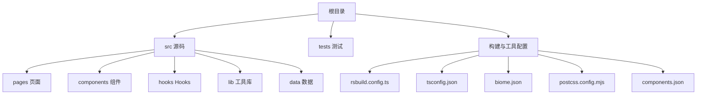
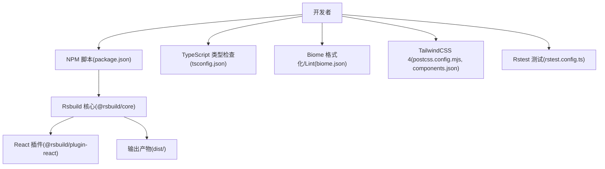
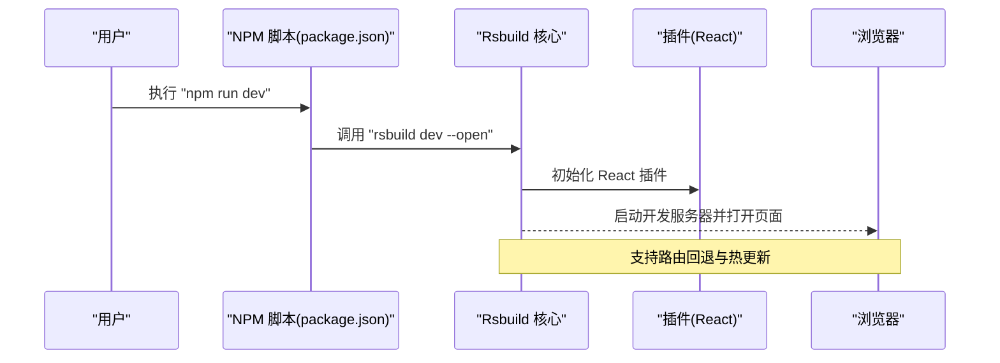
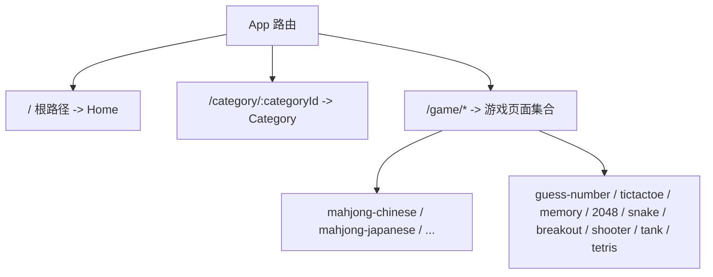
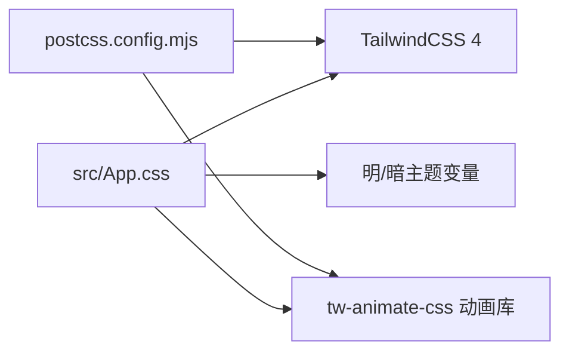
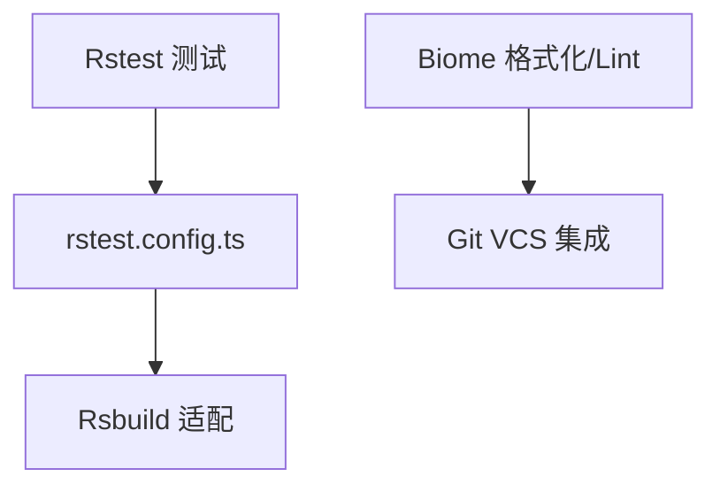
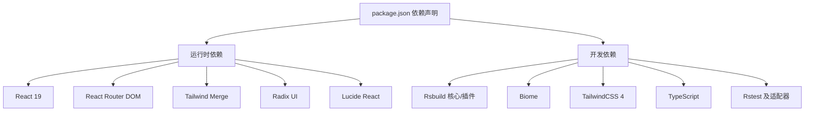
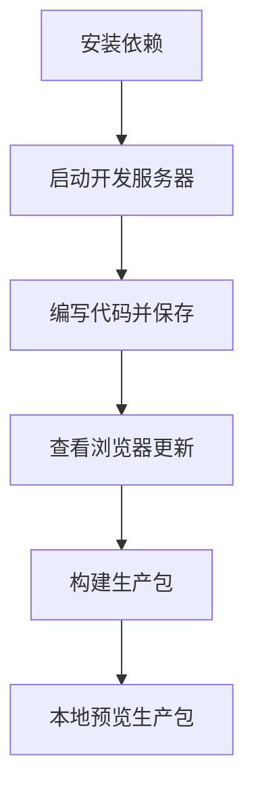

# 快速开始

<cite>
**本文引用的文件**
- [package.json](file://package.json)
- [README.md](file://README.md)
- [rsbuild.config.ts](file://rsbuild.config.ts)
- [tsconfig.json](file://tsconfig.json)
- [biome.json](file://biome.json)
- [postcss.config.mjs](file://postcss.config.mjs)
- [components.json](file://components.json)
- [rstest.config.ts](file://rstest.config.ts)
- [src/index.tsx](file://src/index.tsx)
- [src/App.tsx](file://src/App.tsx)
- [src/pages/Home.tsx](file://src/pages/Home.tsx)
- [src/App.css](file://src/App.css)
- [AGENTS.md](file://AGENTS.md)
</cite>

## 目录
1. [简介](#简介)
2. [项目结构](#项目结构)
3. [核心组件](#核心组件)
4. [架构总览](#架构总览)
5. [详细组件分析](#详细组件分析)
6. [依赖分析](#依赖分析)
7. [性能考虑](#性能考虑)
8. [故障排除指南](#故障排除指南)
9. [结论](#结论)
10. [附录](#附录)

## 简介
本指南面向初学者，帮助你在最短时间内完成 Rsbuild2 项目的环境准备、依赖安装、开发服务器启动与基础构建预览，并掌握常用命令与调试技巧。项目基于 React 19、Rsbuild 2、TailwindCSS 4 与 TypeScript，采用模块化目录组织与路径别名，便于扩展与维护。

## 项目结构
- 根目录包含构建配置、类型定义、格式化与测试配置等。
- 源码位于 src/，按功能拆分为页面、组件、Hooks、工具库与数据。
- 测试位于 tests/，使用 Rstest 适配 Rsbuild 的测试框架。
- 构建与开发由 Rsbuild 驱动，TypeScript 提供类型安全，Biome 负责格式化与 Lint。

**章节来源**
- [rsbuild.config.ts](file://rsbuild.config.ts#L1-L16)
- [tsconfig.json](file://tsconfig.json#L1-L30)
- [biome.json](file://biome.json#L1-L35)
- [postcss.config.mjs](file://postcss.config.mjs#L1-L6)
- [components.json](file://components.json#L1-L22)

## 核心组件
- 入口渲染：在入口文件中挂载 React 应用根节点，开启严格模式渲染。
- 应用路由：通过 React Router 管理多页面路由与导航。
- 页面与组件：页面组件负责展示内容，UI 组件与工具函数提供复用能力。
- 样式系统：TailwindCSS 4 与自定义主题变量结合，支持明暗主题切换与动画库。

**章节来源**
- [src/index.tsx](file://src/index.tsx#L1-L14)
- [src/App.tsx](file://src/App.tsx#L1-L42)
- [src/pages/Home.tsx](file://src/pages/Home.tsx#L1-L43)
- [src/App.css](file://src/App.css#L1-L245)

## 架构总览
Rsbuild2 项目采用“配置驱动 + 模块化源码”的架构。Rsbuild 负责开发服务器、打包与预览；TypeScript 提供类型检查；Biome 负责代码风格与 Lint；TailwindCSS 与 PostCSS 实现样式体系；Rstest 提供测试能力。

**图表来源**
- [package.json](file://package.json#L6-L14)
- [rsbuild.config.ts](file://rsbuild.config.ts#L1-L16)
- [tsconfig.json](file://tsconfig.json#L1-L30)
- [biome.json](file://biome.json#L1-L35)
- [postcss.config.mjs](file://postcss.config.mjs#L1-L6)
- [components.json](file://components.json#L1-L22)
- [rstest.config.ts](file://rstest.config.ts#L1-L9)

**章节来源**
- [package.json](file://package.json#L1-L43)
- [rsbuild.config.ts](file://rsbuild.config.ts#L1-L16)
- [tsconfig.json](file://tsconfig.json#L1-L30)
- [biome.json](file://biome.json#L1-L35)
- [postcss.config.mjs](file://postcss.config.mjs#L1-L6)
- [components.json](file://components.json#L1-L22)
- [rstest.config.ts](file://rstest.config.ts#L1-L9)

## 详细组件分析

### 开发服务器与构建命令
- npm run dev：启动 Rsbuild 开发服务器，默认打开浏览器，支持热更新与路由回退。
- npm run build：生成生产构建产物，用于部署。
- npm run preview：本地预览生产构建，验证打包结果。

**图表来源**
- [package.json](file://package.json#L6-L14)
- [rsbuild.config.ts](file://rsbuild.config.ts#L12-L14)

**章节来源**
- [package.json](file://package.json#L6-L14)
- [rsbuild.config.ts](file://rsbuild.config.ts#L12-L14)
- [AGENTS.md](file://AGENTS.md#L7-L9)

### 路由与页面组织
- 应用通过 React Router 声明式路由组织页面，首页与多个游戏页面均通过路由注册。
- 使用路径别名 @ 指向 src，提升导入可读性与一致性。

**图表来源**
- [src/App.tsx](file://src/App.tsx#L18-L39)
- [rsbuild.config.ts](file://rsbuild.config.ts#L7-L11)
- [tsconfig.json](file://tsconfig.json#L4-L6)

**章节来源**
- [src/App.tsx](file://src/App.tsx#L1-L42)
- [rsbuild.config.ts](file://rsbuild.config.ts#L7-L11)
- [tsconfig.json](file://tsconfig.json#L4-L6)

### 样式与主题系统
- TailwindCSS 4 通过 PostCSS 插件启用，配合自定义主题变量与动画库实现统一视觉风格。
- 支持明暗主题切换，样式在 CSS 变量层进行集中管理。

**图表来源**
- [src/App.css](file://src/App.css#L1-L245)
- [postcss.config.mjs](file://postcss.config.mjs#L1-L6)
- [components.json](file://components.json#L6-L12)

**章节来源**
- [src/App.css](file://src/App.css#L1-L245)
- [postcss.config.mjs](file://postcss.config.mjs#L1-L6)
- [components.json](file://components.json#L1-L22)

### 测试与质量保障
- Rstest 适配 Rsbuild，提供单元测试与监听模式。
- Biome 负责格式化与 Lint，Git VCS 集成自动忽略文件。

**图表来源**
- [rstest.config.ts](file://rstest.config.ts#L1-L9)
- [biome.json](file://biome.json#L10-L14)

**章节来源**
- [rstest.config.ts](file://rstest.config.ts#L1-L9)
- [biome.json](file://biome.json#L1-L35)
- [AGENTS.md](file://AGENTS.md#L20-L29)

## 依赖分析
- 运行时依赖：React 19、React Router DOM、Tailwind Merge、Radix UI、Lucide React 等。
- 开发依赖：Rsbuild 核心与 React 插件、Biome、TailwindCSS 4、TypeScript、Rstest 及其 Rsbuild 适配器等。

**图表来源**
- [package.json](file://package.json#L15-L41)

**章节来源**
- [package.json](file://package.json#L1-L43)

## 性能考虑
- 使用 Rsbuild 2 的现代打包策略，结合 React 插件优化构建速度与体积。
- TypeScript 的严格模式与 noUncheckedSideEffectImports 等选项有助于减少运行时风险。
- TailwindCSS 4 与按需引入策略降低样式体积，配合动画库实现轻量级动效。
- 建议在开发阶段启用 Biome 自动格式化，保持一致的代码风格，减少重构成本。

**章节来源**
- [tsconfig.json](file://tsconfig.json#L23-L27)
- [biome.json](file://biome.json#L1-L35)
- [postcss.config.mjs](file://postcss.config.mjs#L1-L6)

## 故障排除指南
- 无法启动开发服务器
  - 检查 Node.js 版本是否满足项目需求（建议使用 LTS 版本）。
  - 确认端口未被占用，或调整 Rsbuild 配置中的 server.port。
  - 清理缓存后重装依赖：删除 node_modules 与锁文件，重新安装。
- 构建失败或产物异常
  - 查看构建日志中的错误提示，优先修复类型错误（TypeScript 严格模式）。
  - 确保所有导入路径使用正确的别名 @ 与 tsconfig 路径映射。
- 样式不生效或主题异常
  - 确认 TailwindCSS 4 与 PostCSS 插件已正确配置。
  - 检查 components.json 中的 tailwind.css 路径与 aliases 是否指向 src/App.css。
- 测试无法运行
  - 确认 Rstest 配置与 Rsbuild 适配器版本兼容。
  - 检查 setupFiles 路径是否正确，确保测试环境初始化文件存在。
- 代码格式与 Lint 报错
  - 使用 Biome 的格式化与检查脚本修复常见问题。
  - 如需自动修复，执行格式化命令并提交更改。

**章节来源**
- [rsbuild.config.ts](file://rsbuild.config.ts#L12-L14)
- [tsconfig.json](file://tsconfig.json#L4-L6)
- [postcss.config.mjs](file://postcss.config.mjs#L1-L6)
- [components.json](file://components.json#L6-L12)
- [rstest.config.ts](file://rstest.config.ts#L6-L8)
- [biome.json](file://biome.json#L1-L35)

## 结论
通过本指南，你可以在本地快速完成 Rsbuild2 项目的环境准备与运行。建议先完成依赖安装与开发服务器启动，再逐步学习构建与预览流程，最后结合测试与质量工具完善开发体验。遇到问题时，优先检查配置文件与依赖版本，确保与项目要求一致。

## 附录

### 环境要求
- Node.js：建议使用长期支持版本（LTS），以获得最佳兼容性与稳定性。
- 包管理器：推荐使用 npm（与脚本一致），也可使用 pnpm（仓库包含锁文件）。

**章节来源**
- [README.md](file://README.md#L3-L9)
- [package.json](file://package.json#L1-L6)

### 安装与启动步骤
- 安装依赖：在项目根目录执行安装命令。
- 启动开发服务器：运行开发脚本，浏览器将自动打开本地地址。
- 构建生产包：生成可用于部署的静态资源。
- 本地预览生产包：验证构建产物在生产环境的行为。

**图表来源**
- [README.md](file://README.md#L5-L29)
- [package.json](file://package.json#L6-L14)

**章节来源**
- [README.md](file://README.md#L3-L29)
- [package.json](file://package.json#L6-L14)

### 常见开发工作流程与调试技巧
- 使用 Rsbuild 的热更新特性，在修改页面或组件后即时看到效果。
- 利用 Biome 的格式化与 Lint 能力，保持代码风格一致。
- 在测试中使用 Rstest 的监听模式，提高迭代效率。
- 通过路由回退配置，避免刷新页面导致的 404。

**章节来源**
- [AGENTS.md](file://AGENTS.md#L7-L29)
- [rsbuild.config.ts](file://rsbuild.config.ts#L12-L14)
- [biome.json](file://biome.json#L1-L35)
- [rstest.config.ts](file://rstest.config.ts#L1-L9)