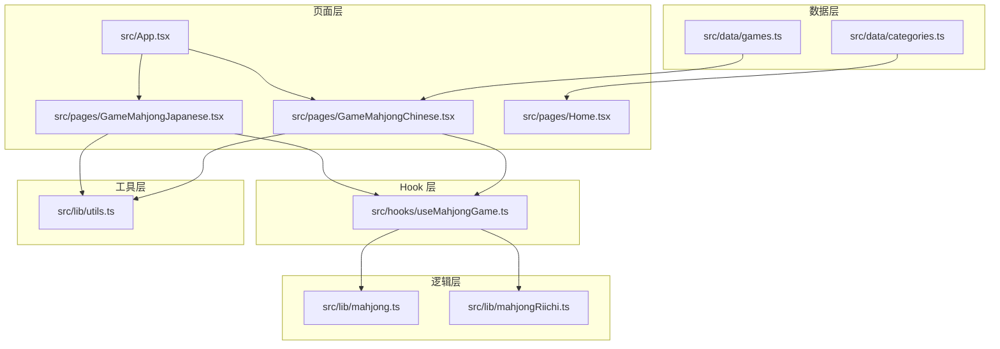
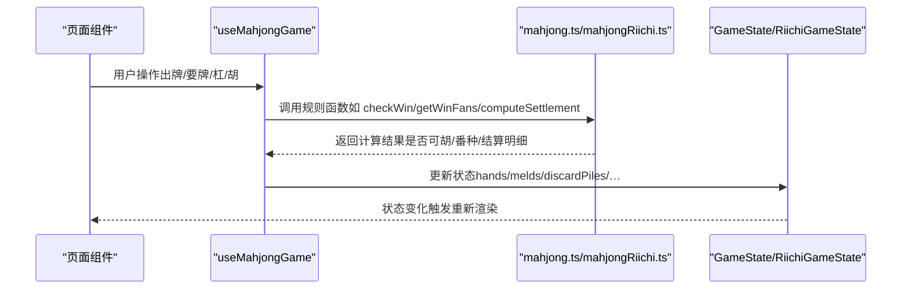
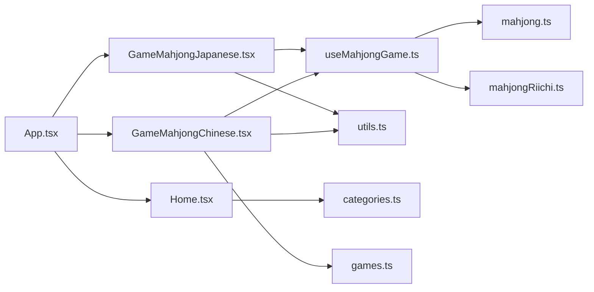

# 数据模型

<cite>
**本文引用的文件**
- [games.ts](file://src/data/games.ts)
- [categories.ts](file://src/data/categories.ts)
- [mahjong.ts](file://src/lib/mahjong.ts)
- [mahjongRiichi.ts](file://src/lib/mahjongRiichi.ts)
- [useMahjongGame.ts](file://src/hooks/useMahjongGame.ts)
- [GameMahjongChinese.tsx](file://src/pages/GameMahjongChinese.tsx)
- [GameMahjongJapanese.tsx](file://src/pages/GameMahjongJapanese.tsx)
- [Home.tsx](file://src/pages/Home.tsx)
- [App.tsx](file://src/App.tsx)
- [utils.ts](file://src/lib/utils.ts)
</cite>

## 目录
1. [简介](#简介)
2. [项目结构](#项目结构)
3. [核心组件](#核心组件)
4. [架构总览](#架构总览)
5. [详细组件分析](#详细组件分析)
6. [依赖关系分析](#依赖关系分析)
7. [性能考量](#性能考量)
8. [故障排查指南](#故障排查指南)
9. [结论](#结论)
10. [附录](#附录)

## 简介
本文件面向 Rsbuild2 项目的“数据模型”，聚焦麻将游戏相关的数据结构、状态管理、计分系统与业务规则。文档涵盖：
- 牌型定义与数据组织
- 游戏状态接口与流转
- 计分与结算模型
- 数据验证规则与业务约束
- 组件间数据传递与状态管理策略
- 游戏分类与游戏列表的数据结构
- 使用示例与常见操作模式
- 数据持久化与缓存策略建议
- 扩展性设计思路

## 项目结构
项目采用按功能域划分的目录结构，麻将相关代码集中在以下模块：
- 数据层：游戏列表与分类数据
- 逻辑层：麻将规则与计分算法
- Hook 层：游戏状态与交互逻辑
- 页面层：UI 与路由集成
- 工具层：通用工具函数

图表来源
- [games.ts](file://src/data/games.ts#L1-L197)
- [categories.ts](file://src/data/categories.ts#L1-L34)
- [mahjong.ts](file://src/lib/mahjong.ts#L1-L494)
- [mahjongRiichi.ts](file://src/lib/mahjongRiichi.ts#L1-L632)
- [useMahjongGame.ts](file://src/hooks/useMahjongGame.ts#L1-L866)
- [GameMahjongChinese.tsx](file://src/pages/GameMahjongChinese.tsx#L1-L469)
- [GameMahjongJapanese.tsx](file://src/pages/GameMahjongJapanese.tsx#L1-L800)
- [Home.tsx](file://src/pages/Home.tsx#L1-L43)
- [App.tsx](file://src/App.tsx#L1-L42)
- [utils.ts](file://src/lib/utils.ts#L1-L7)

章节来源
- [App.tsx](file://src/App.tsx#L18-L39)
- [Home.tsx](file://src/pages/Home.tsx#L5-L40)

## 核心组件
本节概述与麻将数据模型直接相关的数据结构与接口。

- 游戏分类与游戏列表
  - 分类项：包含 id、名称、描述、路径
  - 游戏项：包含 id、分类标识、名称、描述、路径、难度、标签、开发中标记
  - 提供按分类筛选与按路径查找的工具函数

- 牌型与牌池
  - 中国麻将：34 种牌型（万/条/筒/字），每种 4 张
  - 日式立直麻将：在上述基础上增加 3 枚“赤五”（aka 5），作为特殊牌型存在
  - 牌面标签与基础牌型映射，支持“基础牌型”规范化与“红宝牌”识别

- 游戏状态（中国麻将）
  - 手牌、副露（吃/碰/明杠/暗杠/加杠）、弃牌堆、牌墙、当前玩家、阶段、最后打出、要牌轮次与选项、赢家、人类座位、庄家、最近胡牌结果、流局标志、基础分、累计分数、杠记录、点炮来源、结算明细、刚摸牌等

- 计分与结算
  - 胡牌番种与总番数
  - 局终结算：自摸/点炮/杠牌计分，返回收支明细与新分数

- 日式立直麻将状态
  - 增加宝牌指示牌、场风/局数/本场、下一局庄家变更逻辑、役种判定与点数计算

章节来源
- [games.ts](file://src/data/games.ts#L1-L197)
- [categories.ts](file://src/data/categories.ts#L1-L34)
- [mahjong.ts](file://src/lib/mahjong.ts#L1-L494)
- [mahjongRiichi.ts](file://src/lib/mahjongRiichi.ts#L1-L632)

## 架构总览
麻将数据模型贯穿“数据层-逻辑层-Hook 层-页面层”的分层设计：
- 数据层提供静态配置与查询工具
- 逻辑层封装规则与算法
- Hook 层协调状态与交互
- 页面层负责渲染与用户交互

图表来源
- [useMahjongGame.ts](file://src/hooks/useMahjongGame.ts#L209-L866)
- [mahjong.ts](file://src/lib/mahjong.ts#L136-L494)
- [mahjongRiichi.ts](file://src/lib/mahjongRiichi.ts#L413-L495)

## 详细组件分析

### 游戏分类与游戏列表数据模型
- 分类数据结构
  - 字段：id、name、description、path
  - 用途：页面导航与分类筛选
- 游戏数据结构
  - 字段：id、categoryId、name、description、path、difficulty、tags、comingSoon
  - 工具函数：按分类过滤、按路径查找
- 设计要点
  - 类型安全：categoryId 使用联合字面量类型
  - 可扩展：新增分类/游戏只需在数据源中追加
  - 可维护：统一的字段与命名约定

章节来源
- [categories.ts](file://src/data/categories.ts#L1-L34)
- [games.ts](file://src/data/games.ts#L1-L197)

### 牌型与牌池数据模型
- 中国麻将
  - 牌型编号：0-33，分别代表 1-9 万、1-9 条、1-9 筒、东南西北中发白
  - 基础函数：洗牌、发牌、手牌与副露合并、听牌检测、快胡值估算、幺九/字牌判断
- 日式立直麻将
  - 特殊牌：aka 5（34=红五万、35=红五条、36=红五筒）
  - 基础函数：洗牌（含 3 枚红宝牌）、发牌（亲家 14 张、子家 13 张）、基础牌型规范化、红宝牌识别、宝牌指示推导、役种判定与点数计算

章节来源
- [mahjong.ts](file://src/lib/mahjong.ts#L1-L494)
- [mahjongRiichi.ts](file://src/lib/mahjongRiichi.ts#L1-L632)

### 游戏状态与业务流程
- 中国麻将状态
  - 关键字段：hands、melds、discardPiles、deck、currentPlayer、phase、lastDiscard、claimOption、claimPlayer、claimRound、winner、humanSeat、dealer、lastWinResult、isDraw、baseScore、scores、gangRecords、lastHuFromPlayer、lastSettlement、lastDrawnTile
  - 阶段与轮次：draw/discard/claim；要牌轮次 hu/gang/peng/chi，按顺序推进
  - 业务流程：出牌→要牌轮次→AI 决策→自摸/杠上开花/海底捞月→结算
- 日式立直麻将状态
  - 关键字段：hands、wall、discardPiles、melds、currentPlayer、drawnTile、doraIndicator、phase、lastDiscard、lastDiscardFrom、claimIndex、lastClaimMsg、roundWind、roundNumber、honba、dealer
  - 阶段与轮次：discard/claim；要牌阶段按顺序轮询
  - 业务流程：出牌→要牌阶段→役种判定→点数计算→下一局

章节来源
- [mahjong.ts](file://src/lib/mahjong.ts#L279-L448)
- [mahjongRiichi.ts](file://src/lib/mahjongRiichi.ts#L87-L158)

### 计分系统与结算模型
- 中国麻将
  - 胡牌番种：屁胡、自摸、杠上开花、海底捞月、门清、对对胡、混一色、清一色、十三幺、七小对、龙七对等
  - 结算：自摸 3 家付；点炮 1 家付；杠牌计分（暗杠 3 家付，明杠/补杠 由点杠者或原碰牌出牌者承担）
- 日式立直麻将
  - 役种：立直、门前清自摸和、断幺九、役牌、平和、一发、岭上开花、抢杠、海底摸月、河底捞鱼、七对子、对对和、三暗刻、三杠子、一气通贯、混老头、小三元、两杯口、混一色、清一色、天和、地和、国士、四暗刻、大三元等
  - 点数：符数与番数结合，亲/子倍率不同，满贯以上按档位计算

章节来源
- [mahjong.ts](file://src/lib/mahjong.ts#L302-L448)
- [mahjong.ts](file://src/lib/mahjong.ts#L450-L491)
- [mahjongRiichi.ts](file://src/lib/mahjongRiichi.ts#L209-L495)

### 数据验证规则与业务约束
- 中国麻将
  - 胡牌条件：手牌+副露共 14 张；特殊牌型优先判定；基础牌型需满足 1 对将 + 4 组（顺/刻/杠）
  - 副露限制：吃/碰/明杠/加杠需满足来源与数量要求；暗杠不改变门前清状态
  - 要牌轮次：按 hu→gang→peng→chi 顺序，仅下家可吃
  - 计分约束：杠牌记录用于局终结算；点炮来源决定支付方
- 日式立直麻将
  - 和牌形：七对子、国士无双、14 张普通牌型（4 面子 + 1 将）
  - 役种约束：副露降番、役满优先、断幺九、平和等条件严格
  - 宝牌：指示牌推导宝牌，含红宝牌计数

章节来源
- [mahjong.ts](file://src/lib/mahjong.ts#L136-L213)
- [mahjong.ts](file://src/lib/mahjong.ts#L283-L320)
- [mahjongRiichi.ts](file://src/lib/mahjongRiichi.ts#L284-L380)
- [mahjongRiichi.ts](file://src/lib/mahjongRiichi.ts#L413-L487)

### 组件间数据传递与状态管理策略
- 数据传递
  - 页面通过 props 获取 useMahjongGame 返回的状态与动作
  - Hook 将规则函数与状态封装，页面仅负责渲染与事件绑定
- 状态管理
  - React useState 管理 GameState/RiichiGameState
  - 不可变更新：每次 setState 传入新对象，避免直接修改旧状态
  - AI 决策与自动流程：通过 useEffect 与定时器驱动，保证交互流畅
- 状态一致性
  - 要牌轮次推进与过牌逻辑：统一在 Hook 中实现，确保规则一致
  - 听牌与防守策略：基于“见过牌数”与“快胡值”进行舍牌决策

章节来源
- [useMahjongGame.ts](file://src/hooks/useMahjongGame.ts#L209-L866)
- [GameMahjongChinese.tsx](file://src/pages/GameMahjongChinese.tsx#L121-L469)
- [GameMahjongJapanese.tsx](file://src/pages/GameMahjongJapanese.tsx#L163-L800)

### 使用示例与常见操作模式
- 开始一局
  - 中国麻将：调用 startGame 初始化牌墙、发牌、设置庄家与人类座位
  - 日式立直：调用 initRiichiGame 初始化牌墙、宝牌指示、场风/局数/本场
- 出牌与要牌
  - 中国麻将：discard → 进入 claim 阶段 → AI 或人类选择要牌动作（胡/杠/碰/吃/过）
  - 日式立直：discard → claim 阶段 → 自摸/荣和或过
- 杠牌与自摸
  - 中国麻将：暗杠/明杠/加杠后补牌，可能触发杠上开花；自摸时海底捞月判定
  - 日式立直：暗杠不计副露；自摸/荣和后计算役种与点数
- 结算与下一局
  - 中国麻将：computeSettlement 返回收支明细与新分数；流局或胡牌后结算
  - 日式立直：根据胜负结果推进下一局（庄家连庄/换庄）

章节来源
- [useMahjongGame.ts](file://src/hooks/useMahjongGame.ts#L209-L866)
- [GameMahjongChinese.tsx](file://src/pages/GameMahjongChinese.tsx#L121-L469)
- [GameMahjongJapanese.tsx](file://src/pages/GameMahjongJapanese.tsx#L163-L800)

### 数据持久化与缓存策略
- 本地存储建议
  - 游戏偏好与历史：localStorage 存储用户偏好（如难度、分类筛选）
  - 游戏进度：短期保存 GameState/RiichiGameState（注意序列化与类型安全）
- 缓存策略
  - 牌型与规则函数：纯函数无需缓存；复杂计算（如听牌检测）可考虑记忆化
  - UI 性能：Tailwind 工具类合并（utils.ts）减少样式计算开销
- 注意事项
  - 状态过大时避免频繁深拷贝；必要时拆分状态或使用不可变数据结构
  - 路由切换时谨慎处理状态恢复，避免内存泄漏

章节来源
- [utils.ts](file://src/lib/utils.ts#L1-L7)
- [GameMahjongJapanese.tsx](file://src/pages/GameMahjongJapanese.tsx#L160-L202)

### 扩展性设计
- 新增麻将规则
  - 在逻辑层新增规则函数与状态字段，保持 GameState/RiichiGameState 的向后兼容
  - 在 Hook 中补充相应动作与 AI 决策分支
- 新增游戏类型
  - 在数据层新增分类与游戏项，路由与页面组件按需扩展
  - 保持统一的数据结构与工具函数，便于复用
- 性能优化
  - 对听牌检测、役种计算等高频逻辑进行算法优化与缓存
  - 将大型状态切分为多个小状态，降低渲染成本

章节来源
- [games.ts](file://src/data/games.ts#L1-L197)
- [categories.ts](file://src/data/categories.ts#L1-L34)
- [mahjong.ts](file://src/lib/mahjong.ts#L1-L494)
- [mahjongRiichi.ts](file://src/lib/mahjongRiichi.ts#L1-L632)

## 依赖关系分析
- 模块耦合
  - 页面组件依赖 Hook；Hook 依赖规则库；规则库相互独立
  - 数据层与页面层通过路由与组件 props 解耦
- 外部依赖
  - React 生态：React Router、TailwindCSS、clsx/tailwind-merge
  - 工具函数：cn 用于样式合并

图表来源
- [App.tsx](file://src/App.tsx#L18-L39)
- [Home.tsx](file://src/pages/Home.tsx#L1-L43)
- [GameMahjongChinese.tsx](file://src/pages/GameMahjongChinese.tsx#L1-L469)
- [GameMahjongJapanese.tsx](file://src/pages/GameMahjongJapanese.tsx#L1-L800)
- [useMahjongGame.ts](file://src/hooks/useMahjongGame.ts#L1-L866)
- [mahjong.ts](file://src/lib/mahjong.ts#L1-L494)
- [mahjongRiichi.ts](file://src/lib/mahjongRiichi.ts#L1-L632)
- [utils.ts](file://src/lib/utils.ts#L1-L7)
- [categories.ts](file://src/data/categories.ts#L1-L34)
- [games.ts](file://src/data/games.ts#L1-L197)

章节来源
- [App.tsx](file://src/App.tsx#L18-L39)

## 性能考量
- 状态更新
  - 使用不可变更新避免不必要的重渲染
  - 将大型状态拆分，按需渲染
- 计算优化
  - 听牌检测与役种计算可引入缓存与剪枝策略
  - 对高频函数（如牌面颜色、标签）进行预计算
- UI 渲染
  - Tailwind 工具类合并减少样式计算
  - 合理使用 CSS Grid/Flex 实现响应式布局

## 故障排查指南
- 出牌无效
  - 检查当前阶段与玩家是否匹配；确认手牌索引有效
- 要牌轮次异常
  - 核对 claimRound 推进逻辑；确保过牌与下家摸牌流程正确
- 胡牌判定失败
  - 确认手牌+副露张数为 14；检查特殊牌型优先级
- 结算错误
  - 核对 winner、lastHuFromPlayer、gangRecords；确认 baseScore 与结算函数参数
- 日式立直问题
  - 检查宝牌指示与 doraIndicator 推导；确认役种上下文（门清/自摸/立直等）

章节来源
- [useMahjongGame.ts](file://src/hooks/useMahjongGame.ts#L119-L159)
- [useMahjongGame.ts](file://src/hooks/useMahjongGame.ts#L541-L732)
- [mahjong.ts](file://src/lib/mahjong.ts#L136-L154)
- [mahjong.ts](file://src/lib/mahjong.ts#L450-L491)
- [mahjongRiichi.ts](file://src/lib/mahjongRiichi.ts#L413-L487)

## 结论
Rsbuild2 的数据模型围绕麻将游戏构建，采用清晰的分层设计与强类型约束，既保证了规则实现的准确性，也便于扩展与维护。通过 Hook 将状态与规则解耦，页面专注于渲染与交互，形成高效稳定的开发模式。建议在后续迭代中持续优化性能与可扩展性，完善持久化与缓存策略，以支撑更多麻将规则与游戏类型的接入。

## 附录
- 数据模型速查
  - 中国麻将：牌型编号 0-33；副露类型 chi/peng/mingang/angang/jiagang；结算依据番数与杠记录
  - 日式立直：aka 5 特殊牌；宝牌指示；役种与点数计算；下一局庄家变更
- 常用工具函数
  - 牌面标签与颜色映射、基础牌型规范化、红宝牌识别、听牌检测、快胡值估算、役种计算