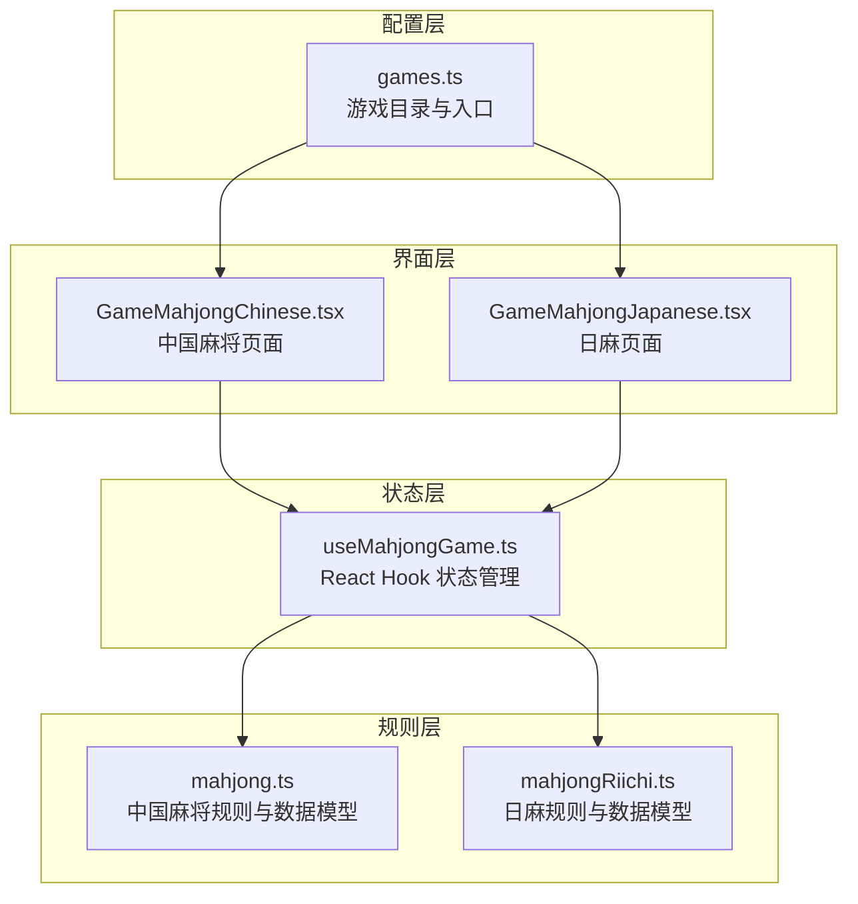
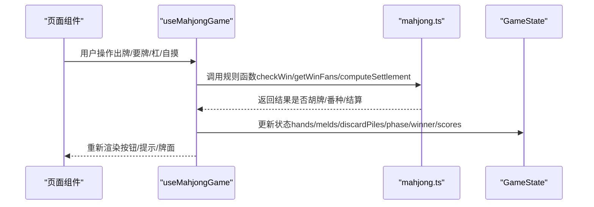
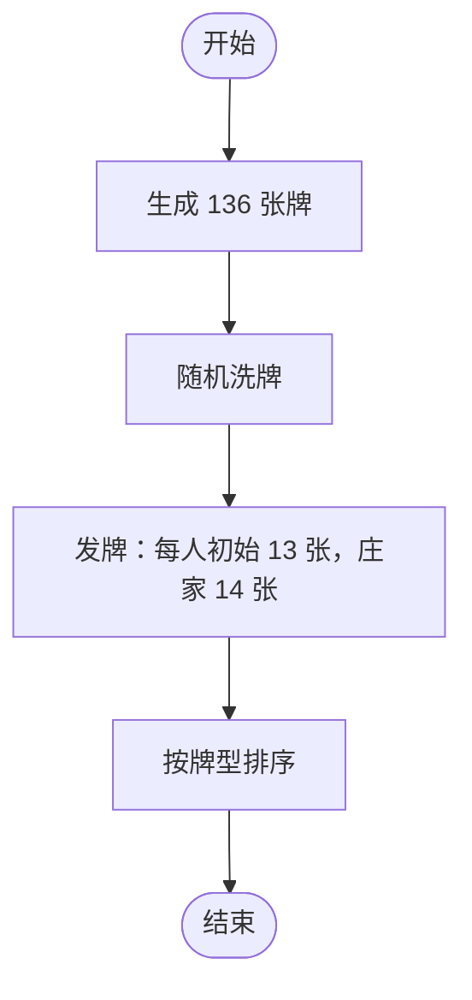
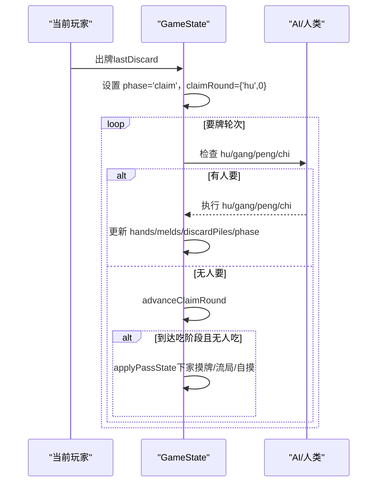
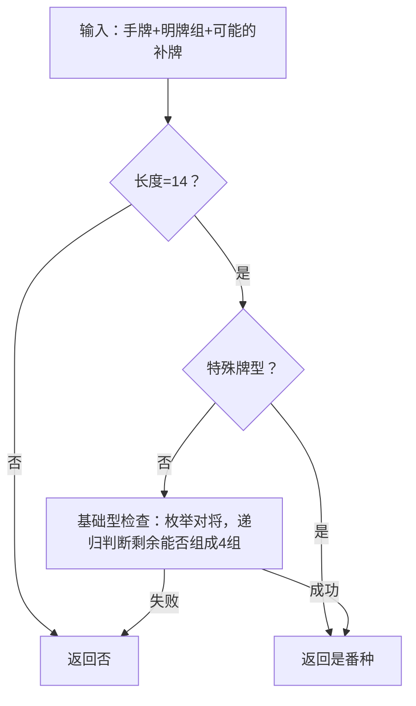
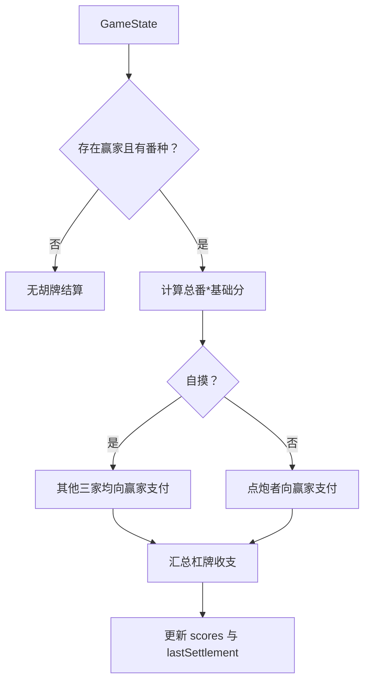
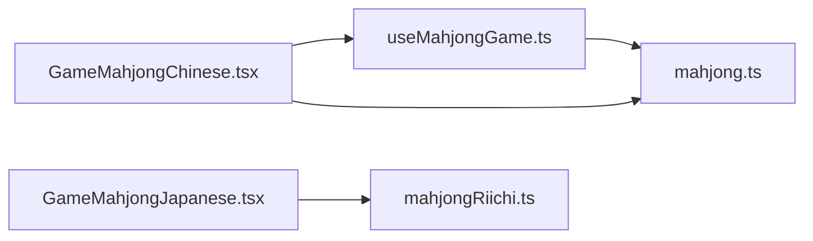
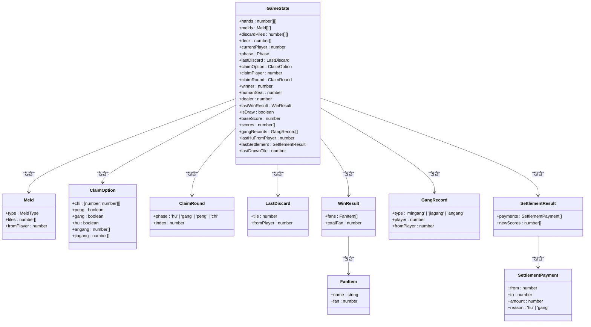

# 游戏数据结构

<cite>
**本文引用的文件**
- [mahjong.ts](file://src/lib/mahjong.ts)
- [useMahjongGame.ts](file://src/hooks/useMahjongGame.ts)
- [GameMahjongChinese.tsx](file://src/pages/GameMahjongChinese.tsx)
- [GameMahjongJapanese.tsx](file://src/pages/GameMahjongJapanese.tsx)
- [mahjongRiichi.ts](file://src/lib/mahjongRiichi.ts)
- [games.ts](file://src/data/games.ts)
</cite>

## 目录
1. [简介](#简介)
2. [项目结构](#项目结构)
3. [核心组件](#核心组件)
4. [架构概览](#架构概览)
5. [详细组件分析](#详细组件分析)
6. [依赖分析](#依赖分析)
7. [性能考量](#性能考量)
8. [故障排查指南](#故障排查指南)
9. [结论](#结论)
10. [附录](#附录)

## 简介
本文件面向 Rsbuild2 项目中的麻将游戏，系统化梳理其核心数据结构与规则实现，重点覆盖以下方面：
- 牌型定义与牌组结构（TILE_LABELS、数字牌与字牌、明牌组 Meld/MeldType）
- 游戏状态（GameState、Phase、ClaimRound、ClaimOption、LastDiscard）
- 计分系统数据模型（FanItem、WinResult、GangRecord、SettlementPayment、SettlementResult）
- 手牌管理、明牌组处理、听牌检测与快胡值估算
- 游戏状态转换机制与数据验证规则
- 数据结构之间的关系图与交互模式
- 设计原则与扩展性建议

## 项目结构
麻将相关代码主要分布在以下模块：
- 核心规则库：src/lib/mahjong.ts（中国麻将规则与数据模型）
- React Hook：src/hooks/useMahjongGame.ts（状态管理与流程控制）
- 页面组件：src/pages/GameMahjongChinese.tsx（UI 与交互）
- 日麻规则库：src/lib/mahjongRiichi.ts（日麻规则与数据模型）
- 日麻页面：src/pages/GameMahjongJapanese.tsx（日麻 UI 与交互）
- 游戏目录：src/data/games.ts（游戏分类与入口）

图表来源
- [mahjong.ts](file://src/lib/mahjong.ts#L1-L494)
- [useMahjongGame.ts](file://src/hooks/useMahjongGame.ts#L1-L866)
- [GameMahjongChinese.tsx](file://src/pages/GameMahjongChinese.tsx#L1-L469)
- [GameMahjongJapanese.tsx](file://src/pages/GameMahjongJapanese.tsx#L1-L800)
- [mahjongRiichi.ts](file://src/lib/mahjongRiichi.ts#L1-L200)
- [games.ts](file://src/data/games.ts#L1-L197)

章节来源
- [mahjong.ts](file://src/lib/mahjong.ts#L1-L494)
- [useMahjongGame.ts](file://src/hooks/useMahjongGame.ts#L1-L866)
- [GameMahjongChinese.tsx](file://src/pages/GameMahjongChinese.tsx#L1-L469)
- [GameMahjongJapanese.tsx](file://src/pages/GameMahjongJapanese.tsx#L1-L800)
- [mahjongRiichi.ts](file://src/lib/mahjongRiichi.ts#L1-L200)
- [games.ts](file://src/data/games.ts#L1-L197)

## 核心组件
本节聚焦麻将核心数据模型与规则支撑。

- 牌型定义与牌组
  - TILE_LABELS：34 种牌型的中文标签映射（万条筒字）
  - 数字牌与字牌：通过索引范围区分（0-8 万、9-17 条、18-26 筒、27-33 字）
  - 牌组生成与洗牌：createShuffledDeck
  - 发牌：deal（逆时针每人初始手牌，庄家多摸一张）

- 明牌组结构
  - MeldType：'chi' | 'peng' | 'mingang' | 'angang' | 'jiagang'
  - Meld：type + tiles + fromPlayer（点炮来源）

- 游戏状态
  - Phase：'draw' | 'discard' | 'claim'
  - ClaimRound：要牌轮次阶段与索引（hu/gang/peng/chi）
  - ClaimOption：当前可执行操作集合（chi/peng/gang/hu/angang/jiagang）
  - LastDiscard：最近打出的牌与来源玩家
  - GameState：完整游戏状态（手牌、明牌组、弃牌堆、牌墙、当前玩家、阶段、赢家、分数、杠记录、结算等）

- 计分系统数据模型
  - FanItem：番种名称与番数
  - WinResult：番种列表与总番数
  - GangRecord：杠牌记录（类型、玩家、点杠者）
  - SettlementPayment：单笔收支（from/to/amount/reason）
  - SettlementResult：局终结算（收支明细与新分数）

- 牌池统计与听牌检测
  - getTileCountsSeen：统计各家弃牌与明牌组中各牌出现次数
  - getWaitingTiles：听牌检测（返回等待张列表）

- 胡牌判定与番种计算
  - checkWin：基础型 1 对 + 4 组；支持十三幺、七小对、龙七对
  - getWinFans：番种计算（对对胡、清一色、混一色、门清、自摸、杠上开花、海底捞月等）

- 快胡值估算与策略
  - estimateKuaiHuValue：快速估算胡牌难度（用于策略与舍牌）
  - 策略函数：AI 决策概率、吃法评分、记牌与防守策略

章节来源
- [mahjong.ts](file://src/lib/mahjong.ts#L1-L494)

## 架构概览
中国麻将与日麻采用相似的状态机与数据模型，但规则细节不同。整体交互如下：

图表来源
- [useMahjongGame.ts](file://src/hooks/useMahjongGame.ts#L209-L739)
- [mahjong.ts](file://src/lib/mahjong.ts#L416-L493)

章节来源
- [useMahjongGame.ts](file://src/hooks/useMahjongGame.ts#L209-L739)
- [mahjong.ts](file://src/lib/mahjong.ts#L416-L493)

## 详细组件分析

### 牌型与牌组结构
- 牌型定义
  - TILE_LABELS 提供 34 种牌型的中文标签，便于 UI 展示
  - 数字牌与字牌通过索引区间区分，便于算法判断（如 isNumberTile、sameSuit、isSequence）
- 牌组生成与发牌
  - createShuffledDeck：生成 136 张牌（每种 4 张），随机洗牌
  - deal：按逆时针顺序发牌，庄家多摸一张，其余玩家保持排序

图表来源
- [mahjong.ts](file://src/lib/mahjong.ts#L33-L58)

章节来源
- [mahjong.ts](file://src/lib/mahjong.ts#L1-L72)

### 明牌组与要牌轮次
- 明牌组结构
  - Meld：包含类型、牌面集合与点炮来源
  - MeldType：支持吃、碰、明杠、暗杠、加杠
- 要牌轮次
  - ClaimRound：按 hu/gang/peng/chi 阶段轮询（下家→对家→上家）
  - ClaimOption：根据手牌与最后一张牌生成可执行操作
  - processClaimRound：AI 决策与状态推进

图表来源
- [useMahjongGame.ts](file://src/hooks/useMahjongGame.ts#L109-L159)
- [useMahjongGame.ts](file://src/hooks/useMahjongGame.ts#L541-L732)

章节来源
- [mahjong.ts](file://src/lib/mahjong.ts#L23-L31)
- [useMahjongGame.ts](file://src/hooks/useMahjongGame.ts#L109-L159)
- [useMahjongGame.ts](file://src/hooks/useMahjongGame.ts#L541-L732)

### 胡牌判定与番种计算
- 胡牌判定
  - checkWin：先判特殊牌型（十三幺、龙七对、七小对），再判基础型（1 对 + 4 组）
  - canFormFourMelds：递归尝试移除三张相同或连续三张，判断是否可组成 4 组
- 番种计算
  - getWinFans：根据牌型与条件（自摸/杠上开花/海底捞月/门清/清一色/混一色/对对胡）累加番数

图表来源
- [mahjong.ts](file://src/lib/mahjong.ts#L135-L154)
- [mahjong.ts](file://src/lib/mahjong.ts#L74-L90)

章节来源
- [mahjong.ts](file://src/lib/mahjong.ts#L135-L154)
- [mahjong.ts](file://src/lib/mahjong.ts#L380-L414)

### 计分系统与局终结算
- 计分模型
  - FanItem：番种名称与番数
  - WinResult：番种列表与总番数
  - GangRecord：杠牌记录（类型、玩家、点杠者）
  - SettlementPayment/SettlementResult：收支明细与新分数
- 结算逻辑
  - 自摸：其他三家共同支付
  - 点炮：点炮者支付
  - 杠牌：暗杠由其他三家支付，明杠/加杠由点杠者支付

图表来源
- [mahjong.ts](file://src/lib/mahjong.ts#L450-L491)

章节来源
- [mahjong.ts](file://src/lib/mahjong.ts#L302-L334)
- [mahjong.ts](file://src/lib/mahjong.ts#L450-L491)

### 听牌检测与策略
- 听牌检测
  - getWaitingTiles：遍历 34 种牌，逐一尝试补牌后是否能胡，返回等待张列表
- 快胡值估算
  - estimateKuaiHuValue：基于刻子/对子/顺子数量与需要组面子数估算难度
- 舍牌策略
  - strategyKeepValue：综合孤张字牌、幺九、防守/听牌等因素，决定保留或舍弃某张牌

章节来源
- [mahjong.ts](file://src/lib/mahjong.ts#L230-L277)
- [mahjong.ts](file://src/lib/mahjong.ts#L247-L267)
- [useMahjongGame.ts](file://src/hooks/useMahjongGame.ts#L741-L785)

### 日麻规则与数据模型（对比参考）
- 牌型与洗牌：含 3 枚赤 5（34=红5万、35=红5条、36=红5筒），getBaseTile 将其视为普通 5
- 发牌：亲家 14 张，子家 13 张
- 吃/碰/明杠：与中国麻将类似，但仅上家可吃
- 宝牌：doraIndicator 推导宝牌，countDoraInHand 统计
- 立直相关：isMenzhen/isOpenMeld/Furiten 等（日麻特有）

章节来源
- [mahjongRiichi.ts](file://src/lib/mahjongRiichi.ts#L1-L200)

## 依赖分析
- 组件耦合
  - 页面组件依赖 Hook，Hook 依赖规则库，形成清晰的分层
  - Hook 与规则库之间通过纯函数与接口契约解耦
- 直接依赖
  - useMahjongGame.ts 依赖 mahjong.ts 的所有公开接口
  - GameMahjongChinese.tsx 依赖 useMahjongGame.ts 与 mahjong.ts 的部分接口
  - 日麻页面依赖日麻规则库与 Hook（日麻 Hook 未在本仓库中，此处仅作对比）
- 外部依赖
  - React Hooks（useState/useCallback）
  - UI 组件库（Button 等）

图表来源
- [GameMahjongChinese.tsx](file://src/pages/GameMahjongChinese.tsx#L1-L469)
- [useMahjongGame.ts](file://src/hooks/useMahjongGame.ts#L1-L866)
- [mahjong.ts](file://src/lib/mahjong.ts#L1-L494)
- [GameMahjongJapanese.tsx](file://src/pages/GameMahjongJapanese.tsx#L1-L800)
- [mahjongRiichi.ts](file://src/lib/mahjongRiichi.ts#L1-L200)

章节来源
- [GameMahjongChinese.tsx](file://src/pages/GameMahjongChinese.tsx#L1-L469)
- [useMahjongGame.ts](file://src/hooks/useMahjongGame.ts#L1-L866)
- [mahjong.ts](file://src/lib/mahjong.ts#L1-L494)
- [GameMahjongJapanese.tsx](file://src/pages/GameMahjongJapanese.tsx#L1-L800)
- [mahjongRiichi.ts](file://src/lib/mahjongRiichi.ts#L1-L200)

## 性能考量
- 算法复杂度
  - checkWin：基础型递归尝试（三张相同或连续三张），时间复杂度较高，适合 14 张牌规模
  - canFormFourMelds：三重循环 + 递归，注意剪枝与提前返回
- 优化建议
  - 使用缓存（Map）存储中间结果（如牌型计数、可胡判断）
  - 在 UI 层限制实时计算频率（如延迟评估）
  - 对大牌墙场景（日麻）采用更高效的牌池统计与听牌检测
- 内存与状态
  - GameState 为纯对象，避免深层拷贝；必要时使用浅拷贝 + 不可变更新策略
  - 合理拆分状态（hands/melds/discardPiles 独立更新）

## 故障排查指南
- 常见问题
  - 出牌后无法进入要牌阶段：确认 lastDiscard 是否设置、phase 是否切换
  - 要牌轮无人要却未触发下家摸牌：检查 advanceClaimRound 与 applyPassState 的逻辑
  - 胡牌判定错误：核对 checkWin 的特殊牌型分支与基础型递归
  - 结算金额异常：核对 computeSettlement 的自摸/点炮分支与杠牌支付
- 调试建议
  - 在关键路径打印 GameState 关键字段（hands/melds/discardPiles/phase/winner/scores）
  - 使用最小化用例（如单张/双张/三张）验证规则函数
  - 对比 UI 与状态一致性，确保渲染与状态更新同步

章节来源
- [useMahjongGame.ts](file://src/hooks/useMahjongGame.ts#L118-L159)
- [mahjong.ts](file://src/lib/mahjong.ts#L450-L491)

## 结论
Rsbuild2 项目中的麻将数据结构设计遵循“规则库 + Hook + 页面”的清晰分层，核心数据模型完整覆盖了中国麻将的牌型、明牌组、游戏状态与计分体系。通过明确的状态转换与严格的规则函数，实现了可维护、可扩展的游戏逻辑。建议在后续迭代中进一步优化复杂算法的性能，并增强日麻规则的模块化与测试覆盖。

## 附录

### 数据结构关系图

图表来源
- [mahjong.ts](file://src/lib/mahjong.ts#L23-L31)
- [mahjong.ts](file://src/lib/mahjong.ts#L280-L334)
- [mahjong.ts](file://src/lib/mahjong.ts#L416-L448)

### 使用示例（代码片段路径）
- 创建并洗牌：[createShuffledDeck](file://src/lib/mahjong.ts#L33-L43)
- 发牌：[deal](file://src/lib/mahjong.ts#L46-L58)
- 胡牌判定：[checkWin](file://src/lib/mahjong.ts#L136-L154)
- 番种计算：[getWinFans](file://src/lib/mahjong.ts#L381-L414)
- 局终结算：[computeSettlement](file://src/lib/mahjong.ts#L451-L491)
- 听牌检测：[getWaitingTiles](file://src/lib/mahjong.ts#L231-L238)
- 快胡值估算：[estimateKuaiHuValue](file://src/lib/mahjong.ts#L248-L267)
- 吃/碰/明杠/暗杠/加杠选项：[getChiOptions/canPeng/canMingang/getAngangOptions/getJiagangOptions](file://src/lib/mahjong.ts#L157-L212)
- 牌池统计：[getTileCountsSeen](file://src/lib/mahjong.ts#L217-L228)