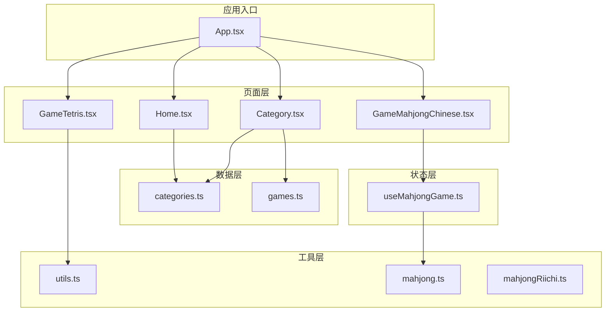
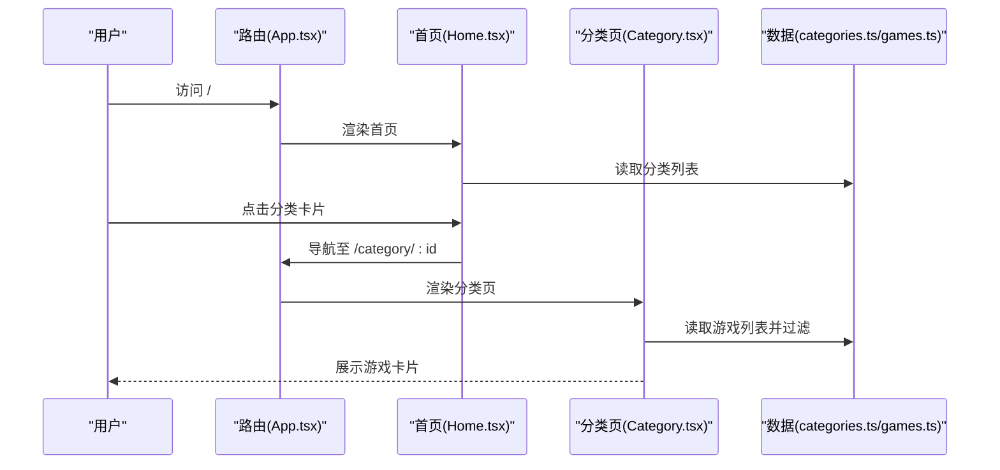
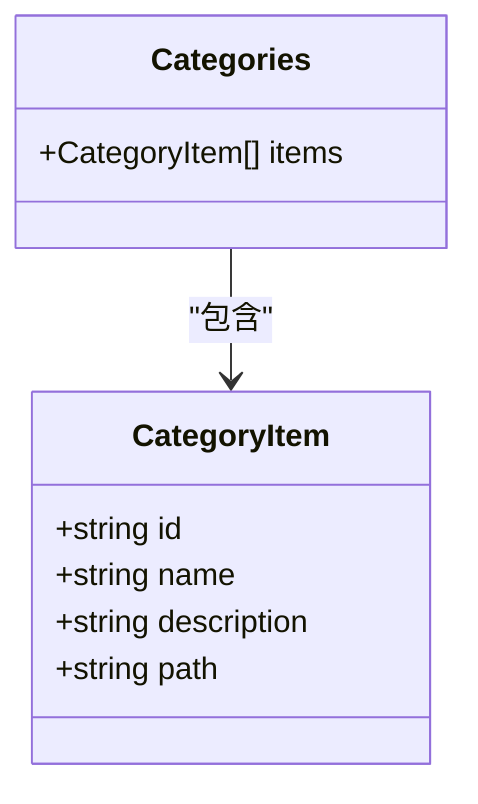
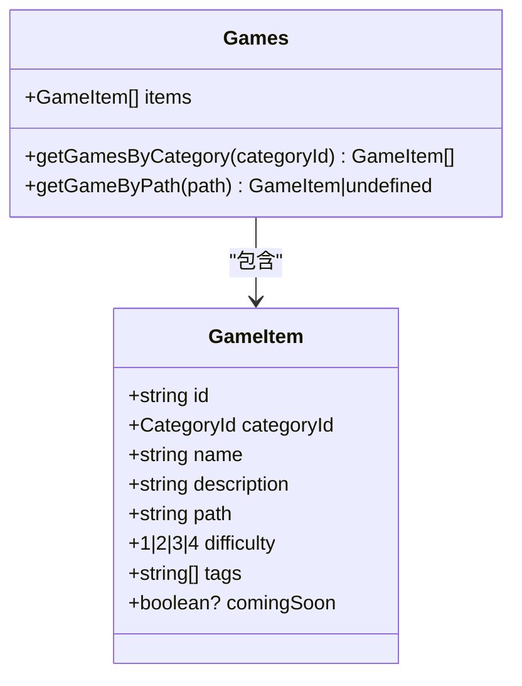
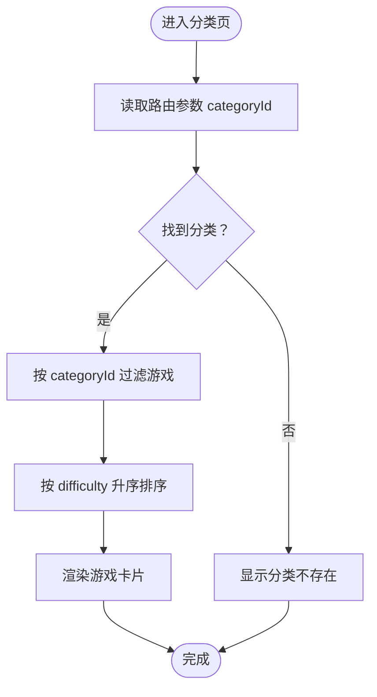
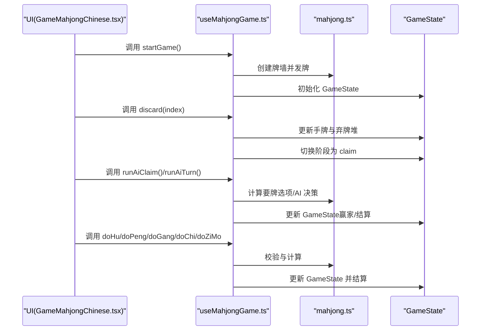
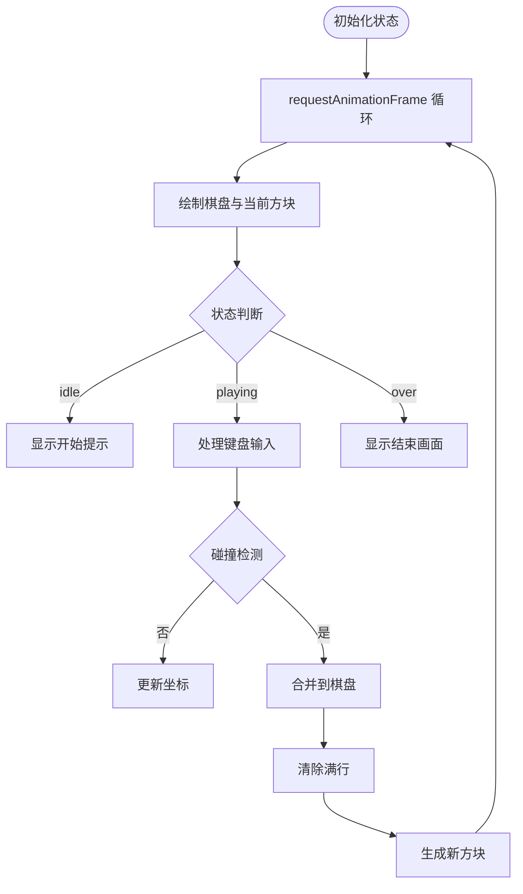
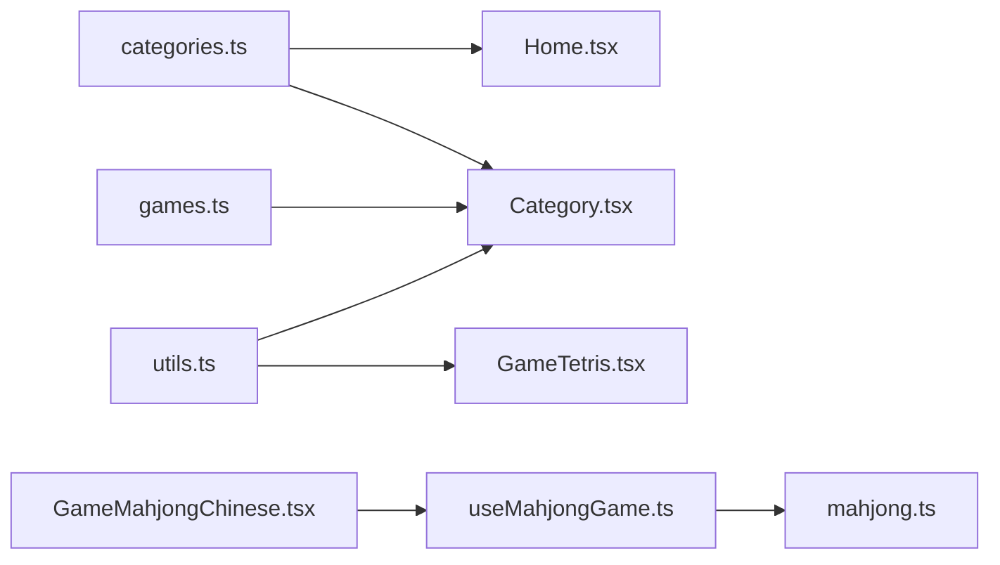

# 通用数据模型

<cite>
**本文引用的文件**
- [src/data/categories.ts](file://src/data/categories.ts)
- [src/data/games.ts](file://src/data/games.ts)
- [src/lib/utils.ts](file://src/lib/utils.ts)
- [src/pages/Home.tsx](file://src/pages/Home.tsx)
- [src/pages/Category.tsx](file://src/pages/Category.tsx)
- [src/pages/GameMahjongChinese.tsx](file://src/pages/GameMahjongChinese.tsx)
- [src/pages/GameTetris.tsx](file://src/pages/GameTetris.tsx)
- [src/hooks/useMahjongGame.ts](file://src/hooks/useMahjongGame.ts)
- [src/lib/mahjong.ts](file://src/lib/mahjong.ts)
- [src/lib/mahjongRiichi.ts](file://src/lib/mahjongRiichi.ts)
- [src/App.tsx](file://src/App.tsx)
- [tests/index.test.tsx](file://tests/index.test.tsx)
</cite>

## 目录
1. [简介](#简介)
2. [项目结构](#项目结构)
3. [核心组件](#核心组件)
4. [架构概览](#架构概览)
5. [详细组件分析](#详细组件分析)
6. [依赖关系分析](#依赖关系分析)
7. [性能考量](#性能考量)
8. [故障排查指南](#故障排查指南)
9. [结论](#结论)
10. [附录](#附录)

## 简介
本文件系统性梳理 Rsbuild2 项目中的通用数据模型与工具函数，重点覆盖：
- 游戏分类数据模型（categories.ts）
- 游戏列表数据模型（games.ts）
- 工具函数库（utils.ts）
- 数据在组件间的传递机制与状态管理策略
- 分类导航与游戏列表的数据结构设计
- 数据验证规则与业务逻辑约束
- 使用示例与常见操作模式
- 数据持久化与缓存策略建议
- 扩展性设计与未来新增功能的支持

## 项目结构
Rsbuild2 采用按职责分层的组织方式：
- 数据层：src/data（分类与游戏清单）
- 工具层：src/lib（通用工具与游戏规则库）
- 页面层：src/pages（路由页面与业务页面）
- 状态层：src/hooks（游戏状态钩子）
- 应用入口：src/App.tsx（路由配置）

图表来源
- [src/App.tsx](file://src/App.tsx#L18-L41)
- [src/pages/Home.tsx](file://src/pages/Home.tsx#L1-L43)
- [src/pages/Category.tsx](file://src/pages/Category.tsx#L1-L132)
- [src/pages/GameMahjongChinese.tsx](file://src/pages/GameMahjongChinese.tsx#L1-L469)
- [src/pages/GameTetris.tsx](file://src/pages/GameTetris.tsx#L1-L358)
- [src/data/categories.ts](file://src/data/categories.ts#L1-L34)
- [src/data/games.ts](file://src/data/games.ts#L1-L197)
- [src/lib/utils.ts](file://src/lib/utils.ts#L1-L7)
- [src/lib/mahjong.ts](file://src/lib/mahjong.ts#L1-L494)
- [src/lib/mahjongRiichi.ts](file://src/lib/mahjongRiichi.ts#L1-L632)
- [src/hooks/useMahjongGame.ts](file://src/hooks/useMahjongGame.ts#L1-L866)

章节来源
- [src/App.tsx](file://src/App.tsx#L18-L41)

## 核心组件
- 分类数据模型（CategoryItem）
  - 字段：id、name、description、path
  - 用途：定义游戏分类导航项，驱动路由跳转
- 游戏数据模型（GameItem）
  - 字段：id、categoryId、name、description、path、difficulty、tags、comingSoon（可选）
  - 用途：统一描述游戏信息，支持难度排序、标签筛选、开发中状态
- 工具函数（cn）
  - 功能：合并 Tailwind 类名，避免冲突
  - 位置：src/lib/utils.ts

章节来源
- [src/data/categories.ts](file://src/data/categories.ts#L1-L34)
- [src/data/games.ts](file://src/data/games.ts#L1-L197)
- [src/lib/utils.ts](file://src/lib/utils.ts#L1-L7)

## 架构概览
数据在组件间的传递遵循“声明式路由 + 常量数据”的模式：
- 路由通过路径参数（如 :categoryId）驱动页面渲染
- 页面读取常量数据（categories、games）进行展示
- 游戏页面内部维护自身状态（如 Tetris 的 Canvas 状态、麻将页面的状态钩子）

图表来源
- [src/App.tsx](file://src/App.tsx#L22-L36)
- [src/pages/Home.tsx](file://src/pages/Home.tsx#L19-L35)
- [src/pages/Category.tsx](file://src/pages/Category.tsx#L13-L17)
- [src/data/categories.ts](file://src/data/categories.ts#L8-L33)
- [src/data/games.ts](file://src/data/games.ts#L190-L196)

## 详细组件分析

### 分类数据模型（categories.ts）
- 结构
  - CategoryItem 接口定义字段 id、name、description、path
  - categories 数组提供静态分类清单
- 业务约束
  - id 作为路由键，必须唯一且与路由匹配
  - path 与路由配置一致，确保导航正确
- 使用场景
  - 首页网格展示分类卡片
  - 分类页根据 id 过滤游戏列表

图表来源
- [src/data/categories.ts](file://src/data/categories.ts#L1-L34)

章节来源
- [src/data/categories.ts](file://src/data/categories.ts#L1-L34)
- [src/pages/Home.tsx](file://src/pages/Home.tsx#L19-L35)
- [src/pages/Category.tsx](file://src/pages/Category.tsx#L13-L17)

### 游戏数据模型（games.ts）
- 结构
  - CategoryId 联合类型限定分类标识
  - GameItem 接口定义字段 id、categoryId、name、description、path、difficulty、tags、comingSoon
  - games 数组提供静态游戏清单
  - 工具函数：getGamesByCategory、getGameByPath
- 业务约束
  - difficulty 为 1~4 的枚举值，用于难度标签与排序
  - comingSoon 控制开发中状态下的 UI 行为
  - tags 为字符串数组，用于标签展示
- 使用场景
  - 分类页按 categoryId 过滤游戏
  - 通过 path 查找具体游戏项

图表来源
- [src/data/games.ts](file://src/data/games.ts#L1-L197)

章节来源
- [src/data/games.ts](file://src/data/games.ts#L1-L197)
- [src/pages/Category.tsx](file://src/pages/Category.tsx#L15-L17)

### 工具函数库（utils.ts）
- 结构
  - cn(...)：合并类名，避免重复与冲突
- 使用场景
  - 分类页与游戏页卡片样式动态组合

章节来源
- [src/lib/utils.ts](file://src/lib/utils.ts#L1-L7)
- [src/pages/Category.tsx](file://src/pages/Category.tsx#L68-L71)

### 分类页（Category.tsx）数据流
- 参数解析：从路由 params 获取 categoryId
- 数据过滤：getGamesByCategory 按分类筛选
- 排序与渲染：按 difficulty 升序排序，渲染卡片与标签
- 状态管理：本地状态（难度标签映射、分类信息）

图表来源
- [src/pages/Category.tsx](file://src/pages/Category.tsx#L13-L17)
- [src/data/games.ts](file://src/data/games.ts#L190-L196)

章节来源
- [src/pages/Category.tsx](file://src/pages/Category.tsx#L1-L132)
- [src/data/games.ts](file://src/data/games.ts#L190-L196)

### 麻将游戏（GameMahjongChinese.tsx）与状态钩子（useMahjongGame.ts）
- 数据模型
  - GameState：手牌、副露、弃牌堆、牌墙、当前玩家、阶段、要牌轮次、赢家、番种、结算等
  - Meld、ClaimOption、ClaimRound、WinResult、SettlementResult 等辅助类型
- 状态管理
  - useMahjongGame 提供 startGame、discard、passClaim、doHu、doPeng、doGang、doChi、doJiagang、doAngang、doZiMo、runAiClaim、runAiTurn 等方法
  - 通过 setState 更新 GameState，驱动 UI 渲染
- 业务逻辑
  - 要牌轮次按“胡/杠/碰/吃”顺序推进，AI 决策基于策略函数
  - 结算计算（自摸 3 家付 / 点炮 1 家付）与杠牌计分

图表来源
- [src/pages/GameMahjongChinese.tsx](file://src/pages/GameMahjongChinese.tsx#L121-L138)
- [src/hooks/useMahjongGame.ts](file://src/hooks/useMahjongGame.ts#L209-L239)
- [src/lib/mahjong.ts](file://src/lib/mahjong.ts#L416-L448)

章节来源
- [src/pages/GameMahjongChinese.tsx](file://src/pages/GameMahjongChinese.tsx#L1-L469)
- [src/hooks/useMahjongGame.ts](file://src/hooks/useMahjongGame.ts#L1-L866)
- [src/lib/mahjong.ts](file://src/lib/mahjong.ts#L1-L494)

### 俄罗斯方块（GameTetris.tsx）状态管理
- 数据模型
  - Board 状态：二维数组表示网格
  - Piece 状态：形状、旋转、坐标
  - NextPiece：下一个方块
  - Score/Lines/Level：游戏进度
- 状态管理
  - 通过 useRef 保存 board、piece、dropInterval 等
  - 通过 useState 管理 score、level、lines、status
  - 键盘事件驱动移动、旋转、加速与落地
  - requestAnimationFrame 循环渲染

图表来源
- [src/pages/GameTetris.tsx](file://src/pages/GameTetris.tsx#L129-L233)

章节来源
- [src/pages/GameTetris.tsx](file://src/pages/GameTetris.tsx#L1-L358)

## 依赖关系分析
- 组件依赖
  - Home.tsx 依赖 categories.ts
  - Category.tsx 依赖 categories.ts 与 games.ts，并使用 utils.ts 的 cn
  - GameMahjongChinese.tsx 依赖 useMahjongGame.ts 与 mahjong.ts
  - GameTetris.tsx 依赖 utils.ts 的 cn
- 数据依赖
  - 分类与游戏数据为纯静态常量，耦合度低，便于扩展
  - 麻将状态依赖规则库，规则变化影响状态计算
- 路由依赖
  - App.tsx 统一注册路由，保证路径与数据模型一致

图表来源
- [src/pages/Home.tsx](file://src/pages/Home.tsx#L3-L3)
- [src/pages/Category.tsx](file://src/pages/Category.tsx#L3-L5)
- [src/data/categories.ts](file://src/data/categories.ts#L1-L34)
- [src/data/games.ts](file://src/data/games.ts#L1-L197)
- [src/lib/utils.ts](file://src/lib/utils.ts#L1-L7)
- [src/hooks/useMahjongGame.ts](file://src/hooks/useMahjongGame.ts#L1-L22)
- [src/lib/mahjong.ts](file://src/lib/mahjong.ts#L1-L494)
- [src/pages/GameMahjongChinese.tsx](file://src/pages/GameMahjongChinese.tsx#L1-L11)

章节来源
- [src/App.tsx](file://src/App.tsx#L22-L36)

## 性能考量
- 游戏列表过滤
  - games.ts 提供 getGamesByCategory 与 getGameByPath，复杂度 O(n)，在小规模数据下可接受
  - 若数据增长，建议引入索引表（Map）以降低查找成本
- 麻将状态计算
  - 要牌轮次与 AI 决策涉及多次计算，建议：
    - 缓存 claimOption 与计算结果
    - 对 AI 决策增加节流/防抖
- 游戏渲染
  - Tetris 使用 requestAnimationFrame，避免频繁重排
  - 麻将 UI 通过类名合并减少样式冲突，提升渲染效率

## 故障排查指南
- 分类不存在
  - 现象：访问 /category/:id 时显示“分类不存在”
  - 排查：确认 categoryId 与 categories.ts 中 id 匹配
- 游戏列表为空
  - 现象：分类页显示“暂无游戏，敬请期待”
  - 排查：确认 games.ts 中 categoryId 与分类 id 匹配
- 麻将按钮不可用
  - 现象：无法点击“胡/杠/碰/吃/过”
  - 排查：检查 GameState 的 phase 与 claimOption，确认当前玩家与要牌轮次
- 俄罗斯方块无法移动
  - 现象：键盘事件无效
  - 排查：确认状态为 playing，且未处于 over

章节来源
- [src/pages/Category.tsx](file://src/pages/Category.tsx#L19-L37)
- [src/pages/Category.tsx](file://src/pages/Category.tsx#L15-L17)
- [src/hooks/useMahjongGame.ts](file://src/hooks/useMahjongGame.ts#L265-L272)
- [src/pages/GameTetris.tsx](file://src/pages/GameTetris.tsx#L235-L311)

## 结论
Rsbuild2 的通用数据模型以“静态常量 + 路由 + 状态钩子”的方式实现清晰的数据流与可维护性。分类与游戏数据模型简洁明确，工具函数提供必要的样式合并能力。麻将与俄罗斯方块分别展示了复杂状态管理与高效渲染的最佳实践。建议在未来扩展中：
- 引入索引与缓存优化查询性能
- 将规则库模块化，便于单元测试与演进
- 为关键状态提供持久化方案（如 localStorage）

## 附录

### 数据模型使用示例与常见操作模式
- 获取分类下的所有游戏
  - 调用：getGamesByCategory(categoryId)
  - 场景：分类页渲染
- 通过路径获取游戏详情
  - 调用：getGameByPath(path)
  - 场景：路由跳转后的页面初始化
- 合并类名
  - 调用：cn(...)
  - 场景：卡片样式动态组合

章节来源
- [src/data/games.ts](file://src/data/games.ts#L190-L196)
- [src/lib/utils.ts](file://src/lib/utils.ts#L4-L6)
- [src/pages/Category.tsx](file://src/pages/Category.tsx#L68-L71)

### 数据持久化与缓存策略建议
- 游戏列表缓存
  - 建议：在内存中缓存过滤结果，避免重复遍历
- 麻将状态持久化
  - 建议：将 GameState 序列化存储于 localStorage，页面加载时恢复
- 游戏偏好设置
  - 建议：用户偏好（如难度偏好、标签筛选）持久化

[本节为通用建议，无需特定文件来源]

### 扩展性设计
- 新增分类
  - 在 categories.ts 添加 CategoryItem，并在路由中注册路径
- 新增游戏
  - 在 games.ts 添加 GameItem，设置 categoryId 与 difficulty
  - 如为开发中，设置 comingSoon 为 true
- 新增游戏规则
  - 在 lib/mahjong.ts 或新增规则库中扩展类型与计算函数
  - 在 useMahjongGame.ts 中集成新规则

章节来源
- [src/data/categories.ts](file://src/data/categories.ts#L8-L33)
- [src/data/games.ts](file://src/data/games.ts#L15-L188)
- [src/lib/mahjong.ts](file://src/lib/mahjong.ts#L279-L448)
- [src/hooks/useMahjongGame.ts](file://src/hooks/useMahjongGame.ts#L209-L239)