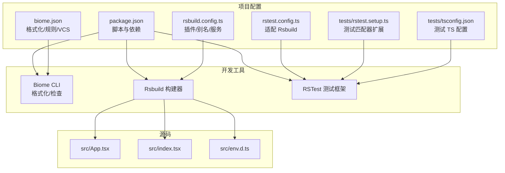
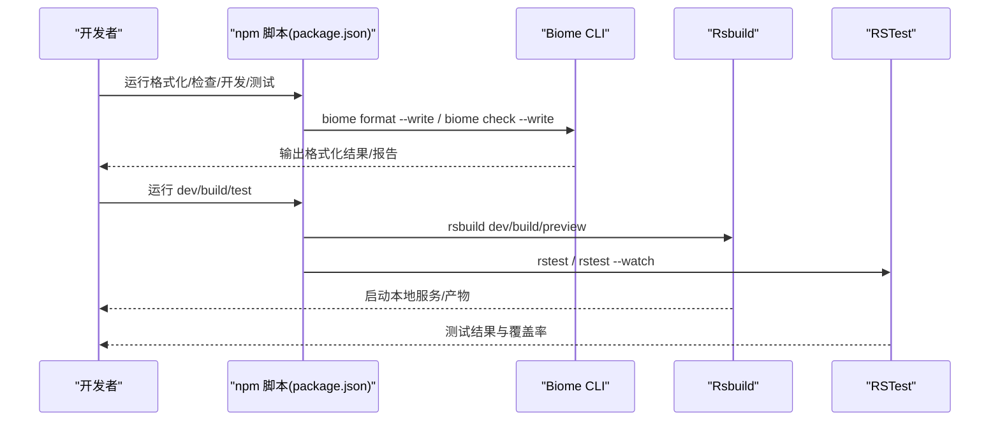
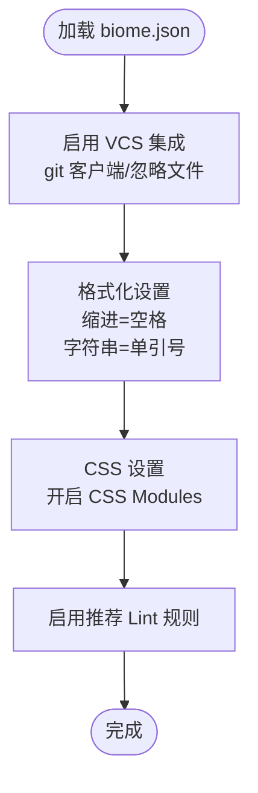
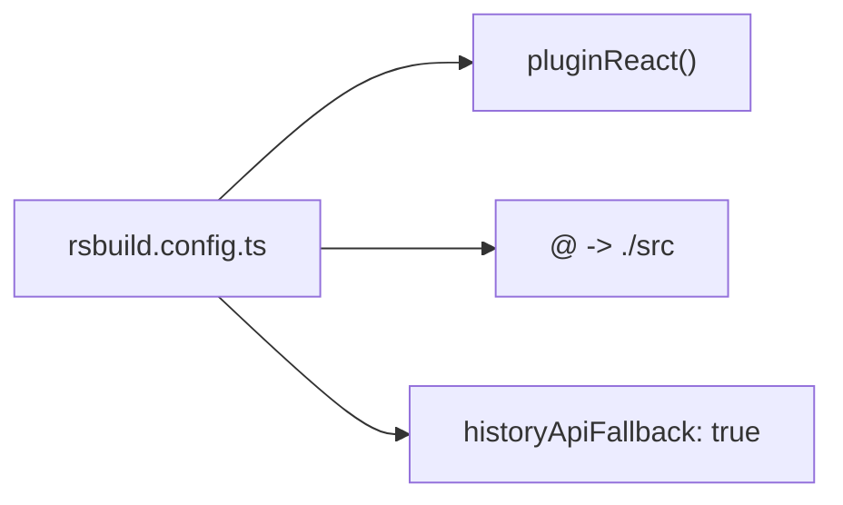
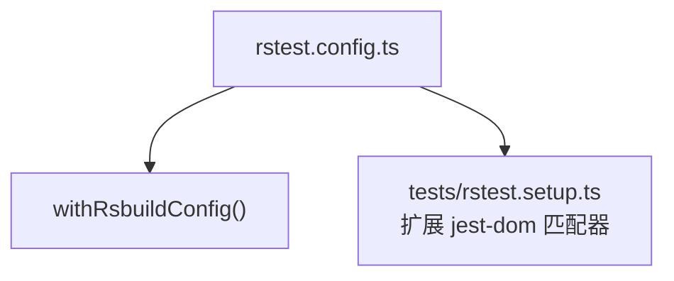
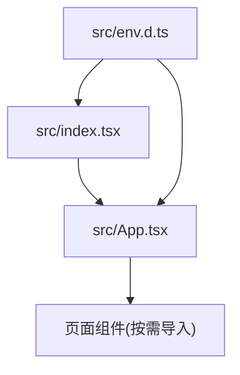
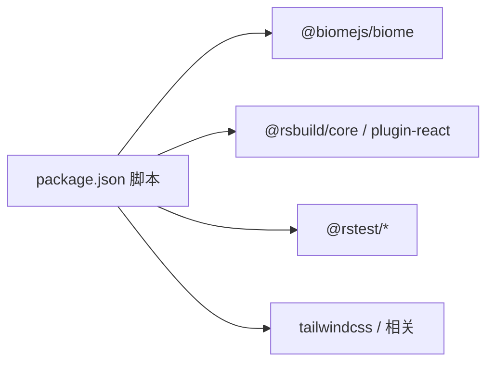

# 代码质量工具

<cite>
**本文引用的文件**
- [biome.json](file://biome.json)
- [package.json](file://package.json)
- [README.md](file://README.md)
- [rsbuild.config.ts](file://rsbuild.config.ts)
- [rstest.config.ts](file://rstest.config.ts)
- [tests/rstest.setup.ts](file://tests/rstest.setup.ts)
- [tests/tsconfig.json](file://tests/tsconfig.json)
- [src/App.tsx](file://src/App.tsx)
- [src/index.tsx](file://src/index.tsx)
- [src/env.d.ts](file://src/env.d.ts)
</cite>

## 目录
1. [简介](#简介)
2. [项目结构](#项目结构)
3. [核心组件](#核心组件)
4. [架构总览](#架构总览)
5. [详细组件分析](#详细组件分析)
6. [依赖分析](#依赖分析)
7. [性能考虑](#性能考虑)
8. [故障排查指南](#故障排查指南)
9. [结论](#结论)
10. [附录](#附录)

## 简介
本指南面向 Rsbuild2 项目，系统讲解基于 Biome 的代码质量工具链配置与使用，覆盖以下主题：
- Biome 配置文件各项设置：代码格式化、JavaScript/CSS 规则、VCS 集成、性能优化建议
- Git 钩子与预提交检查的配置方法
- 代码质量检查流程的自动化：ESLint、Prettier 与 Biome 的协同
- 在持续集成（CI）中运行代码质量检查的策略
- 常见问题与最佳实践
- 团队协作中的代码规范制定与执行策略

## 项目结构
Rsbuild2 使用 Rsbuild 构建，配合 Biome 提供统一的格式化与质量检查能力。项目中已内置 Biome 配置与脚本命令，测试框架采用 RSTest。

图表来源
- [package.json](file://package.json#L1-L43)
- [biome.json](file://biome.json#L1-L35)
- [rsbuild.config.ts](file://rsbuild.config.ts#L1-L15)
- [rstest.config.ts](file://rstest.config.ts#L1-L9)
- [tests/rstest.setup.ts](file://tests/rstest.setup.ts#L1-L5)
- [tests/tsconfig.json](file://tests/tsconfig.json#L1-L7)
- [src/App.tsx](file://src/App.tsx#L1-L42)
- [src/index.tsx](file://src/index.tsx#L1-L14)
- [src/env.d.ts](file://src/env.d.ts#L1-L12)

章节来源
- [package.json](file://package.json#L1-L43)
- [README.md](file://README.md#L1-L37)

## 核心组件
- Biome 配置与脚本
  - biome.json：启用 VCS 集成、推荐 Lint 规则、格式化空格缩进与单引号策略、CSS Modules 解析
  - package.json：定义格式化与检查脚本，集成 Biome CLI
- 构建与测试
  - rsbuild.config.ts：启用 React 插件、路径别名、历史路由回退
  - rstest.config.ts：基于 Rsbuild 适配器的测试配置，扩展 Jest DOM 匹配器

章节来源
- [biome.json](file://biome.json#L1-L35)
- [package.json](file://package.json#L6-L14)
- [rsbuild.config.ts](file://rsbuild.config.ts#L1-L15)
- [rstest.config.ts](file://rstest.config.ts#L1-L9)
- [tests/rstest.setup.ts](file://tests/rstest.setup.ts#L1-L5)

## 架构总览
下图展示从开发者到构建与质量检查的整体流程：

图表来源
- [package.json](file://package.json#L6-L14)
- [rsbuild.config.ts](file://rsbuild.config.ts#L1-L15)
- [rstest.config.ts](file://rstest.config.ts#L1-L9)

## 详细组件分析

### Biome 配置详解
- VCS 集成
  - 启用 git 客户端、读取 .gitignore 忽略文件，确保检查范围与版本控制一致
- 格式化
  - 缩进风格为空格；JavaScript 字符串使用单引号
- CSS
  - 开启 CSS Modules 解析，便于模块化样式管理
- Lint
  - 启用推荐规则集，覆盖常见语法与可维护性问题

图表来源
- [biome.json](file://biome.json#L10-L33)

章节来源
- [biome.json](file://biome.json#L1-L35)

### Rsbuild 构建配置
- 插件：React 插件用于 JSX/TSX 支持
- 别名：@ 指向 src，提升导入一致性
- 服务器：开启 historyApiFallback，利于前端路由

图表来源
- [rsbuild.config.ts](file://rsbuild.config.ts#L1-L15)

章节来源
- [rsbuild.config.ts](file://rsbuild.config.ts#L1-L15)

### RSTest 测试配置
- 基于 Rsbuild 适配器，继承 Rsbuild 的构建与资源处理能力
- 扩展 Jest DOM 匹配器，增强断言能力

图表来源
- [rstest.config.ts](file://rstest.config.ts#L1-L9)
- [tests/rstest.setup.ts](file://tests/rstest.setup.ts#L1-L5)

章节来源
- [rstest.config.ts](file://rstest.config.ts#L1-L9)
- [tests/rstest.setup.ts](file://tests/rstest.setup.ts#L1-L5)

### 源码与类型声明
- 入口与路由：App.tsx 定义路由与页面组件导入；index.tsx 渲染入口
- 类型声明：env.d.ts 声明 SVG 模块类型，配合 Rsbuild SVGR 插件

图表来源
- [src/index.tsx](file://src/index.tsx#L1-L14)
- [src/App.tsx](file://src/App.tsx#L1-L42)
- [src/env.d.ts](file://src/env.d.ts#L1-L12)

章节来源
- [src/index.tsx](file://src/index.tsx#L1-L14)
- [src/App.tsx](file://src/App.tsx#L1-L42)
- [src/env.d.ts](file://src/env.d.ts#L1-L12)

## 依赖分析
- 脚本与命令
  - format：调用 Biome 格式化并写回
  - check：调用 Biome 检查并写回
  - dev/build/preview/test/test:watch：分别对应开发、构建、预览与测试
- 外部依赖
  - @biomejs/biome：Biome CLI
  - @rsbuild/core 与 @rsbuild/plugin-react：构建与 React 支持
  - @rstest/*：测试框架与适配器
  - tailwindcss 及相关：样式工具链

图表来源
- [package.json](file://package.json#L6-L14)
- [package.json](file://package.json#L25-L41)

章节来源
- [package.json](file://package.json#L1-L43)

## 性能考虑
- 使用 Biome 的 VCS 集成与忽略文件，避免对未跟踪或忽略文件进行检查，减少 IO 与 CPU 开销
- 在大型项目中，优先在变更集上运行检查，结合 CI 的增量检查策略
- 构建阶段尽量复用缓存与并行任务，避免重复格式化与类型检查

## 故障排查指南
- 格式化未生效
  - 确认 biome.json 中格式化规则已启用，且编辑器已安装 Biome 插件以支持实时提示
  - 在终端执行格式化脚本，观察输出与文件变更
- Lint 报错
  - 使用检查脚本定位问题，必要时临时关闭特定规则以验证影响范围
  - 结合推荐规则集逐步收敛问题
- VCS 集成异常
  - 确认 .gitignore 存在且被正确读取；检查 VCS 客户端配置
- 测试失败
  - 查看 RSTest 输出与断言信息，确认测试环境与匹配器已正确扩展

章节来源
- [biome.json](file://biome.json#L10-L14)
- [package.json](file://package.json#L6-L14)
- [tests/rstest.setup.ts](file://tests/rstest.setup.ts#L1-L5)

## 结论
Rsbuild2 已具备完善的代码质量工具基础：Biome 负责格式化与 Lint，Rsbuild 提供构建与开发体验，RSTest 覆盖测试场景。通过合理的配置与脚本编排，团队可以高效地在本地与 CI 中保持一致的质量标准。

## 附录

### 附录A：Git 钩子与预提交检查
- 推荐方案
  - 使用 Husky + lint-staged 组合，在提交前自动运行 Biome 格式化与检查，并对暂存区文件执行 ESLint/Prettier（如需）
- 配置步骤
  - 安装 husky 与 lint-staged
  - 在 package.json 中添加 prepare 脚本以初始化 Husky
  - 在根目录新增 .husky/pre-commit 文件，内容为：先运行 Biome 格式化与检查，再运行 ESLint/Prettier（如需）
  - 在 lint-staged 中配置对 .ts/.tsx/.js/.jsx/.css 等文件执行格式化与检查
- 注意事项
  - 若项目已全面使用 Biome，可直接在 pre-commit 中调用 biome format --write 与 biome check --write
  - 保持 .gitignore 与 Biome VCS 忽略一致，避免误检

### 附录B：ESLint 与 Prettier 集成（可选）
- 当需要与现有 ESLint/Prettier 生态共存时，建议：
  - 使用 @biomejs/eslint-config 作为 ESLint 规则来源，保证与 Biome 规则一致
  - 在 Prettier 中启用与 Biome 相同的单引号、尾逗号等风格
  - 在 pre-commit 中统一执行 Biome 与 ESLint/Prettier，确保一致性

### 附录C：持续集成中的代码质量检查
- 建议流水线步骤
  - 安装依赖（pnpm install）
  - 运行 Biome 检查（不写回，仅报告错误）
  - 运行测试（RSTest）
  - 构建产物（Rsbuild build）
- 失败策略
  - 任一步骤失败即中断流水线，修复后再推送
- 缓存与加速
  - 缓存 node_modules 与 Rsbuild 构建缓存，提升 CI 速度

### 附录D：常见问题与最佳实践
- 常见问题
  - 编辑器未应用 Biome 规则：确认编辑器安装 Biome 插件并启用
  - Lint 规则冲突：优先以 Biome 为准，或调整 ESLint 规则以对齐 Biome
  - VCS 忽略导致遗漏文件：核对 .gitignore 与 biome.json 的 useIgnoreFile 配置
- 最佳实践
  - 在团队内统一 biome.json 配置，禁止在本地随意修改
  - 将格式化与检查纳入 pre-commit，保证提交质量
  - 在 CI 中严格校验格式与 Lint，避免“漂移”
  - 对大文件或复杂逻辑，拆分函数与组件，降低 Lint 复杂度