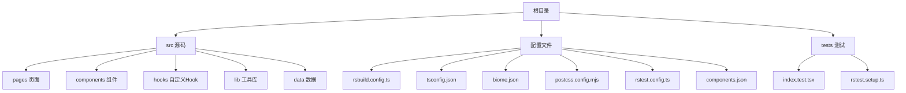
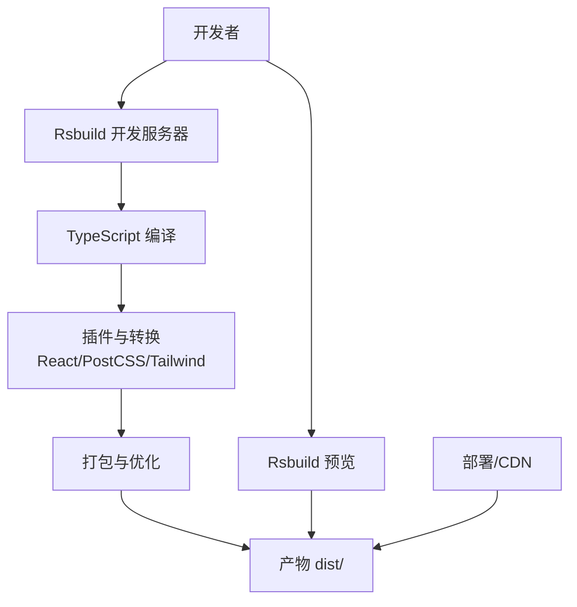
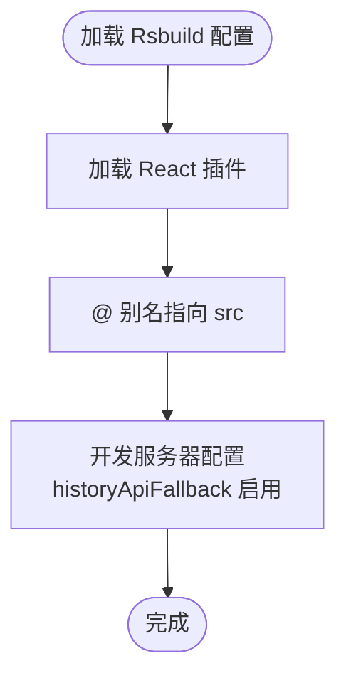
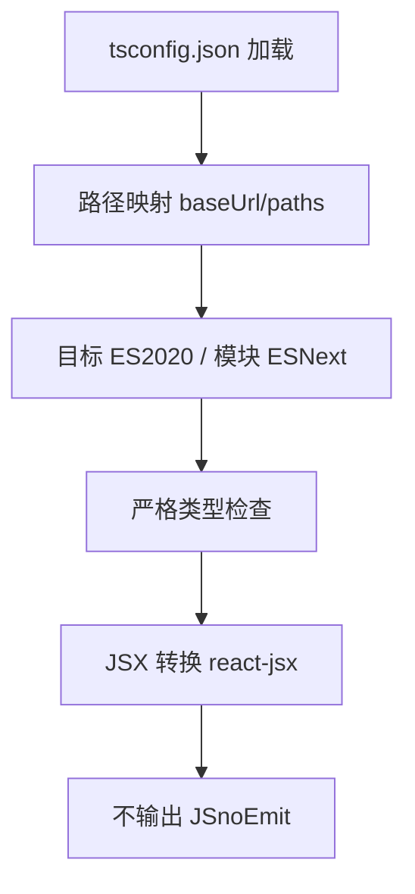
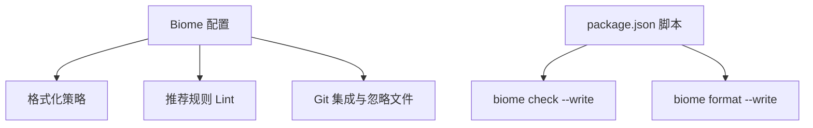
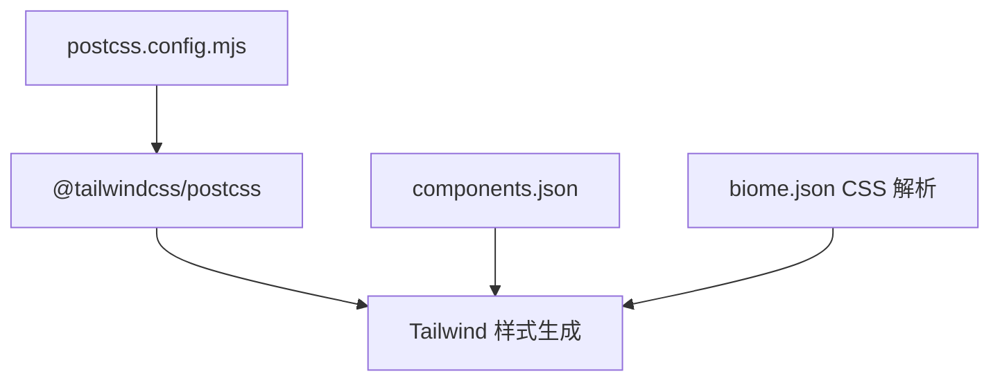
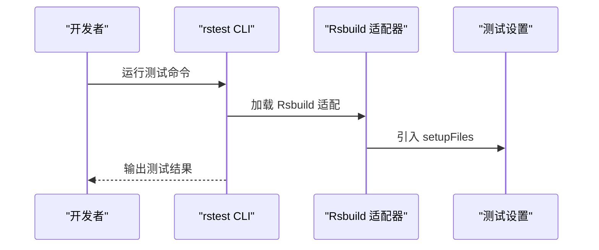
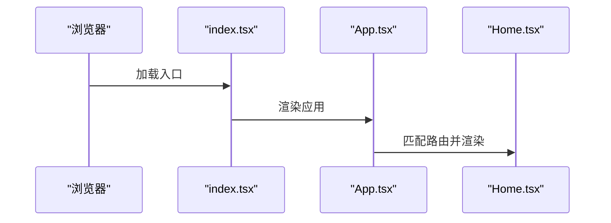
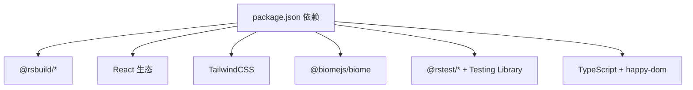

# 构建与部署

<cite>
**本文引用的文件**
- [rsbuild.config.ts](file://rsbuild.config.ts)
- [package.json](file://package.json)
- [tsconfig.json](file://tsconfig.json)
- [biome.json](file://biome.json)
- [postcss.config.mjs](file://postcss.config.mjs)
- [rstest.config.ts](file://rstest.config.ts)
- [components.json](file://components.json)
- [README.md](file://README.md)
- [src/App.tsx](file://src/App.tsx)
- [src/index.tsx](file://src/index.tsx)
- [src/pages/Home.tsx](file://src/pages/Home.tsx)
- [.gitignore](file://.gitignore)
- [tests/index.test.tsx](file://tests/index.test.tsx)
- [tests/rstest.setup.ts](file://tests/rstest.setup.ts)
</cite>

## 目录
1. [简介](#简介)
2. [项目结构](#项目结构)
3. [核心组件](#核心组件)
4. [架构总览](#架构总览)
5. [详细组件分析](#详细组件分析)
6. [依赖分析](#依赖分析)
7. [性能考虑](#性能考虑)
8. [故障排除指南](#故障排除指南)
9. [结论](#结论)
10. [附录](#附录)

## 简介
本指南面向 Rsbuild2 项目的构建与部署，系统讲解以下内容：
- Rsbuild 构建配置：开发服务器、生产优化与代码分割策略
- TypeScript 编译配置与代码质量工具（Biome）集成
- 构建流程各阶段：从源码编译到产物生成
- 部署最佳实践：静态资源优化与 CDN 集成
- CI/CD 流程与自动化部署策略
- 性能监控与构建产物分析方法
- 常见问题排查与解决方案

## 项目结构
该项目采用以功能模块划分的前端工程组织方式，核心目录与文件如下：
- 源码位于 src/，按页面、组件、数据、自定义 Hook 和通用库分层
- 构建与工具配置集中在根目录的配置文件中
- 测试位于 tests/，使用 Rstest 适配 Rsbuild 的测试运行器

图表来源
- [rsbuild.config.ts](file://rsbuild.config.ts#L1-L16)
- [tsconfig.json](file://tsconfig.json#L1-L30)
- [biome.json](file://biome.json#L1-L35)
- [postcss.config.mjs](file://postcss.config.mjs#L1-L6)
- [rstest.config.ts](file://rstest.config.ts#L1-L9)
- [components.json](file://components.json#L1-L22)

章节来源
- [README.md](file://README.md#L1-L37)
- [rsbuild.config.ts](file://rsbuild.config.ts#L1-L16)
- [tsconfig.json](file://tsconfig.json#L1-L30)
- [biome.json](file://biome.json#L1-L35)
- [postcss.config.mjs](file://postcss.config.mjs#L1-L6)
- [rstest.config.ts](file://rstest.config.ts#L1-L9)
- [components.json](file://components.json#L1-L22)

## 核心组件
- Rsbuild 构建配置：启用 React 插件、路径别名、开发服务器历史回退
- TypeScript 编译：严格类型检查、ESNext 模块解析、JSX 转换
- 代码质量：Biome 格式化与 Lint、Git VCS 集成
- 样式管线：PostCSS + TailwindCSS
- 测试：Rstest 适配 Rsbuild，自动加载测试设置文件
- UI 组件：基于 shadcn 配置的组件别名与样式入口

章节来源
- [rsbuild.config.ts](file://rsbuild.config.ts#L5-L15)
- [tsconfig.json](file://tsconfig.json#L2-L27)
- [biome.json](file://biome.json#L1-L35)
- [postcss.config.mjs](file://postcss.config.mjs#L1-L6)
- [rstest.config.ts](file://rstest.config.ts#L1-L9)
- [components.json](file://components.json#L1-L22)

## 架构总览
下图展示从开发到生产的整体流程：开发服务器启动、源码编译、打包与优化、预览与部署。

图表来源
- [rsbuild.config.ts](file://rsbuild.config.ts#L5-L15)
- [tsconfig.json](file://tsconfig.json#L2-L27)
- [postcss.config.mjs](file://postcss.config.mjs#L1-L6)
- [package.json](file://package.json#L6-L14)

章节来源
- [README.md](file://README.md#L11-L29)
- [package.json](file://package.json#L6-L14)

## 详细组件分析

### Rsbuild 构建配置
- 插件：启用 React 插件以支持 JSX 与 React 生态
- 解析别名：通过 @ 指向 src，提升导入可读性
- 开发服务器：historyApiFallback 启用，利于 SPA 路由回退

图表来源
- [rsbuild.config.ts](file://rsbuild.config.ts#L5-L15)

章节来源
- [rsbuild.config.ts](file://rsbuild.config.ts#L5-L15)

### TypeScript 编译配置
- 路径映射：baseUrl 与 paths 保持与 Rsbuild 别名一致
- 目标与模块：ES2020 目标、ESNext 模块系统、bundler 解析
- 类型检查：严格模式、未使用变量/参数检测
- JSX：react-jsx 策略
- 输出：noEmit，仅用于类型检查与编译

图表来源
- [tsconfig.json](file://tsconfig.json#L2-L27)

章节来源
- [tsconfig.json](file://tsconfig.json#L2-L27)

### 代码质量工具（Biome）
- 格式化：单引号、空格缩进、自动导入整理
- Lint：启用推荐规则
- VCS：Git 集成，忽略 .gitignore 中的文件
- 命令：格式化与检查脚本在 package.json 中定义

图表来源
- [biome.json](file://biome.json#L1-L35)
- [package.json](file://package.json#L6-L14)

章节来源
- [biome.json](file://biome.json#L1-L35)
- [package.json](file://package.json#L6-L14)

### 样式管线（PostCSS + TailwindCSS）
- PostCSS 插件：TailwindCSS 插件
- 组件样式入口：components.json 指定 Tailwind 样式文件位置
- CSS Modules：Biome 对 CSS 的解析开启 CSS Modules 支持

图表来源
- [postcss.config.mjs](file://postcss.config.mjs#L1-L6)
- [components.json](file://components.json#L6-L12)
- [biome.json](file://biome.json#L23-L27)

章节来源
- [postcss.config.mjs](file://postcss.config.mjs#L1-L6)
- [components.json](file://components.json#L6-L12)
- [biome.json](file://biome.json#L23-L27)

### 测试配置（Rstest）
- 适配 Rsbuild：withRsbuildConfig 扩展
- 设置文件：自动加载测试设置（如 Jest DOM 匹配器）

图表来源
- [rstest.config.ts](file://rstest.config.ts#L1-L9)
- [tests/rstest.setup.ts](file://tests/rstest.setup.ts#L1-L5)

章节来源
- [rstest.config.ts](file://rstest.config.ts#L1-L9)
- [tests/rstest.setup.ts](file://tests/rstest.setup.ts#L1-L5)

### 应用入口与路由
- 入口：index.tsx 渲染根节点
- 路由：App.tsx 使用 React Router DOM 定义多页面路由
- 页面：Home.tsx 展示分类与导航

图表来源
- [src/index.tsx](file://src/index.tsx#L1-L14)
- [src/App.tsx](file://src/App.tsx#L1-L42)
- [src/pages/Home.tsx](file://src/pages/Home.tsx#L1-L43)

章节来源
- [src/index.tsx](file://src/index.tsx#L1-L14)
- [src/App.tsx](file://src/App.tsx#L1-L42)
- [src/pages/Home.tsx](file://src/pages/Home.tsx#L1-L43)

## 依赖分析
- 构建与打包：@rsbuild/core、@rsbuild/plugin-react
- 运行时：React 19、react-router-dom、react-dom
- 样式：tailwindcss、@tailwindcss/postcss
- 质量：@biomejs/biome
- 测试：@rstest/core、@rstest/adapter-rsbuild、Testing Library
- 工具链：TypeScript、happy-dom（测试环境）

图表来源
- [package.json](file://package.json#L15-L41)

章节来源
- [package.json](file://package.json#L15-L41)

## 性能考虑
- 代码分割策略建议
  - 基于路由的动态导入：对大型页面或游戏页面进行懒加载，减少首屏包体
  - 动态 import 分组：将共享依赖提取至公共块，降低重复下载
- 生产优化
  - Tree Shaking：确保模块化与 ES 模块语法，配合打包器进行死代码消除
  - 压缩与压缩策略：启用最小化与资源压缩（如 CSS/JS）
  - 资源指纹：为静态资源添加哈希后缀，便于缓存与更新
- 开发体验
  - 启用 React Refresh 提升热更新效率
  - 合理的 Source Map 策略，平衡调试与体积
- 静态资源与 CDN
  - 将静态资源（图片、字体等）上传至 CDN，结合指纹命名与缓存头
  - 对第三方依赖进行外部化或 CDN 加速，缩短首屏时间
- 性能监控与分析
  - 构建后分析产物体积（Bundle Analyzer），定位大体积模块
  - 运行时监控（如 Web Vitals）与埋点，持续评估用户体验

## 故障排除指南
- 开发服务器无法访问或路由 404
  - 确认已启用 historyApiFallback，避免 SPA 路由回退失败
  - 检查路由是否正确匹配，避免路径大小写与参数不一致
- 样式未生效或 Tailwind 未生成
  - 确认 PostCSS 插件已安装并启用
  - 检查 components.json 中的样式入口路径
- TypeScript 报错或类型检查失败
  - 确保 baseUrl 与 paths 与 Rsbuild 别名一致
  - 关闭 noEmit 时仅用于类型检查，实际打包由 Rsbuild 处理
- 测试无法运行或断言失败
  - 确认 Rstest 适配 Rsbuild 已正确扩展
  - 检查 setupFiles 是否正确引入 Jest DOM 匹配器
- Git 提交被阻断或格式化冲突
  - 使用 biome check --write 与 biome format --write 修复
  - 确认 .gitignore 与 Biome VCS 忽略规则一致

章节来源
- [rsbuild.config.ts](file://rsbuild.config.ts#L12-L14)
- [postcss.config.mjs](file://postcss.config.mjs#L1-L6)
- [components.json](file://components.json#L6-L12)
- [tsconfig.json](file://tsconfig.json#L2-L27)
- [rstest.config.ts](file://rstest.config.ts#L1-L9)
- [tests/rstest.setup.ts](file://tests/rstest.setup.ts#L1-L5)
- [biome.json](file://biome.json#L10-L14)
- [.gitignore](file://.gitignore#L1-L16)

## 结论
本指南围绕 Rsbuild2 项目的构建与部署，从配置、流程、质量工具、测试、样式到性能与故障排除进行了系统梳理。建议在现有基础上进一步完善：
- 明确生产构建优化项（压缩、指纹、外部化）
- 引入 Bundle Analyzer 与运行时性能监控
- 规范 CI/CD 流程与自动化部署策略
- 持续维护 Biome 规则与测试覆盖率

## 附录
- 常用命令
  - 开发：启动开发服务器并自动打开浏览器
  - 构建：生成生产构建产物
  - 预览：本地预览生产构建
  - 测试：运行测试与监听模式
  - 质量：格式化与检查

章节来源
- [README.md](file://README.md#L11-L29)
- [package.json](file://package.json#L6-L14)