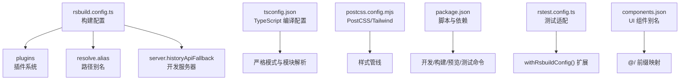
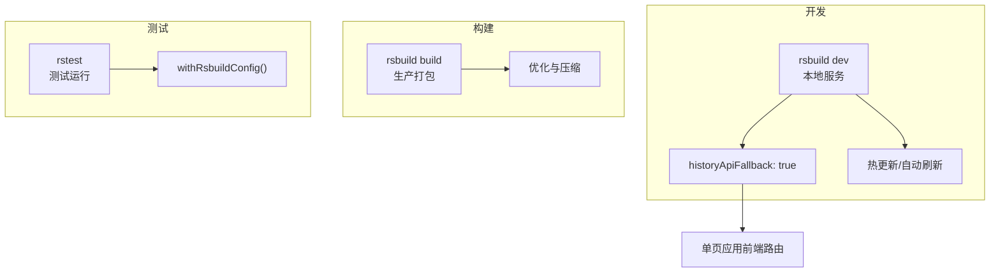
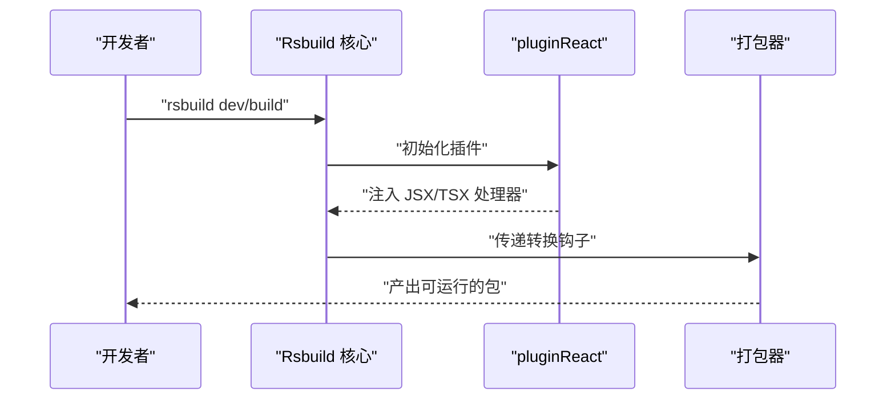
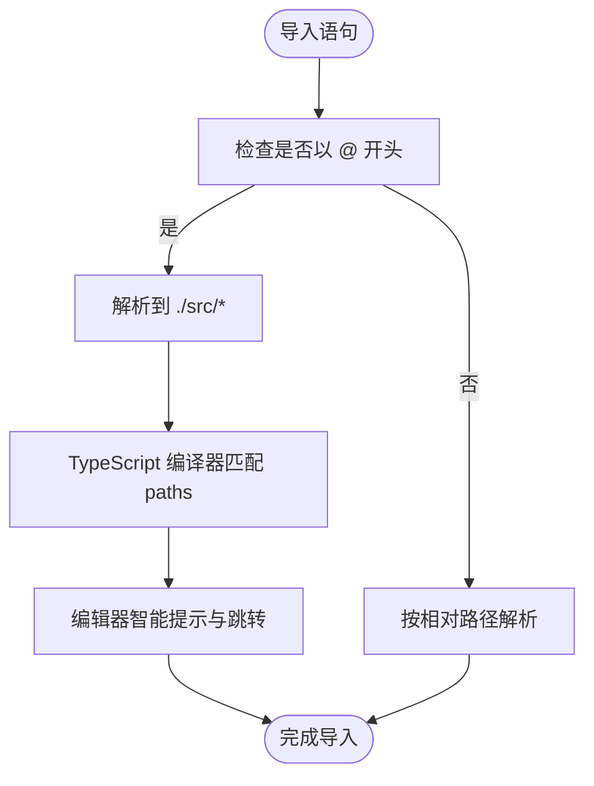
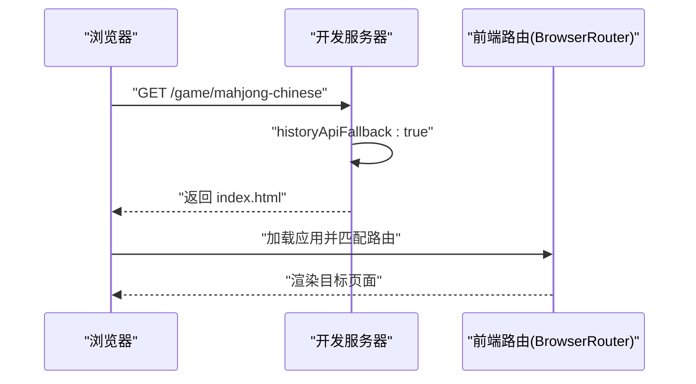
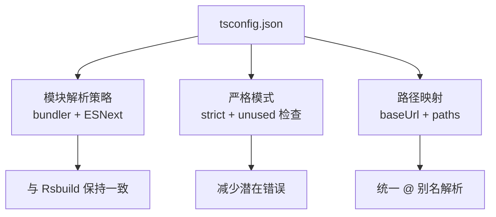
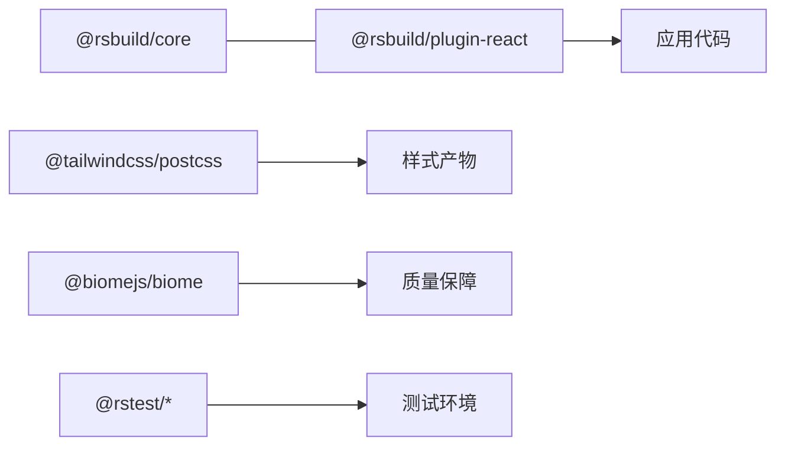

# 构建配置

<cite>
**本文引用的文件**
- [rsbuild.config.ts](file://rsbuild.config.ts)
- [package.json](file://package.json)
- [tsconfig.json](file://tsconfig.json)
- [postcss.config.mjs](file://postcss.config.mjs)
- [rstest.config.ts](file://rstest.config.ts)
- [biome.json](file://biome.json)
- [components.json](file://components.json)
- [src/App.tsx](file://src/App.tsx)
- [src/pages/Home.tsx](file://src/pages/Home.tsx)
- [src/pages/GameMahjongChinese.tsx](file://src/pages/GameMahjongChinese.tsx)
- [src/lib/mahjong.ts](file://src/lib/mahjong.ts)
- [src/hooks/useMahjongGame.ts](file://src/hooks/useMahjongGame.ts)
- [src/lib/utils.ts](file://src/lib/utils.ts)
</cite>

## 目录
1. [简介](#简介)
2. [项目结构](#项目结构)
3. [核心组件](#核心组件)
4. [架构总览](#架构总览)
5. [详细组件分析](#详细组件分析)
6. [依赖分析](#依赖分析)
7. [性能考量](#性能考量)
8. [故障排查指南](#故障排查指南)
9. [结论](#结论)
10. [附录](#附录)

## 简介
本文件面向 Rsbuild2 项目的构建配置，系统化梳理并解释以下主题：
- Rsbuild 核心配置项：插件系统、路径别名、开发服务器设置
- pluginReact 插件的作用与配置要点
- resolve.alias 如何简化模块导入路径
- server.historyApiFallback 在单页应用中的作用与意义
- TypeScript 编译配置：严格模式与模块解析策略
- 构建优化：代码分割、Tree Shaking、压缩设置
- 常见配置场景示例与最佳实践

本说明兼顾工程落地与可读性，既适合初学者快速上手，也便于资深开发者进行深度定制。

## 项目结构
该仓库采用以功能域为中心的组织方式，前端源码集中在 src 目录，构建与工具配置位于根目录：
- 构建与脚本：rsbuild.config.ts、package.json、postcss.config.mjs、rstest.config.ts、biome.json
- 类型与样式：tsconfig.json、components.json
- 源码：src 下按 pages、components、hooks、lib、data 等划分
- 测试：tests 目录及 rstest 配置

图表来源
- [rsbuild.config.ts](file://rsbuild.config.ts#L1-L16)
- [tsconfig.json](file://tsconfig.json#L1-L30)
- [postcss.config.mjs](file://postcss.config.mjs#L1-L6)
- [package.json](file://package.json#L1-L43)
- [rstest.config.ts](file://rstest.config.ts#L1-L9)
- [components.json](file://components.json#L1-L22)

章节来源
- [rsbuild.config.ts](file://rsbuild.config.ts#L1-L16)
- [package.json](file://package.json#L1-L43)

## 核心组件
本节聚焦 Rsbuild 的三大核心配置点：插件系统、路径别名与开发服务器。

- 插件系统
  - 使用 @rsbuild/plugin-react 注入 React 生态支持（JSX 转换、运行时优化等）
  - 通过 defineConfig 导出统一配置对象，便于扩展与维护

- 路径别名
  - 通过 resolve.alias 将 @ 映射到 ./src，显著降低相对路径复杂度
  - TypeScript 侧同样通过 compilerOptions.paths 配置 baseUrl 与 @/* 映射，确保编辑器与编译一致

- 开发服务器
  - server.historyApiFallback: true 支持 SPA 的前端路由回退，避免刷新 404
  - 结合 React Router 的 BrowserRouter 使用，保证深度链接与刷新可用

章节来源
- [rsbuild.config.ts](file://rsbuild.config.ts#L5-L15)
- [tsconfig.json](file://tsconfig.json#L2-L6)
- [src/App.tsx](file://src/App.tsx#L1-L42)

## 架构总览
Rsbuild 在开发与生产环境分别承担不同职责：
- 开发模式：启动本地服务，启用热更新与历史路由回退
- 构建模式：打包产物、资源优化与压缩
- 测试模式：基于 @rstest/adapter-rsbuild 的 Rsbuild 适配

图表来源
- [rsbuild.config.ts](file://rsbuild.config.ts#L12-L14)
- [rstest.config.ts](file://rstest.config.ts#L6-L7)

## 详细组件分析

### 插件系统与 pluginReact
- 作用
  - 提供 React JSX/TSX 的编译支持与运行时优化
  - 与 @rsbuild/core 协作，实现开发与构建期的统一行为
- 配置要点
  - 在 plugins 数组中注册 pluginReact()
  - 无需额外参数即可获得默认优化（如 React 18 的自动并发特性支持）

图表来源
- [rsbuild.config.ts](file://rsbuild.config.ts#L6-L6)
- [package.json](file://package.json#L25-L40)

章节来源
- [rsbuild.config.ts](file://rsbuild.config.ts#L1-L16)
- [package.json](file://package.json#L25-L40)

### 路径别名配置（resolve.alias 与 tsconfig.paths）
- Rsbuild 侧
  - alias: { '@': './src' } 将 @ 前缀解析到 src 根目录
- TypeScript 侧
  - baseUrl: "." 与 paths: { '@/*': ['./src/*'] } 保持编译器与编辑器一致
- 实际效果
  - 源码中可直接使用 '@/xxx' 导入，避免深层相对路径
  - 示例：组件、数据、逻辑模块均可通过 @ 前缀访问

图表来源
- [rsbuild.config.ts](file://rsbuild.config.ts#L7-L11)
- [tsconfig.json](file://tsconfig.json#L2-L6)
- [components.json](file://components.json#L13-L19)

章节来源
- [rsbuild.config.ts](file://rsbuild.config.ts#L7-L11)
- [tsconfig.json](file://tsconfig.json#L2-L6)
- [components.json](file://components.json#L13-L19)

### 开发服务器与 historyApiFallback
- 作用
  - 在单页应用中，用户刷新或直接访问深层路由时，开发服务器将回退到 index.html，交由前端路由接管
- 配置
  - server.historyApiFallback: true
- 与 React Router 的配合
  - BrowserRouter 与 historyApiFallback 协同工作，保证深度链接可用

图表来源
- [rsbuild.config.ts](file://rsbuild.config.ts#L12-L14)
- [src/App.tsx](file://src/App.tsx#L1-L42)

章节来源
- [rsbuild.config.ts](file://rsbuild.config.ts#L12-L14)
- [src/App.tsx](file://src/App.tsx#L1-L42)

### TypeScript 编译配置详解
- 基本设置
  - target: ES2020、lib: DOM + ES2020，面向现代浏览器
  - jsx: react-jsx，启用 React 17+ 的 JSX 转换
  - noEmit: true，由 Rsbuild 负责输出
- 模块与解析
  - module: ESNext、moduleResolution: bundler、moduleDetection: force，与 Rsbuild 的打包器对齐
  - verbatimModuleSyntax: true、resolveJsonModule: true、allowImportingTsExtensions: true、noUncheckedSideEffectImports: true，提升模块解析准确性与安全性
- 严格模式
  - strict: true，开启所有严格检查
  - noUnusedLocals、noUnusedParameters，减少冗余代码
- 路径映射
  - baseUrl 与 paths 与 Rsbuild alias 保持一致，避免编译与运行差异

图表来源
- [tsconfig.json](file://tsconfig.json#L2-L27)

章节来源
- [tsconfig.json](file://tsconfig.json#L2-L27)

### 构建优化配置（代码分割、Tree Shaking、压缩）
- 代码分割
  - Rsbuild 默认按入口与动态导入进行分包，结合 React.lazy 与路由级懒加载可进一步优化首屏
- Tree Shaking
  - 使用 ES 模块语法导出，配合打包器的副作用标记，可有效移除未使用代码
- 压缩
  - Rsbuild 在生产模式默认启用压缩与最小化，可结合具体需求调整压缩器与策略
- 样式优化
  - Tailwind PostCSS 配置已启用，可与 Tree Shaking 协同裁剪未使用样式

章节来源
- [postcss.config.mjs](file://postcss.config.mjs#L1-L6)
- [package.json](file://package.json#L25-L40)

### 常见配置场景与最佳实践
- 场景一：引入第三方 UI 组件库（如 shadcn）
  - 通过 components.json 的 aliases 与 @ 别名配合，统一组件与工具函数的导入路径
  - 保持 Rsbuild 与 TypeScript 的路径映射一致，避免类型与运行时差异
- 场景二：多入口与多页面
  - 在 Rsbuild 中定义多个入口，结合路由实现多页面应用
  - 使用 historyApiFallback 保障每个页面的深度链接可用
- 场景三：开发调试与格式化
  - 使用 Biome 进行格式化与 Lint，与 Rsbuild 的开发体验互补
- 场景四：测试集成
  - 通过 @rstest/adapter-rsbuild 与 withRsbuildConfig()，在测试中复用构建配置，确保测试环境与生产一致

章节来源
- [components.json](file://components.json#L13-L19)
- [biome.json](file://biome.json#L1-L35)
- [rstest.config.ts](file://rstest.config.ts#L6-L7)

## 依赖分析
- Rsbuild 生态
  - @rsbuild/core：构建核心
  - @rsbuild/plugin-react：React 生态支持
- 前端框架与工具
  - react、react-dom、react-router-dom：应用主体
  - tailwindcss、@tailwindcss/postcss：样式管线
  - @types/*：类型声明
- 质量与测试
  - @biomejs/biome：格式化与 Lint
  - @rstest/*：测试框架与 Rsbuild 适配

图表来源
- [package.json](file://package.json#L15-L41)

章节来源
- [package.json](file://package.json#L15-L41)

## 性能考量
- 模块解析一致性
  - Rsbuild 与 TypeScript 的路径映射保持一致，避免重复解析与缓存失效
- 严格模式与类型检查
  - 启用严格模式与未使用变量检查，提前发现潜在性能隐患
- 样式与资源
  - Tailwind PostCSS 与 Tree Shaking 协同，减少未使用样式的体积
- 构建与压缩
  - 生产模式默认压缩，建议根据业务体量评估是否启用更激进的压缩策略

## 故障排查指南
- 刷新 404 或路由异常
  - 确认 server.historyApiFallback 已启用
  - 确认使用 BrowserRouter 且路由层级正确
- 路径导入失败
  - 检查 Rsbuild 的 alias 与 tsconfig 的 paths 是否一致
  - 确认 components.json 的 aliases 与 @ 前缀映射正确
- 类型错误或编辑器提示异常
  - 确认 baseUrl 与 paths 设置正确
  - 检查 strict、noUnusedLocals、noUnusedParameters 等严格模式选项
- 样式未生效或体积过大
  - 检查 Tailwind PostCSS 插件是否正确加载
  - 确认 Tree Shaking 未被副作用标记破坏

章节来源
- [rsbuild.config.ts](file://rsbuild.config.ts#L12-L14)
- [tsconfig.json](file://tsconfig.json#L2-L6)
- [components.json](file://components.json#L13-L19)
- [postcss.config.mjs](file://postcss.config.mjs#L1-L6)

## 结论
本项目的 Rsbuild 配置以简洁与实用为核心：通过 pluginReact 提供 React 生态支持，通过 @ 别名与 TypeScript 路径映射统一导入体验，通过 historyApiFallback 保障 SPA 路由可用性。配合严格的 TypeScript 选项与 Tailwind PostCSS，形成从开发到生产的高效闭环。建议在后续迭代中持续关注模块解析一致性与 Tree Shaking 效果，以获得更优的构建性能与运行时表现。

## 附录
- 关键文件速览
  - 构建配置：rsbuild.config.ts
  - TypeScript 配置：tsconfig.json
  - 样式配置：postcss.config.mjs
  - 测试配置：rstest.config.ts
  - 代码规范：biome.json
  - UI 组件别名：components.json
- 典型使用示例
  - 页面与组件导入：@/pages/*、@/components/ui/*
  - 数据与逻辑：@/data/*、@/hooks/*、@/lib/*
  - 工具函数：@/lib/utils