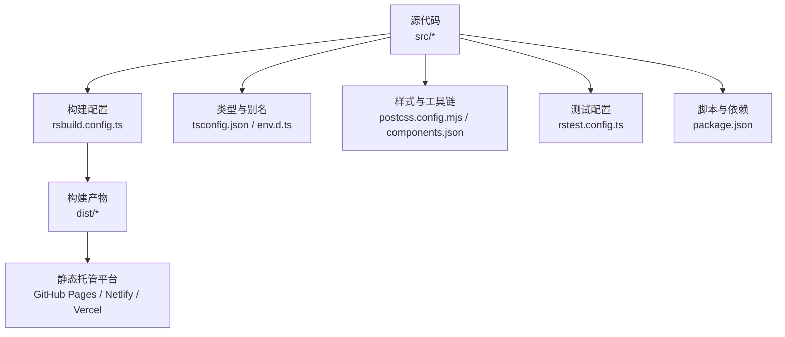
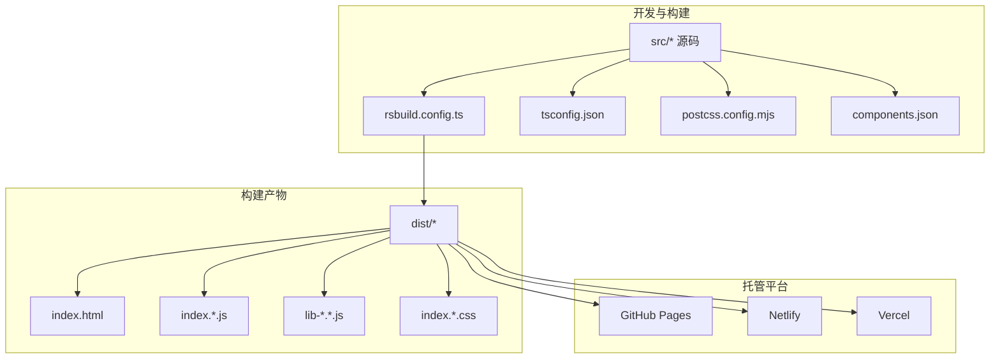
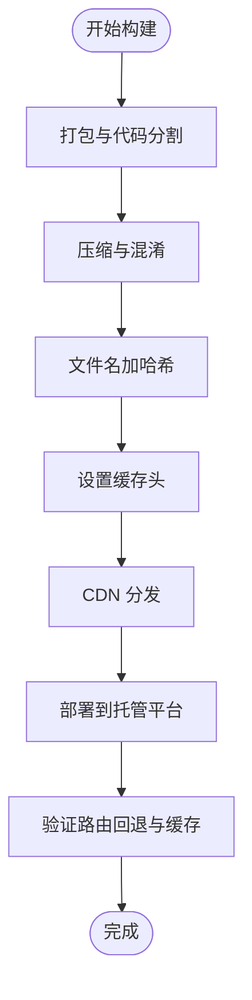
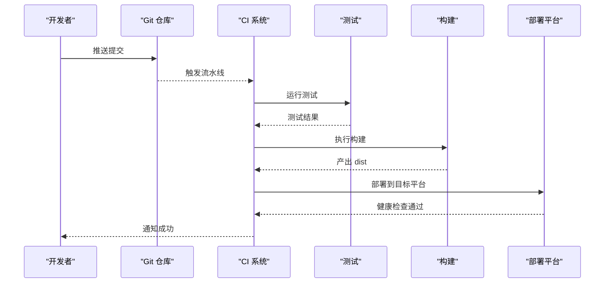
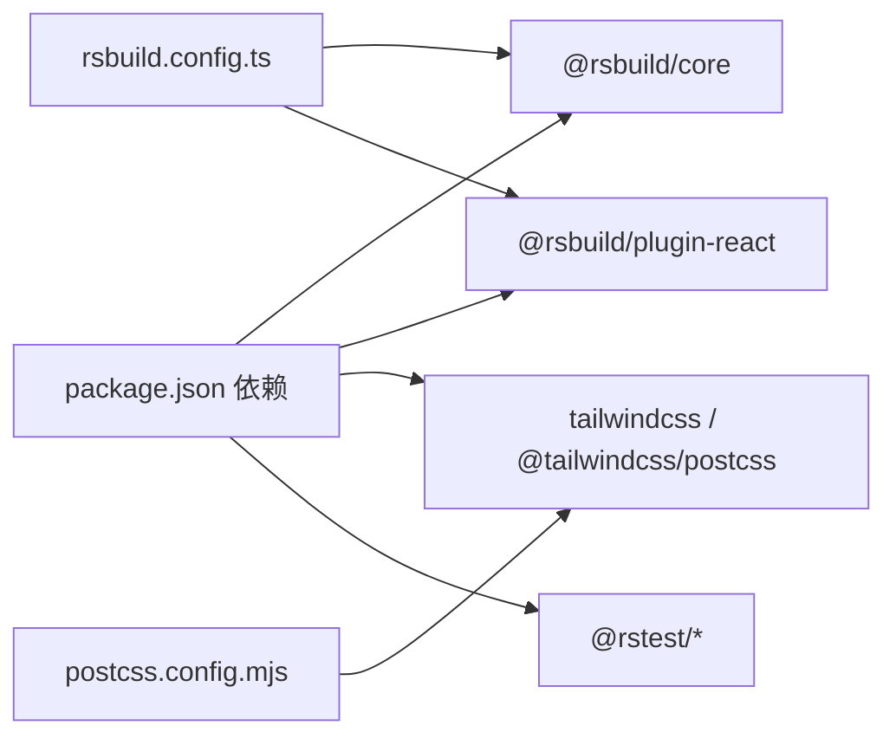

# 部署策略

<cite>
**本文引用的文件**   
- [package.json](file://package.json)
- [rsbuild.config.ts](file://rsbuild.config.ts)
- [README.md](file://README.md)
- [biome.json](file://biome.json)
- [tsconfig.json](file://tsconfig.json)
- [postcss.config.mjs](file://postcss.config.mjs)
- [components.json](file://components.json)
- [dist/index.html](file://dist/index.html)
- [dist/static/js/index.d1037d1e3f.js](file://dist/static/js/index.d1037d1e3f.js)
- [dist/static/js/lib-router.ca51625079.js](file://dist/static/js/lib-router.ca51625079.js)
- [dist/static/js/514.3d03d9c1e1.js](file://dist/static/js/514.3d03d9c1e1.js)
- [dist/static/css/index.824fa56c9b.css](file://dist/static/css/index.824fa56c9b.css)
- [rstest.config.ts](file://rstest.config.ts)
</cite>

## 目录
1. [引言](#引言)
2. [项目结构](#项目结构)
3. [核心组件](#核心组件)
4. [架构总览](#架构总览)
5. [详细组件分析](#详细组件分析)
6. [依赖分析](#依赖分析)
7. [性能考虑](#性能考虑)
8. [故障排除指南](#故障排除指南)
9. [结论](#结论)
10. [附录](#附录)

## 引言
本指南面向 Rsbuild2 项目的部署与发布，覆盖静态网站在 GitHub Pages、Netlify、Vercel 等平台的配置要点；构建产物优化（资源压缩、缓存策略、CDN 集成）；Docker 容器化部署；CI/CD 流水线（含自动化测试、构建与部署）；环境变量与多环境配置；性能监控与错误追踪集成；以及常见部署问题的排查与回滚策略。文档基于仓库现有配置与产物进行说明，并提供可操作的步骤与图示。

## 项目结构
Rsbuild2 是一个基于 Rsbuild 的前端应用，使用 React 与路由、TailwindCSS 样式体系，通过 Rsbuild 进行开发与生产构建。项目采用模块化的源码组织，测试框架通过 RsTest 适配 Rsbuild。

图表来源
- [rsbuild.config.ts](file://rsbuild.config.ts#L1-L16)
- [tsconfig.json](file://tsconfig.json#L1-L30)
- [postcss.config.mjs](file://postcss.config.mjs#L1-L6)
- [components.json](file://components.json#L1-L22)
- [rstest.config.ts](file://rstest.config.ts#L1-L9)
- [package.json](file://package.json#L1-L43)

章节来源
- [rsbuild.config.ts](file://rsbuild.config.ts#L1-L16)
- [tsconfig.json](file://tsconfig.json#L1-L30)
- [postcss.config.mjs](file://postcss.config.mjs#L1-L6)
- [components.json](file://components.json#L1-L22)
- [rstest.config.ts](file://rstest.config.ts#L1-L9)
- [package.json](file://package.json#L1-L43)

## 核心组件
- 构建与打包：Rsbuild 作为打包器，启用 React 插件与路径别名，支持开发服务器与历史路由回退。
- 样式体系：TailwindCSS 与 PostCSS 配置，支持 CSS Modules 与主题变量。
- 类型与别名：TypeScript 路径映射与模块声明，提升开发体验。
- 测试：RsTest 适配 Rsbuild，统一测试运行与设置。
- 脚本与依赖：通过 npm scripts 管理开发、构建、预览与测试任务。

章节来源
- [rsbuild.config.ts](file://rsbuild.config.ts#L1-L16)
- [tsconfig.json](file://tsconfig.json#L1-L30)
- [postcss.config.mjs](file://postcss.config.mjs#L1-L6)
- [components.json](file://components.json#L1-L22)
- [rstest.config.ts](file://rstest.config.ts#L1-L9)
- [package.json](file://package.json#L1-L43)

## 架构总览
下图展示从源码到静态产物再到托管平台的整体流程，以及关键产物与入口文件：

图表来源
- [rsbuild.config.ts](file://rsbuild.config.ts#L1-L16)
- [dist/index.html](file://dist/index.html#L1-L1)
- [dist/static/js/index.d1037d1e3f.js](file://dist/static/js/index.d1037d1e3f.js#L1-L1)
- [dist/static/js/lib-router.ca51625079.js](file://dist/static/js/lib-router.ca51625079.js#L1-L1)
- [dist/static/js/514.3d03d9c1e1.js](file://dist/static/js/514.3d03d9c1e1.js#L1-L1)
- [dist/static/css/index.824fa56c9b.css](file://dist/static/css/index.824fa56c9b.css#L1-L1)

## 详细组件分析

### 静态网站部署最佳实践
- GitHub Pages
  - 推荐使用仓库的 gh-pages 分支或 docs 目录发布 dist/ 内容。
  - 在仓库设置中开启 Pages 并选择分支/目录。
  - 若使用子路径部署，需在构建配置中设置公共路径（如 base），并在 GitHub Pages 中配置基础路径。
  - 参考：构建命令与产物位置见脚本与产物清单。

- Netlify
  - 使用 CLI 或仪表板导入仓库，设置构建命令与发布目录。
  - 建议启用缓存与预渲染（如适用）。
  - 可通过 netlify.toml 配置重定向与安全头。

- Vercel
  - 使用 vercel.json 配置构建输出与重写规则。
  - 启用 ISR/SSR（如需要）与边缘网络加速。
  - 利用环境变量与预设域。

章节来源
- [package.json](file://package.json#L6-L13)
- [rsbuild.config.ts](file://rsbuild.config.ts#L12-L14)

### 构建产物优化策略
- 资源压缩与分包
  - Rsbuild 默认启用代码分割与压缩，确保生产构建开启。
  - 可通过插件扩展（如压缩 CSS/JS、图片优化）以进一步减小体积。
  - 关注入口与动态导入，减少首屏阻塞。

- 缓存策略
  - 将静态资源文件名带哈希（默认行为），以便长期缓存。
  - 设置合理的 Cache-Control 头（静态资源 vs 动态资源）。
  - 对 HTML 设置较短缓存，对 JS/CSS 设置较长缓存。

- CDN 集成
  - 将静态资源托管至 CDN，降低延迟。
  - 使用服务端回源与边缘缓存策略。
  - 注意跨域与 HTTPS。

- History API 与 SPA
  - 开发服务器已启用 historyApiFallback，确保刷新页面不返回 404。
  - 生产部署需在平台配置“未匹配路由回退至 index.html”。

图表来源
- [rsbuild.config.ts](file://rsbuild.config.ts#L12-L14)
- [dist/index.html](file://dist/index.html#L1-L1)

章节来源
- [rsbuild.config.ts](file://rsbuild.config.ts#L1-L16)
- [dist/index.html](file://dist/index.html#L1-L1)

### Docker 容器化部署
- Dockerfile 示例思路
  - 基础镜像：官方 Nginx 或轻量 Alpine + Nginx。
  - 构建阶段：安装依赖、执行构建命令生成 dist。
  - 运行阶段：将 dist 部署到 Nginx 的静态根目录，启用 gzip/HTTP2。
  - 健康检查：访问 /index.html。
  - 端口：80（或 443 + TLS）。

- 运行建议
  - 使用只读文件系统与最小权限。
  - 挂载日志卷与配置卷（如需）。
  - 结合反向代理与证书管理。

- 与 Rsbuild 的关系
  - Dockerfile 中的构建命令应与 package.json 的脚本一致。
  - 发布目录指向 dist。

章节来源
- [package.json](file://package.json#L6-L13)
- [rsbuild.config.ts](file://rsbuild.config.ts#L1-L16)

### CI/CD 流水线配置
- 自动化测试
  - 使用测试脚本运行单元测试，建议在流水线中失败即停止。
  - 可结合覆盖率阈值与报告上传。

- 构建与预览
  - 执行构建命令生成 dist。
  - 将 dist 作为工件或直接部署到预览环境。

- 部署
  - 主干分支触发生产部署（如 master/main）。
  - 平台侧配置环境变量与密钥（如令牌）。
  - 支持蓝绿/滚动发布与回滚。

- 典型节点顺序
  - 安装依赖 → 验证格式/类型 → 测试 → 构建 → 部署 → 健康检查 → 回滚保护

章节来源
- [package.json](file://package.json#L6-L13)
- [rstest.config.ts](file://rstest.config.ts#L1-L9)

### 环境变量与多环境配置
- 环境变量
  - 生产环境变量通过平台设置（如 GitHub Pages/Netlify/Vercel 的环境变量面板）注入。
  - 在应用中通过构建期常量或运行时配置区分环境（如 API 域名、功能开关）。

- 多环境
  - 不同环境（开发/预览/生产）使用不同配置文件或变量前缀。
  - 保持敏感信息不进入仓库，使用平台提供的加密变量。

- Rsbuild 与环境变量
  - Rsbuild 支持通过 define 注入全局常量，便于在构建期替换环境变量。

章节来源
- [rsbuild.config.ts](file://rsbuild.config.ts#L1-L16)
- [package.json](file://package.json#L6-L13)

### 性能监控与错误追踪
- 性能监控
  - 使用 Web Vitals 采集首屏、交互与布局偏移指标。
  - 在平台侧启用性能分析与边缘缓存统计。

- 错误追踪
  - 集成前端错误上报（如 Sentry），在构建产物中保留 sourcemap（生产谨慎开启）。
  - 对第三方脚本与资源进行健康检查与降级策略。

- 与构建的关系
  - 产物中的哈希文件名与缓存头直接影响性能表现。
  - 资源压缩与分包策略影响加载时间。

章节来源
- [dist/static/js/index.d1037d1e3f.js](file://dist/static/js/index.d1037d1e3f.js#L1-L1)
- [dist/static/css/index.824fa56c9b.css](file://dist/static/css/index.824fa56c9b.css#L1-L1)

## 依赖分析
- 构建与运行时依赖
  - Rsbuild 与 React 插件负责打包与开发体验。
  - TailwindCSS 与 PostCSS 提供样式能力。
  - 测试框架与类型检查保障质量。

- 产物与入口
  - 构建产物包含 HTML、JS、CSS 文件，入口由 HTML 引用多个 JS/CSS 片段。
  - 路由脚本与业务脚本分离，利于缓存与加载优化。

图表来源
- [package.json](file://package.json#L15-L41)
- [rsbuild.config.ts](file://rsbuild.config.ts#L1-L6)
- [postcss.config.mjs](file://postcss.config.mjs#L1-L5)

章节来源
- [package.json](file://package.json#L1-L43)
- [rsbuild.config.ts](file://rsbuild.config.ts#L1-L16)
- [postcss.config.mjs](file://postcss.config.mjs#L1-L6)

## 性能考虑
- 首屏优化
  - 保持入口 JS 体积最小，拆分非关键代码。
  - 使用懒加载与动态导入，延迟加载非首屏路由。

- 缓存与分发
  - 静态资源带哈希名，设置长缓存；HTML 短缓存。
  - CDN 边缘缓存与回源策略优化。

- 资源压缩
  - 启用 JS/CSS 压缩与 Tree Shaking。
  - 图片与字体优化（尺寸、格式、压缩）。

- 路由与回退
  - 历史路由回退配置确保 SPA 刷新可用。

章节来源
- [rsbuild.config.ts](file://rsbuild.config.ts#L12-L14)
- [dist/index.html](file://dist/index.html#L1-L1)

## 故障排除指南
- 刷新页面 404
  - 检查平台是否配置“未匹配路由回退至 index.html”。
  - 确认开发服务器已启用 historyApiFallback。

- 资源加载失败
  - 核对公共路径（base）与实际部署路径一致。
  - 检查缓存头与 CDN 回源状态。

- 样式异常
  - 确认 Tailwind 与 PostCSS 配置正确，CSS Modules 与主题变量生效。

- 构建失败
  - 检查类型与格式化配置，确保本地可构建。
  - 查看 CI 日志定位具体报错。

- 回滚策略
  - 保留最近几个版本的构建工件，快速回滚到上一个稳定版本。
  - 使用平台提供的回滚功能或重新部署上一版产物。

章节来源
- [rsbuild.config.ts](file://rsbuild.config.ts#L12-L14)
- [biome.json](file://biome.json#L1-L35)
- [README.md](file://README.md#L19-L29)

## 结论
Rsbuild2 项目具备清晰的构建与部署路径。通过合理配置托管平台、优化构建产物、引入 Docker 与 CI/CD、完善环境变量与监控体系，可实现高效、稳定的静态站点交付。建议在生产环境中启用 CDN、缓存与监控，并制定标准化的回滚流程以降低风险。

## 附录
- 快速参考
  - 构建命令：参见脚本定义
  - 预览命令：参见脚本定义
  - 测试命令：参见脚本定义
  - 构建配置：参见 Rsbuild 配置
  - 样式配置：参见 Tailwind 与 PostCSS 配置
  - 测试配置：参见 RsTest 配置

章节来源
- [package.json](file://package.json#L6-L13)
- [rsbuild.config.ts](file://rsbuild.config.ts#L1-L16)
- [postcss.config.mjs](file://postcss.config.mjs#L1-L6)
- [rstest.config.ts](file://rstest.config.ts#L1-L9)
- [README.md](file://README.md#L19-L29)