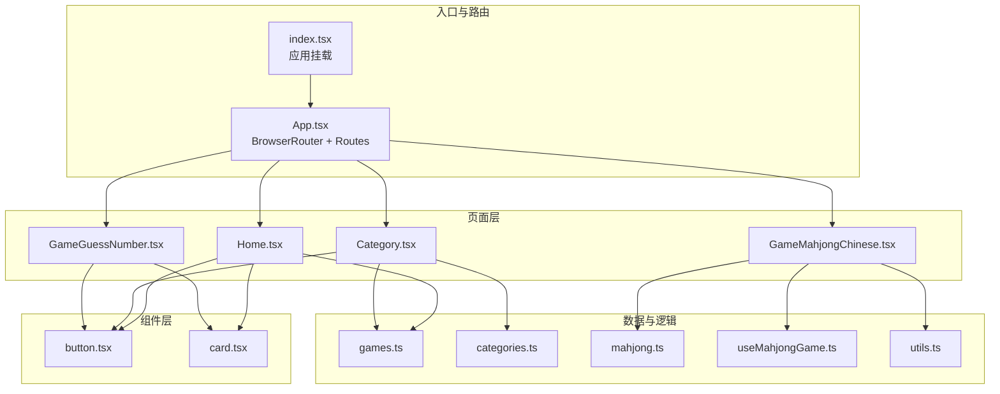
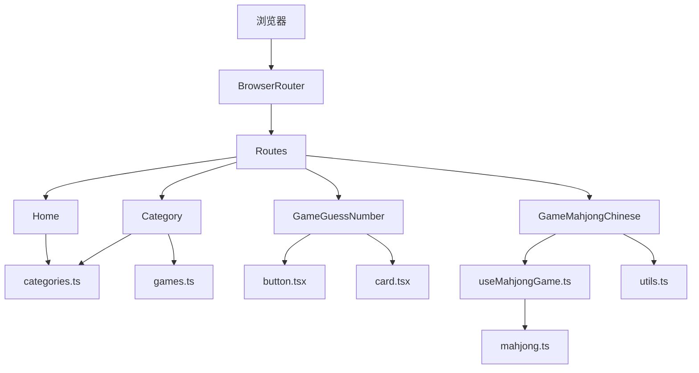
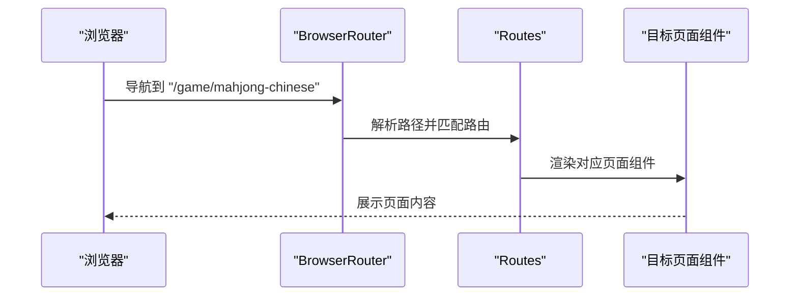
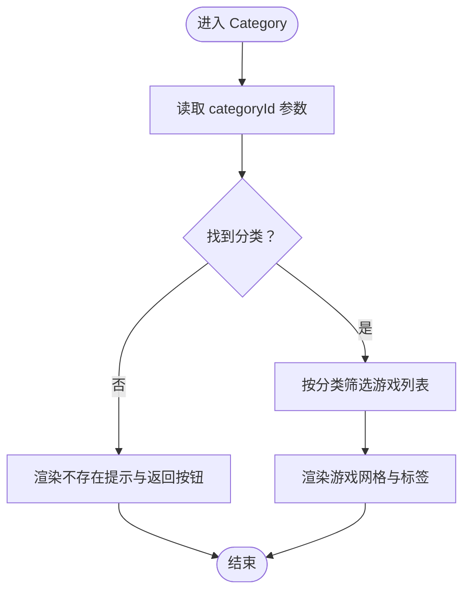
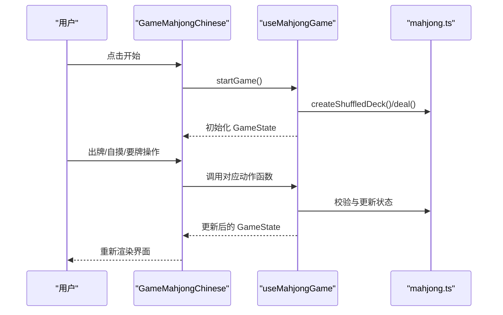
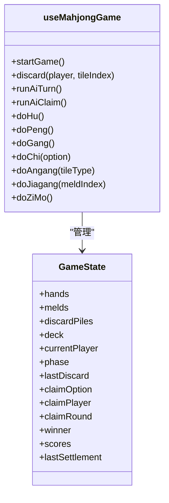
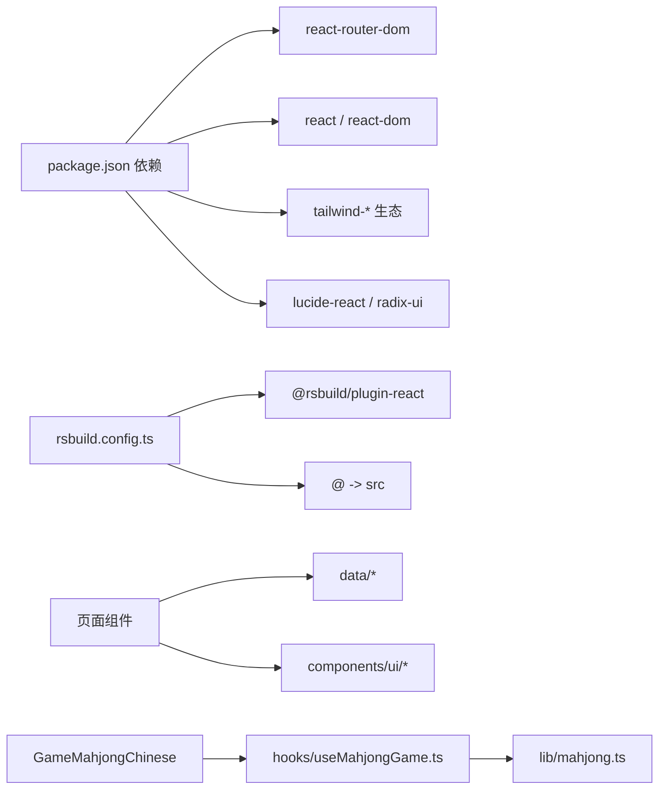

# 整体架构

<cite>
**本文引用的文件**
- [src/App.tsx](file://src/App.tsx)
- [src/index.tsx](file://src/index.tsx)
- [src/pages/Home.tsx](file://src/pages/Home.tsx)
- [src/pages/Category.tsx](file://src/pages/Category.tsx)
- [src/pages/GameGuessNumber.tsx](file://src/pages/GameGuessNumber.tsx)
- [src/pages/GameMahjongChinese.tsx](file://src/pages/GameMahjongChinese.tsx)
- [src/data/games.ts](file://src/data/games.ts)
- [src/data/categories.ts](file://src/data/categories.ts)
- [src/lib/mahjong.ts](file://src/lib/mahjong.ts)
- [src/hooks/useMahjongGame.ts](file://src/hooks/useMahjongGame.ts)
- [src/components/ui/button.tsx](file://src/components/ui/button.tsx)
- [src/components/ui/card.tsx](file://src/components/ui/card.tsx)
- [src/lib/utils.ts](file://src/lib/utils.ts)
- [rsbuild.config.ts](file://rsbuild.config.ts)
- [package.json](file://package.json)
- [README.md](file://README.md)
</cite>

## 目录
1. [引言](#引言)
2. [项目结构](#项目结构)
3. [核心组件](#核心组件)
4. [架构总览](#架构总览)
5. [详细组件分析](#详细组件分析)
6. [依赖关系分析](#依赖关系分析)
7. [性能考量](#性能考量)
8. [故障排查指南](#故障排查指南)
9. [结论](#结论)
10. [附录](#附录)

## 引言
本项目是一个基于 Rsbuild 构建工具链的 React 单页应用（SPA），采用 React Router v6 实现客户端路由，提供多种小游戏集合。项目以模块化设计为核心理念，将页面、组件、数据与业务逻辑清晰分离，形成可维护、可扩展的前端架构。

## 项目结构
项目采用按功能域划分的目录组织方式：
- src/pages：页面级组件，每个页面对应一个路由路径
- src/components/ui：可复用的 UI 组件库
- src/data：静态数据与数据访问函数
- src/lib：纯函数与算法库（如麻将规则）
- src/hooks：自定义 Hook（如麻将游戏状态管理）
- 根目录配置：Rsbuild 构建配置、包管理与脚本

图表来源
- [src/index.tsx](file://src/index.tsx#L1-L14)
- [src/App.tsx](file://src/App.tsx#L1-L42)
- [src/pages/Home.tsx](file://src/pages/Home.tsx#L1-L43)
- [src/pages/Category.tsx](file://src/pages/Category.tsx#L1-L132)
- [src/pages/GameGuessNumber.tsx](file://src/pages/GameGuessNumber.tsx#L1-L111)
- [src/pages/GameMahjongChinese.tsx](file://src/pages/GameMahjongChinese.tsx#L1-L469)
- [src/components/ui/button.tsx](file://src/components/ui/button.tsx#L1-L65)
- [src/components/ui/card.tsx](file://src/components/ui/card.tsx#L1-L93)
- [src/data/games.ts](file://src/data/games.ts#L1-L197)
- [src/data/categories.ts](file://src/data/categories.ts#L1-L34)
- [src/lib/mahjong.ts](file://src/lib/mahjong.ts#L1-L494)
- [src/hooks/useMahjongGame.ts](file://src/hooks/useMahjongGame.ts#L1-L866)
- [src/lib/utils.ts](file://src/lib/utils.ts#L1-L7)

章节来源
- [src/index.tsx](file://src/index.tsx#L1-L14)
- [src/App.tsx](file://src/App.tsx#L1-L42)
- [rsbuild.config.ts](file://rsbuild.config.ts#L1-L16)
- [package.json](file://package.json#L1-L43)

## 核心组件
- 入口与挂载：index.tsx 创建根节点并渲染 App 组件，启用严格模式。
- 根组件与路由：App.tsx 使用 BrowserRouter 包裹 Routes，声明多条路由规则，映射至不同页面组件。
- 页面组件：Home、Category、GameGuessNumber、GameMahjongChinese 等，负责各自页面的布局与交互。
- UI 组件：button、card 等，提供一致的视觉与交互语义。
- 数据与算法：games、categories 提供静态数据；mahjong 提供麻将规则算法；useMahjongGame 提供状态与业务逻辑。
- 工具函数：utils 提供样式合并工具，简化类名拼接。

章节来源
- [src/index.tsx](file://src/index.tsx#L1-L14)
- [src/App.tsx](file://src/App.tsx#L1-L42)
- [src/pages/Home.tsx](file://src/pages/Home.tsx#L1-L43)
- [src/pages/Category.tsx](file://src/pages/Category.tsx#L1-L132)
- [src/pages/GameGuessNumber.tsx](file://src/pages/GameGuessNumber.tsx#L1-L111)
- [src/pages/GameMahjongChinese.tsx](file://src/pages/GameMahjongChinese.tsx#L1-L469)
- [src/components/ui/button.tsx](file://src/components/ui/button.tsx#L1-L65)
- [src/components/ui/card.tsx](file://src/components/ui/card.tsx#L1-L93)
- [src/data/games.ts](file://src/data/games.ts#L1-L197)
- [src/data/categories.ts](file://src/data/categories.ts#L1-L34)
- [src/lib/mahjong.ts](file://src/lib/mahjong.ts#L1-L494)
- [src/hooks/useMahjongGame.ts](file://src/hooks/useMahjongGame.ts#L1-L866)
- [src/lib/utils.ts](file://src/lib/utils.ts#L1-L7)

## 架构总览
本项目采用“页面路由 + 组件化 + 数据/算法分离”的架构模式：
- SPA 模式：通过 BrowserRouter 实现客户端路由，History API 回退支持开启，保证刷新与深度链接可用。
- 组件化开发：UI 组件与页面组件职责清晰，复用性强。
- 状态管理策略：轻量页面内状态使用 React 内置状态；复杂业务状态（如麻将）通过自定义 Hook 封装。
- 性能优化：按需渲染、条件渲染、事件节流与防抖、最小化重排与重绘。

图表来源
- [src/App.tsx](file://src/App.tsx#L1-L42)
- [src/pages/Home.tsx](file://src/pages/Home.tsx#L1-L43)
- [src/pages/Category.tsx](file://src/pages/Category.tsx#L1-L132)
- [src/pages/GameGuessNumber.tsx](file://src/pages/GameGuessNumber.tsx#L1-L111)
- [src/pages/GameMahjongChinese.tsx](file://src/pages/GameMahjongChinese.tsx#L1-L469)
- [src/data/categories.ts](file://src/data/categories.ts#L1-L34)
- [src/data/games.ts](file://src/data/games.ts#L1-L197)
- [src/components/ui/button.tsx](file://src/components/ui/button.tsx#L1-L65)
- [src/components/ui/card.tsx](file://src/components/ui/card.tsx#L1-L93)
- [src/hooks/useMahjongGame.ts](file://src/hooks/useMahjongGame.ts#L1-L866)
- [src/lib/mahjong.ts](file://src/lib/mahjong.ts#L1-L494)
- [src/lib/utils.ts](file://src/lib/utils.ts#L1-L7)

## 详细组件分析

### 根组件与路由系统（App.tsx）
- 作用：作为 SPA 的根容器，统一注册路由与页面组件。
- 路由设计：使用 Routes 声明多条路由，覆盖首页、分类页、各游戏页等。
- 客户端路由：BrowserRouter 提供 URL 状态与导航能力，History API 回退在构建配置中启用。

图表来源
- [src/App.tsx](file://src/App.tsx#L1-L42)
- [rsbuild.config.ts](file://rsbuild.config.ts#L12-L14)

章节来源
- [src/App.tsx](file://src/App.tsx#L1-L42)
- [rsbuild.config.ts](file://rsbuild.config.ts#L12-L14)

### 页面组件：Home 与 Category
- Home：展示分类卡片，使用 Link 导航至分类详情。
- Category：根据路由参数 categoryId 获取分类信息与游戏列表，动态渲染游戏卡片与难度标签，处理不存在分类的兜底。

图表来源
- [src/pages/Category.tsx](file://src/pages/Category.tsx#L12-L132)
- [src/data/categories.ts](file://src/data/categories.ts#L1-L34)
- [src/data/games.ts](file://src/data/games.ts#L190-L197)

章节来源
- [src/pages/Home.tsx](file://src/pages/Home.tsx#L1-L43)
- [src/pages/Category.tsx](file://src/pages/Category.tsx#L1-L132)
- [src/data/categories.ts](file://src/data/categories.ts#L1-L34)
- [src/data/games.ts](file://src/data/games.ts#L1-L197)

### 页面组件：GameGuessNumber（示例）
- 功能：简单的猜数字游戏，包含输入校验、计数与重开逻辑。
- 组件化：使用 Card、Button、Input 等 UI 组件，保持一致风格。

章节来源
- [src/pages/GameGuessNumber.tsx](file://src/pages/GameGuessNumber.tsx#L1-L111)
- [src/components/ui/card.tsx](file://src/components/ui/card.tsx#L1-L93)
- [src/components/ui/button.tsx](file://src/components/ui/button.tsx#L1-L65)

### 页面组件：GameMahjongChinese（麻将）
- 状态管理：通过 useMahjongGame Hook 管理完整麻将对局状态与流程（发牌、摸牌、出牌、要牌轮次、胡/杠/碰/吃、结算）。
- 规则引擎：mahjong.ts 提供完整的麻将规则与计分逻辑。
- UI 设计：自定义牌面渲染、座位标识、操作按钮、结算面板等。

图表来源
- [src/pages/GameMahjongChinese.tsx](file://src/pages/GameMahjongChinese.tsx#L121-L157)
- [src/hooks/useMahjongGame.ts](file://src/hooks/useMahjongGame.ts#L209-L239)
- [src/lib/mahjong.ts](file://src/lib/mahjong.ts#L33-L58)

章节来源
- [src/pages/GameMahjongChinese.tsx](file://src/pages/GameMahjongChinese.tsx#L1-L469)
- [src/hooks/useMahjongGame.ts](file://src/hooks/useMahjongGame.ts#L1-L866)
- [src/lib/mahjong.ts](file://src/lib/mahjong.ts#L1-L494)

### 自定义 Hook：useMahjongGame
- 职责：封装麻将对局的状态与动作，包括发牌、出牌、要牌轮次推进、AI 决策、结算等。
- 设计：将复杂业务逻辑与 UI 解耦，便于测试与复用。

图表来源
- [src/hooks/useMahjongGame.ts](file://src/hooks/useMahjongGame.ts#L209-L866)
- [src/lib/mahjong.ts](file://src/lib/mahjong.ts#L416-L494)

章节来源
- [src/hooks/useMahjongGame.ts](file://src/hooks/useMahjongGame.ts#L1-L866)
- [src/lib/mahjong.ts](file://src/lib/mahjong.ts#L1-L494)

### UI 组件库：button 与 card
- button：基于 Variance Authority 的变体系统，支持多种尺寸与外观，适配主题与交互状态。
- card：卡片容器组件，提供标题、描述、内容、底部等语义化区域。

章节来源
- [src/components/ui/button.tsx](file://src/components/ui/button.tsx#L1-L65)
- [src/components/ui/card.tsx](file://src/components/ui/card.tsx#L1-L93)
- [src/lib/utils.ts](file://src/lib/utils.ts#L1-L7)

## 依赖关系分析
- 外部依赖：React、ReactDOM、React Router DOM、Tailwind 生态（clsx、tailwind-merge、lucide-react、radix-ui 等）。
- 构建与开发：Rsbuild 核心与 React 插件，PostCSS 与 TailwindCSS，Biome 代码质量工具，测试框架（rstest + @testing-library）。
- 内部依赖：页面组件依赖数据模块与 UI 组件；GameMahjongChinese 依赖规则与状态 Hook；Hook 依赖算法库。

图表来源
- [package.json](file://package.json#L15-L41)
- [rsbuild.config.ts](file://rsbuild.config.ts#L1-L16)
- [src/pages/GameMahjongChinese.tsx](file://src/pages/GameMahjongChinese.tsx#L1-L469)
- [src/hooks/useMahjongGame.ts](file://src/hooks/useMahjongGame.ts#L1-L866)
- [src/lib/mahjong.ts](file://src/lib/mahjong.ts#L1-L494)

章节来源
- [package.json](file://package.json#L1-L43)
- [rsbuild.config.ts](file://rsbuild.config.ts#L1-L16)

## 性能考量
- 路由与渲染：SPA 模式减少页面切换开销；页面组件按需渲染，避免不必要的重渲染。
- 状态管理：轻量页面内状态使用 React 内置状态；复杂业务状态集中管理，避免跨组件重复计算。
- UI 优化：使用 Tailwind 类名合并工具，减少样式冲突与重排；组件按需加载，避免一次性引入过多资源。
- 算法优化：麻将规则采用预计算与缓存思路，避免重复计算；AI 决策通过概率与评分函数平衡性能与体验。

## 故障排查指南
- 路由问题：确认 Rsbuild 配置中的 historyApiFallback 已启用，确保刷新与深度链接正常工作。
- 样式异常：检查 Tailwind 与 PostCSS 配置，确认类名拼接工具正确使用。
- 游戏状态异常：检查 useMahjongGame 的动作函数调用时机与参数合法性，确保状态流转符合规则。
- 性能问题：关注大型列表渲染与事件绑定，必要时引入虚拟滚动与事件委托。

章节来源
- [rsbuild.config.ts](file://rsbuild.config.ts#L12-L14)
- [src/lib/utils.ts](file://src/lib/utils.ts#L1-L7)
- [src/hooks/useMahjongGame.ts](file://src/hooks/useMahjongGame.ts#L1-L866)

## 结论
本项目以模块化为核心设计思想，结合 React Router 的 SPA 能力与自定义 Hook 的状态封装，实现了清晰的页面路由、可复用的 UI 组件与可扩展的业务逻辑。通过将数据、算法与页面解耦，项目具备良好的可维护性与扩展性，适合持续迭代与多人协作。

## 附录
- 快速启动与构建：参考 README 中的安装与运行命令。
- 构建配置：Rsbuild 提供 React 插件与别名配置，History API 回退已启用。

章节来源
- [README.md](file://README.md#L1-L37)
- [rsbuild.config.ts](file://rsbuild.config.ts#L1-L16)