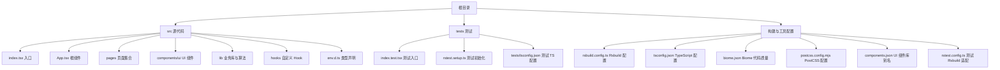
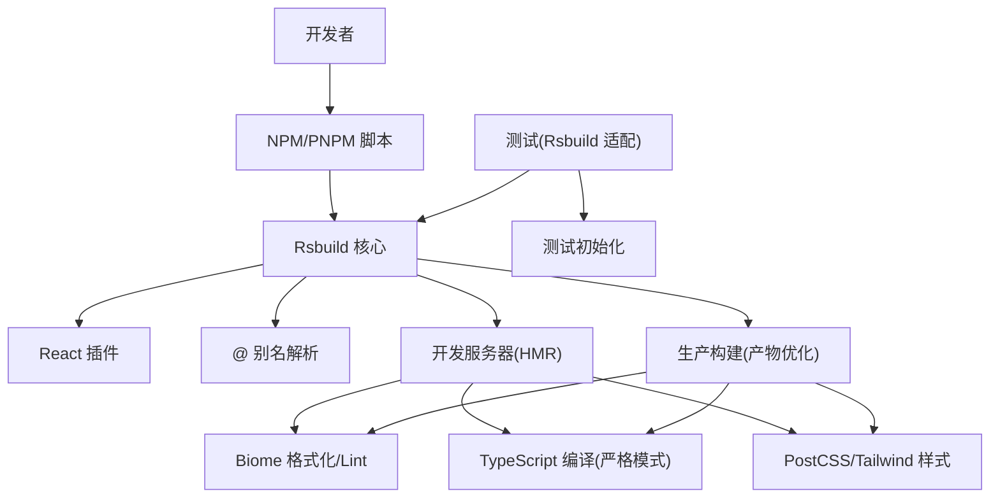
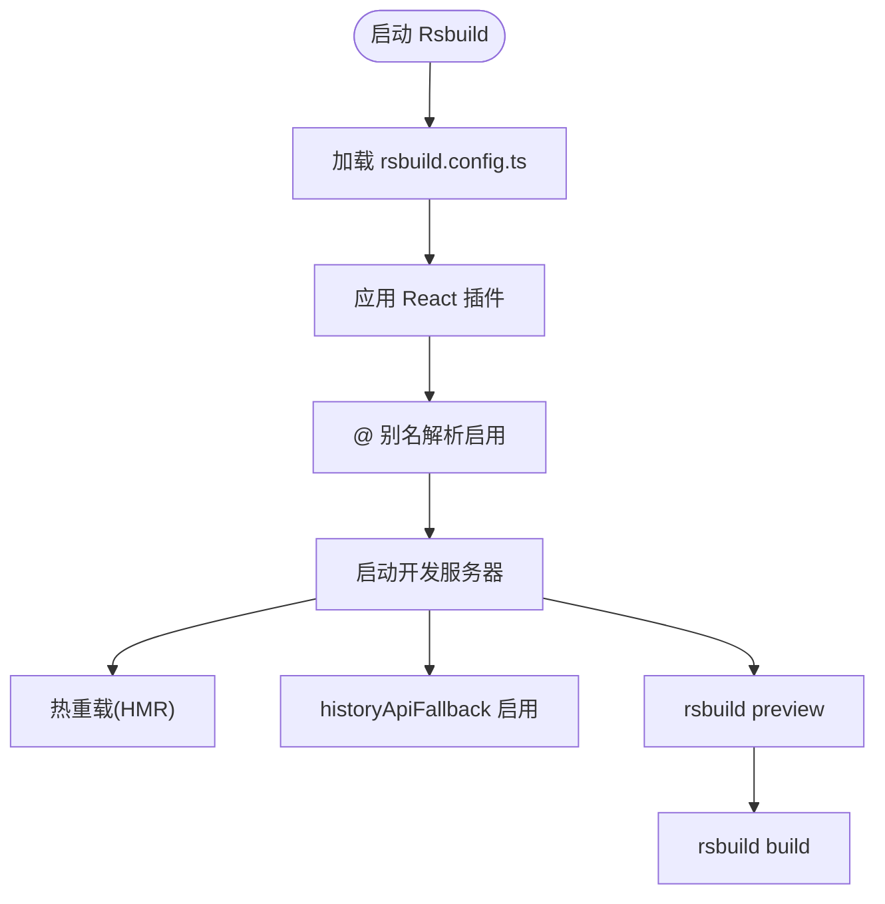
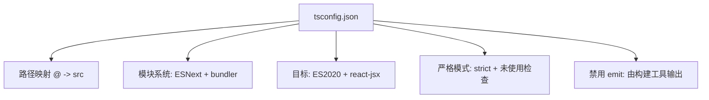
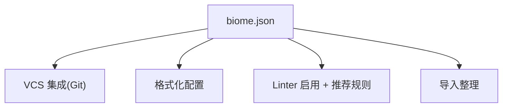
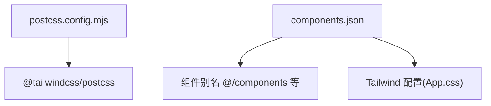
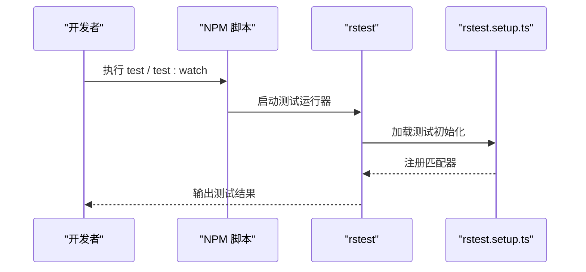
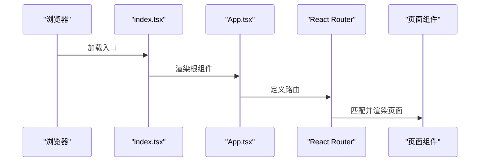
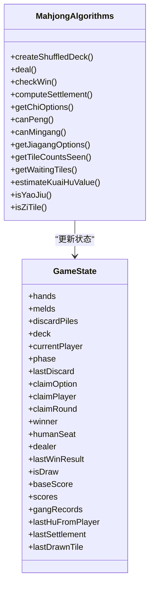
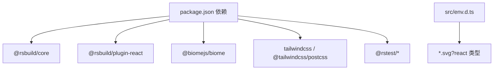

# 构建系统

<cite>
**本文引用的文件**
- [rsbuild.config.ts](file://rsbuild.config.ts)
- [package.json](file://package.json)
- [tsconfig.json](file://tsconfig.json)
- [biome.json](file://biome.json)
- [postcss.config.mjs](file://postcss.config.mjs)
- [rstest.config.ts](file://rstest.config.ts)
- [tests/tsconfig.json](file://tests/tsconfig.json)
- [components.json](file://components.json)
- [src/index.tsx](file://src/index.tsx)
- [src/App.tsx](file://src/App.tsx)
- [src/env.d.ts](file://src/env.d.ts)
- [tests/rstest.setup.ts](file://tests/rstest.setup.ts)
- [src/pages/Home.tsx](file://src/pages/Home.tsx)
- [src/lib/mahjong.ts](file://src/lib/mahjong.ts)
- [src/hooks/useMahjongGame.ts](file://src/hooks/useMahjongGame.ts)
</cite>

## 目录
1. [简介](#简介)
2. [项目结构](#项目结构)
3. [核心组件](#核心组件)
4. [架构总览](#架构总览)
5. [详细组件分析](#详细组件分析)
6. [依赖关系分析](#依赖关系分析)
7. [性能考量](#性能考量)
8. [故障排查指南](#故障排查指南)
9. [结论](#结论)
10. [附录](#附录)

## 简介
本文件面向 Rsbuild2 项目，系统化梳理构建系统的配置与使用方式，覆盖以下主题：
- 开发服务器与热重载、预览与历史路由回退
- 生产构建与资源打包策略
- TypeScript 编译配置与严格模式下的类型检查
- Biome 代码质量工具的集成与格式化、Lint 规则
- 包管理策略与 pnpm 使用建议
- 测试框架与脚本命令
- 错误处理与调试建议

## 项目结构
该项目采用以功能模块为中心的组织方式，前端入口位于 src 目录，页面组件按功能划分在 pages 子目录，UI 组件与通用工具分别位于 ui 与 lib 子目录。测试相关配置位于 tests 目录。

图表来源
- [rsbuild.config.ts](file://rsbuild.config.ts#L1-L16)
- [tsconfig.json](file://tsconfig.json#L1-L30)
- [biome.json](file://biome.json#L1-L35)
- [postcss.config.mjs](file://postcss.config.mjs#L1-L6)
- [rstest.config.ts](file://rstest.config.ts#L1-L9)
- [tests/tsconfig.json](file://tests/tsconfig.json#L1-L8)
- [components.json](file://components.json#L1-L22)
- [src/index.tsx](file://src/index.tsx#L1-L14)
- [src/App.tsx](file://src/App.tsx#L1-L42)
- [src/env.d.ts](file://src/env.d.ts#L1-L12)
- [tests/rstest.setup.ts](file://tests/rstest.setup.ts#L1-L5)

章节来源
- [rsbuild.config.ts](file://rsbuild.config.ts#L1-L16)
- [tsconfig.json](file://tsconfig.json#L1-L30)
- [biome.json](file://biome.json#L1-L35)
- [postcss.config.mjs](file://postcss.config.mjs#L1-L6)
- [rstest.config.ts](file://rstest.config.ts#L1-L9)
- [tests/tsconfig.json](file://tests/tsconfig.json#L1-L8)
- [components.json](file://components.json#L1-L22)
- [src/index.tsx](file://src/index.tsx#L1-L14)
- [src/App.tsx](file://src/App.tsx#L1-L42)
- [src/env.d.ts](file://src/env.d.ts#L1-L12)
- [tests/rstest.setup.ts](file://tests/rstest.setup.ts#L1-L5)

## 核心组件
- Rsbuild 构建配置：启用 React 插件、路径别名、开发服务器历史路由回退
- TypeScript 编译：严格模式、模块解析、目标与 JSX 配置
- Biome 代码质量：格式化、Lint、VCS 集成
- PostCSS/Tailwind：样式管线与 CSS Modules 支持
- 测试框架：基于 Rsbuild 的测试适配器与测试初始化
- UI 组件库：基于 shadcn 的组件别名与 Tailwind 配置

章节来源
- [rsbuild.config.ts](file://rsbuild.config.ts#L1-L16)
- [tsconfig.json](file://tsconfig.json#L1-L30)
- [biome.json](file://biome.json#L1-L35)
- [postcss.config.mjs](file://postcss.config.mjs#L1-L6)
- [rstest.config.ts](file://rstest.config.ts#L1-L9)
- [components.json](file://components.json#L1-L22)

## 架构总览
Rsbuild2 的构建体系围绕 Rsbuild 核心与插件生态展开，结合 Biome 实现代码质量保障，通过 Tailwind PostCSS 处理样式，配合测试适配器完成端到端验证。

图表来源
- [rsbuild.config.ts](file://rsbuild.config.ts#L1-L16)
- [package.json](file://package.json#L6-L14)
- [biome.json](file://biome.json#L1-L35)
- [tsconfig.json](file://tsconfig.json#L1-L30)
- [postcss.config.mjs](file://postcss.config.mjs#L1-L6)
- [rstest.config.ts](file://rstest.config.ts#L1-L9)
- [tests/rstest.setup.ts](file://tests/rstest.setup.ts#L1-L5)

## 详细组件分析

### Rsbuild 配置与开发服务器
- 插件与别名：启用 React 插件并配置 @ 指向 src，提升导入便捷性
- 开发服务器：开启 historyApiFallback，支持 SPA 路由回退
- 命令行：提供 dev、build、preview 等常用命令

图表来源
- [rsbuild.config.ts](file://rsbuild.config.ts#L5-L15)
- [package.json](file://package.json#L6-L14)

章节来源
- [rsbuild.config.ts](file://rsbuild.config.ts#L1-L16)
- [package.json](file://package.json#L6-L14)

### TypeScript 编译配置与严格模式
- 路径映射：baseUrl 与 paths 将 @ 映射至 src，与 Rsbuild 别名保持一致
- 模块系统：ESNext、bundler 解析、ESM 语法严格性
- 目标与 JSX：ES2020、react-jsx
- 严格模式：开启 strict、未使用局部变量与参数检查
- 无输出：noEmit，交由 Rsbuild/Rspack 处理打包与输出

图表来源
- [tsconfig.json](file://tsconfig.json#L2-L27)

章节来源
- [tsconfig.json](file://tsconfig.json#L1-L30)

### Biome 代码质量工具集成
- VCS 集成：启用 Git 客户端、忽略文件
- 格式化：缩进风格、单引号、Tailwind CSS Modules
- Lint：推荐规则集
- 导入整理：自动组织导入

图表来源
- [biome.json](file://biome.json#L1-L35)

章节来源
- [biome.json](file://biome.json#L1-L35)

### PostCSS 与 Tailwind 集成
- PostCSS 插件：Tailwind PostCSS 插件
- CSS Modules：CSS 解析器启用 CSS Modules
- 组件库：components.json 提供 UI 组件别名与 Tailwind 配置

图表来源
- [postcss.config.mjs](file://postcss.config.mjs#L1-L6)
- [components.json](file://components.json#L1-L22)

章节来源
- [postcss.config.mjs](file://postcss.config.mjs#L1-L6)
- [components.json](file://components.json#L1-L22)

### 测试配置与脚本
- 测试适配：rstest 适配 Rsbuild 配置
- 测试初始化：扩展 Jest DOM 匹配器
- 测试 TS 配置：继承主 TS 配置并引入测试类型

图表来源
- [rstest.config.ts](file://rstest.config.ts#L1-L9)
- [tests/rstest.setup.ts](file://tests/rstest.setup.ts#L1-L5)
- [tests/tsconfig.json](file://tests/tsconfig.json#L1-L8)

章节来源
- [rstest.config.ts](file://rstest.config.ts#L1-L9)
- [tests/rstest.setup.ts](file://tests/rstest.setup.ts#L1-L5)
- [tests/tsconfig.json](file://tests/tsconfig.json#L1-L8)

### 入口与路由
- 入口：index.tsx 使用 React.StrictMode 渲染 App
- 根组件：App.tsx 使用 React Router 管理多页面路由
- 页面：Home 等页面组件使用 UI 组件与数据模块

图表来源
- [src/index.tsx](file://src/index.tsx#L1-L14)
- [src/App.tsx](file://src/App.tsx#L1-L42)
- [src/pages/Home.tsx](file://src/pages/Home.tsx#L1-L43)

章节来源
- [src/index.tsx](file://src/index.tsx#L1-L14)
- [src/App.tsx](file://src/App.tsx#L1-L42)
- [src/pages/Home.tsx](file://src/pages/Home.tsx#L1-L43)

### SVG 类型声明与资源处理
- env.d.ts 声明 *.svg?react 模块，使 SVG 可作为 React 组件导入
- 配合 Rsbuild 插件实现资源处理

章节来源
- [src/env.d.ts](file://src/env.d.ts#L1-L12)

### 业务逻辑与算法模块
- mahjong.ts：麻将核心算法与状态模型
- useMahjongGame.ts：游戏状态管理与 AI 决策

图表来源
- [src/lib/mahjong.ts](file://src/lib/mahjong.ts#L1-L494)
- [src/hooks/useMahjongGame.ts](file://src/hooks/useMahjongGame.ts#L1-L800)

章节来源
- [src/lib/mahjong.ts](file://src/lib/mahjong.ts#L1-L494)
- [src/hooks/useMahjongGame.ts](file://src/hooks/useMahjongGame.ts#L1-L800)

## 依赖关系分析
- Rsbuild 核心与 React 插件：提供构建与开发能力
- Biome：统一格式化与 Lint
- Tailwind PostCSS：样式管线与 CSS Modules
- 测试适配器：基于 Rsbuild 的测试运行环境
- 类型声明：SVG 资源类型与 Rsbuild 类型

图表来源
- [package.json](file://package.json#L15-L41)
- [src/env.d.ts](file://src/env.d.ts#L1-L12)

章节来源
- [package.json](file://package.json#L15-L41)
- [src/env.d.ts](file://src/env.d.ts#L1-L12)

## 性能考量
- 开发模式
  - 启用 HMR 与快速刷新，减少全量重载
  - 使用 historyApiFallback，避免路由切换导致的 404
- 生产模式
  - 由 Rsbuild 默认进行代码分割与产物优化
  - TypeScript 严格模式有助于提前发现潜在问题
  - Biome 在 CI 中执行格式化与 Lint，降低运行时错误概率
- 样式与资源
  - Tailwind PostCSS 与 CSS Modules 有助于按需样式与作用域隔离
  - SVG 作为 React 组件导入，便于 Tree Shaking

[本节为通用指导，无需列出具体文件来源]

## 故障排查指南
- 开发服务器无法访问
  - 检查开发脚本与端口占用
  - 确认 historyApiFallback 已启用
- 路由跳转 404
  - 确保 SPA 路由回退生效
- 类型错误
  - 检查 tsconfig 的 strict、未使用检查与模块解析
- 格式化与 Lint
  - 使用 biome format --write 与 biome check --write
- 测试失败
  - 检查测试初始化与适配器配置

章节来源
- [rsbuild.config.ts](file://rsbuild.config.ts#L12-L14)
- [package.json](file://package.json#L6-L14)
- [biome.json](file://biome.json#L1-L35)
- [rstest.config.ts](file://rstest.config.ts#L1-L9)
- [tests/rstest.setup.ts](file://tests/rstest.setup.ts#L1-L5)

## 结论
Rsbuild2 项目通过简洁而强大的配置实现了现代化前端工程化：Rsbuild 提供高效构建与开发体验，Biome 保障代码质量，TypeScript 严格模式强化类型安全，Tailwind PostCSS 与组件库别名提升样式开发效率。配合测试适配器与脚本命令，形成完整的开发与交付流水线。

[本节为总结性内容，无需列出具体文件来源]

## 附录
- 常用命令
  - 开发：rsbuild dev --open
  - 构建：rsbuild build
  - 预览：rsbuild preview
  - 测试：rstest / rstest --watch
  - 格式化：biome format --write
  - Lint：biome check --write
- 关键配置文件位置
  - Rsbuild：rsbuild.config.ts
  - TypeScript：tsconfig.json
  - Biome：biome.json
  - PostCSS：postcss.config.mjs
  - 组件库：components.json
  - 测试：rstest.config.ts、tests/rstest.setup.ts、tests/tsconfig.json

章节来源
- [package.json](file://package.json#L6-L14)
- [rsbuild.config.ts](file://rsbuild.config.ts#L1-L16)
- [tsconfig.json](file://tsconfig.json#L1-L30)
- [biome.json](file://biome.json#L1-L35)
- [postcss.config.mjs](file://postcss.config.mjs#L1-L6)
- [components.json](file://components.json#L1-L22)
- [rstest.config.ts](file://rstest.config.ts#L1-L9)
- [tests/rstest.setup.ts](file://tests/rstest.setup.ts#L1-L5)
- [tests/tsconfig.json](file://tests/tsconfig.json#L1-L8)