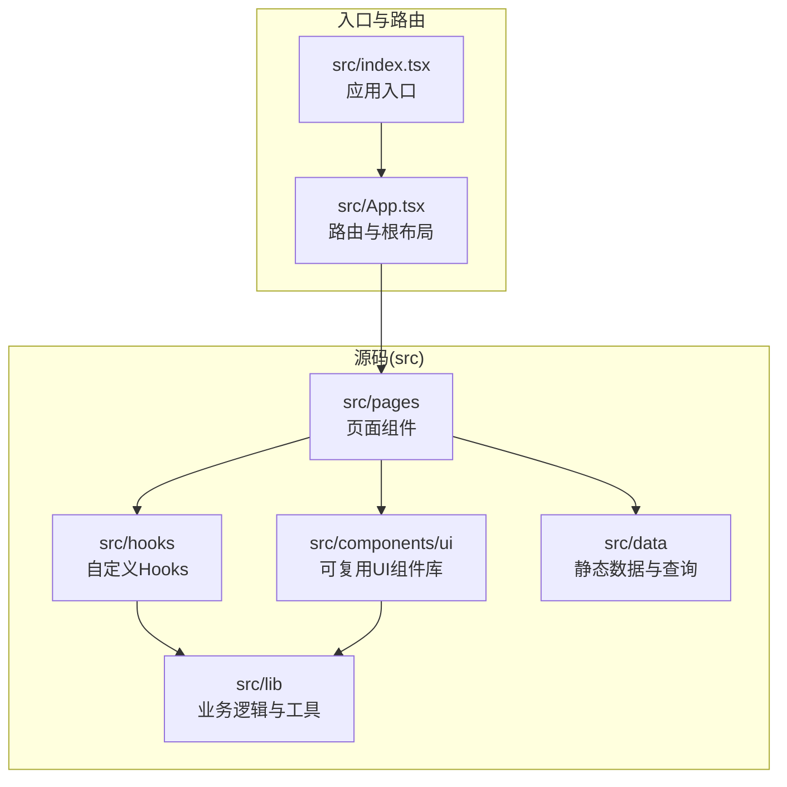
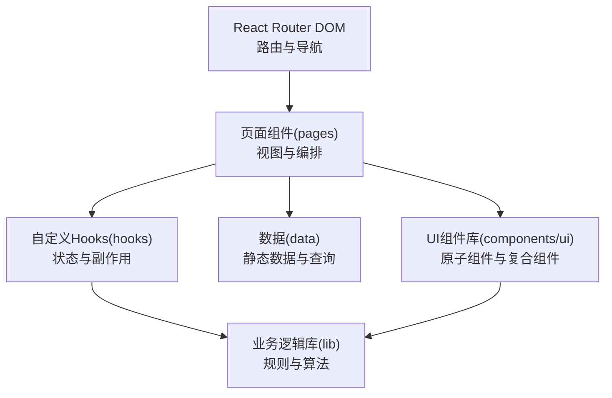
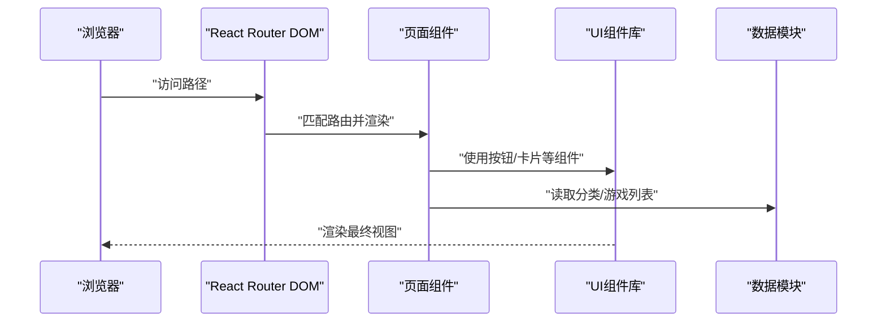
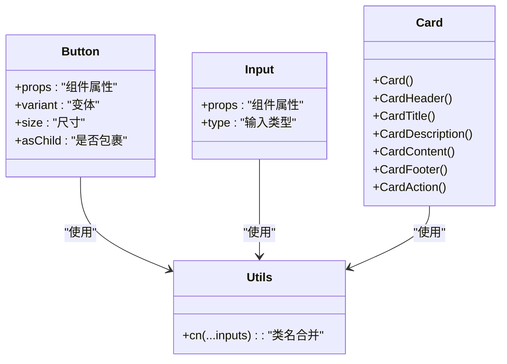
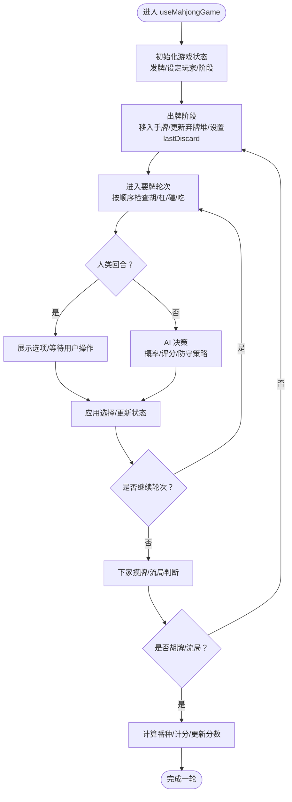
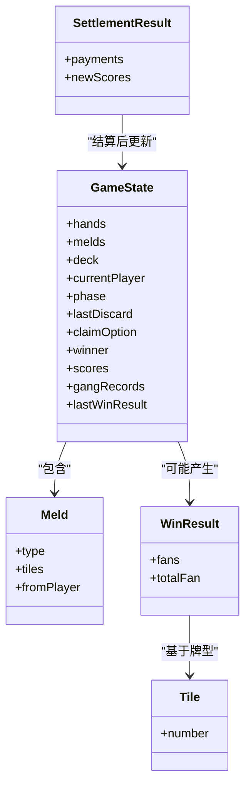
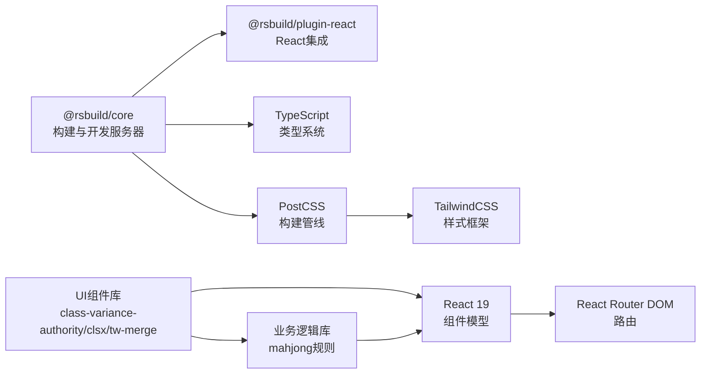

# 架构设计

<cite>
**本文引用的文件**
- [package.json](file://package.json)
- [rsbuild.config.ts](file://rsbuild.config.ts)
- [tsconfig.json](file://tsconfig.json)
- [postcss.config.mjs](file://postcss.config.mjs)
- [src/index.tsx](file://src/index.tsx)
- [src/App.tsx](file://src/App.tsx)
- [src/components/ui/button.tsx](file://src/components/ui/button.tsx)
- [src/components/ui/input.tsx](file://src/components/ui/input.tsx)
- [src/components/ui/card.tsx](file://src/components/ui/card.tsx)
- [src/hooks/useMahjongGame.ts](file://src/hooks/useMahjongGame.ts)
- [src/lib/mahjong.ts](file://src/lib/mahjong.ts)
- [src/lib/utils.ts](file://src/lib/utils.ts)
- [src/pages/Home.tsx](file://src/pages/Home.tsx)
- [src/data/games.ts](file://src/data/games.ts)
</cite>

## 目录
1. [引言](#引言)
2. [项目结构](#项目结构)
3. [核心组件](#核心组件)
4. [架构总览](#架构总览)
5. [详细组件分析](#详细组件分析)
6. [依赖关系分析](#依赖关系分析)
7. [性能考量](#性能考量)
8. [故障排查指南](#故障排查指南)
9. [结论](#结论)
10. [附录](#附录)

## 引言
本项目是一个基于 Rsbuild 的前端应用，采用 React 19 与 TypeScript，结合 TailwindCSS 实现响应式 UI，并通过 React Router DOM 提供多页面路由能力。项目以功能域为导向进行目录组织，包含可复用的 UI 组件库、业务逻辑库、页面组件与数据模型，形成清晰的分层与职责划分。本文档将系统阐述项目的整体架构模式、组件化设计、状态管理策略与路由体系，解释目录结构的设计理念，并给出构建系统配置说明与技术选型的权衡考量。

## 项目结构
项目采用“按功能域分层”的目录组织方式，核心目录与职责如下：
- src/components/ui：可复用的原子级 UI 组件库，提供按钮、输入框、卡片等基础组件，统一样式与交互规范。
- src/lib：纯函数与领域逻辑库，封装游戏规则、工具方法与状态类型定义，保证业务逻辑与 UI 解耦。
- src/hooks：自定义 Hooks，封装复杂的状态与副作用逻辑，如麻将游戏状态管理。
- src/pages：页面级组件，负责路由与页面内容的组织，调用 UI 组件与业务逻辑。
- src/data：静态数据与查询方法，如游戏分类与游戏列表，便于页面渲染与导航。
- 构建与配置：Rsbuild 配置、TypeScript 路径别名、PostCSS/Tailwind 集成。

图表来源
- [src/index.tsx](file://src/index.tsx#L1-L14)
- [src/App.tsx](file://src/App.tsx#L1-L42)
- [src/components/ui/button.tsx](file://src/components/ui/button.tsx#L1-L65)
- [src/components/ui/input.tsx](file://src/components/ui/input.tsx#L1-L22)
- [src/components/ui/card.tsx](file://src/components/ui/card.tsx#L1-L93)
- [src/hooks/useMahjongGame.ts](file://src/hooks/useMahjongGame.ts#L1-L866)
- [src/lib/mahjong.ts](file://src/lib/mahjong.ts#L1-L494)
- [src/lib/utils.ts](file://src/lib/utils.ts#L1-L7)
- [src/pages/Home.tsx](file://src/pages/Home.tsx#L1-L43)
- [src/data/games.ts](file://src/data/games.ts#L1-L197)

章节来源
- [package.json](file://package.json#L1-L43)
- [rsbuild.config.ts](file://rsbuild.config.ts#L1-L16)
- [tsconfig.json](file://tsconfig.json#L1-L30)
- [postcss.config.mjs](file://postcss.config.mjs#L1-L6)

## 核心组件
- 路由与入口
  - 应用入口在 src/index.tsx，使用 ReactDOM 将 App 渲染到 DOM。
  - 根组件 App.tsx 使用 React Router DOM 的 BrowserRouter 与 Routes 定义多条路由，覆盖首页、分类页与多个游戏页面。
- UI 组件库
  - button.tsx：基于 class-variance-authority 与 radix-ui 的 Slot，支持多种变体与尺寸，具备可扩展的样式变体系统。
  - input.tsx：统一输入框样式与交互，提供无障碍属性与聚焦态样式。
  - card.tsx：卡片容器与子组件（头部、标题、描述、内容、底部、操作），支持网格布局与响应式断点。
- 自定义 Hooks
  - useMahjongGame.ts：封装麻将游戏的完整状态机，包括发牌、出牌、要牌轮次（胡/杠/碰/吃）、AI 决策、计分结算等。
- 业务逻辑库
  - mahjong.ts：定义牌型、牌组、游戏状态、番种计算、计分结算、听牌检测、快胡值估算等核心算法与类型。
  - utils.ts：cn 工具函数，整合 clsx 与 tailwind-merge，确保类名合并与冲突修复。
- 页面与数据
  - Home.tsx：首页展示分类卡片，使用 UI 组件与数据模块 categories。
  - games.ts：游戏列表与查询方法，提供分类筛选与路径映射。

章节来源
- [src/index.tsx](file://src/index.tsx#L1-L14)
- [src/App.tsx](file://src/App.tsx#L1-L42)
- [src/components/ui/button.tsx](file://src/components/ui/button.tsx#L1-L65)
- [src/components/ui/input.tsx](file://src/components/ui/input.tsx#L1-L22)
- [src/components/ui/card.tsx](file://src/components/ui/card.tsx#L1-L93)
- [src/hooks/useMahjongGame.ts](file://src/hooks/useMahjongGame.ts#L1-L866)
- [src/lib/mahjong.ts](file://src/lib/mahjong.ts#L1-L494)
- [src/lib/utils.ts](file://src/lib/utils.ts#L1-L7)
- [src/pages/Home.tsx](file://src/pages/Home.tsx#L1-L43)
- [src/data/games.ts](file://src/data/games.ts#L1-L197)

## 架构总览
系统采用“路由驱动的页面层 + 可复用 UI 组件库 + 业务逻辑库 + 自定义 Hooks”的分层架构。页面组件负责路由与视图编排，UI 组件提供一致的视觉与交互体验，业务逻辑库承载复杂规则与算法，自定义 Hooks 抽象状态与副作用，实现关注点分离与高内聚低耦合。

图表来源
- [src/App.tsx](file://src/App.tsx#L1-L42)
- [src/pages/Home.tsx](file://src/pages/Home.tsx#L1-L43)
- [src/components/ui/button.tsx](file://src/components/ui/button.tsx#L1-L65)
- [src/components/ui/card.tsx](file://src/components/ui/card.tsx#L1-L93)
- [src/hooks/useMahjongGame.ts](file://src/hooks/useMahjongGame.ts#L1-L866)
- [src/lib/mahjong.ts](file://src/lib/mahjong.ts#L1-L494)
- [src/data/games.ts](file://src/data/games.ts#L1-L197)

## 详细组件分析

### 路由系统与页面交互
- 路由定义集中在 App.tsx，使用 React Router DOM 的 Route 与 Routes 组织页面路径，支持首页、分类页与多个游戏页面。
- 页面组件通过 Link 或直接渲染，组合 UI 组件与数据模块，实现内容展示与用户交互。

图表来源
- [src/App.tsx](file://src/App.tsx#L1-L42)
- [src/pages/Home.tsx](file://src/pages/Home.tsx#L1-L43)
- [src/components/ui/button.tsx](file://src/components/ui/button.tsx#L1-L65)
- [src/components/ui/card.tsx](file://src/components/ui/card.tsx#L1-L93)
- [src/data/games.ts](file://src/data/games.ts#L1-L197)

章节来源
- [src/App.tsx](file://src/App.tsx#L1-L42)
- [src/pages/Home.tsx](file://src/pages/Home.tsx#L1-L43)

### UI 组件库设计与复用
- 设计原则
  - 原子化与组合：基础元素（按钮、输入框）与复合组件（卡片）分离，支持灵活组合。
  - 变体系统：通过 class-variance-authority 定义变体与尺寸，统一风格与可维护性。
  - 可访问性：提供焦点态、禁用态与无障碍属性，提升可用性。
  - 样式合并：使用 cn 工具函数合并类名，避免冲突。
- 典型组件
  - Button：支持 variant 与 size 变体，asChild 支持语义标签包裹。
  - Input：统一输入框样式与交互，支持聚焦态与错误态。
  - Card：卡片容器与子组件，支持网格布局与响应式断点。

图表来源
- [src/components/ui/button.tsx](file://src/components/ui/button.tsx#L1-L65)
- [src/components/ui/input.tsx](file://src/components/ui/input.tsx#L1-L22)
- [src/components/ui/card.tsx](file://src/components/ui/card.tsx#L1-L93)
- [src/lib/utils.ts](file://src/lib/utils.ts#L1-L7)

章节来源
- [src/components/ui/button.tsx](file://src/components/ui/button.tsx#L1-L65)
- [src/components/ui/input.tsx](file://src/components/ui/input.tsx#L1-L22)
- [src/components/ui/card.tsx](file://src/components/ui/card.tsx#L1-L93)
- [src/lib/utils.ts](file://src/lib/utils.ts#L1-L7)

### 状态管理模式与自定义 Hooks
- 设计思路
  - 页面组件负责视图与用户交互，状态通过自定义 Hooks 抽象，保持页面简洁。
  - 复杂业务状态（如麻将游戏）集中在一个 Hook 中，提供启动、出牌、要牌轮次、AI 决策与结算等方法。
- 关键流程
  - 初始化：创建牌堆、发牌、设定当前玩家与阶段。
  - 出牌：更新手牌、弃牌堆与最后打出牌信息，切换到要牌轮次。
  - 要牌轮次：按顺序检查胡/杠/碰/吃，支持人类与 AI 决策，必要时自动摸牌或结算。
  - 结算：根据番种与规则计算得分，更新累计分数与最后结算详情。

图表来源
- [src/hooks/useMahjongGame.ts](file://src/hooks/useMahjongGame.ts#L209-L739)
- [src/lib/mahjong.ts](file://src/lib/mahjong.ts#L451-L491)

章节来源
- [src/hooks/useMahjongGame.ts](file://src/hooks/useMahjongGame.ts#L1-L866)
- [src/lib/mahjong.ts](file://src/lib/mahjong.ts#L1-L494)

### 麻将规则引擎与数据模型
- 数据模型
  - Tile、Meld、GameState、ClaimOption、WinResult、SettlementResult 等类型定义完整的游戏状态与规则实体。
- 规则实现
  - 发牌与洗牌：生成 136 张牌并随机洗牌，按逆时针发牌。
  - 胡牌判定：支持十三幺、七小对、龙七对与基础牌型，结合明牌组展开判断。
  - 要牌轮次：按顺序检查胡/杠/碰/吃，支持 AI 评分与概率决策。
  - 计分结算：根据番种与规则计算支付明细与新分数，支持自摸与点炮场景。

图表来源
- [src/lib/mahjong.ts](file://src/lib/mahjong.ts#L26-L334)
- [src/hooks/useMahjongGame.ts](file://src/hooks/useMahjongGame.ts#L416-L448)

章节来源
- [src/lib/mahjong.ts](file://src/lib/mahjong.ts#L1-L494)
- [src/hooks/useMahjongGame.ts](file://src/hooks/useMahjongGame.ts#L1-L866)

## 依赖关系分析
- 构建与运行时
  - Rsbuild 作为打包与开发服务器，插件化集成 React，启用路径别名 @ 指向 src。
  - TypeScript 配置启用严格模式与 ESNext 模块解析，配合 bundler 模式。
  - PostCSS 与 TailwindCSS 集成，提供原子化样式与响应式能力。
- 运行时依赖
  - React 19 与 React Router DOM 提供组件模型与路由能力。
  - UI 与样式相关依赖：class-variance-authority、clsx、tailwind-merge、lucide-react、radix-ui。
- 开发依赖
  - Rsbuild 插件、Biome 代码质量工具、TailwindCSS、测试框架与类型声明。

图表来源
- [package.json](file://package.json#L15-L41)
- [rsbuild.config.ts](file://rsbuild.config.ts#L1-L16)
- [tsconfig.json](file://tsconfig.json#L1-L30)
- [postcss.config.mjs](file://postcss.config.mjs#L1-L6)

章节来源
- [package.json](file://package.json#L1-L43)
- [rsbuild.config.ts](file://rsbuild.config.ts#L1-L16)
- [tsconfig.json](file://tsconfig.json#L1-L30)
- [postcss.config.mjs](file://postcss.config.mjs#L1-L6)

## 性能考量
- 构建优化
  - 使用 Rsbuild 的插件化与现代打包策略，减少打包体积与冷启动时间。
  - TypeScript 严格模式与 noUnused* 检查降低运行时错误风险。
- 运行时优化
  - 自定义 Hooks 使用 useCallback 与 useState 管理状态，避免不必要的重渲染。
  - UI 组件通过变体系统与类名合并工具，减少样式计算开销。
  - 麻将规则引擎采用纯函数与不可变更新策略，便于追踪状态变化与调试。

## 故障排查指南
- 路由无法匹配
  - 检查 App.tsx 中的路由路径与页面导入是否一致。
  - 确认浏览器历史模式回退配置开启。
- 样式异常
  - 检查 Tailwind 配置与 PostCSS 插件是否正确加载。
  - 确认 cn 工具函数正确合并类名，避免冲突覆盖。
- 状态不更新
  - 检查自定义 Hooks 中的状态更新是否使用 setState 的函数式写法。
  - 确认游戏状态机中的阶段与玩家索引逻辑正确。
- 类型错误
  - 检查 TypeScript 配置与路径别名 @/* 是否与实际目录一致。

章节来源
- [src/App.tsx](file://src/App.tsx#L1-L42)
- [rsbuild.config.ts](file://rsbuild.config.ts#L12-L14)
- [postcss.config.mjs](file://postcss.config.mjs#L1-L6)
- [tsconfig.json](file://tsconfig.json#L4-L5)
- [src/lib/utils.ts](file://src/lib/utils.ts#L1-L7)
- [src/hooks/useMahjongGame.ts](file://src/hooks/useMahjongGame.ts#L241-L262)

## 结论
本项目通过清晰的目录分层与组件化设计，实现了 UI 与业务逻辑的解耦，借助自定义 Hooks 将复杂状态与规则抽象出来，配合 Rsbuild 与 TypeScript 提供高效的开发与构建体验。UI 组件库以变体系统与原子化设计为核心，确保一致的视觉与交互体验；路由系统与页面组件共同构成可扩展的页面层。整体架构在可维护性、可扩展性与性能之间取得良好平衡。

## 附录
- 构建命令
  - 开发：npm run dev
  - 构建：npm run build
  - 预览：npm run preview
  - 测试：npm run test / npm run test:watch
  - 代码格式化与检查：npm run format / npm run check
- 技术选型说明
  - Rsbuild：现代化构建工具，插件生态完善，适合 React 项目。
  - React 19：最新版本带来更好的并发与性能特性。
  - TailwindCSS：原子化样式，提升开发效率与一致性。
  - class-variance-authority：组件变体系统，增强可复用性与可维护性。
  - Radix UI：无障碍与可组合的 UI 原子组件。
  - TypeScript：严格的类型系统，降低运行时错误风险。