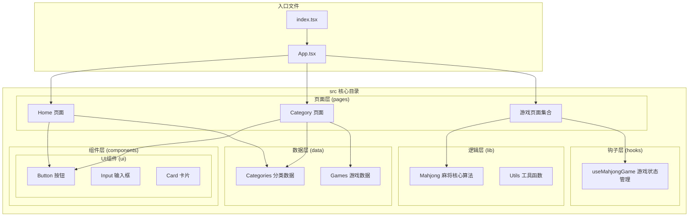
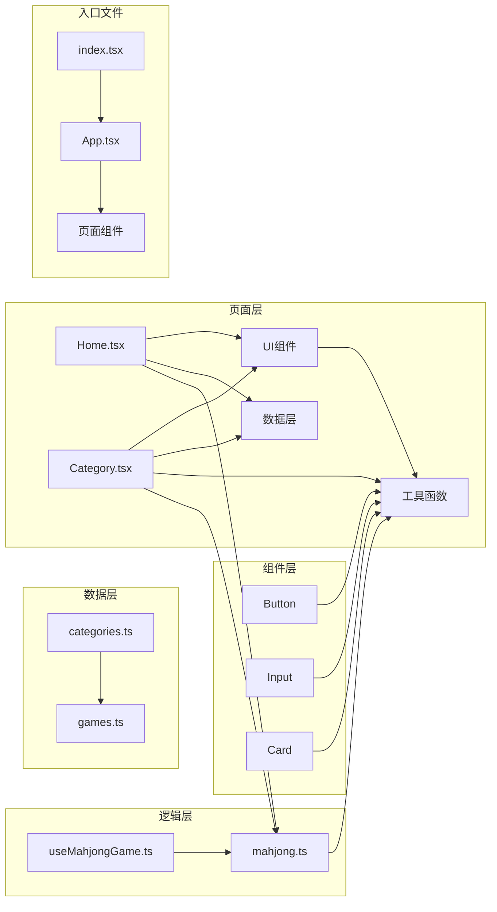

# 目录结构设计

<cite>
**本文档引用的文件**
- [src/App.tsx](file://src/App.tsx)
- [src/index.tsx](file://src/index.tsx)
- [src/pages/Home.tsx](file://src/pages/Home.tsx)
- [src/pages/Category.tsx](file://src/pages/Category.tsx)
- [src/components/ui/button.tsx](file://src/components/ui/button.tsx)
- [src/components/ui/input.tsx](file://src/components/ui/input.tsx)
- [src/components/ui/card.tsx](file://src/components/ui/card.tsx)
- [src/data/categories.ts](file://src/data/categories.ts)
- [src/data/games.ts](file://src/data/games.ts)
- [src/hooks/useMahjongGame.ts](file://src/hooks/useMahjongGame.ts)
- [src/lib/mahjong.ts](file://src/lib/mahjong.ts)
- [src/lib/utils.ts](file://src/lib/utils.ts)
- [rsbuild.config.ts](file://rsbuild.config.ts)
- [tsconfig.json](file://tsconfig.json)
- [package.json](file://package.json)
</cite>

## 目录结构设计

### 设计理念概述

Rsbuild2项目采用"功能域驱动"的目录组织方式，将src目录划分为明确的功能域，每个域都有清晰的职责边界和复用机制。这种设计遵循了现代前端工程的最佳实践，实现了代码的高内聚、低耦合。

### 核心目录架构



**图表来源**
- [src/App.tsx](file://src/App.tsx#L1-L42)
- [src/pages/Home.tsx](file://src/pages/Home.tsx#L1-L43)
- [src/pages/Category.tsx](file://src/pages/Category.tsx#L1-L132)

### 目录职责分工

#### components/ui - 可复用UI组件库

**设计理念**: 实现"设计系统"级别的组件抽象，提供一致的视觉语言和交互体验。

**核心组件职责**:
- **Button**: 提供完整的按钮变体系统，支持多种尺寸、样式和语义状态
- **Input**: 标准化输入控件，统一样式和交互行为
- **Card**: 卡片容器组件，支持头部、内容、底部等结构化布局

**复用策略**:
- 使用CSS变量和Tailwind类名实现主题一致性
- 通过CVA(条件变体架构)提供灵活的样式组合
- 支持语义化属性和无障碍访问

**图表来源**
- [src/components/ui/button.tsx](file://src/components/ui/button.tsx#L1-L65)
- [src/components/ui/input.tsx](file://src/components/ui/input.tsx#L1-L22)
- [src/components/ui/card.tsx](file://src/components/ui/card.tsx#L1-L93)

#### data - 数据模型和配置

**设计理念**: 将静态数据和动态配置分离，提供类型安全的数据访问接口。

**数据结构**:
- **Categories**: 游戏分类元数据，包含分类标识、名称、描述和路由路径
- **Games**: 游戏清单数据，包含游戏基本信息、难度级别、标签系统和状态管理

**数据访问模式**:
- 导出类型定义确保编译时类型安全
- 提供查询函数实现数据筛选和检索
- 支持扩展性设计，便于添加新的游戏类型

**图表来源**
- [src/data/categories.ts](file://src/data/categories.ts#L1-L34)
- [src/data/games.ts](file://src/data/games.ts#L1-L197)

#### hooks - 自定义React Hook

**设计理念**: 将复杂的状态逻辑封装在可复用的Hook中，实现业务逻辑与UI的解耦。

**核心Hook**: `useMahjongGame`
- **状态管理**: 完整的麻将游戏状态生命周期管理
- **AI决策**: 智能对手的决策算法实现
- **规则引擎**: 麻将规则的完整实现
- **副作用处理**: 游戏流程的异步状态更新

**Hook设计原则**:
- 单一职责：专注于麻将游戏状态管理
- 纯函数式：使用不可变数据结构
- 类型安全：完整的TypeScript类型定义
- 性能优化：使用useCallback避免不必要的重渲染

**图表来源**
- [src/hooks/useMahjongGame.ts](file://src/hooks/useMahjongGame.ts#L1-L866)

#### lib - 核心业务逻辑

**设计理念**: 实现独立的业务算法和工具函数，提供可测试、可复用的核心能力。

**核心模块**:
- **Mahjong**: 麻将游戏的完整算法实现，包括牌型判断、胡牌计算、番种统计等
- **Utils**: 通用工具函数，主要负责CSS类名合并

**算法复杂度**:
- 牌型判断：O(n log n) 时间复杂度
- 胡牌检测：指数级算法，包含剪枝优化
- 计分系统：线性时间复杂度

**图表来源**
- [src/lib/mahjong.ts](file://src/lib/mahjong.ts#L1-L494)
- [src/lib/utils.ts](file://src/lib/utils.ts#L1-L7)

#### pages - 页面组件

**设计理念**: 页面组件作为路由级别的视图容器，负责页面布局和数据展示。

**页面层次**:
- **Home**: 应用主入口，展示游戏分类导航
- **Category**: 分类详情页面，展示该分类下的所有游戏
- **游戏页面**: 具体游戏的实现页面

**页面设计模式**:
- 使用路由参数实现动态页面内容
- 通过数据层提供页面所需的数据
- 统一的布局结构和样式规范

**图表来源**
- [src/pages/Home.tsx](file://src/pages/Home.tsx#L1-L43)
- [src/pages/Category.tsx](file://src/pages/Category.tsx#L1-L132)

### 文件命名约定

**组件命名规则**:
- UI组件使用帕斯卡命名法：`Button.tsx`, `Card.tsx`
- 页面组件使用帕斯卡命名法：`Home.tsx`, `Category.tsx`
- Hook使用`use`前缀：`useMahjongGame.ts`

**导入路径策略**:

#### 相对路径导入
```typescript
// 在组件内部导入同级或子级组件
import { Button } from '../components/ui/button';
import { categories } from '../../data/categories';
```

#### 绝对路径导入
```typescript
// 使用@别名进行绝对路径导入
import { Button } from '@/components/ui/button';
import { categories } from '@/data/categories';
```

**路径配置**:
- TypeScript配置：`"@/*": ["./src/*"]`
- Rsbuild配置：`alias: {'@': './src'}`

### 模块依赖关系



**图表来源**
- [src/App.tsx](file://src/App.tsx#L1-L42)
- [src/index.tsx](file://src/index.tsx#L1-L14)
- [src/pages/Home.tsx](file://src/pages/Home.tsx#L1-L43)
- [src/pages/Category.tsx](file://src/pages/Category.tsx#L1-L132)

### 代码模块化优势

#### 1. 职责分离
- **清晰的层次结构**：页面、组件、数据、逻辑各司其职
- **单一职责原则**：每个模块专注于特定功能领域
- **可预测的依赖关系**：从页面到组件再到数据的单向依赖

#### 2. 复用性增强
- **UI组件复用**：Button、Input、Card可在多个页面使用
- **数据共享**：categories和games数据在多个页面间共享
- **业务逻辑复用**：mahjong算法可被不同游戏页面使用

#### 3. 可维护性提升
- **局部修改影响范围有限**：修改某个模块不会波及整个应用
- **测试友好**：每个模块可以独立测试
- **团队协作**：不同开发者可以专注于不同的功能域

### 性能优化策略

#### 1. 懒加载机制
- 页面组件按需加载，减少初始包体积
- 大型算法模块延迟初始化

#### 2. 缓存策略
- 数据层提供缓存机制
- UI组件使用React.memo优化渲染

#### 3. 代码分割
- 按路由进行代码分割
- 第三方库单独打包

### 最佳实践建议

#### 1. 目录扩展指南
- 新增功能时优先考虑现有目录的归属
- 避免创建新的功能域，保持架构稳定性
- 遵循现有的命名约定和导入模式

#### 2. 代码质量保证
- 所有组件必须有对应的类型定义
- 重要算法需要单元测试覆盖
- 遵循TypeScript严格模式

#### 3. 性能监控
- 定期检查bundle大小
- 监控组件渲染性能
- 优化大型数据结构的处理

### 结论

Rsbuild2项目的目录结构设计体现了现代前端工程的优秀实践，通过明确的功能域划分、清晰的职责分工和规范的导入策略，实现了高度模块化的代码组织。这种设计不仅提升了代码的可维护性和可扩展性，还为团队协作和长期演进奠定了坚实的基础。