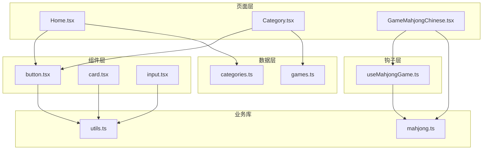
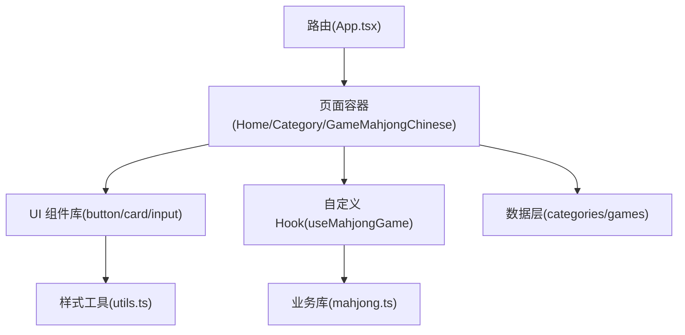
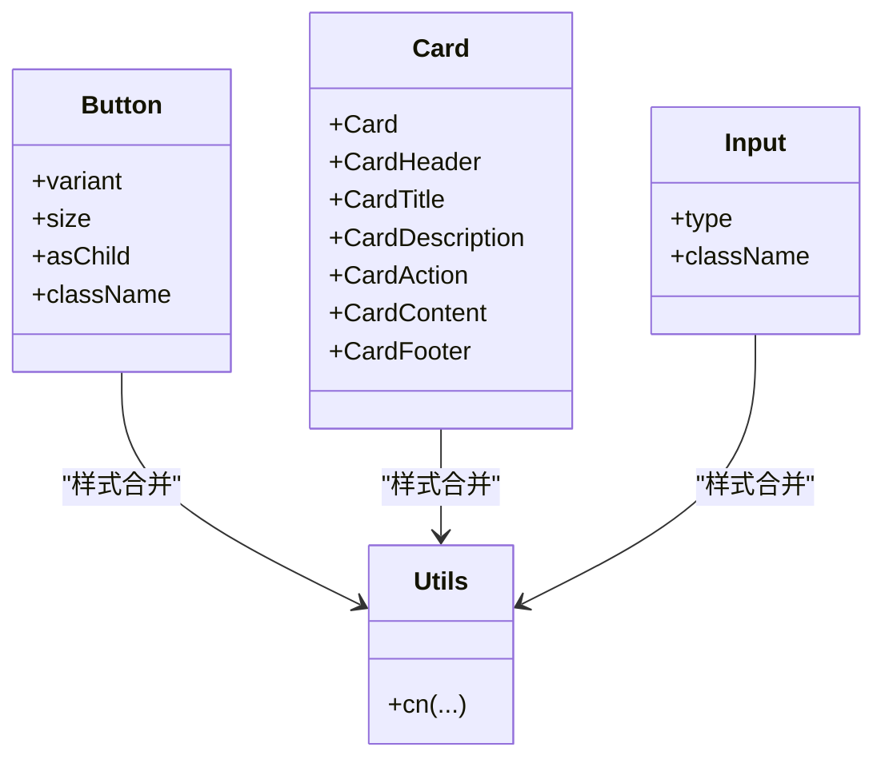
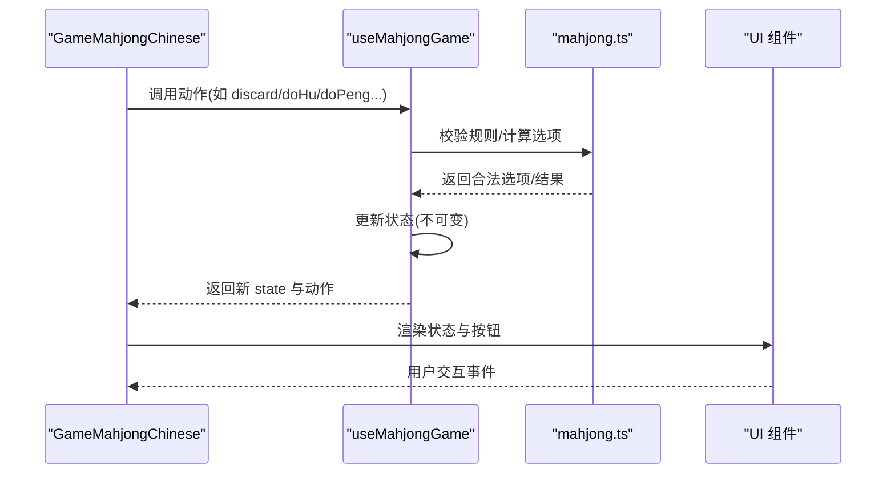
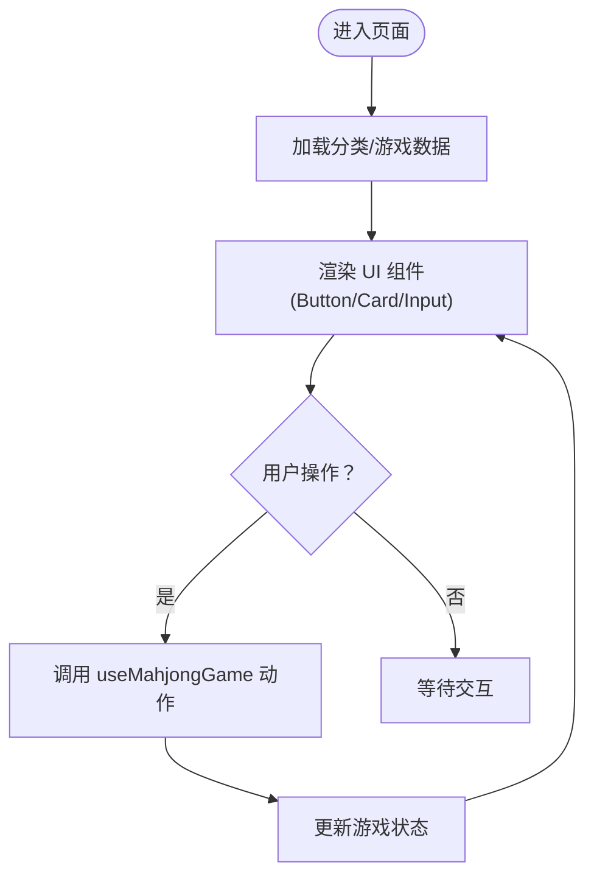
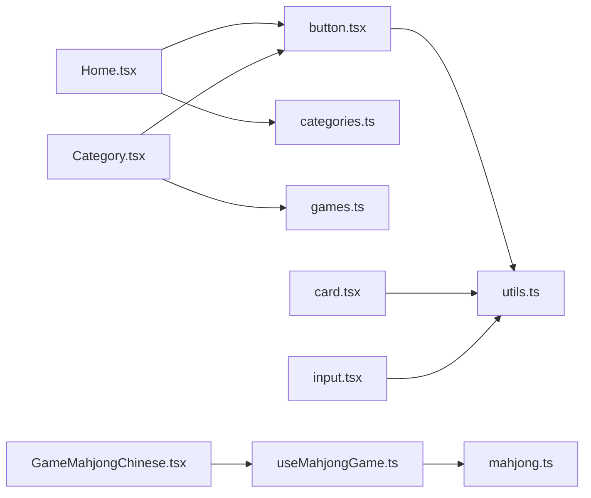

# 组件模式

<cite>
**本文引用的文件**
- [App.tsx](file://src/App.tsx)
- [Home.tsx](file://src/pages/Home.tsx)
- [Category.tsx](file://src/pages/Category.tsx)
- [GameMahjongChinese.tsx](file://src/pages/GameMahjongChinese.tsx)
- [button.tsx](file://src/components/ui/button.tsx)
- [card.tsx](file://src/components/ui/card.tsx)
- [input.tsx](file://src/components/ui/input.tsx)
- [useMahjongGame.ts](file://src/hooks/useMahjongGame.ts)
- [mahjong.ts](file://src/lib/mahjong.ts)
- [utils.ts](file://src/lib/utils.ts)
- [categories.ts](file://src/data/categories.ts)
- [games.ts](file://src/data/games.ts)
</cite>

## 目录
1. [简介](#简介)
2. [项目结构](#项目结构)
3. [核心组件](#核心组件)
4. [架构总览](#架构总览)
5. [组件详细分析](#组件详细分析)
6. [依赖关系分析](#依赖关系分析)
7. [性能考量](#性能考量)
8. [故障排查指南](#故障排查指南)
9. [结论](#结论)
10. [附录](#附录)

## 简介
本文件系统化梳理 Rsbuild2 项目中的组件模式与设计实践，重点覆盖：
- 组件类型与职责：函数组件、纯组件、容器组件的使用场景与边界
- UI 组件库设计原则：button、card、input 等基础组件的实现与复用策略
- 自定义 Hook 模式：useMahjongGame 如何封装复杂状态逻辑与业务规则
- 组件通信：props 传递、状态提升、Context 使用
- 最佳实践：职责单一、可测试性、可维护性

## 项目结构
项目采用按功能域划分的目录组织，核心模块如下：
- 页面层：pages/*，承载路由页面与容器组件
- 组件层：components/ui/*，提供可复用的基础 UI 组件
- 钩子层：hooks/*，封装可复用的状态与业务逻辑
- 数据层：data/*，提供分类与游戏列表等静态数据
- 业务库：lib/*，包含游戏规则与工具函数
- 样式工具：lib/utils.ts 提供样式合并工具

图表来源
- [App.tsx](file://src/App.tsx#L1-L42)
- [Home.tsx](file://src/pages/Home.tsx#L1-L43)
- [Category.tsx](file://src/pages/Category.tsx#L1-L132)
- [GameMahjongChinese.tsx](file://src/pages/GameMahjongChinese.tsx#L1-L469)
- [button.tsx](file://src/components/ui/button.tsx#L1-L65)
- [card.tsx](file://src/components/ui/card.tsx#L1-L93)
- [input.tsx](file://src/components/ui/input.tsx#L1-L22)
- [useMahjongGame.ts](file://src/hooks/useMahjongGame.ts#L1-L866)
- [mahjong.ts](file://src/lib/mahjong.ts#L1-L494)
- [utils.ts](file://src/lib/utils.ts#L1-L7)
- [categories.ts](file://src/data/categories.ts#L1-L34)
- [games.ts](file://src/data/games.ts#L1-L197)

章节来源
- [App.tsx](file://src/App.tsx#L1-L42)
- [Home.tsx](file://src/pages/Home.tsx#L1-L43)
- [Category.tsx](file://src/pages/Category.tsx#L1-L132)
- [GameMahjongChinese.tsx](file://src/pages/GameMahjongChinese.tsx#L1-L469)
- [button.tsx](file://src/components/ui/button.tsx#L1-L65)
- [card.tsx](file://src/components/ui/card.tsx#L1-L93)
- [input.tsx](file://src/components/ui/input.tsx#L1-L22)
- [useMahjongGame.ts](file://src/hooks/useMahjongGame.ts#L1-L866)
- [mahjong.ts](file://src/lib/mahjong.ts#L1-L494)
- [utils.ts](file://src/lib/utils.ts#L1-L7)
- [categories.ts](file://src/data/categories.ts#L1-L34)
- [games.ts](file://src/data/games.ts#L1-L197)

## 核心组件
- 函数组件：以函数形式声明的 React 组件，如 Home、Category、GameMahjongChinese，负责页面级布局与交互编排。
- 纯组件：UI 组件如 Button、Card、Input，通过 props 渲染，不持有内部状态，强调可复用与一致性。
- 容器组件：GameMahjongChinese 作为容器组件，聚合 useMahjongGame 的状态与动作，协调业务逻辑与 UI 展示。

章节来源
- [Home.tsx](file://src/pages/Home.tsx#L5-L40)
- [Category.tsx](file://src/pages/Category.tsx#L12-L131)
- [GameMahjongChinese.tsx](file://src/pages/GameMahjongChinese.tsx#L121-L138)
- [button.tsx](file://src/components/ui/button.tsx#L41-L62)
- [card.tsx](file://src/components/ui/card.tsx#L5-L82)
- [input.tsx](file://src/components/ui/input.tsx#L5-L19)

## 架构总览
应用通过路由组织页面，页面组件承担容器职责，UI 组件提供基础能力，自定义 Hook 封装复杂业务逻辑，业务库提供规则与算法，数据层提供静态配置。

图表来源
- [App.tsx](file://src/App.tsx#L18-L39)
- [Home.tsx](file://src/pages/Home.tsx#L1-L43)
- [Category.tsx](file://src/pages/Category.tsx#L1-L132)
- [GameMahjongChinese.tsx](file://src/pages/GameMahjongChinese.tsx#L1-L469)
- [button.tsx](file://src/components/ui/button.tsx#L1-L65)
- [card.tsx](file://src/components/ui/card.tsx#L1-L93)
- [input.tsx](file://src/components/ui/input.tsx#L1-L22)
- [useMahjongGame.ts](file://src/hooks/useMahjongGame.ts#L1-L866)
- [mahjong.ts](file://src/lib/mahjong.ts#L1-L494)
- [utils.ts](file://src/lib/utils.ts#L1-L7)
- [categories.ts](file://src/data/categories.ts#L1-L34)
- [games.ts](file://src/data/games.ts#L1-L197)

## 组件详细分析

### UI 组件库：button、card、input
- 设计原则
  - 变体与尺寸：通过变体与尺寸变量统一风格，支持默认、危险、描边、次级、幽灵、链接等变体，以及默认、超小、小、大、图标等尺寸。
  - 语义化与可访问性：使用语义化标签与可访问属性，确保键盘导航与屏幕阅读器友好。
  - 组合与扩展：通过 Slot 支持 asChild，允许将原生元素包装为语义容器，便于无障碍与样式扩展。
  - 样式合并：使用 utils.cn 合并条件样式，保证样式覆盖与冲突最小化。
- 复用策略
  - 统一入口导出，集中管理样式与行为，降低页面侧样板代码。
  - 通过变体与尺寸参数化，减少重复组件定义。

图表来源
- [button.tsx](file://src/components/ui/button.tsx#L41-L62)
- [card.tsx](file://src/components/ui/card.tsx#L5-L82)
- [input.tsx](file://src/components/ui/input.tsx#L5-L19)
- [utils.ts](file://src/lib/utils.ts#L4-L6)

章节来源
- [button.tsx](file://src/components/ui/button.tsx#L1-L65)
- [card.tsx](file://src/components/ui/card.tsx#L1-L93)
- [input.tsx](file://src/components/ui/input.tsx#L1-L22)
- [utils.ts](file://src/lib/utils.ts#L1-L7)

### 自定义 Hook：useMahjongGame
- 职责与边界
  - 状态集中管理：封装麻将游戏的完整状态机，包括手牌、副露、弃牌堆、牌墙、当前玩家、阶段、赢家、分数等。
  - 动作编排：提供丢牌、过、胡、碰、杠、吃、自摸、加杠、暗杠、AI 要牌轮次推进、AI 出牌策略等动作。
  - 业务规则：内置复杂的规则判断与结算逻辑，包括番种计算、杠上开花、海底捞月、听牌判断、防守策略等。
- 设计模式
  - 状态提升：将游戏状态提升至 Hook，由容器组件 GameMahjongChinese 调用并渲染。
  - 不可变更新：通过浅拷贝与重组数据，确保状态更新的确定性与可追踪性。
  - 纯函数辅助：将评分、策略、规则判断等逻辑拆分为纯函数，便于测试与复用。
- 关键流程示意

图表来源
- [GameMahjongChinese.tsx](file://src/pages/GameMahjongChinese.tsx#L121-L138)
- [useMahjongGame.ts](file://src/hooks/useMahjongGame.ts#L209-L866)
- [mahjong.ts](file://src/lib/mahjong.ts#L136-L200)

章节来源
- [useMahjongGame.ts](file://src/hooks/useMahjongGame.ts#L1-L866)
- [GameMahjongChinese.tsx](file://src/pages/GameMahjongChinese.tsx#L1-L469)
- [mahjong.ts](file://src/lib/mahjong.ts#L1-L494)

### 页面组件：Home、Category、GameMahjongChinese
- Home：展示分类卡片，使用 Button 组件，体现容器组件的布局与交互职责。
- Category：根据路由参数加载分类信息与游戏列表，使用 Button、Card、Input 等组件进行展示与交互。
- GameMahjongChinese：作为容器组件，注入 useMahjongGame 的状态与动作，驱动 UI 渲染与用户交互。

图表来源
- [Home.tsx](file://src/pages/Home.tsx#L5-L40)
- [Category.tsx](file://src/pages/Category.tsx#L12-L131)
- [GameMahjongChinese.tsx](file://src/pages/GameMahjongChinese.tsx#L121-L138)

章节来源
- [Home.tsx](file://src/pages/Home.tsx#L1-L43)
- [Category.tsx](file://src/pages/Category.tsx#L1-L132)
- [GameMahjongChinese.tsx](file://src/pages/GameMahjongChinese.tsx#L1-L469)

## 依赖关系分析
- 页面到组件：Home 与 Category 直接依赖 UI 组件与数据层；GameMahjongChinese 依赖 Hook 与业务库。
- 组件到工具：UI 组件依赖 utils.cn 合并样式。
- Hook 到库：useMahjongGame 依赖 mahjong.ts 实现规则与算法。
- 数据到页面：categories.ts 与 games.ts 为页面提供静态数据。

图表来源
- [Home.tsx](file://src/pages/Home.tsx#L1-L43)
- [Category.tsx](file://src/pages/Category.tsx#L1-L132)
- [GameMahjongChinese.tsx](file://src/pages/GameMahjongChinese.tsx#L1-L469)
- [button.tsx](file://src/components/ui/button.tsx#L1-L65)
- [card.tsx](file://src/components/ui/card.tsx#L1-L93)
- [input.tsx](file://src/components/ui/input.tsx#L1-L22)
- [useMahjongGame.ts](file://src/hooks/useMahjongGame.ts#L1-L866)
- [mahjong.ts](file://src/lib/mahjong.ts#L1-L494)
- [utils.ts](file://src/lib/utils.ts#L1-L7)
- [categories.ts](file://src/data/categories.ts#L1-L34)
- [games.ts](file://src/data/games.ts#L1-L197)

章节来源
- [Home.tsx](file://src/pages/Home.tsx#L1-L43)
- [Category.tsx](file://src/pages/Category.tsx#L1-L132)
- [GameMahjongChinese.tsx](file://src/pages/GameMahjongChinese.tsx#L1-L469)
- [button.tsx](file://src/components/ui/button.tsx#L1-L65)
- [card.tsx](file://src/components/ui/card.tsx#L1-L93)
- [input.tsx](file://src/components/ui/input.tsx#L1-L22)
- [useMahjongGame.ts](file://src/hooks/useMahjongGame.ts#L1-L866)
- [mahjong.ts](file://src/lib/mahjong.ts#L1-L494)
- [utils.ts](file://src/lib/utils.ts#L1-L7)
- [categories.ts](file://src/data/categories.ts#L1-L34)
- [games.ts](file://src/data/games.ts#L1-L197)

## 性能考量
- 渲染优化
  - 使用不可变更新与浅拷贝，减少不必要的重渲染。
  - 将纯函数逻辑拆分，避免在渲染路径中执行昂贵计算。
- 交互响应
  - 将 AI 决策与自动出牌通过定时器异步触发，避免阻塞主线程。
- 样式与资源
  - 通过 utils.cn 合并样式，减少无效类名与重复样式计算。

## 故障排查指南
- 状态未更新
  - 检查动作函数是否在正确阶段调用，确认 state 的 phase 与 currentPlayer 等字段。
  - 确认规则校验函数返回值与期望一致。
- UI 按钮不可用
  - 检查 claimOption 与 canXxx 选项生成逻辑，确保在正确时机启用/禁用按钮。
- 样式异常
  - 确认 utils.cn 的合并顺序与优先级，避免样式覆盖冲突。

章节来源
- [useMahjongGame.ts](file://src/hooks/useMahjongGame.ts#L209-L866)
- [GameMahjongChinese.tsx](file://src/pages/GameMahjongChinese.tsx#L153-L166)
- [utils.ts](file://src/lib/utils.ts#L1-L7)

## 结论
Rsbuild2 项目通过清晰的分层与职责划分，实现了可复用的 UI 组件库、可测试的自定义 Hook 与可维护的页面容器组件。useMahjongGame 将复杂业务规则与状态管理抽象为 Hook，使页面组件专注于交互与渲染；UI 组件通过变体与尺寸参数化，提供一致的视觉与交互体验。建议在后续迭代中进一步完善测试覆盖与文档注释，持续优化渲染性能与可访问性。

## 附录
- 组件职责清单
  - 函数组件：负责页面布局与交互编排
  - 纯组件：负责 UI 渲染与样式表现
  - 容器组件：负责状态聚合与动作调度
- 最佳实践
  - 职责单一：每个组件只做一件事
  - 可测试性：将纯逻辑抽离为纯函数，便于单元测试
  - 可维护性：统一的样式工具与组件变体，降低维护成本