# 路由系统

<cite>
**本文档引用的文件**
- [src/App.tsx](file://src/App.tsx)
- [src/pages/Home.tsx](file://src/pages/Home.tsx)
- [src/pages/Category.tsx](file://src/pages/Category.tsx)
- [src/pages/GameMahjongChinese.tsx](file://src/pages/GameMahjongChinese.tsx)
- [src/pages/GameTetris.tsx](file://src/pages/GameTetris.tsx)
- [src/pages/GameGuessNumber.tsx](file://src/pages/GameGuessNumber.tsx)
- [src/pages/GameMemory.tsx](file://src/pages/GameMemory.tsx)
- [src/data/categories.ts](file://src/data/categories.ts)
- [src/data/games.ts](file://src/data/games.ts)
- [src/index.tsx](file://src/index.tsx)
- [package.json](file://package.json)
</cite>

## 目录
1. [简介](#简介)
2. [项目结构](#项目结构)
3. [核心组件](#核心组件)
4. [架构概览](#架构概览)
5. [详细组件分析](#详细组件分析)
6. [依赖分析](#依赖分析)
7. [性能考虑](#性能考虑)
8. [故障排除指南](#故障排除指南)
9. [结论](#结论)

## 简介

Rsbuild2项目采用基于React Router的客户端路由系统，实现了完整的单页应用路由功能。该路由系统支持静态路由、动态参数路由和嵌套路由设计，为用户提供流畅的游戏分类浏览和游戏体验导航。

## 项目结构

项目采用按功能模块组织的目录结构，路由相关的代码主要分布在以下位置：

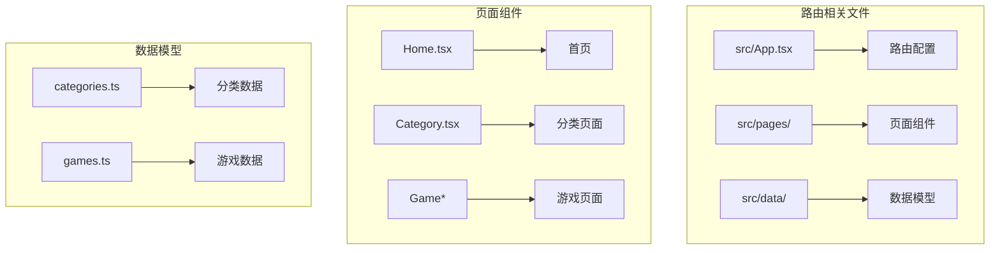

**图表来源**
- [src/App.tsx](file://src/App.tsx#L1-L42)
- [src/pages/Home.tsx](file://src/pages/Home.tsx#L1-L43)
- [src/pages/Category.tsx](file://src/pages/Category.tsx#L1-L132)

**章节来源**
- [src/App.tsx](file://src/App.tsx#L1-L42)
- [src/index.tsx](file://src/index.tsx#L1-L14)

## 核心组件

### 路由配置系统

应用的路由配置集中在主应用组件中，使用React Router的声明式路由语法：

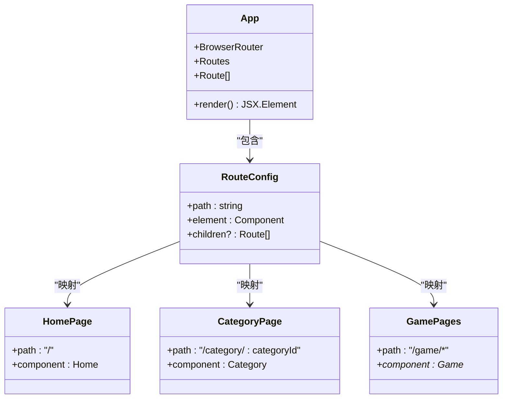

**图表来源**
- [src/App.tsx](file://src/App.tsx#L18-L39)

### 路由表结构详解

应用包含以下主要路由路径：

| 路径模式 | 参数 | 组件 | 功能描述 |
|---------|------|------|----------|
| `/` | 无 | Home | 首页，展示所有游戏分类 |
| `/category/:categoryId` | categoryId | Category | 分类详情页面，支持动态参数 |
| `/game/mahjong-chinese` | 无 | GameMahjongChinese | 中国麻将游戏 |
| `/game/mahjong-sichuan` | 无 | GameMahjongComingSoon | 四川麻将（开发中） |
| `/game/mahjong-japanese` | 无 | GameMahjongJapanese | 日本麻将游戏 |
| `/game/guess-number` | 无 | GameGuessNumber | 猜数字游戏 |
| `/game/tictactoe` | 无 | GameTictactoe | 井字棋游戏 |
| `/game/memory` | 无 | GameMemory | 记忆翻牌游戏 |
| `/game/2048` | 无 | Game2048 | 2048游戏 |
| `/game/snake` | 无 | GameSnake | 贪吃蛇游戏 |
| `/game/breakout` | 无 | GameBreakout | 打砖块游戏 |
| `/game/shooter` | 无 | GameShooter | 飞机大战游戏 |
| `/game/tank` | 无 | GameTank | 坦克大战游戏 |
| `/game/tetris` | 无 | GameTetris | 俄罗斯方块游戏 |

**章节来源**
- [src/App.tsx](file://src/App.tsx#L22-L35)

## 架构概览

### 路由系统架构图

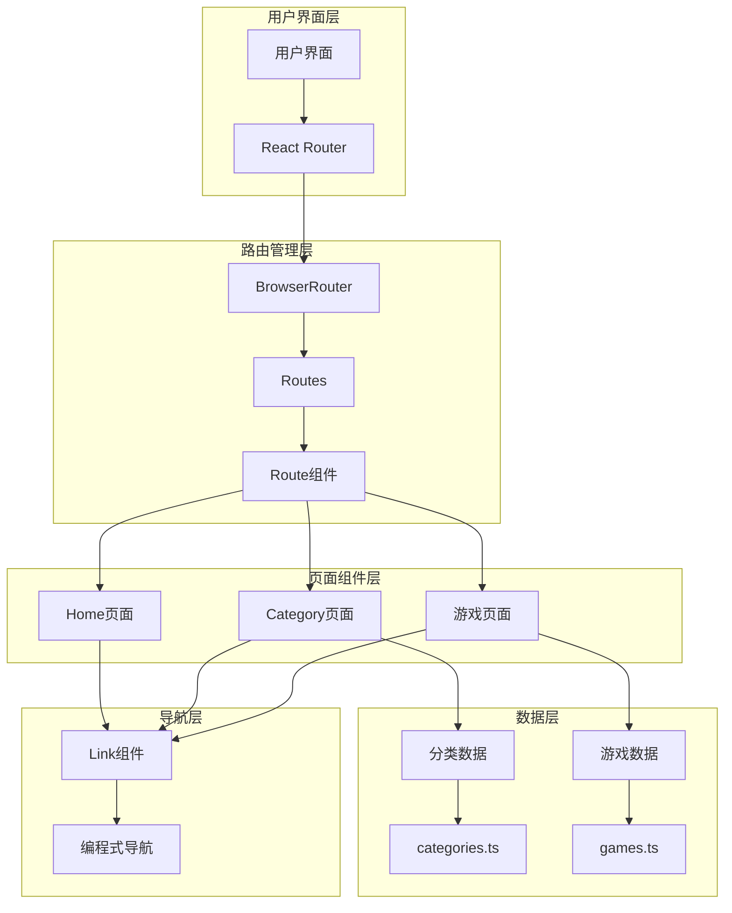

**图表来源**
- [src/App.tsx](file://src/App.tsx#L1-L42)
- [src/pages/Home.tsx](file://src/pages/Home.tsx#L1-L43)
- [src/pages/Category.tsx](file://src/pages/Category.tsx#L1-L132)

### 路由导航流程

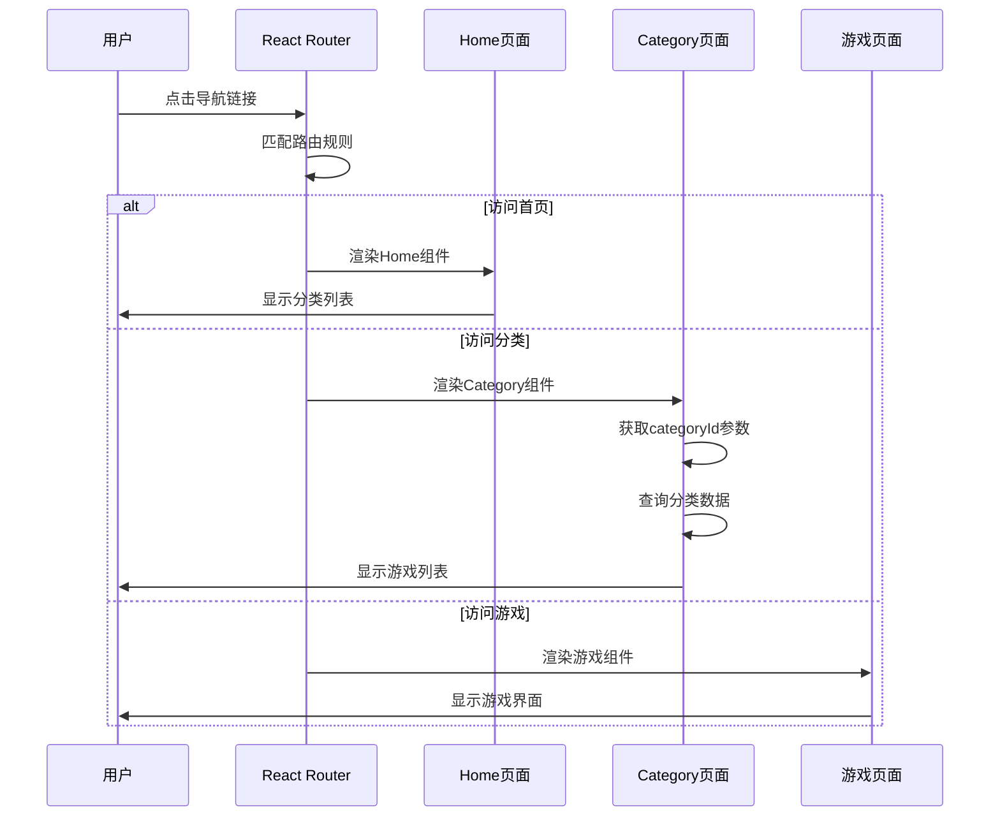

**图表来源**
- [src/pages/Home.tsx](file://src/pages/Home.tsx#L19-L35)
- [src/pages/Category.tsx](file://src/pages/Category.tsx#L12-L17)

## 详细组件分析

### 首页路由系统

首页作为应用的主要入口，负责展示所有可用的游戏分类：

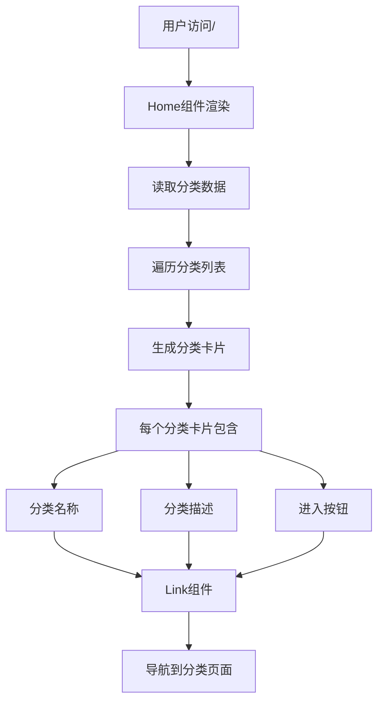

**图表来源**
- [src/pages/Home.tsx](file://src/pages/Home.tsx#L18-L36)

**章节来源**
- [src/pages/Home.tsx](file://src/pages/Home.tsx#L1-L43)

### 分类页面路由实现

分类页面是路由系统的核心组件，实现了动态参数处理和嵌套路由设计：

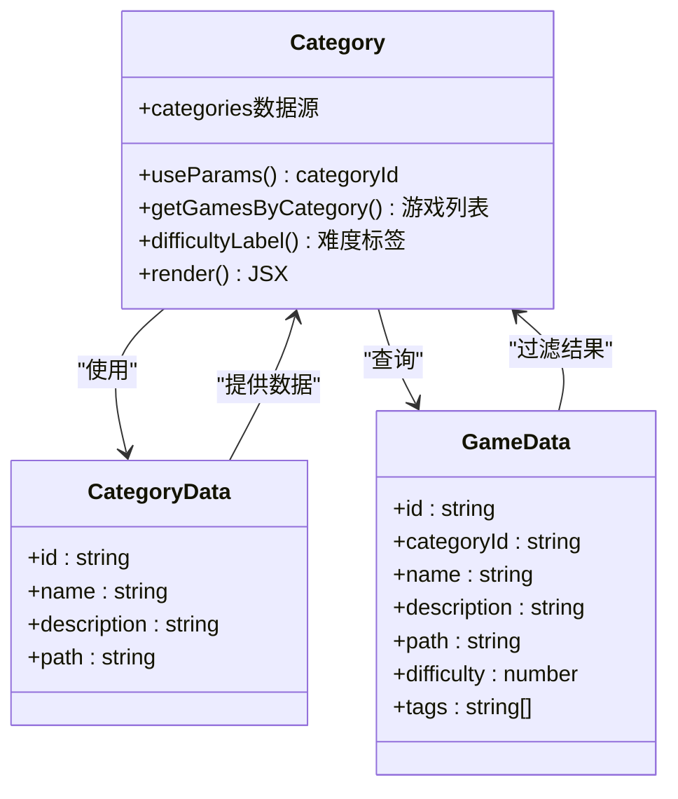

**图表来源**
- [src/pages/Category.tsx](file://src/pages/Category.tsx#L12-L132)
- [src/data/categories.ts](file://src/data/categories.ts#L1-L34)
- [src/data/games.ts](file://src/data/games.ts#L190-L196)

#### 动态参数处理机制

分类页面通过React Router的`useParams`钩子处理动态参数：

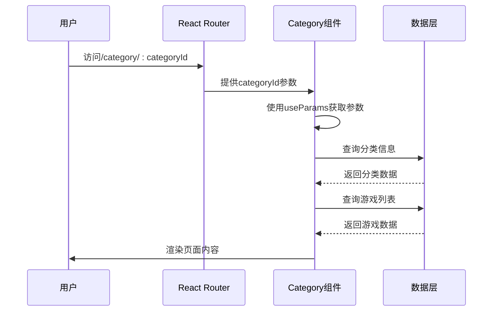

**图表来源**
- [src/pages/Category.tsx](file://src/pages/Category.tsx#L13-L17)

**章节来源**
- [src/pages/Category.tsx](file://src/pages/Category.tsx#L1-L132)

### 游戏页面导航模式

游戏页面采用了统一的导航模式，确保用户体验的一致性：

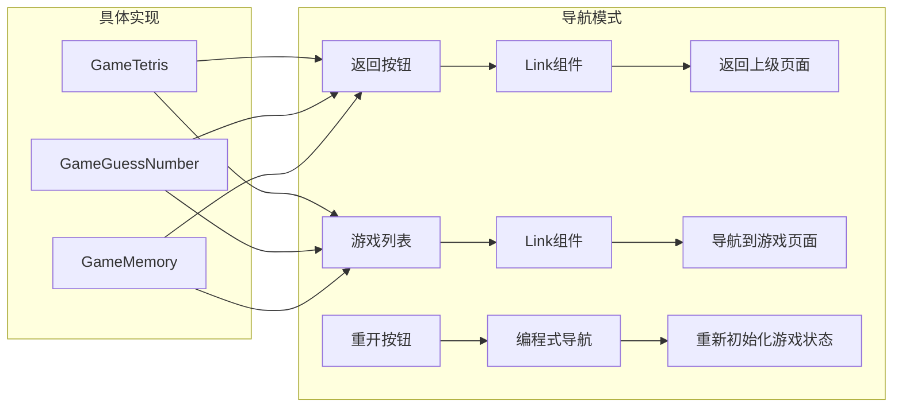

**图表来源**
- [src/pages/GameTetris.tsx](file://src/pages/GameTetris.tsx#L318-L354)
- [src/pages/GameGuessNumber.tsx](file://src/pages/GameGuessNumber.tsx#L47-L107)
- [src/pages/GameMemory.tsx](file://src/pages/GameMemory.tsx#L91-L136)

**章节来源**
- [src/pages/GameTetris.tsx](file://src/pages/GameTetris.tsx#L1-L358)
- [src/pages/GameGuessNumber.tsx](file://src/pages/GameGuessNumber.tsx#L1-L111)
- [src/pages/GameMemory.tsx](file://src/pages/GameMemory.tsx#L1-L140)

### 路由守卫和权限控制

当前项目采用简单的客户端路由控制，没有实现复杂的路由守卫机制。所有路由都是公开可访问的，但可以通过以下方式扩展：

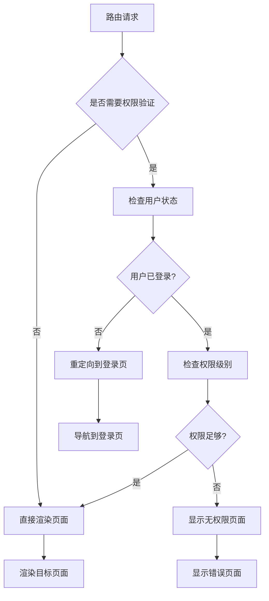

## 依赖分析

### 外部依赖关系

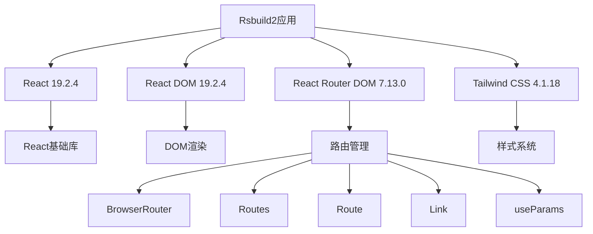

**图表来源**
- [package.json](file://package.json#L15-L24)

### 内部依赖关系

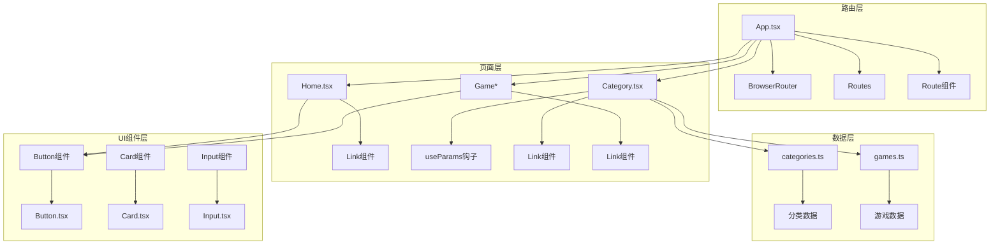

**图表来源**
- [src/App.tsx](file://src/App.tsx#L1-L16)
- [src/pages/Home.tsx](file://src/pages/Home.tsx#L1-L4)
- [src/pages/Category.tsx](file://src/pages/Category.tsx#L1-L6)

**章节来源**
- [package.json](file://package.json#L1-L43)

## 性能考虑

### 路由性能优化建议

1. **懒加载组件**：对于大型游戏页面，可以考虑实现代码分割：
   ```javascript
   const LazyGameComponent = React.lazy(() => import('@/pages/GameMahjongChinese'));
   ```

2. **路由缓存**：对于频繁访问的页面，可以实现简单的缓存机制

3. **预加载策略**：对于用户可能访问的下一个页面，可以实现预加载

4. **路由参数验证**：在处理动态参数时添加输入验证

## 故障排除指南

### 常见路由问题及解决方案

#### 1. 路由无法匹配

**问题症状**：访问路由时显示空白页面或404

**可能原因**：
- 路由路径配置错误
- 组件导入路径不正确
- 路由层级配置问题

**解决方法**：
- 检查路由路径是否与组件导出一致
- 验证组件导入路径的正确性
- 确认路由层级结构的完整性

#### 2. 动态参数获取失败

**问题症状**：分类页面无法获取categoryId参数

**可能原因**：
- useParams钩子使用错误
- 路由参数定义不正确
- 数据源查询失败

**解决方法**：
- 确认路由参数定义格式为`:categoryId`
- 检查useParams钩子的使用方式
- 验证数据源查询逻辑

#### 3. 导航链接失效

**问题症状**：Link组件点击无响应

**可能原因**：
- Link组件属性设置错误
- 路由配置缺失
- 组件未正确导入

**解决方法**：
- 检查Link组件的to属性值
- 确认目标路由已正确定义
- 验证组件导入语句

**章节来源**
- [src/pages/Category.tsx](file://src/pages/Category.tsx#L19-L37)

## 结论

Rsbuild2项目的路由系统设计简洁而实用，成功实现了基于React Router的客户端路由功能。系统具有以下特点：

1. **清晰的路由结构**：采用层次化的路由设计，便于理解和维护
2. **动态参数支持**：通过`:categoryId`参数实现灵活的分类页面
3. **统一的导航模式**：所有页面遵循一致的导航规范
4. **良好的扩展性**：代码结构便于添加新的路由和页面组件

该路由系统为用户提供了流畅的游戏分类浏览和游戏体验导航，是构建现代Web应用的良好基础。未来可以在现有基础上进一步增强路由守卫、性能优化和错误处理能力。