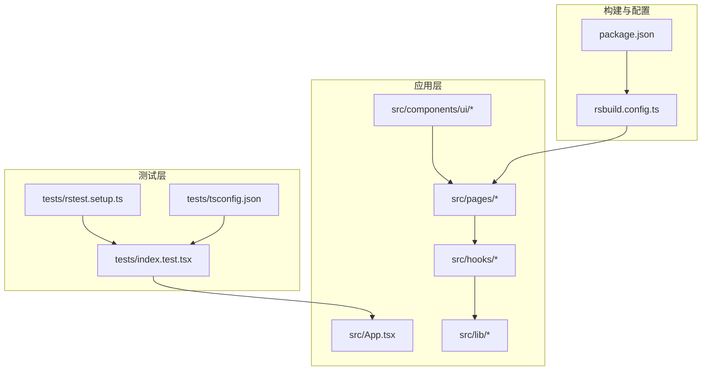
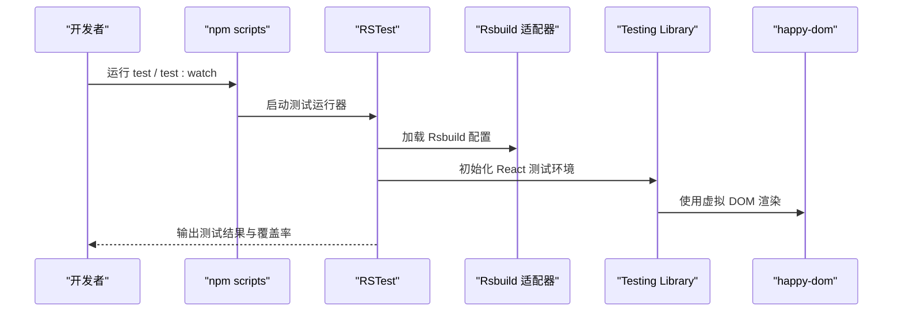
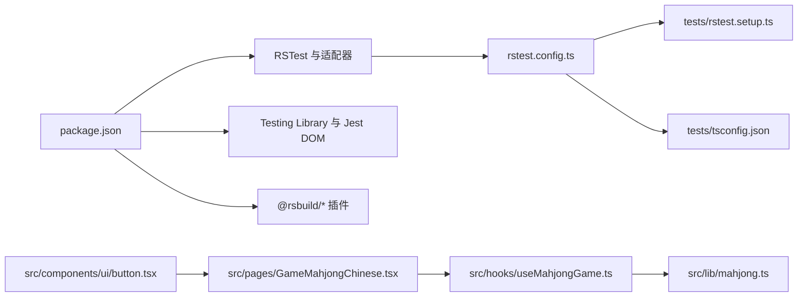

# 测试策略

<cite>
**本文引用的文件**
- [package.json](file://package.json)
- [rstest.config.ts](file://rstest.config.ts)
- [tests/rstest.setup.ts](file://tests/rstest.setup.ts)
- [tests/tsconfig.json](file://tests/tsconfig.json)
- [rsbuild.config.ts](file://rsbuild.config.ts)
- [tests/index.test.tsx](file://tests/index.test.tsx)
- [src/lib/mahjong.ts](file://src/lib/mahjong.ts)
- [src/hooks/useMahjongGame.ts](file://src/hooks/useMahjongGame.ts)
- [src/pages/GameMahjongChinese.tsx](file://src/pages/GameMahjongChinese.tsx)
- [src/components/ui/button.tsx](file://src/components/ui/button.tsx)
- [src/lib/mahjongRiichi.ts](file://src/lib/mahjongRiichi.ts)
- [src/lib/utils.ts](file://src/lib/utils.ts)
- [README.md](file://README.md)
</cite>

## 目录
1. [引言](#引言)
2. [项目结构](#项目结构)
3. [核心组件](#核心组件)
4. [架构总览](#架构总览)
5. [详细组件分析](#详细组件分析)
6. [依赖关系分析](#依赖关系分析)
7. [性能考量](#性能考量)
8. [故障排查指南](#故障排查指南)
9. [结论](#结论)
10. [附录](#附录)

## 引言
本测试策略文档面向 Rsbuild2 项目，围绕单元测试、组件测试、游戏逻辑测试、测试数据与模拟、覆盖率要求、CI 中的测试执行、性能与用户体验测试以及调试技巧等方面进行系统化说明。项目采用 Rsbuild 构建，测试框架基于 RSTest（适配 Rsbuild），并结合 Testing Library 与 Jest DOM 匹配器进行 UI 组件测试。

## 项目结构
项目采用按功能模块组织的目录结构，核心测试位于 tests 目录，游戏逻辑集中在 src/lib 与 src/hooks，页面组件在 src/pages，UI 组件在 src/components/ui。

图表来源
- [tests/index.test.tsx](file://tests/index.test.tsx#L1-L10)
- [tests/rstest.setup.ts](file://tests/rstest.setup.ts#L1-L5)
- [tests/tsconfig.json](file://tests/tsconfig.json#L1-L8)
- [rsbuild.config.ts](file://rsbuild.config.ts#L1-L16)
- [package.json](file://package.json#L1-L43)

章节来源
- [README.md](file://README.md#L1-L37)
- [package.json](file://package.json#L1-L43)
- [rsbuild.config.ts](file://rsbuild.config.ts#L1-L16)

## 核心组件
- 测试运行器与适配：RSTest + @rstest/adapter-rsbuild
- 测试环境：Testing Library React + Jest DOM 匹配器
- 类型与工具：@testing-library/jest-dom、happy-dom（虚拟 DOM）
- 构建与插件：@rsbuild/core + @rsbuild/plugin-react

章节来源
- [package.json](file://package.json#L25-L41)
- [rstest.config.ts](file://rstest.config.ts#L1-L9)
- [tests/rstest.setup.ts](file://tests/rstest.setup.ts#L1-L5)
- [tests/tsconfig.json](file://tests/tsconfig.json#L1-L8)

## 架构总览
测试体系围绕以下要点：
- 使用 RSTest 作为统一测试入口，通过 Rsbuild 适配器加载 Rsbuild 配置
- 通过 setupFiles 注入 Jest DOM 匹配器，增强断言能力
- 测试脚本通过 npm scripts 调用 rstest 与 watch 模式
- 测试类型覆盖：单元测试（纯函数/逻辑）、组件测试（React 组件）、集成测试（页面与钩子）

图表来源
- [package.json](file://package.json#L6-L14)
- [rstest.config.ts](file://rstest.config.ts#L1-L9)
- [tests/rstest.setup.ts](file://tests/rstest.setup.ts#L1-L5)

## 详细组件分析

### 单元测试策略（游戏逻辑）
目标：验证麻将核心算法与状态机的正确性，包括发牌、吃碰杠、听牌、计番、结算等。

- 覆盖范围
  - 牌组生成与洗牌
  - 发牌与初始手牌
  - 吃/碰/明杠/暗杠/加杠判定
  - 听牌检测与快胡值估算
  - 胡牌判定与番种计算
  - 局终结算与计分

- 关键函数与断言建议
  - 牌组生成与洗牌：断言长度、分布均匀性（随机性测试）
  - 发牌：断言每人手牌数量、剩余牌墙长度、排序一致性
  - 吃/碰/杠：断言合法选项、非法输入拒绝、牌型移除与新增
  - 听牌：断言等待牌集合、非听牌返回空
  - 胡牌与番种：断言不同牌型（十三幺、七小对、对对胡、清一色等）与番数
  - 结算：断言支付明细、分数变化、流局处理

- 测试数据与模拟
  - 使用固定种子或可控随机源，确保可重复性
  - 构造边界场景：缺牌、满牌、杠后补牌、海底摸月
  - 模拟 AI 决策路径：不同概率阈值下的行为

- 示例断言思路（不包含具体代码）
  - 发牌后每人手牌数量与剩余牌墙长度
  - 吃/碰/杠后手牌与副露变化
  - 胡牌后番种列表与总番数
  - 结算后分数与支付明细

章节来源
- [src/lib/mahjong.ts](file://src/lib/mahjong.ts#L32-L494)
- [src/hooks/useMahjongGame.ts](file://src/hooks/useMahjongGame.ts#L1-L866)

### 组件测试策略（UI 组件）
目标：验证 UI 组件的行为、渲染与交互，确保用户界面正确性与可访问性。

- Button 组件
  - 变体与尺寸：断言类名与属性映射
  - 禁用态与焦点态：断言禁用与可访问性属性
  - 图标支持：断言图标容器与尺寸

- 页面组件（中国麻将）
  - 渲染流程：初始未开始、开始后牌桌布局、结算面板
  - 用户交互：出牌、要牌阶段按钮可用性、AI 自动行为触发时机
  - 牌面渲染：颜色、样式、数字/符号显示
  - 分数与状态：断言分数更新、赢家/流局状态

- 测试方法与最佳实践
  - 使用 Testing Library 的查询 API（getByRole、getByText 等）
  - 事件模拟：fireEvent/click、userEvent（推荐）
  - 断言可访问性：确保标签、角色、键盘可达
  - 避免 DOM 实现细节：断言语义与行为而非具体类名

章节来源
- [src/components/ui/button.tsx](file://src/components/ui/button.tsx#L1-L65)
- [src/pages/GameMahjongChinese.tsx](file://src/pages/GameMahjongChinese.tsx#L1-L469)

### 集成测试策略（页面与钩子）
目标：验证页面与自定义钩子的协作，覆盖完整业务流程。

- 典型流程
  - 开始游戏：初始化 GameState、发牌、设置当前玩家
  - 出牌与要牌：丢弃手牌、进入 claim 阶段、AI 决策
  - 胡/杠/碰/吃：根据选项执行动作、更新状态与分数
  - 结算：局终结算、支付明细、分数汇总

- 断言重点
  - 状态流转：phase、currentPlayer、claimOption、lastWinResult
  - 分数变化：结算前后分数对比
  - UI 响应：按钮可用性、提示信息、牌面更新

章节来源
- [src/hooks/useMahjongGame.ts](file://src/hooks/useMahjongGame.ts#L209-L866)
- [src/pages/GameMahjongChinese.tsx](file://src/pages/GameMahjongChinese.tsx#L121-L469)

### 日麻规则库（扩展）
目标：为日式立直麻将提供规则与计分支持，便于后续扩展测试。

- 关键点
  - 赤五牌处理、基础牌型映射
  - 吃/碰/杠判定（含赤五）
  - 役种计算（立直、断幺九、役牌、清一色等）
  - 计分公式与符计算

- 测试建议
  - 赤五牌与普通五牌等价性
  - 不同役种组合与番数叠加
  - 门前清与副露对番数的影响

章节来源
- [src/lib/mahjongRiichi.ts](file://src/lib/mahjongRiichi.ts#L1-L632)

## 依赖关系分析
测试配置与应用代码之间的耦合关系如下：

图表来源
- [package.json](file://package.json#L25-L41)
- [rstest.config.ts](file://rstest.config.ts#L1-L9)
- [tests/rstest.setup.ts](file://tests/rstest.setup.ts#L1-L5)
- [tests/tsconfig.json](file://tests/tsconfig.json#L1-L8)
- [src/pages/GameMahjongChinese.tsx](file://src/pages/GameMahjongChinese.tsx#L1-L469)
- [src/hooks/useMahjongGame.ts](file://src/hooks/useMahjongGame.ts#L1-L866)
- [src/lib/mahjong.ts](file://src/lib/mahjong.ts#L1-L494)
- [src/components/ui/button.tsx](file://src/components/ui/button.tsx#L1-L65)

章节来源
- [package.json](file://package.json#L25-L41)
- [rstest.config.ts](file://rstest.config.ts#L1-L9)

## 性能考量
- 单元测试性能
  - 使用固定随机源或伪随机，减少不确定性带来的重试成本
  - 对复杂算法（如听牌/计番）进行边界与回归测试，避免过度随机化导致的长耗时
- 组件测试性能
  - 使用 Testing Library 的轻量渲染与最小化 DOM 查询
  - 避免不必要的 useEffect 与副作用，必要时使用 act 包裹
- CI 中的测试执行
  - 并行度：RSTest 默认并行，合理拆分测试文件
  - 缓存：Rsbuild 构建缓存与依赖缓存，缩短 CI 时间

[本节为通用指导，无需特定文件来源]

## 故障排查指南
- 常见问题
  - 测试无法启动：检查 Rsbuild 配置与适配器版本
  - DOM 断言失败：确认 setupFiles 中已扩展 Jest DOM 匹配器
  - 随机性导致不稳定：使用固定种子或可控随机源
  - UI 交互无效：确认事件模拟与可访问性查询匹配实际渲染
- 调试技巧
  - 使用 RSTest 的 watch 模式快速迭代
  - 在本地使用 preview 验证页面渲染与交互
  - 对复杂逻辑添加日志或断点（在测试中使用 console 或条件断言）

章节来源
- [rstest.config.ts](file://rstest.config.ts#L1-L9)
- [tests/rstest.setup.ts](file://tests/rstest.setup.ts#L1-L5)
- [package.json](file://package.json#L6-L14)

## 结论
本测试策略以 RSTest 为核心，结合 Testing Library 与 Rsbuild 适配器，覆盖单元、组件与集成测试。针对麻将游戏逻辑，建议围绕发牌、吃碰杠、听牌、计番与结算建立系统化测试矩阵，并通过固定随机源与边界场景提升稳定性。在 CI 中启用并行与缓存，确保测试效率与质量。

[本节为总结，无需特定文件来源]

## 附录

### 测试用例编写指南
- 命名规范：describe/it 使用清晰语义，聚焦单一行为
- 断言风格：优先使用语义化断言（getByRole/getByText），避免 DOM 实现细节
- 数据准备：构造最小可验证场景，必要时使用 fixtures 或工厂函数
- 异步与副作用：使用 act 包裹异步更新，清理定时器与订阅

### 覆盖率要求建议
- 逻辑覆盖率：核心算法（发牌、吃碰杠、听牌、计番、结算）达到较高覆盖率
- 组件覆盖率：关键 UI 组件（Button、页面主组件）达到中等以上覆盖率
- 集成覆盖率：页面与钩子协作流程覆盖主要分支

### 持续集成中的测试执行
- 命令：使用 npm run test 与 test:watch
- 配置：Rsbuild 适配器自动加载构建配置，RSTest 读取 rstest.config.ts
- 类型：测试 tsconfig 继承根 tsconfig 并引入 jest-dom 类型

章节来源
- [package.json](file://package.json#L6-L14)
- [rstest.config.ts](file://rstest.config.ts#L1-L9)
- [tests/tsconfig.json](file://tests/tsconfig.json#L1-L8)