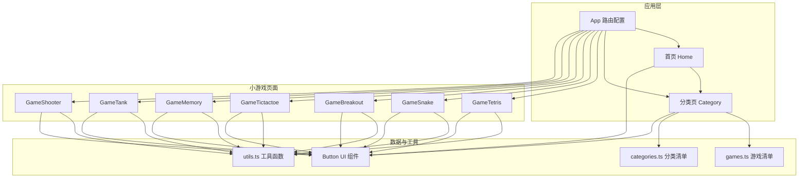
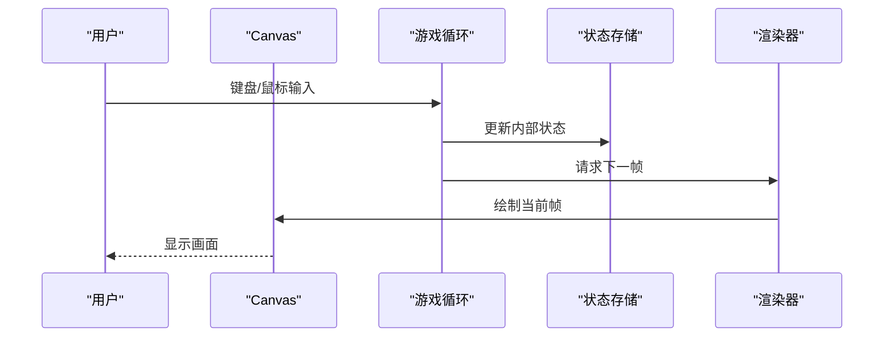
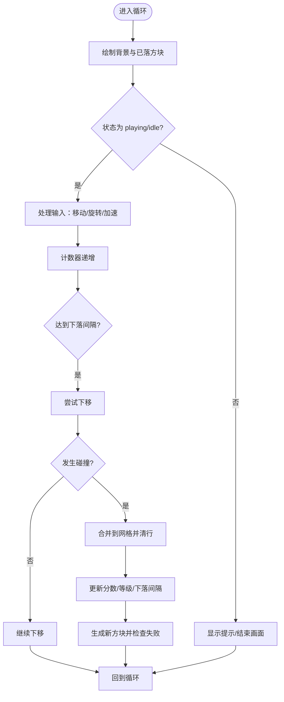
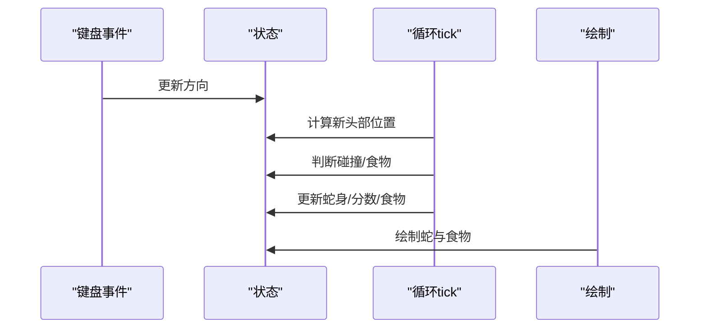
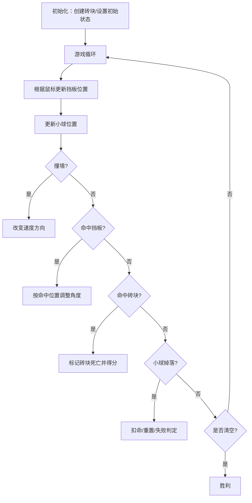
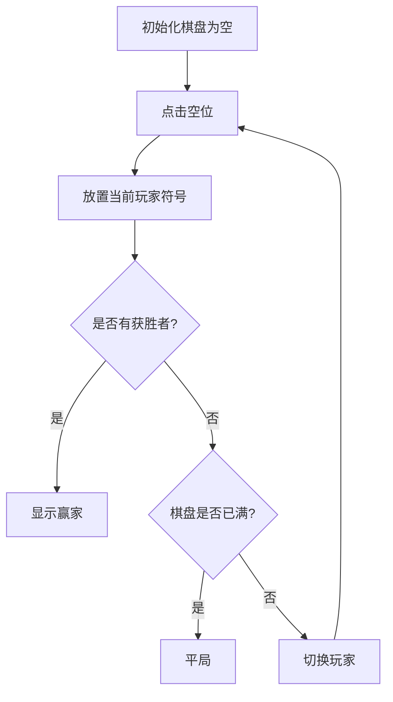
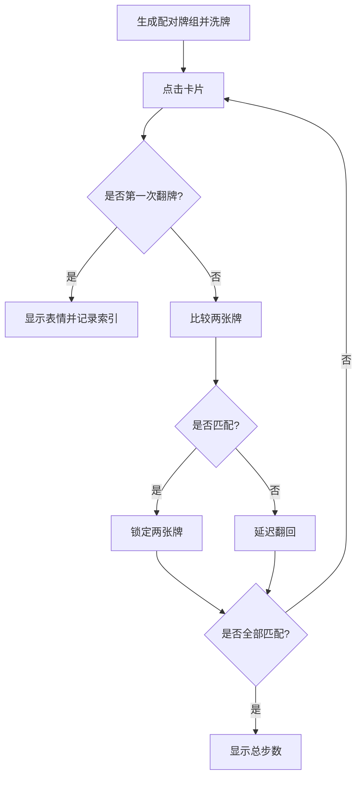
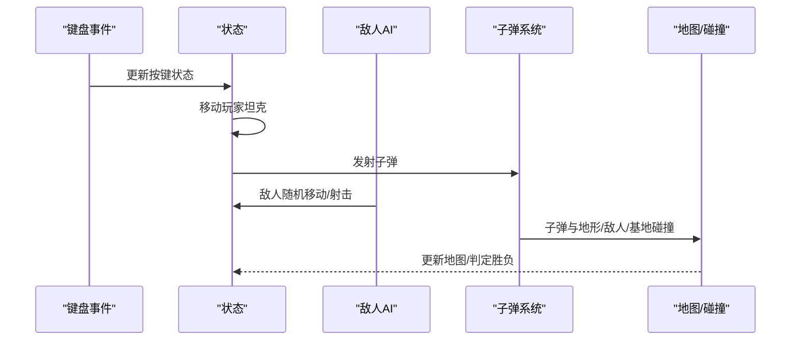
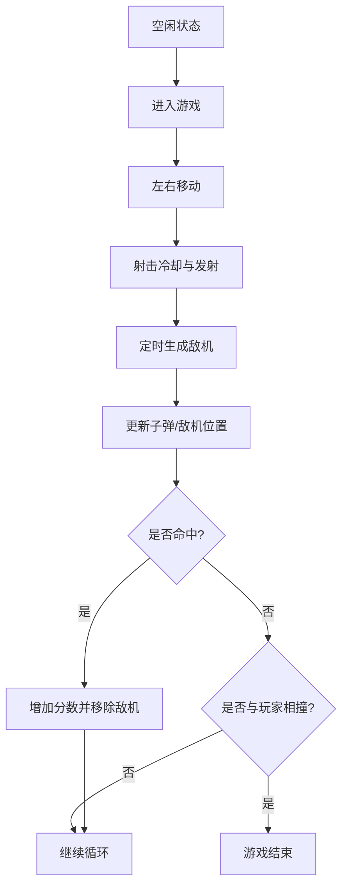
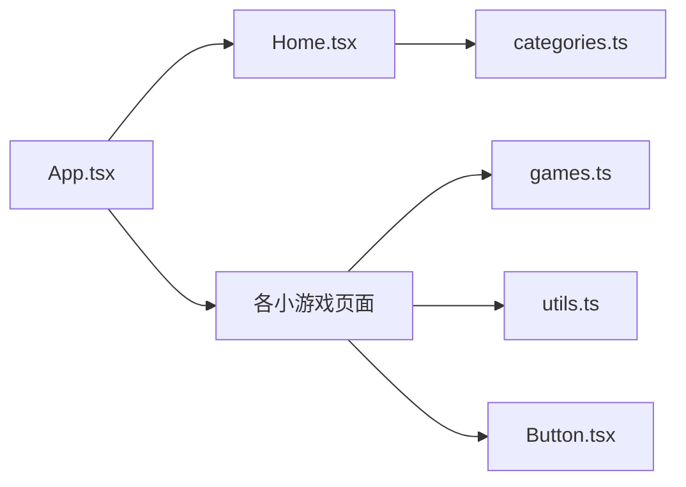

# 其他小游戏系统

<cite>
**本文引用的文件**
- [src/pages/GameTetris.tsx](file://src/pages/GameTetris.tsx)
- [src/pages/GameSnake.tsx](file://src/pages/GameSnake.tsx)
- [src/pages/GameBreakout.tsx](file://src/pages/GameBreakout.tsx)
- [src/pages/GameTictactoe.tsx](file://src/pages/GameTictactoe.tsx)
- [src/pages/GameMemory.tsx](file://src/pages/GameMemory.tsx)
- [src/pages/GameTank.tsx](file://src/pages/GameTank.tsx)
- [src/pages/GameShooter.tsx](file://src/pages/GameShooter.tsx)
- [src/data/games.ts](file://src/data/games.ts)
- [src/data/categories.ts](file://src/data/categories.ts)
- [src/lib/utils.ts](file://src/lib/utils.ts)
- [src/components/ui/button.tsx](file://src/components/ui/button.tsx)
- [src/App.tsx](file://src/App.tsx)
- [src/pages/Home.tsx](file://src/pages/Home.tsx)
</cite>

## 目录
1. [简介](#简介)
2. [项目结构](#项目结构)
3. [核心组件](#核心组件)
4. [架构总览](#架构总览)
5. [详细组件分析](#详细组件分析)
6. [依赖关系分析](#依赖关系分析)
7. [性能考虑](#性能考虑)
8. [故障排查指南](#故障排查指南)
9. [结论](#结论)
10. [附录](#附录)

## 简介
本文件为 Rsbuild2 项目“其他小游戏系统”的综合技术文档，覆盖俄罗斯方块、贪吃蛇、打砖块、井字棋、记忆游戏、坦克大战与射击游戏的实现原理与核心逻辑。文档从系统架构、组件关系、数据流、处理逻辑、集成点、错误处理与性能特性等方面进行深入解析，并提供扩展指南、测试策略与调试方法，帮助开发者快速理解与维护这些小游戏模块。

## 项目结构
小游戏系统采用按页面拆分的组织方式，每个小游戏独立为一个页面组件，使用 Canvas 进行渲染，配合 React Hooks 实现状态管理与输入处理。路由通过 React Router 进行配置，首页与分类页提供导航入口。

图表来源
- [src/App.tsx](file://src/App.tsx#L18-L39)
- [src/pages/Home.tsx](file://src/pages/Home.tsx#L5-L42)
- [src/data/games.ts](file://src/data/games.ts#L15-L197)
- [src/data/categories.ts](file://src/data/categories.ts#L8-L33)
- [src/lib/utils.ts](file://src/lib/utils.ts#L4-L6)
- [src/components/ui/button.tsx](file://src/components/ui/button.tsx#L41-L62)

章节来源
- [src/App.tsx](file://src/App.tsx#L1-L42)
- [src/pages/Home.tsx](file://src/pages/Home.tsx#L1-L43)
- [src/data/games.ts](file://src/data/games.ts#L1-L197)
- [src/data/categories.ts](file://src/data/categories.ts#L1-L34)
- [src/lib/utils.ts](file://src/lib/utils.ts#L1-L7)
- [src/components/ui/button.tsx](file://src/components/ui/button.tsx#L1-L65)

## 核心组件
- 游戏页面组件：每个小游戏以独立的页面组件实现，统一使用 Canvas 进行绘制，通过 React Hooks 管理状态与生命周期。
- UI 组件：Button 组件提供一致的交互样式；utils.cn 提供类名合并工具。
- 数据模型：games.ts 定义游戏清单与分类映射；categories.ts 定义分类信息。
- 路由：App.tsx 配置路由，连接首页、分类页与各小游戏页面。

章节来源
- [src/pages/GameTetris.tsx](file://src/pages/GameTetris.tsx#L36-L358)
- [src/pages/GameSnake.tsx](file://src/pages/GameSnake.tsx#L13-L215)
- [src/pages/GameBreakout.tsx](file://src/pages/GameBreakout.tsx#L53-L304)
- [src/pages/GameTictactoe.tsx](file://src/pages/GameTictactoe.tsx#L29-L92)
- [src/pages/GameMemory.tsx](file://src/pages/GameMemory.tsx#L21-L140)
- [src/pages/GameTank.tsx](file://src/pages/GameTank.tsx#L59-L439)
- [src/pages/GameShooter.tsx](file://src/pages/GameShooter.tsx#L15-L243)
- [src/components/ui/button.tsx](file://src/components/ui/button.tsx#L41-L62)
- [src/lib/utils.ts](file://src/lib/utils.ts#L4-L6)
- [src/data/games.ts](file://src/data/games.ts#L3-L13)
- [src/data/categories.ts](file://src/data/categories.ts#L1-L34)
- [src/App.tsx](file://src/App.tsx#L1-L42)

## 架构总览
各小游戏均遵循统一的架构模式：
- 输入处理：键盘事件监听与鼠标事件（部分游戏），将输入映射为内部状态更新。
- 游戏循环：使用 requestAnimationFrame 或 setInterval 控制帧循环，驱动状态推进与渲染。
- 状态管理：使用 useRef 存储可变状态，useState 管理 UI 状态（分数、等级、生命值、胜负状态等）。
- 渲染：在 Canvas 上绘制网格、角色、子弹、砖块等元素，支持不同颜色与样式。
- 碰撞检测：基于像素/网格坐标与边界条件进行碰撞判断，触发消行、得分、失败等逻辑。
- 状态切换：idle/playing/paused/win/lose 等状态驱动 UI 层提示与交互。

图表来源
- [src/pages/GameTetris.tsx](file://src/pages/GameTetris.tsx#L129-L233)
- [src/pages/GameSnake.tsx](file://src/pages/GameSnake.tsx#L61-L130)
- [src/pages/GameBreakout.tsx](file://src/pages/GameBreakout.tsx#L97-L230)
- [src/pages/GameTank.tsx](file://src/pages/GameTank.tsx#L111-L376)
- [src/pages/GameShooter.tsx](file://src/pages/GameShooter.tsx#L42-L167)

## 详细组件分析

### 俄罗斯方块（GameTetris）
- 算法设计
  - 方块形状与旋转：预定义七种基础形状与四方向旋转矩阵，通过索引选择当前形状与旋转状态。
  - 游戏网格：固定宽高网格，单元格存储颜色索引或空值。
  - 下落与旋转：按键处理改变 px/py/rot；每 dropInterval 帧自动下移；碰撞检测阻止越界与重叠。
  - 消行：扫描满行并整体上移，更新分数与等级；等级提升降低下落间隔。
- 碰撞检测
  - 对形状矩阵中的每个非零单元，检查目标位置是否越界或已有方块。
- 游戏循环
  - 使用 requestAnimationFrame 驱动循环，绘制背景、已落下方块与当前方块；根据状态显示提示或结束画面。
- 用户输入
  - 空格：开始/一键落地；左右下键移动；上下/Z 键旋转。
- 状态管理
  - 使用 useRef 存储 board/piece/rot/px/py/nextPiece/dropCounter/dropInterval；使用 useState 管理分数、等级、消行数与状态。

图表来源
- [src/pages/GameTetris.tsx](file://src/pages/GameTetris.tsx#L129-L233)
- [src/pages/GameTetris.tsx](file://src/pages/GameTetris.tsx#L82-L127)
- [src/pages/GameTetris.tsx](file://src/pages/GameTetris.tsx#L235-L311)

章节来源
- [src/pages/GameTetris.tsx](file://src/pages/GameTetris.tsx#L1-L358)

### 贪吃蛇（GameSnake）
- 算法设计
  - 蛇身：数组记录每个节点坐标；头部根据方向移动一格。
  - 食物：随机生成不与蛇身重叠的位置。
  - 游戏循环：setInterval 控制移动节奏；每次 tick 移动头部，若吃到食物则不删除尾部，否则删除尾部。
- 碰撞检测
  - 边界检测：头部越界直接失败。
  - 自身碰撞：头部与身体任一节点重叠失败。
  - 食物碰撞：头部与食物坐标一致则得分并重新放置食物。
- 渲染
  - 绘制网格背景，蛇头与蛇身不同颜色，食物为圆形。
- 用户输入
  - 方向键控制方向，防止反向移动；空闲时开始游戏。

图表来源
- [src/pages/GameSnake.tsx](file://src/pages/GameSnake.tsx#L61-L130)
- [src/pages/GameSnake.tsx](file://src/pages/GameSnake.tsx#L132-L160)

章节来源
- [src/pages/GameSnake.tsx](file://src/pages/GameSnake.tsx#L1-L215)

### 打砖块（GameBreakout）
- 算法设计
  - 挡板与小球：鼠标移动挡板，空格发射；小球按速度矢量移动。
  - 碰撞检测：墙体反弹、挡板角度偏转、砖块消除。
  - 生命值：小球掉落减少生命，归零判定失败；清空所有砖块判定胜利。
- 渲染
  - 绘制砖块网格、挡板、小球；根据状态显示开始/暂停/胜利/失败遮罩。
- 用户输入
  - 鼠标移动控制挡板；空格发射/暂停；点击画布开始。

图表来源
- [src/pages/GameBreakout.tsx](file://src/pages/GameBreakout.tsx#L97-L230)

章节来源
- [src/pages/GameBreakout.tsx](file://src/pages/GameBreakout.tsx#L1-L304)

### 井字棋（GameTictactoe）
- 算法设计
  - 三乘三棋盘，两玩家轮流落子；获胜条件为某一行/列/对角线连成一线；平局条件为棋盘填满。
  - 使用预定义的获胜组合进行判断。
- 状态管理
  - 使用 useState 维护九宫格状态与当前玩家；根据结果禁用点击。
- 渲染
  - 使用按钮网格渲染，X/O 不同颜色；底部显示当前玩家或结果。

图表来源
- [src/pages/GameTictactoe.tsx](file://src/pages/GameTictactoe.tsx#L20-L45)

章节来源
- [src/pages/GameTictactoe.tsx](file://src/pages/GameTictactoe.tsx#L1-L92)

### 记忆游戏（GameMemory）
- 算法设计
  - 四乘四网格，每张牌有唯一表情；每次翻牌计步数；配对成功则锁定，否则短暂延迟后翻回。
  - 使用 Fisher-Yates 洗牌算法打乱牌组。
- 状态管理
  - 使用 useState 维护卡片状态（id/emoji/flipped/matched）、步数、上次翻牌索引与锁定状态。
- 渲染
  - 根据卡片状态显示表情或问号；全匹配完成后显示总步数统计。

图表来源
- [src/pages/GameMemory.tsx](file://src/pages/GameMemory.tsx#L21-L88)

章节来源
- [src/pages/GameMemory.tsx](file://src/pages/GameMemory.tsx#L1-L140)

### 坦克大战（GameTank）
- 算法设计
  - 地图：13×13 网格，不同数值代表地形（可破坏/不可破坏/基地）。
  - 角色：玩家坦克与敌方坦克；玩家可射击，敌人随机移动并概率射击。
  - 碰撞检测：基于坦克四角与地图瓦片的碰撞；子弹与坦克/地形/基地的碰撞。
  - 胜负：消灭所有敌人胜利，基地被毁或被击中失败。
- 渲染
  - 绘制地图瓦片、玩家/敌人坦克、子弹；根据状态显示开始/胜利/失败遮罩。
- 用户输入
  - 方向键移动，空格射击；空格在空闲时开始。

图表来源
- [src/pages/GameTank.tsx](file://src/pages/GameTank.tsx#L111-L376)
- [src/pages/GameTank.tsx](file://src/pages/GameTank.tsx#L378-L397)

章节来源
- [src/pages/GameTank.tsx](file://src/pages/GameTank.tsx#L1-L439)

### 射击游戏（GameShooter）
- 算法设计
  - 玩家：底部三角形战机，左右移动，空格射击。
  - 敌机：随机生成，自上而下移动；子弹向上飞行。
  - 碰撞检测：子弹击中敌机得分；敌机与玩家相撞失败。
- 渲染
  - 绘制玩家、子弹、敌机；空闲时显示开始提示。
- 用户输入
  - 方向键左右移动，空格射击；空格在空闲时开始。

图表来源
- [src/pages/GameShooter.tsx](file://src/pages/GameShooter.tsx#L42-L167)
- [src/pages/GameShooter.tsx](file://src/pages/GameShooter.tsx#L169-L198)

章节来源
- [src/pages/GameShooter.tsx](file://src/pages/GameShooter.tsx#L1-L243)

## 依赖关系分析
- 路由依赖：App.tsx 将各小游戏页面注册到路由表，Home 与 Category 提供导航入口。
- 数据依赖：Category 页面读取 games.ts 与 categories.ts，用于生成游戏列表与分类导航。
- UI 依赖：各游戏页面依赖 Button 组件与 utils.cn 合并类名，保证一致的交互与样式。
- 内部依赖：各小游戏组件内部通过 useRef/state 管理状态，相互之间无直接耦合，保持高内聚低耦合。

图表来源
- [src/App.tsx](file://src/App.tsx#L18-L39)
- [src/pages/Home.tsx](file://src/pages/Home.tsx#L5-L42)
- [src/data/games.ts](file://src/data/games.ts#L15-L197)
- [src/data/categories.ts](file://src/data/categories.ts#L8-L33)
- [src/lib/utils.ts](file://src/lib/utils.ts#L4-L6)
- [src/components/ui/button.tsx](file://src/components/ui/button.tsx#L41-L62)

章节来源
- [src/App.tsx](file://src/App.tsx#L1-L42)
- [src/pages/Home.tsx](file://src/pages/Home.tsx#L1-L43)
- [src/data/games.ts](file://src/data/games.ts#L1-L197)
- [src/data/categories.ts](file://src/data/categories.ts#L1-L34)
- [src/lib/utils.ts](file://src/lib/utils.ts#L1-L7)
- [src/components/ui/button.tsx](file://src/components/ui/button.tsx#L1-L65)

## 性能考虑
- 渲染优化
  - 使用 requestAnimationFrame 替代 setInterval，确保与屏幕刷新同步，减少掉帧。
  - 在循环中仅绘制必要元素，避免重复绘制整个画布；例如俄罗斯方块与坦克大战中按需绘制网格与角色。
  - 合理使用 Canvas 绘制指令，减少状态切换与路径闭合操作。
- 内存管理
  - 使用 useRef 存储高频变化的状态（如游戏状态、输入状态），避免频繁触发重渲染。
  - 及时清理事件监听器与动画帧 ID，防止内存泄漏。
- 帧率控制
  - 采用固定时间步长或 delta 时间缩放（如打砖块中使用 dt 缩放速度），保证不同设备帧率差异下的稳定性。
  - 限制最大 dt 值，防止长时间未渲染导致的跳跃。
- 碰撞检测优化
  - 使用包围盒/点阵快速检测，减少复杂几何运算；例如俄罗斯方块的逐单元检查与坦克的四角检测。
- UI 一致性
  - 使用 Button 组件与 utils.cn 合并类名，减少样式计算与 DOM 操作。

[本节为通用性能建议，无需特定文件来源]

## 故障排查指南
- 输入无响应
  - 检查键盘事件绑定与状态切换逻辑，确认 idle/playing/paused 状态分支正确处理按键。
  - 确认事件监听器在组件卸载时被清理。
- 渲染异常
  - 确认 Canvas 上下文获取成功；检查绘制顺序与透明度设置。
  - 对于使用 requestAnimationFrame 的游戏，确认循环中未遗漏 rafId 清理。
- 碰撞检测问题
  - 核对网格尺寸与坐标换算，确保像素坐标与网格坐标的映射正确。
  - 对于旋转/角度偏转，检查三角函数与角度转换。
- 性能抖动
  - 检查是否存在不必要的 setState 调用；将高频状态放入 useRef。
  - 评估绘制复杂度，减少每帧绘制对象数量。

章节来源
- [src/pages/GameTetris.tsx](file://src/pages/GameTetris.tsx#L235-L311)
- [src/pages/GameSnake.tsx](file://src/pages/GameSnake.tsx#L132-L160)
- [src/pages/GameBreakout.tsx](file://src/pages/GameBreakout.tsx#L107-L123)
- [src/pages/GameTank.tsx](file://src/pages/GameTank.tsx#L378-L397)
- [src/pages/GameShooter.tsx](file://src/pages/GameShooter.tsx#L169-L198)

## 结论
该小游戏系统以清晰的页面组件化架构与统一的输入/渲染/碰撞框架为基础，实现了多种经典小游戏。通过 useRef/state 的合理分工、requestAnimationFrame 的稳定帧控以及简洁的碰撞检测逻辑，系统在可维护性与性能之间取得了良好平衡。后续扩展可通过复用现有模式快速接入新游戏，并结合测试与调试流程保障质量。

[本节为总结性内容，无需特定文件来源]

## 附录

### 扩展指南：新增小游戏
- 新建页面组件
  - 复制现有小游戏的骨架（Canvas 初始化、状态存储、输入处理、循环与渲染），按需调整尺寸与网格。
- 注册路由
  - 在 App.tsx 中添加新路由项，指向新建的页面组件。
- 导航集成
  - 在 games.ts 中添加新游戏条目，设置分类、难度与标签；在 Category 页面中即可展示。
- UI 一致性
  - 使用 Button 组件与 utils.cn 合并类名，保持风格一致。
- 测试与调试
  - 为关键逻辑（碰撞检测、状态切换）编写单元测试；在浏览器中使用开发者工具观察帧率与内存占用。

章节来源
- [src/App.tsx](file://src/App.tsx#L18-L39)
- [src/data/games.ts](file://src/data/games.ts#L15-L197)
- [src/components/ui/button.tsx](file://src/components/ui/button.tsx#L41-L62)
- [src/lib/utils.ts](file://src/lib/utils.ts#L4-L6)