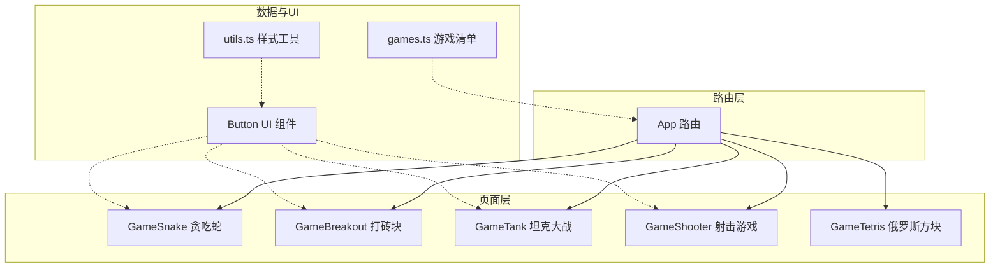
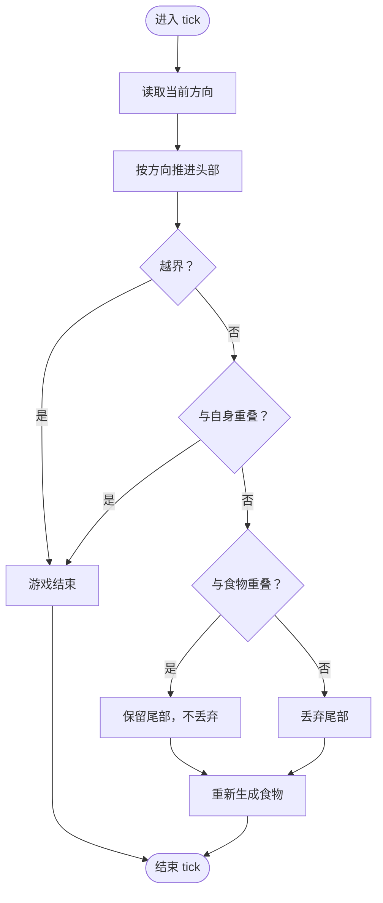
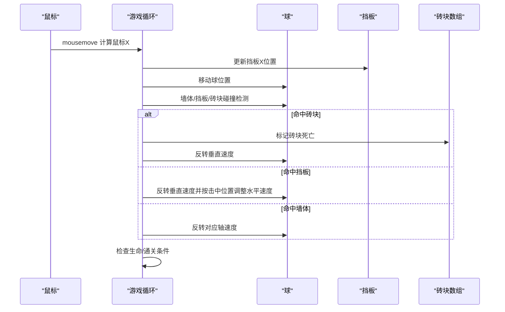
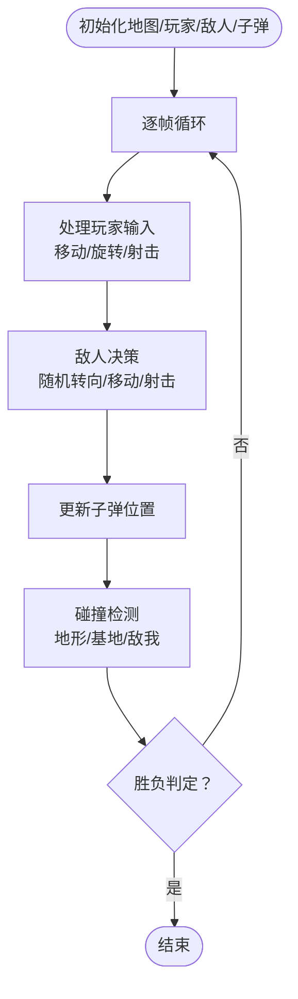
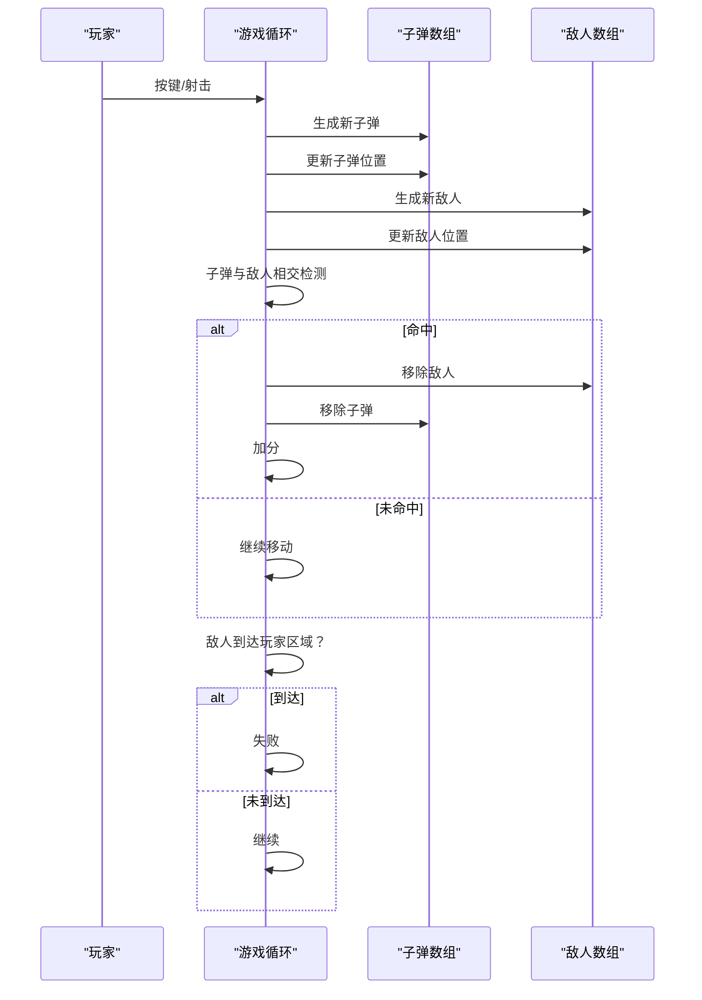
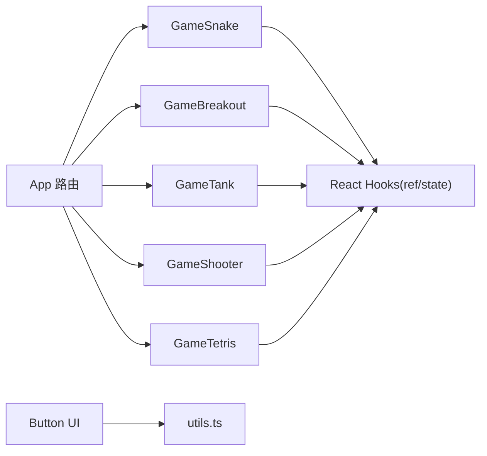

# 动作类游戏

<cite>
**本文引用的文件**
- [src/pages/GameSnake.tsx](file://src/pages/GameSnake.tsx)
- [src/pages/GameBreakout.tsx](file://src/pages/GameBreakout.tsx)
- [src/pages/GameTank.tsx](file://src/pages/GameTank.tsx)
- [src/pages/GameShooter.tsx](file://src/pages/GameShooter.tsx)
- [src/pages/GameTetris.tsx](file://src/pages/GameTetris.tsx)
- [src/App.tsx](file://src/App.tsx)
- [src/data/games.ts](file://src/data/games.ts)
- [src/components/ui/button.tsx](file://src/components/ui/button.tsx)
- [src/lib/utils.ts](file://src/lib/utils.ts)
</cite>

## 目录
1. [简介](#简介)
2. [项目结构](#项目结构)
3. [核心组件](#核心组件)
4. [架构总览](#架构总览)
5. [详细组件分析](#详细组件分析)
6. [依赖关系分析](#依赖关系分析)
7. [性能考量](#性能考量)
8. [故障排查指南](#故障排查指南)
9. [结论](#结论)
10. [附录](#附录)

## 简介
本文件面向 Rsbuild2 项目中的动作类游戏模块，围绕贪吃蛇、打砖块、坦克大战与射击游戏，系统梳理其路径规划、碰撞检测、运动控制与实时性保障等关键实现，并给出性能优化与扩展开发建议。文档同时提供可视化图示帮助非技术读者理解各游戏的运行机制。

## 项目结构
- 游戏页面集中在 src/pages 下，每个游戏以独立组件形式实现，使用 Canvas 进行渲染与交互。
- 路由在 App 中集中配置，游戏清单与分类信息在数据模块中维护。
- UI 基础组件来自 src/components/ui，样式工具函数来自 src/lib/utils。



图表来源
- [src/App.tsx](file://src/App.tsx#L18-L39)
- [src/pages/GameSnake.tsx](file://src/pages/GameSnake.tsx#L1-L215)
- [src/pages/GameBreakout.tsx](file://src/pages/GameBreakout.tsx#L1-L304)
- [src/pages/GameTank.tsx](file://src/pages/GameTank.tsx#L1-L439)
- [src/pages/GameShooter.tsx](file://src/pages/GameShooter.tsx#L1-L243)
- [src/pages/GameTetris.tsx](file://src/pages/GameTetris.tsx#L82-L311)
- [src/data/games.ts](file://src/data/games.ts#L15-L87)
- [src/components/ui/button.tsx](file://src/components/ui/button.tsx#L1-L65)
- [src/lib/utils.ts](file://src/lib/utils.ts#L1-L7)

章节来源
- [src/App.tsx](file://src/App.tsx#L18-L39)
- [src/data/games.ts](file://src/data/games.ts#L15-L87)

## 核心组件
- 贪吃蛇：基于定时器的固定步进更新，键盘输入切换方向，边界与自碰撞判定，随机放置食物。
- 打砖块：基于 requestAnimationFrame 的逐帧更新，鼠标控制挡板，球与砖块、墙体、挡板的碰撞检测，生命值与通关判定。
- 坦克大战：基于 requestAnimationFrame 的逐帧更新，键盘控制移动与射击，AI 敌方随机转向与移动，子弹与地形、基地、敌我碰撞处理。
- 射击游戏：基于 requestAnimationFrame 的逐帧更新，键盘控制移动与射击，敌人生成与碰撞检测，失败判定。
- 俄罗斯方块：基于帧计数与下落间隔的下落推进，旋转与平移碰撞检测，消行与等级提升。

章节来源
- [src/pages/GameSnake.tsx](file://src/pages/GameSnake.tsx#L13-L215)
- [src/pages/GameBreakout.tsx](file://src/pages/GameBreakout.tsx#L53-L304)
- [src/pages/GameTank.tsx](file://src/pages/GameTank.tsx#L59-L439)
- [src/pages/GameShooter.tsx](file://src/pages/GameShooter.tsx#L15-L243)
- [src/pages/GameTetris.tsx](file://src/pages/GameTetris.tsx#L82-L311)

## 架构总览
各游戏均采用“状态持有 + 请求动画帧/定时器 + 事件监听”的模式：
- 状态存储：使用 useRef 持有游戏状态，避免每次渲染都产生新对象导致重绘抖动。
- 更新循环：贪吃蛇使用 setInterval；其他游戏统一使用 requestAnimationFrame。
- 输入处理：通过键盘/鼠标事件更新状态，驱动下一帧渲染。
- 渲染：在每帧中清屏、绘制地图/角色/子弹/UI，然后请求下一帧。

```mermaid
sequenceDiagram
participant User as "用户"
participant Page as "游戏页面组件"
participant State as "状态(ref)"
participant Render as "Canvas 渲染"
participant Loop as "游戏循环"
User->>Page : 键盘/鼠标事件
Page->>State : 更新按键/鼠标位置/状态
Page->>Loop : 启动/恢复循环
Loop->>State : 读取状态并推进
Loop->>Render : 绘制背景/地图/角色/子弹
Render-->>Loop : 完成一帧
Loop-->>Page : 请求下一帧
```

图表来源
- [src/pages/GameSnake.tsx](file://src/pages/GameSnake.tsx#L52-L130)
- [src/pages/GameBreakout.tsx](file://src/pages/GameBreakout.tsx#L97-L230)
- [src/pages/GameTank.tsx](file://src/pages/GameTank.tsx#L111-L376)
- [src/pages/GameShooter.tsx](file://src/pages/GameShooter.tsx#L42-L167)

## 详细组件分析

### 贪吃蛇（路径规划、碰撞检测、运动控制）
- 路径规划与运动控制
  - 使用方向与下一方向分离，保证转向在整格处生效，避免反向直接死亡。
  - 固定步进更新，每帧根据当前方向推进头部，生成新头部并决定是否丢弃尾部。
- 碰撞检测
  - 边界检测：头部坐标越界即失败。
  - 自身碰撞：遍历身体判断与头部重叠。
  - 食物收集：头部与食物重叠时加分并重新生成食物，不丢尾。
- 食物生成
  - 使用集合记录身体坐标，随机生成不在身体上的新坐标，直到找到可用位置。



图表来源
- [src/pages/GameSnake.tsx](file://src/pages/GameSnake.tsx#L69-L96)
- [src/pages/GameSnake.tsx](file://src/pages/GameSnake.tsx#L26-L37)

章节来源
- [src/pages/GameSnake.tsx](file://src/pages/GameSnake.tsx#L13-L215)

### 打砖块（球拍控制、砖块碰撞物理、关卡设计）
- 球拍控制
  - 鼠标移动监听，计算画布缩放后的鼠标坐标，限制挡板在屏幕范围内。
  - 发射前状态管理：空格键或点击触发发射，暂停/继续切换。
- 砖块碰撞物理
  - 球与砖块的矩形相交检测，命中后标记砖块死亡并反转球垂直速度。
  - 球与墙体的边界反射，球与挡板的弹性碰撞（基于击中位置调整水平速度）。
- 关卡设计
  - 砖块网格布局，颜色按行轮换，初始状态全存活。
  - 生命值与通关判定：生命耗尽失败，所有砖块清除胜利。



图表来源
- [src/pages/GameBreakout.tsx](file://src/pages/GameBreakout.tsx#L107-L123)
- [src/pages/GameBreakout.tsx](file://src/pages/GameBreakout.tsx#L125-L192)
- [src/pages/GameBreakout.tsx](file://src/pages/GameBreakout.tsx#L36-L51)

章节来源
- [src/pages/GameBreakout.tsx](file://src/pages/GameBreakout.tsx#L53-L304)

### 坦克大战（AI 行为树、炮塔旋转机制、战斗策略）
- 玩家控制
  - 方向键控制移动，按方向旋转炮塔，冷却射击。
  - 地形碰撞：检查四个角点是否落在不可穿越区域。
- AI 敌人
  - 随机转向：每固定帧数尝试随机方向，若可通行则改变朝向。
  - 移动：在可通行方向上前进，随机概率开火。
- 炮塔旋转机制
  - 使用方向映射表计算旋转角度，绘制时以中心为原点旋转矩形。
- 战斗策略
  - 子弹与地形、基地、敌我双方的碰撞检测，命中即移除子弹并判定胜负。



图表来源
- [src/pages/GameTank.tsx](file://src/pages/GameTank.tsx#L119-L136)
- [src/pages/GameTank.tsx](file://src/pages/GameTank.tsx#L235-L261)
- [src/pages/GameTank.tsx](file://src/pages/GameTank.tsx#L263-L320)

章节来源
- [src/pages/GameTank.tsx](file://src/pages/GameTank.tsx#L59-L439)

### 射击游戏（射击控制、弹道轨迹、敌人生成）
- 射击控制
  - 空格键射击，存在冷却时间，防止连续发射。
- 弹道轨迹
  - 子弹沿固定方向移动，超出屏幕范围即回收。
- 敌人生成与碰撞
  - 固定间隔随机生成敌人，从顶部向下移动。
  - 子弹与敌人相交即消除敌人与子弹，增加分数。
  - 敌人到达玩家区域即判定失败。



图表来源
- [src/pages/GameShooter.tsx](file://src/pages/GameShooter.tsx#L65-L127)

章节来源
- [src/pages/GameShooter.tsx](file://src/pages/GameShooter.tsx#L15-L243)

### 俄罗斯方块（动作游戏共性：实时性与帧率控制）
- 实时性与帧率控制
  - 使用 dropCounter 与 dropInterval 控制下落节奏，随等级提升加速。
  - requestAnimationFrame 驱动循环，保持流畅渲染。
- 碰撞与消行
  - 碰撞检测：检查形状在网格中的占用位，越界或与已有方块重叠则不可移动。
  - 消行：扫描满行并整体上移，更新分数与等级。

章节来源
- [src/pages/GameTetris.tsx](file://src/pages/GameTetris.tsx#L82-L127)
- [src/pages/GameTetris.tsx](file://src/pages/GameTetris.tsx#L194-L233)

## 依赖关系分析
- 组件耦合
  - 各游戏页面相对独立，仅共享基础 UI 组件与工具函数。
  - 状态集中于 useRef，避免跨组件传递复杂状态。
- 外部依赖
  - React 路由用于页面导航。
  - Radix UI Button 作为通用按钮组件。
  - Tailwind 工具函数用于样式合并。



图表来源
- [src/pages/GameSnake.tsx](file://src/pages/GameSnake.tsx#L1-L20)
- [src/pages/GameBreakout.tsx](file://src/pages/GameBreakout.tsx#L1-L10)
- [src/pages/GameTank.tsx](file://src/pages/GameTank.tsx#L1-L10)
- [src/pages/GameShooter.tsx](file://src/pages/GameShooter.tsx#L1-L10)
- [src/pages/GameTetris.tsx](file://src/pages/GameTetris.tsx#L1-L20)
- [src/components/ui/button.tsx](file://src/components/ui/button.tsx#L1-L65)
- [src/lib/utils.ts](file://src/lib/utils.ts#L1-L7)
- [src/App.tsx](file://src/App.tsx#L18-L39)

章节来源
- [src/components/ui/button.tsx](file://src/components/ui/button.tsx#L1-L65)
- [src/lib/utils.ts](file://src/lib/utils.ts#L1-L7)
- [src/App.tsx](file://src/App.tsx#L18-L39)

## 性能考量
- 渲染优化
  - 使用 requestAnimationFrame 替代高频率定时器，减少掉帧风险。
  - 仅在必要时重绘，避免每帧重建大数组或重复计算。
- 物理与碰撞优化
  - 使用矩形相交检测（轴对齐包围盒），避免复杂几何运算。
  - 对于贪吃蛇与打砖块，使用集合或布尔标志快速判断可通行/存活。
- 内存管理
  - 使用 useRef 持有状态，避免闭包频繁创建新对象。
  - 及时回收超出屏幕范围的子弹与敌人，控制数组长度。
- 实时性与输入响应
  - 事件监听在组件挂载时注册，卸载时清理，避免内存泄漏。
  - 对于打砖块，使用时间步长 dt 平滑速度，避免不同帧率下的速度漂移。

章节来源
- [src/pages/GameSnake.tsx](file://src/pages/GameSnake.tsx#L52-L130)
- [src/pages/GameBreakout.tsx](file://src/pages/GameBreakout.tsx#L97-L230)
- [src/pages/GameTank.tsx](file://src/pages/GameTank.tsx#L111-L376)
- [src/pages/GameShooter.tsx](file://src/pages/GameShooter.tsx#L42-L167)
- [src/pages/GameTetris.tsx](file://src/pages/GameTetris.tsx#L194-L233)

## 故障排查指南
- 游戏无响应
  - 检查事件监听是否正确注册与注销。
  - 确认循环是否在 idle/over 状态下被阻断。
- 坦克卡墙或穿模
  - 检查角点碰撞检测是否覆盖完整坦克四角。
  - 确保移动步长不超过格子尺寸，避免跳过碰撞。
- 子弹不消失或穿透
  - 确认超出屏幕范围的子弹被过滤。
  - 检查相交检测的边界条件是否正确。
- 打砖块速度异常
  - 检查 dt 的计算与归一化，确保速度与帧率解耦。

章节来源
- [src/pages/GameTank.tsx](file://src/pages/GameTank.tsx#L119-L136)
- [src/pages/GameTank.tsx](file://src/pages/GameTank.tsx#L263-L320)
- [src/pages/GameShooter.tsx](file://src/pages/GameShooter.tsx#L81-L127)
- [src/pages/GameBreakout.tsx](file://src/pages/GameBreakout.tsx#L125-L139)

## 结论
本项目中的动作类游戏以简洁的状态机与 Canvas 渲染实现了经典玩法，具备良好的可读性与扩展性。通过统一的实时循环、清晰的碰撞检测与输入处理，为后续加入更复杂的 AI、粒子效果与关卡编辑器提供了良好基础。

## 附录
- 扩展开发建议
  - 新增动作元素：优先考虑使用统一的实体基类抽象（位置、方向、速度、生命周期），便于复用碰撞与渲染逻辑。
  - 改进游戏体验：引入音效与背景音乐、粒子爆炸、动态难度曲线、多关卡与成就系统。
  - 性能增强：对大量实体采用空间分割（如四叉树/网格）优化碰撞检测；对静态背景使用离屏 Canvas 缓存。
  - 可访问性：为键盘操作提供视觉反馈与无障碍提示，支持触屏设备的虚拟摇杆与按钮。