# 经典益智游戏

<cite>
**本文档引用的文件**
- [Game2048.tsx](file://src/pages/Game2048.tsx)
- [GameTictactoe.tsx](file://src/pages/GameTictactoe.tsx)
- [GameMemory.tsx](file://src/pages/GameMemory.tsx)
- [GameTetris.tsx](file://src/pages/GameTetris.tsx)
- [games.ts](file://src/data/games.ts)
- [categories.ts](file://src/data/categories.ts)
- [Home.tsx](file://src/pages/Home.tsx)
- [Category.tsx](file://src/pages/Category.tsx)
- [App.tsx](file://src/App.tsx)
- [utils.ts](file://src/lib/utils.ts)
</cite>

## 目录
1. [简介](#简介)
2. [项目结构](#项目结构)
3. [核心组件](#核心组件)
4. [架构概览](#架构概览)
5. [详细组件分析](#详细组件分析)
6. [依赖关系分析](#依赖关系分析)
7. [性能考虑](#性能考虑)
8. [故障排除指南](#故障排除指南)
9. [结论](#结论)
10. [扩展开发指南](#扩展开发指南)

## 简介

Rsbuild2项目是一个基于React和TypeScript构建的经典益智游戏合集。该项目包含了多种经典的益智游戏，从简单的记忆翻牌到复杂的俄罗斯方块，涵盖了不同难度级别的游戏体验。本文档将深入分析这些游戏的核心算法实现，包括网格操作、数字合并逻辑、随机生成机制和游戏状态管理。

项目采用模块化架构设计，每个游戏都是独立的React组件，通过路由系统进行组织和管理。游戏数据通过统一的数据层进行管理，支持难度分级和标签系统。

## 项目结构

项目采用清晰的文件组织结构，按照功能模块进行划分：

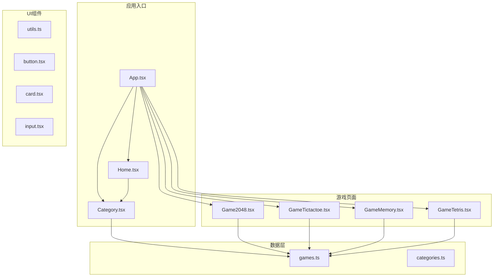

**图表来源**
- [App.tsx](file://src/App.tsx#L18-L39)
- [Home.tsx](file://src/pages/Home.tsx#L5-L40)
- [Category.tsx](file://src/pages/Category.tsx#L12-L132)

**章节来源**
- [App.tsx](file://src/App.tsx#L1-L42)
- [Home.tsx](file://src/pages/Home.tsx#L1-L43)
- [Category.tsx](file://src/pages/Category.tsx#L1-L132)

## 核心组件

### 游戏数据模型

项目使用统一的游戏数据模型来描述所有游戏：

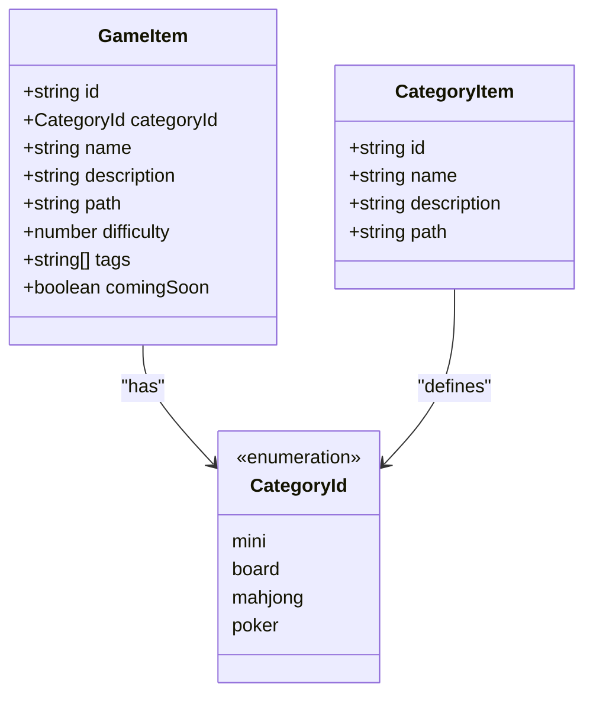

**图表来源**
- [games.ts](file://src/data/games.ts#L3-L13)
- [categories.ts](file://src/data/categories.ts#L1-L6)

### 游戏难度系统

项目实现了四级难度分级系统，从简单到困难递增：

| 难度级别 | 数值 | 描述 | 对应游戏示例 |
|---------|------|------|-------------|
| 简单 | 1 | 基础逻辑，入门级 | 猜数字、井字棋 |
| 中等 | 2 | 需要策略思考 | 记忆翻牌 |
| 困难 | 3 | 复杂策略，需要技巧 | 贪吃蛇、2048 |
| 挑战 | 4 | 高级策略，专业级 | 俄罗斯方块、飞机大战 |

**章节来源**
- [games.ts](file://src/data/games.ts#L15-L197)
- [categories.ts](file://src/data/categories.ts#L8-L33)

## 架构概览

项目采用分层架构设计，确保各组件职责清晰分离：

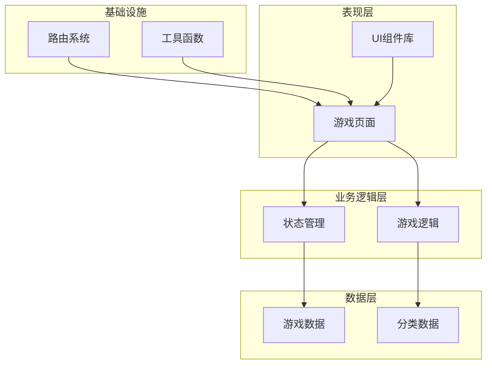

**图表来源**
- [App.tsx](file://src/App.tsx#L1-L42)
- [utils.ts](file://src/lib/utils.ts#L1-L7)

### 路由架构

应用使用React Router进行路由管理，支持嵌套路由和参数传递：

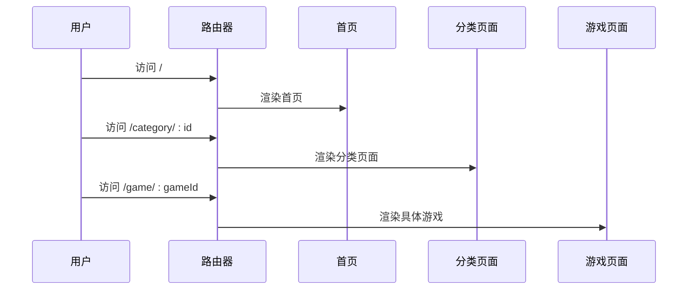

**图表来源**
- [App.tsx](file://src/App.tsx#L21-L36)

**章节来源**
- [App.tsx](file://src/App.tsx#L1-L42)

## 详细组件分析

### 俄罗斯方块（2048）游戏分析

#### 核心算法实现

俄罗斯方块（2048）游戏实现了完整的网格操作和数字合并逻辑：

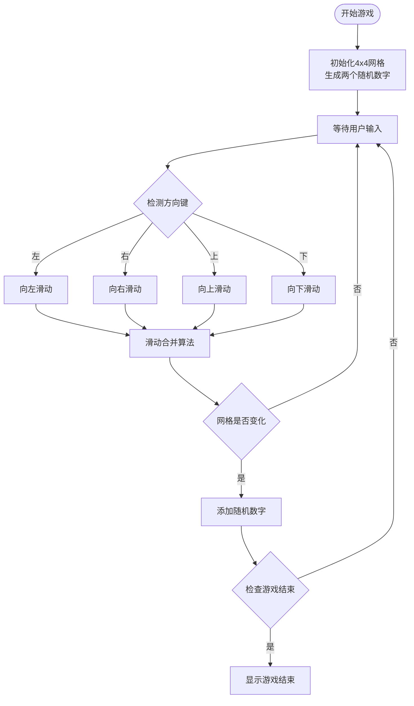

**图表来源**
- [Game2048.tsx](file://src/pages/Game2048.tsx#L101-L136)

#### 数字合并算法

数字合并算法是2048游戏的核心逻辑：

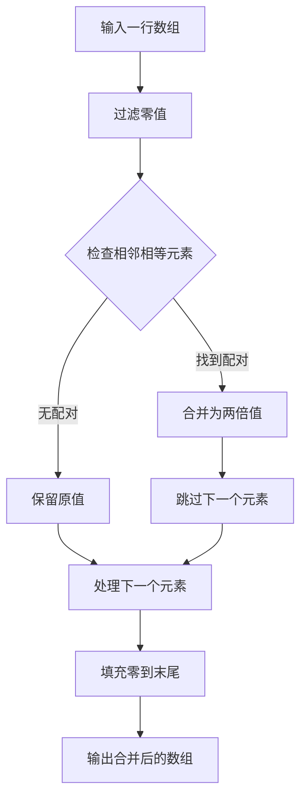

**图表来源**
- [Game2048.tsx](file://src/pages/Game2048.tsx#L24-L41)

#### 随机生成机制

游戏使用概率分布生成新数字：

| 数字 | 概率 | 颜色方案 |
|------|------|----------|
| 2 | 90% | 浅色系 |
| 4 | 10% | 深色系 |

这种设计平衡了游戏的可玩性和挑战性。

**章节来源**
- [Game2048.tsx](file://src/pages/Game2048.tsx#L1-L206)

### 井字棋（Tic Tac Toe）游戏分析

#### 获胜条件判断

井字棋实现了完整的获胜检测算法：

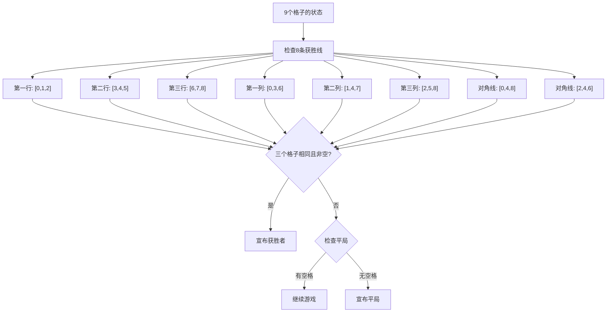

**图表来源**
- [GameTictactoe.tsx](file://src/pages/GameTictactoe.tsx#L9-L27)

#### 游戏状态管理

井字棋使用简洁的状态管理模式：

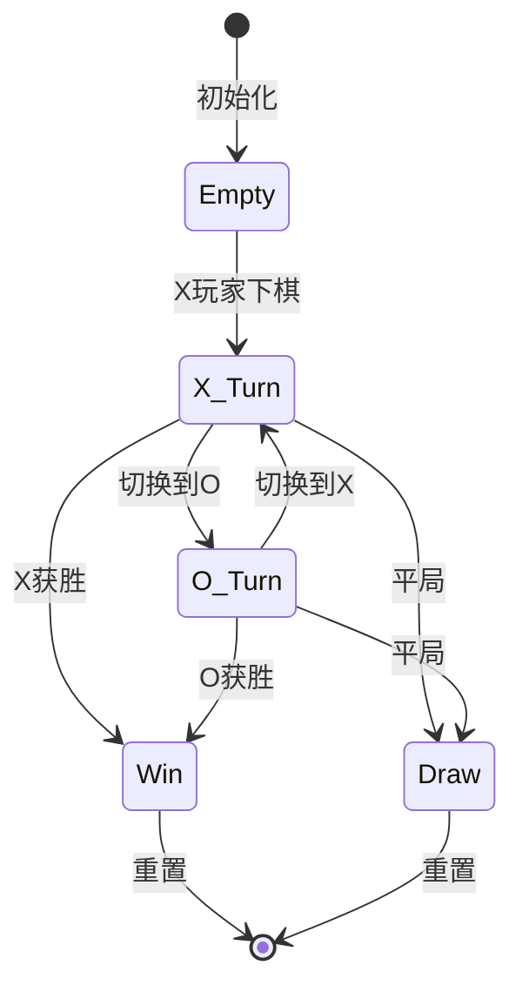

**图表来源**
- [GameTictactoe.tsx](file://src/pages/GameTictactoe.tsx#L29-L45)

**章节来源**
- [GameTictactoe.tsx](file://src/pages/GameTictactoe.tsx#L1-L92)

### 记忆游戏分析

#### 记忆匹配机制

记忆游戏实现了经典的配对消除机制：

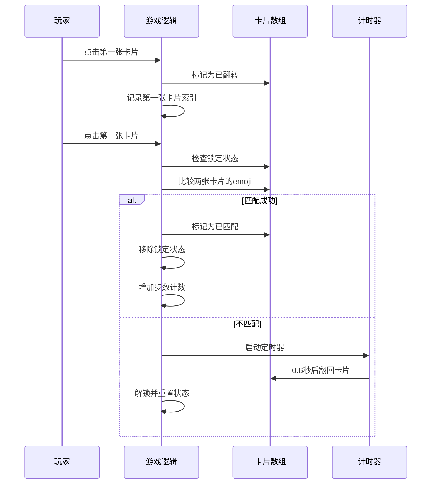

**图表来源**
- [GameMemory.tsx](file://src/pages/GameMemory.tsx#L38-L74)

#### 卡片翻转动画

游戏实现了流畅的卡片翻转动画效果：

| 动画状态 | 触发条件 | 动画效果 |
|----------|----------|----------|
| 翻转开始 | 点击未翻转卡片 | 从问号变为emoji |
| 翻转结束 | 动画完成 | 显示emoji并保持 |
| 匹配成功 | 两张卡片相同 | 保持显示状态 |
| 匹配失败 | 两张卡片不同 | 0.6秒后翻回 |

**章节来源**
- [GameMemory.tsx](file://src/pages/GameMemory.tsx#L1-L140)

### 俄罗斯方块游戏分析

#### 游戏循环系统

俄罗斯方块实现了完整的游戏循环系统：

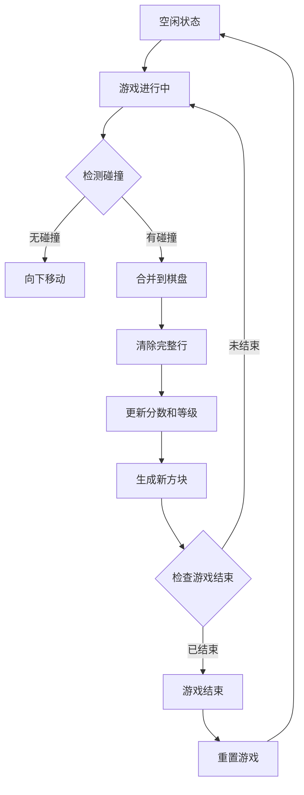

**图表来源**
- [GameTetris.tsx](file://src/pages/GameTetris.tsx#L137-L233)

#### 方块碰撞检测

碰撞检测算法确保方块不会穿透边界或其他方块：

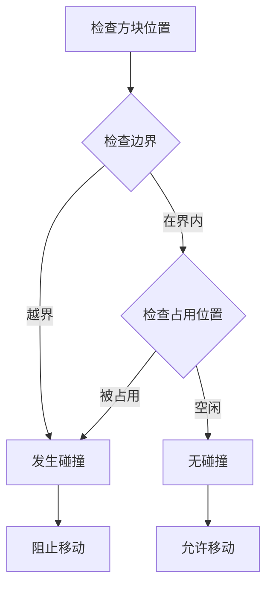

**图表来源**
- [GameTetris.tsx](file://src/pages/GameTetris.tsx#L82-L97)

**章节来源**
- [GameTetris.tsx](file://src/pages/GameTetris.tsx#L1-L358)

## 依赖关系分析

### 组件间依赖关系

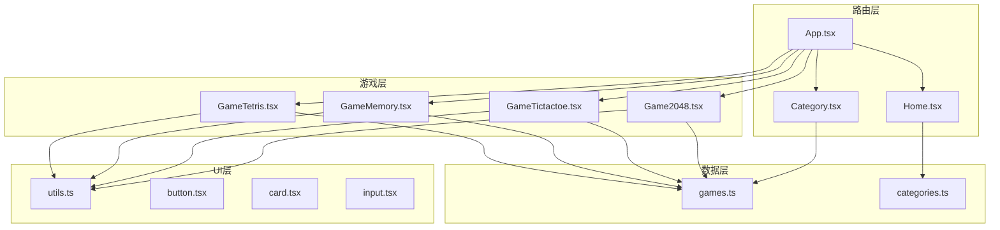

**图表来源**
- [App.tsx](file://src/App.tsx#L1-L42)
- [games.ts](file://src/data/games.ts#L1-L197)
- [categories.ts](file://src/data/categories.ts#L1-L34)

### 外部依赖分析

项目使用的主要外部依赖：

| 依赖包 | 版本 | 用途 |
|--------|------|------|
| react | 最新版本 | React框架 |
| react-router-dom | 最新版本 | 路由管理 |
| tailwindcss | 最新版本 | 样式框架 |
| clsx | 最新版本 | 类名合并 |
| tailwind-merge | 最新版本 | Tailwind样式合并 |

**章节来源**
- [App.tsx](file://src/App.tsx#L1-L42)
- [utils.ts](file://src/lib/utils.ts#L1-L7)

## 性能考虑

### 算法复杂度分析

#### 2048游戏算法复杂度

| 操作 | 时间复杂度 | 空间复杂度 | 说明 |
|------|------------|------------|------|
| 网格初始化 | O(n²) | O(n²) | n=4的固定大小 |
| 数字合并 | O(n) | O(n) | n=4的固定大小 |
| 碰撞检测 | O(n²) | O(1) | n=4的固定大小 |
| 游戏结束检查 | O(n²) | O(1) | n=4的固定大小 |

#### 记忆游戏性能优化

| 操作 | 优化策略 | 性能提升 |
|------|----------|----------|
| 卡片洗牌 | Fisher-Yates算法 | O(n)时间，原地洗牌 |
| 状态更新 | React状态优化 | 避免不必要的重渲染 |
| 动画处理 | CSS过渡动画 | GPU加速，减少JS计算 |

### 内存使用优化

1. **状态管理优化**
   - 使用useCallback缓存回调函数
   - 避免在渲染过程中创建新对象
   - 合理使用useMemo进行昂贵计算的缓存

2. **DOM操作优化**
   - 使用CSS类名切换而非直接修改样式
   - 合并多个状态更新以减少重渲染
   - 及时清理事件监听器和定时器

3. **资源管理**
   - Canvas绘图使用requestAnimationFrame
   - 合理管理游戏循环中的资源分配
   - 及时释放不再使用的内存

## 故障排除指南

### 常见问题及解决方案

#### 2048游戏问题

**问题：游戏无法移动**
- 检查canMove函数的实现
- 确认网格中是否有空位
- 验证相邻元素比较逻辑

**问题：数字合并异常**
- 检查slideAndMerge函数的合并逻辑
- 确认数组遍历顺序
- 验证分数计算的正确性

#### 记忆游戏问题

**问题：卡片无法翻转**
- 检查handleClick函数的状态更新
- 确认lock状态的正确管理
- 验证CSS类名的应用

**问题：匹配逻辑错误**
- 检查lastFlipped状态的管理
- 确认emoji比较的准确性
- 验证匹配状态的同步更新

#### 俄罗斯方块问题

**问题：方块穿透问题**
- 检查collide函数的边界检测
- 确认旋转状态的正确性
- 验证坐标转换的准确性

**问题：行清除异常**
- 检查clearLines函数的实现
- 确认行移除的正确顺序
- 验证分数计算的逻辑

**章节来源**
- [Game2048.tsx](file://src/pages/Game2048.tsx#L83-L92)
- [GameMemory.tsx](file://src/pages/GameMemory.tsx#L38-L74)
- [GameTetris.tsx](file://src/pages/GameTetris.tsx#L82-L127)

## 结论

Rsbuild2项目成功实现了多个经典益智游戏，展现了良好的软件架构设计和算法实现。每个游戏都体现了特定的算法模式和设计理念：

1. **算法模式统一性**：所有游戏都遵循相似的状态管理模式，使用React Hooks进行状态管理
2. **性能优化意识**：通过合理的算法设计和状态管理优化，确保游戏运行流畅
3. **可扩展性设计**：模块化的架构设计便于添加新的游戏类型和功能
4. **用户体验优先**：注重动画效果和交互反馈，提供良好的用户体验

项目在数据驱动的游戏设计方面表现出色，通过统一的数据模型和路由系统，实现了清晰的功能分离和良好的可维护性。

## 扩展开发指南

### 添加新游戏的基本步骤

#### 1. 创建游戏页面组件

```typescript
// 新游戏组件模板
import { useState } from 'react';

const NewGame = () => {
  const [gameState, setGameState] = useState(initialState);
  
  const handleAction = (params) => {
    // 实现游戏逻辑
  };
  
  return (
    <div>
      {/* 游戏界面 */}
    </div>
  );
};

export default NewGame;
```

#### 2. 更新路由配置

在App.tsx中添加新的路由：

```typescript
<Route path="/game/new-game" element={<NewGame />} />
```

#### 3. 注册游戏数据

在games.ts中添加游戏信息：

```typescript
{
  id: 'new-game',
  categoryId: 'mini',
  name: '新游戏',
  description: '游戏描述',
  path: '/game/new-game',
  difficulty: 1,
  tags: ['新类型', '益智'],
}
```

### 游戏算法扩展建议

#### 状态空间搜索算法

对于需要AI决策的游戏，可以考虑实现以下算法：

1. **深度优先搜索（DFS）**
   - 适用于棋类游戏的走法探索
   - 需要合理的设计启发式评估函数

2. **广度优先搜索（BFS）**
   - 适用于最短路径问题
   - 在记忆游戏中可用于最优解探索

3. **Alpha-Beta剪枝**
   - 适用于零和博弈游戏
   - 可以显著减少搜索空间

#### 启发式评估函数设计

```typescript
interface HeuristicEvaluation {
  evaluate(board: GameState): number;
  getBestMove(board: GameState): Move;
}

class GameHeuristic implements HeuristicEvaluation {
  evaluate(board: GameState): number {
    // 实现评估函数
    return score;
  }
  
  getBestMove(board: GameState): Move {
    // 实现最佳移动选择
    return bestMove;
  }
}
```

### 性能优化实践

#### 游戏循环优化

1. **使用requestAnimationFrame**
   - 确保60fps的流畅动画
   - 合理安排计算密集型任务

2. **状态更新批处理**
   - 合并多个状态更新
   - 避免频繁的重渲染

3. **内存池管理**
   - 复用对象实例
   - 及时清理不再使用的资源

#### 算法复杂度优化

1. **预计算和缓存**
   - 缓存常用计算结果
   - 使用memoization技术

2. **数据结构优化**
   - 选择合适的数据结构
   - 优化查找和更新操作

3. **并行计算**
   - 利用Web Workers处理复杂计算
   - 避免阻塞主线程

### 用户体验增强

#### 动画和视觉效果

1. **流畅的过渡动画**
   - 使用CSS3 transform属性
   - 合理设置动画持续时间和缓动函数

2. **响应式设计**
   - 支持不同屏幕尺寸
   - 适配移动端触摸操作

3. **无障碍访问**
   - 支持键盘导航
   - 提供屏幕阅读器支持

#### 游戏平衡性调整

1. **难度曲线设计**
   - 合理的渐进式难度提升
   - 多样化的挑战方式

2. **奖励系统设计**
   - 合理的分数计算
   - 成就系统的激励作用

3. **反馈机制优化**
   - 即时的操作反馈
   - 清晰的结果提示

通过遵循这些开发指南和最佳实践，开发者可以轻松地为Rsbuild2项目添加新的经典益智游戏，同时保持项目的高质量和良好性能。