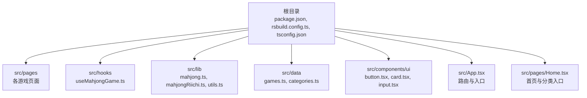
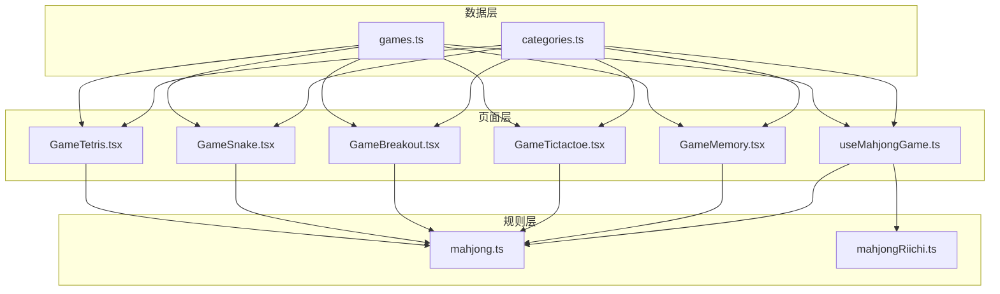
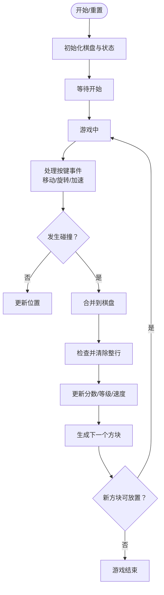
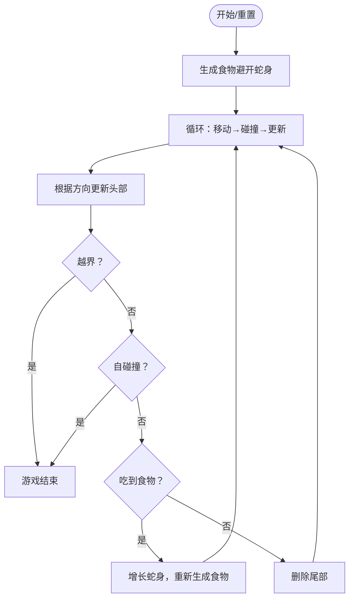
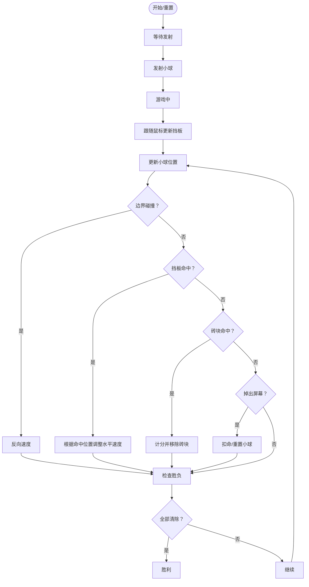
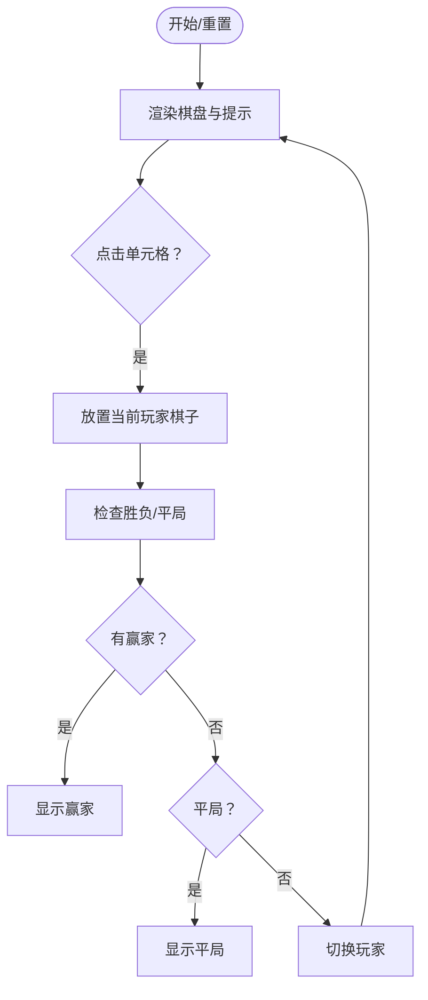
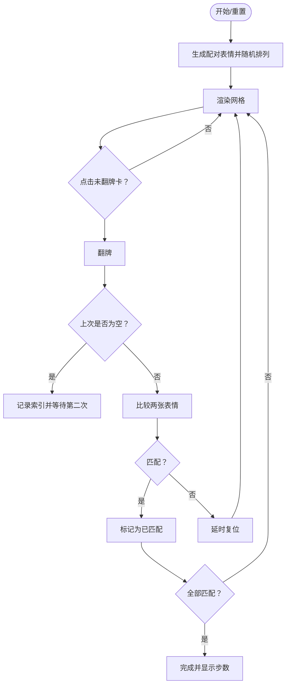
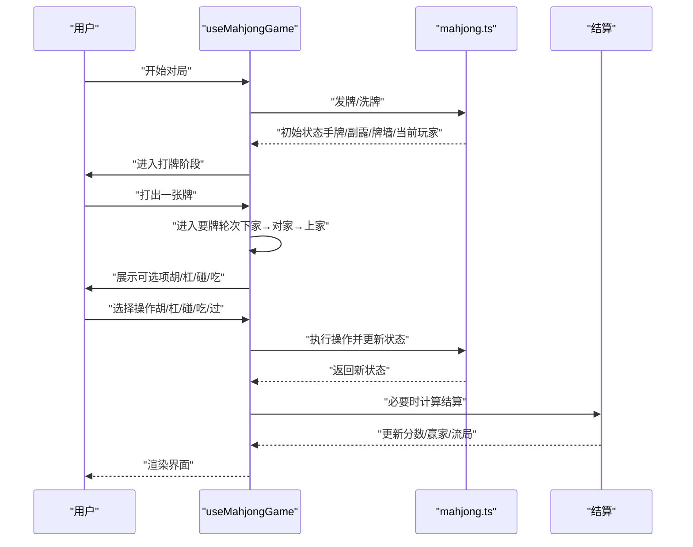
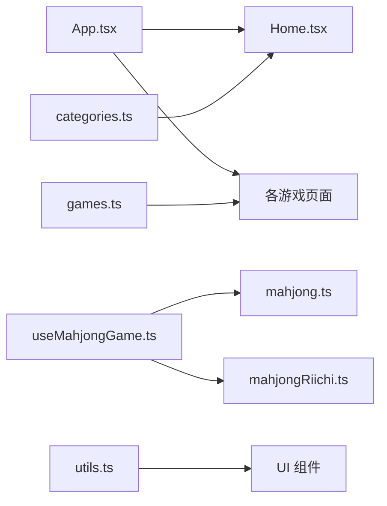

# 游戏系统

<cite>
**本文引用的文件**
- [README.md](file://README.md)
- [package.json](file://package.json)
- [src/App.tsx](file://src/App.tsx)
- [src/data/games.ts](file://src/data/games.ts)
- [src/data/categories.ts](file://src/data/categories.ts)
- [src/pages/Home.tsx](file://src/pages/Home.tsx)
- [src/pages/GameTetris.tsx](file://src/pages/GameTetris.tsx)
- [src/pages/GameSnake.tsx](file://src/pages/GameSnake.tsx)
- [src/pages/GameBreakout.tsx](file://src/pages/GameBreakout.tsx)
- [src/pages/GameTictactoe.tsx](file://src/pages/GameTictactoe.tsx)
- [src/pages/GameMemory.tsx](file://src/pages/GameMemory.tsx)
- [src/hooks/useMahjongGame.ts](file://src/hooks/useMahjongGame.ts)
- [src/lib/mahjong.ts](file://src/lib/mahjong.ts)
- [src/lib/mahjongRiichi.ts](file://src/lib/mahjongRiichi.ts)
- [src/lib/utils.ts](file://src/lib/utils.ts)
</cite>

## 目录
1. [简介](#简介)
2. [项目结构](#项目结构)
3. [核心组件](#核心组件)
4. [架构总览](#架构总览)
5. [详细组件分析](#详细组件分析)
6. [依赖关系分析](#依赖关系分析)
7. [性能考量](#性能考量)
8. [故障排查指南](#故障排查指南)
9. [结论](#结论)
10. [附录](#附录)

## 简介
本项目为 Rsbuild2 游戏合集应用，提供多种经典小游戏与麻将玩法，涵盖休闲益智、动作竞技与策略对局。系统采用 React + Canvas 的前端架构，结合路由组织页面与数据驱动的游戏状态管理。文档将围绕以下目标展开：
- 全面介绍项目包含的游戏类型与核心玩法
- 解释规则实现与用户交互设计
- 阐述游戏状态管理机制，尤其是麻将游戏的复杂逻辑
- 总结性能优化策略与响应式设计要点
- 提供扩展新游戏与测试调试的方法

## 项目结构
项目采用按页面与功能模块划分的目录结构，核心路径如下：
- src/pages：各游戏页面组件（如俄罗斯方块、贪吃蛇、打砖块、井字棋、记忆游戏、麻将等）
- src/hooks：游戏逻辑钩子（如 useMahjongGame）
- src/lib：通用算法与规则库（如麻将规则、日式立直规则）
- src/data：游戏与分类数据定义
- src/components/ui：UI 组件（按钮、卡片、输入框等）
- 根目录配置：构建脚本、依赖与测试配置

图表来源
- [src/App.tsx](file://src/App.tsx#L1-L42)
- [src/pages/Home.tsx](file://src/pages/Home.tsx#L1-L43)
- [src/data/games.ts](file://src/data/games.ts#L1-L197)
- [src/data/categories.ts](file://src/data/categories.ts#L1-L34)

章节来源
- [README.md](file://README.md#L1-L37)
- [package.json](file://package.json#L1-L43)
- [src/App.tsx](file://src/App.tsx#L1-L42)
- [src/pages/Home.tsx](file://src/pages/Home.tsx#L1-L43)

## 核心组件
- 游戏路由与入口：通过 React Router 在 App 中注册各游戏页面路由，支持从首页分类导航进入。
- 数据层：games.ts 定义游戏清单与难度标签；categories.ts 定义分类信息。
- 麻将钩子：useMahjongGame.ts 提供四人麻将对局的状态管理、要牌轮次处理、AI 决策与结算。
- 麻将规则库：mahjong.ts 实现中国通用麻将规则（牌型、吃碰杠、听牌、番种、结算）；mahjongRiichi.ts 实现日式立直麻将规则（含宝牌、役种、点数计算）。
- UI 工具：utils.ts 提供类名合并工具，配合 TailwindCSS 实现样式管理。

章节来源
- [src/App.tsx](file://src/App.tsx#L1-L42)
- [src/data/games.ts](file://src/data/games.ts#L1-L197)
- [src/data/categories.ts](file://src/data/categories.ts#L1-L34)
- [src/hooks/useMahjongGame.ts](file://src/hooks/useMahjongGame.ts#L1-L866)
- [src/lib/mahjong.ts](file://src/lib/mahjong.ts#L1-L494)
- [src/lib/mahjongRiichi.ts](file://src/lib/mahjongRiichi.ts#L1-L632)
- [src/lib/utils.ts](file://src/lib/utils.ts#L1-L7)

## 架构总览
系统采用“页面组件 + 规则库 + 钩子”的分层架构：
- 页面组件负责用户交互与渲染（Canvas 或 DOM）
- 规则库提供纯函数式的规则判断与计算
- 钩子封装复杂状态流转与 AI 决策
- 数据层提供静态配置与动态状态

图表来源
- [src/pages/GameTetris.tsx](file://src/pages/GameTetris.tsx#L1-L358)
- [src/pages/GameSnake.tsx](file://src/pages/GameSnake.tsx#L1-L215)
- [src/pages/GameBreakout.tsx](file://src/pages/GameBreakout.tsx#L1-L304)
- [src/pages/GameTictactoe.tsx](file://src/pages/GameTictactoe.tsx#L1-L92)
- [src/pages/GameMemory.tsx](file://src/pages/GameMemory.tsx#L1-L140)
- [src/hooks/useMahjongGame.ts](file://src/hooks/useMahjongGame.ts#L1-L866)
- [src/lib/mahjong.ts](file://src/lib/mahjong.ts#L1-L494)
- [src/lib/mahjongRiichi.ts](file://src/lib/mahjongRiichi.ts#L1-L632)
- [src/data/games.ts](file://src/data/games.ts#L1-L197)
- [src/data/categories.ts](file://src/data/categories.ts#L1-L34)

## 详细组件分析

### 俄罗斯方块（Tetris）
- 核心玩法：控制不同形状的方块下落，消除完整行获得分数，等级越高下落速度越快。
- 关键实现：
  - 使用 Canvas 绘制网格与方块
  - 状态管理：棋盘、当前方块、旋转状态、下一块、掉落计时器与等级
  - 交互：键盘控制移动、旋转、加速与一键落地
  - 规则：碰撞检测、行清除、等级提升与速度上限
- 用户交互：开始/暂停、重开、分数与等级实时显示

图表来源
- [src/pages/GameTetris.tsx](file://src/pages/GameTetris.tsx#L1-L358)

章节来源
- [src/pages/GameTetris.tsx](file://src/pages/GameTetris.tsx#L1-L358)

### 贪吃蛇（Snake）
- 核心玩法：控制蛇头移动，吃到食物增长身体，撞墙或撞到自身即结束。
- 关键实现：
  - 使用 Canvas 绘制网格、蛇身与食物
  - 状态管理：蛇身坐标序列、方向、下一方向、食物位置
  - 规则：边界检测、自碰撞检测、食物生成不与蛇身重叠
- 用户交互：方向键控制、开始/重开

图表来源
- [src/pages/GameSnake.tsx](file://src/pages/GameSnake.tsx#L1-L215)

章节来源
- [src/pages/GameSnake.tsx](file://src/pages/GameSnake.tsx#L1-L215)

### 打砖块（Breakout）
- 核心玩法：使用挡板反弹小球，击碎所有砖块获胜，失败条件为生命值耗尽。
- 关键实现：
  - 使用 Canvas 绘制挡板、小球与多行彩色砖块
  - 状态管理：挡板位置、小球速度与位置、砖块存活状态
  - 规则：边界反弹、挡板命中角度影响水平速度、砖块命中计分
- 用户交互：鼠标控制挡板、空格发射/暂停、点击发射

图表来源
- [src/pages/GameBreakout.tsx](file://src/pages/GameBreakout.tsx#L1-L304)

章节来源
- [src/pages/GameBreakout.tsx](file://src/pages/GameBreakout.tsx#L1-L304)

### 井字棋（Tic-Tac-Toe）
- 核心玩法：3×3 棋盘，双方轮流落子，先连成一线者获胜。
- 关键实现：
  - 状态管理：9 个单元格状态与当前玩家
  - 胜负判定：检查 8 条连线与平局
- 用户交互：点击单元格落子、重开与返回

图表来源
- [src/pages/GameTictactoe.tsx](file://src/pages/GameTictactoe.tsx#L1-L92)

章节来源
- [src/pages/GameTictactoe.tsx](file://src/pages/GameTictactoe.tsx#L1-L92)

### 记忆游戏（Memory）
- 核心玩法：网格中随机分布表情包，翻开两张匹配即得分，用最少步数完成全部配对。
- 关键实现：
  - 状态管理：卡牌翻转状态、匹配状态、步数与锁定状态
  - 逻辑：点击翻牌、配对成功标记、不匹配延时复位
- 用户交互：点击卡片、重开与返回

图表来源
- [src/pages/GameMemory.tsx](file://src/pages/GameMemory.tsx#L1-L140)

章节来源
- [src/pages/GameMemory.tsx](file://src/pages/GameMemory.tsx#L1-L140)

### 麻将游戏（中国通用与日本立直）
- 中国通用麻将（四人对局）：
  - 核心规则：牌型（顺/碰/明杠/暗杠/加杠）、听牌、番种（对对胡、清一色、混一色、门清、自摸、杠上开花、海底捞月等）、结算（自摸 3 家付/点炮 1 家付 + 杠分）
  - 状态管理：手牌、副露、弃牌堆、牌墙、当前玩家、阶段（摸牌/打牌/要牌轮）、要牌轮次（胡/杠/碰/吃顺序）、赢家、分数、杠记录、最后结果
  - AI 决策：吃/碰/杠概率、舍牌优先级（孤张字牌/幺九/中张、防守/听牌只打熟张）
- 日本立直麻将（四人对局）：
  - 核心规则：宝牌（指示牌下一张）、役种（立直、门前清自摸、断幺九、役牌、平和、一发、岭上开花、抢杠、海底摸月、河底捞鱼、七对子、对对和、三暗刻、三杠子、一气通贯、混老头、小三元、两杯口、混一色、清一色等）、符与番计算、点数公式
  - 状态管理：手牌、副露、宝牌、振听状态、立直状态、自摸/荣和判定、杠数统计
  - 计分：符×2^(番+2)×倍率（子家 1，亲家 1.5），满贯以上按档位

图表来源
- [src/hooks/useMahjongGame.ts](file://src/hooks/useMahjongGame.ts#L209-L535)
- [src/lib/mahjong.ts](file://src/lib/mahjong.ts#L416-L494)

章节来源
- [src/hooks/useMahjongGame.ts](file://src/hooks/useMahjongGame.ts#L1-L866)
- [src/lib/mahjong.ts](file://src/lib/mahjong.ts#L1-L494)
- [src/lib/mahjongRiichi.ts](file://src/lib/mahjongRiichi.ts#L1-L632)

## 依赖关系分析
- 路由与页面：App.tsx 注册各游戏路由，Home.tsx 提供分类入口
- 数据与分类：games.ts 提供游戏清单，categories.ts 提供分类清单
- 麻将规则：useMahjongGame.ts 依赖 mahjong.ts 与 mahjongRiichi.ts
- UI 工具：utils.ts 提供类名合并

图表来源
- [src/App.tsx](file://src/App.tsx#L1-L42)
- [src/pages/Home.tsx](file://src/pages/Home.tsx#L1-L43)
- [src/data/games.ts](file://src/data/games.ts#L1-L197)
- [src/data/categories.ts](file://src/data/categories.ts#L1-L34)
- [src/hooks/useMahjongGame.ts](file://src/hooks/useMahjongGame.ts#L1-L866)
- [src/lib/mahjong.ts](file://src/lib/mahjong.ts#L1-L494)
- [src/lib/mahjongRiichi.ts](file://src/lib/mahjongRiichi.ts#L1-L632)
- [src/lib/utils.ts](file://src/lib/utils.ts#L1-L7)

章节来源
- [src/App.tsx](file://src/App.tsx#L1-L42)
- [src/pages/Home.tsx](file://src/pages/Home.tsx#L1-L43)
- [src/data/games.ts](file://src/data/games.ts#L1-L197)
- [src/data/categories.ts](file://src/data/categories.ts#L1-L34)
- [src/hooks/useMahjongGame.ts](file://src/hooks/useMahjongGame.ts#L1-L866)
- [src/lib/mahjong.ts](file://src/lib/mahjong.ts#L1-L494)
- [src/lib/mahjongRiichi.ts](file://src/lib/mahjongRiichi.ts#L1-L632)
- [src/lib/utils.ts](file://src/lib/utils.ts#L1-L7)

## 性能考量
- 动画与渲染
  - 使用 requestAnimationFrame 控制游戏循环，减少不必要的重绘
  - Canvas 渲染优先于频繁 DOM 更新，降低布局抖动
- 状态更新
  - 使用不可变更新策略（复制数组/对象）避免深层引用问题
  - 将高频计算（如麻将番种、听牌检测）限制在必要时机触发
- 输入处理
  - 键盘与鼠标事件统一在组件生命周期内注册/清理，防止内存泄漏
- 响应式设计
  - 使用相对单位与最大宽度约束，确保在不同设备上保持良好体验
  - Canvas 尺寸随容器变化，避免超出视口

[本节为通用指导，无需列出章节来源]

## 故障排查指南
- 游戏无法启动
  - 检查路由配置与页面导入是否正确
  - 确认依赖安装与构建脚本可用
- 交互异常
  - 核查事件监听是否在渲染后注册并在卸载时清理
  - 检查状态更新是否遵循不可变原则
- 麻将逻辑错误
  - 核对吃/碰/杠/胡的判定顺序与参数传递
  - 检查要牌轮次推进与 AI 决策分支
- 计分异常
  - 核对番种累加与自摸/点炮支付逻辑
  - 检查杠分与流局结算

章节来源
- [src/App.tsx](file://src/App.tsx#L1-L42)
- [src/pages/GameTetris.tsx](file://src/pages/GameTetris.tsx#L129-L233)
- [src/pages/GameSnake.tsx](file://src/pages/GameSnake.tsx#L61-L130)
- [src/pages/GameBreakout.tsx](file://src/pages/GameBreakout.tsx#L97-L230)
- [src/hooks/useMahjongGame.ts](file://src/hooks/useMahjongGame.ts#L541-L732)
- [src/lib/mahjong.ts](file://src/lib/mahjong.ts#L450-L491)

## 结论
本项目以清晰的模块化结构实现了多样化的游戏体验，尤其在麻将系统的规则抽象与状态管理方面具备较高复杂度与可扩展性。通过 Canvas 与 React 的结合，既保证了流畅的交互体验，也便于后续新增游戏与优化性能。

[本节为总结性内容，无需列出章节来源]

## 附录

### 游戏清单与分类
- 分类：小游戏、棋类、扑克、麻将
- 游戏：猜数字、井字棋、记忆翻牌、2048、贪吃蛇、打砖块、飞机大战、坦克大战、俄罗斯方块、中国通用麻将、日本麻将（规则页开放）

章节来源
- [src/data/categories.ts](file://src/data/categories.ts#L1-L34)
- [src/data/games.ts](file://src/data/games.ts#L1-L197)

### 扩展新游戏指南
- 新增页面组件：在 src/pages 下创建新文件，导出默认组件并注册路由
- 状态管理：对于复杂逻辑使用自定义 Hook（参考 useMahjongGame.ts）
- 规则实现：将纯函数规则放入 src/lib，保持与 UI 解耦
- 数据集成：在 games.ts 中添加新游戏项，设置分类、难度与标签
- UI 适配：使用现有 UI 组件与工具类（cn）保持一致风格

章节来源
- [src/App.tsx](file://src/App.tsx#L1-L42)
- [src/data/games.ts](file://src/data/games.ts#L1-L197)
- [src/lib/utils.ts](file://src/lib/utils.ts#L1-L7)

### 测试策略与调试方法
- 单元测试：基于 @rstest 与 @testing-library，针对规则函数与状态逻辑编写用例
- 集成测试：模拟用户交互（键盘/鼠标），验证渲染与状态变更
- 调试建议：利用浏览器开发者工具检查事件绑定、Canvas 帧率与状态快照

章节来源
- [package.json](file://package.json#L12-L13)