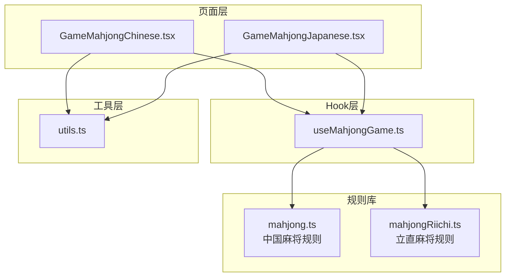
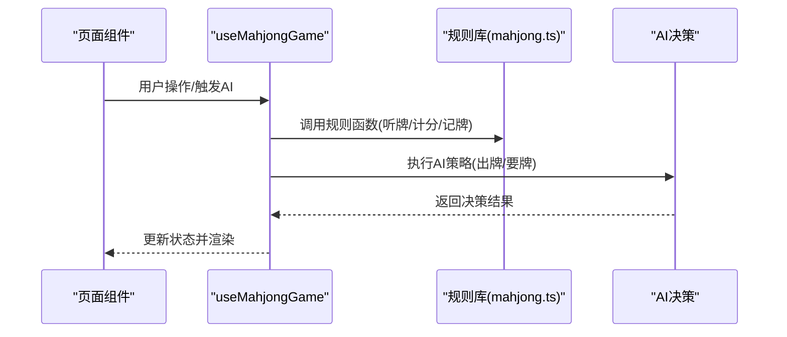
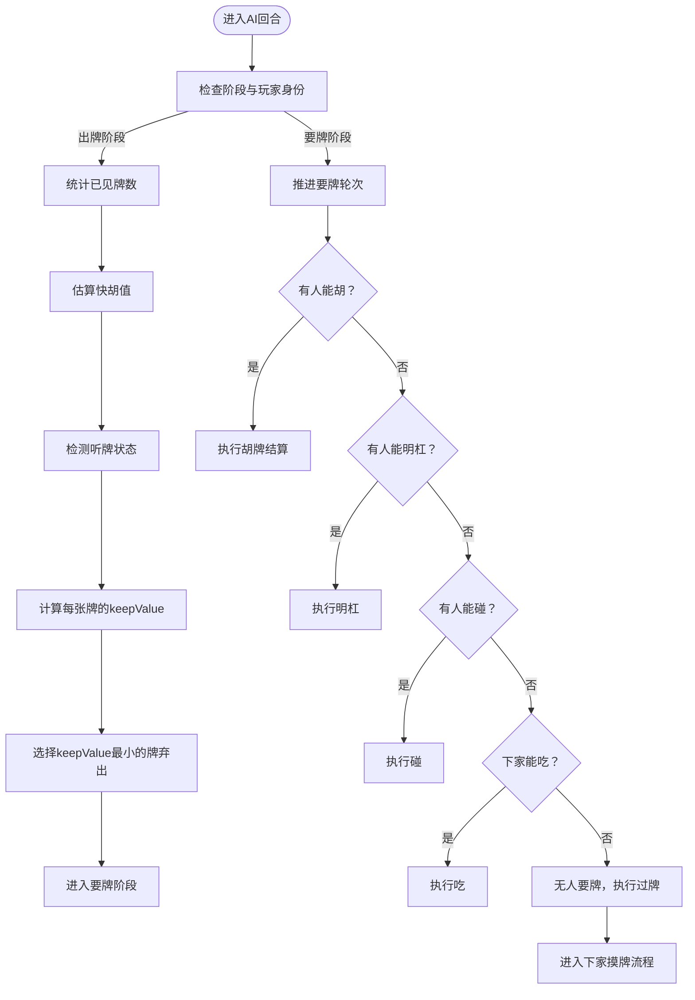
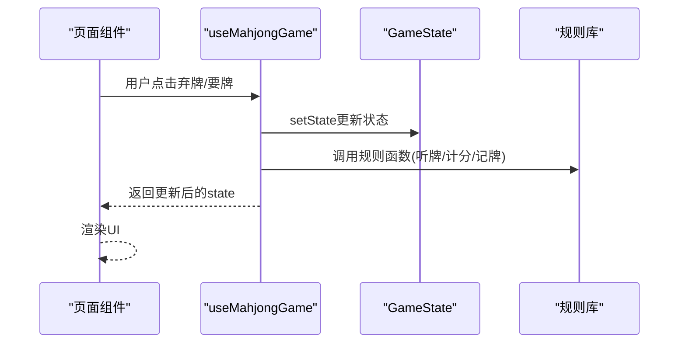
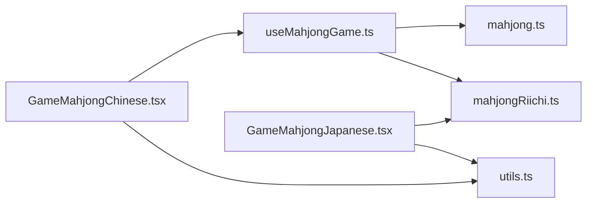

# 麻将AI对手系统

<cite>
**本文引用的文件**
- [useMahjongGame.ts](file://src/hooks/useMahjongGame.ts)
- [mahjong.ts](file://src/lib/mahjong.ts)
- [mahjongRiichi.ts](file://src/lib/mahjongRiichi.ts)
- [GameMahjongChinese.tsx](file://src/pages/GameMahjongChinese.tsx)
- [GameMahjongJapanese.tsx](file://src/pages/GameMahjongJapanese.tsx)
- [utils.ts](file://src/lib/utils.ts)
- [README.md](file://README.md)
- [AGENTS.md](file://AGENTS.md)
</cite>

## 目录
1. [简介](#简介)
2. [项目结构](#项目结构)
3. [核心组件](#核心组件)
4. [架构概览](#架构概览)
5. [详细组件分析](#详细组件分析)
6. [依赖关系分析](#依赖关系分析)
7. [性能考量](#性能考量)
8. [故障排查指南](#故障排查指南)
9. [结论](#结论)
10. [附录](#附录)

## 简介
本文件面向Rsbuild2项目的麻将AI对手系统，系统支持中国麻将与日本立直麻将两种玩法。本文重点围绕useMahjongGame Hook中的AI逻辑实现进行深入解析，涵盖AI策略设计、牌理计算、出牌决策、要牌选择、状态更新机制与事件处理流程。同时阐述AI对手的难度级别、策略优先级、风险评估算法，解释AI的记牌功能、熟张/生张判断、听牌概率计算，并给出性能优化策略、决策时间控制与用户体验平衡建议，最后提供扩展指南，说明如何添加新的AI策略、调整难度级别与改进决策算法。

## 项目结构
项目采用React + TypeScript构建，核心代码位于src目录：
- hooks：游戏逻辑与AI状态管理，useMahjongGame为核心Hook
- lib：麻将规则与工具函数，包含中国麻将与立直麻将规则库
- pages：页面组件，GameMahjongChinese.tsx与GameMahjongJapanese.tsx分别承载两种玩法
- lib/utils.ts：UI辅助工具函数
- README.md与AGENTS.md：项目说明与开发命令

图表来源
- [GameMahjongChinese.tsx](file://src/pages/GameMahjongChinese.tsx#L121-L151)
- [GameMahjongJapanese.tsx](file://src/pages/GameMahjongJapanese.tsx#L163-L179)
- [useMahjongGame.ts](file://src/hooks/useMahjongGame.ts#L219-L249)
- [mahjong.ts](file://src/lib/mahjong.ts#L33-L58)
- [mahjongRiichi.ts](file://src/lib/mahjongRiichi.ts#L55-L84)
- [utils.ts](file://src/lib/utils.ts#L4-L6)

章节来源
- [README.md](file://README.md#L1-L37)
- [AGENTS.md](file://AGENTS.md#L1-L29)

## 核心组件
- useMahjongGame：集中管理游戏状态、AI决策、事件处理与状态更新
- mahjong.ts：中国麻将规则与工具函数（牌型、听牌、计分、记牌等）
- mahjongRiichi.ts：立直麻将规则与役种计算（含宝牌、门清、自摸、断幺九等）
- GameMahjongChinese.tsx：中国麻将页面，绑定AI决策与用户交互
- GameMahjongJapanese.tsx：立直麻将页面，独立AI逻辑与役种判定

章节来源
- [useMahjongGame.ts](file://src/hooks/useMahjongGame.ts#L219-L875)
- [mahjong.ts](file://src/lib/mahjong.ts#L484-L562)
- [mahjongRiichi.ts](file://src/lib/mahjongRiichi.ts#L86-L134)
- [GameMahjongChinese.tsx](file://src/pages/GameMahjongChinese.tsx#L121-L151)
- [GameMahjongJapanese.tsx](file://src/pages/GameMahjongJapanese.tsx#L163-L179)

## 架构概览
useMahjongGame负责：
- 初始化游戏状态与发牌
- 处理出牌阶段与要牌阶段的状态流转
- AI在出牌阶段的记牌与舍牌策略
- AI在要牌阶段的胡/杠/碰/吃决策
- 结算与局终处理

图表来源
- [useMahjongGame.ts](file://src/hooks/useMahjongGame.ts#L219-L875)
- [mahjong.ts](file://src/lib/mahjong.ts#L285-L306)

## 详细组件分析

### useMahjongGame Hook中的AI逻辑实现
- 出牌阶段AI策略
  - 记牌：通过getTileCountsSeen统计已出现牌数，用于熟张/生张判断
  - 听牌检测：遍历手牌，判断弃一后是否听牌
  - 舍牌评分：strategyKeepValue综合同牌数、相邻牌数、字牌、幺九、防守模式、听牌模式等
  - 决策：选择keepValue最小的牌弃出，偏向保留熟张与听牌牌型
- 要牌阶段AI决策
  - 要牌轮次顺序：胡 > 杠 > 碰 > 吃，按顺序轮询三家（下家→对家→上家），吃仅下家
  - 胡：checkWin判断是否能胡
  - 明杠：canMingang判断，aiWantsGang按面子数与残局/庄家保守度决定
  - 碰：canPeng判断，aiWantsPeng按面子数、对子数与残局/庄家保守度决定
  - 吃：aiChooseChi基于scoreChiOption评分选择最优顺子组合
  - 过牌：无人要牌时applyPassState处理下家摸牌与流局/自摸判定

图表来源
- [useMahjongGame.ts](file://src/hooks/useMahjongGame.ts#L798-L843)
- [useMahjongGame.ts](file://src/hooks/useMahjongGame.ts#L551-L742)
- [useMahjongGame.ts](file://src/hooks/useMahjongGame.ts#L129-L169)

章节来源
- [useMahjongGame.ts](file://src/hooks/useMahjongGame.ts#L751-L795)
- [useMahjongGame.ts](file://src/hooks/useMahjongGame.ts#L798-L843)
- [useMahjongGame.ts](file://src/hooks/useMahjongGame.ts#L551-L742)
- [useMahjongGame.ts](file://src/hooks/useMahjongGame.ts#L129-L169)

### 状态更新机制与事件处理流程
- 状态初始化：startGame创建初始GameState，包含手牌、副露、弃牌堆、牌墙、当前玩家、阶段、赢家等
- 出牌事件：discard将指定索引牌从手牌移除并加入弃牌堆，切换到要牌阶段
- 要牌事件：passClaim推进要牌轮次，doHu/doPeng/doGang/doChi执行对应动作，runAiClaim在AI回合自动决策
- 结算：computeSettlement根据赢家与杠牌记录计算收支与新分数，更新lastSettlement

图表来源
- [useMahjongGame.ts](file://src/hooks/useMahjongGame.ts#L219-L545)
- [mahjong.ts](file://src/lib/mahjong.ts#L519-L559)

章节来源
- [useMahjongGame.ts](file://src/hooks/useMahjongGame.ts#L219-L545)
- [mahjong.ts](file://src/lib/mahjong.ts#L519-L559)

### AI策略设计与难度级别
- 面子数与对子数影响：aiWantsGang/aiWantsPeng基于面子数与对子数动态调整概率
- 残局与庄家保守度：deck长度小于阈值或当前玩家为庄家时降低进攻概率
- 吃法评分：scoreChiOption综合顺子类型与手牌连贯性，嵌张优于边张，两面优于嵌张
- 听牌优先：strategyKeepValue在听牌状态下优先保留熟张，避免生张导致听牌失效
- 风险评估：estimateKuaiHuValue估算快胡值，高快胡值时偏向防守

章节来源
- [useMahjongGame.ts](file://src/hooks/useMahjongGame.ts#L76-L107)
- [useMahjongGame.ts](file://src/hooks/useMahjongGame.ts#L174-L200)
- [useMahjongGame.ts](file://src/hooks/useMahjongGame.ts#L316-L334)
- [useMahjongGame.ts](file://src/hooks/useMahjongGame.ts#L798-L843)
- [mahjong.ts](file://src/lib/mahjong.ts#L316-L335)

### 记牌功能与熟张/生张判断
- 记牌：getTileCountsSeen汇总弃牌堆与副露中的牌数，用于熟张/生张判断
- 生张：seen计数<2，AI倾向于保留或避免打出
- 熟张：seen计数≥2，AI更愿意弃出
- 听牌模式：听牌状态下强制保留熟张，避免生张导致听牌落空

章节来源
- [mahjong.ts](file://src/lib/mahjong.ts#L285-L296)
- [useMahjongGame.ts](file://src/hooks/useMahjongGame.ts#L798-L843)

### 听牌概率计算
- 听牌检测：getWaitingTiles枚举13张手牌+副露，逐个测试弃一后是否能胡，返回等待张列表
- 听牌状态：遍历手牌，若弃一后存在等待张则标记听牌
- 听牌优先：strategyKeepValue在isTingPai为真时对生张额外惩罚

章节来源
- [mahjong.ts](file://src/lib/mahjong.ts#L299-L306)
- [useMahjongGame.ts](file://src/hooks/useMahjongGame.ts#L808-L815)

### 中国麻将与立直麻将的差异
- 中国麻将：使用mahjong.ts，支持七小对、龙七对、十三幺等特殊牌型，计分基于番种叠加
- 立直麻将：使用mahjongRiichi.ts，支持断幺九、役牌、门清、清一色、混一色等役种，计算点数与倍率
- 页面绑定：GameMahjongChinese.tsx绑定useMahjongGame，GameMahjongJapanese.tsx独立实现AI与役种判定

章节来源
- [mahjong.ts](file://src/lib/mahjong.ts#L136-L151)
- [mahjong.ts](file://src/lib/mahjong.ts#L449-L482)
- [mahjongRiichi.ts](file://src/lib/mahjongRiichi.ts#L284-L487)
- [GameMahjongChinese.tsx](file://src/pages/GameMahjongChinese.tsx#L121-L151)
- [GameMahjongJapanese.tsx](file://src/pages/GameMahjongJapanese.tsx#L163-L179)

## 依赖关系分析
useMahjongGame依赖mahjong.ts提供的规则函数，如：
- 牌理与听牌：checkWin、getWaitingTiles
- 记牌：getTileCountsSeen
- 快胡值：estimateKuaiHuValue
- 要牌判定：getChiOptions、canPeng、canMingang、getJiagangOptions
- 结算：computeSettlement

图表来源
- [useMahjongGame.ts](file://src/hooks/useMahjongGame.ts#L1-L22)
- [mahjong.ts](file://src/lib/mahjong.ts#L285-L306)
- [mahjongRiichi.ts](file://src/lib/mahjongRiichi.ts#L105-L146)
- [GameMahjongChinese.tsx](file://src/pages/GameMahjongChinese.tsx#L1-L11)
- [GameMahjongJapanese.tsx](file://src/pages/GameMahjongJapanese.tsx#L1-L20)
- [utils.ts](file://src/lib/utils.ts#L4-L6)

章节来源
- [useMahjongGame.ts](file://src/hooks/useMahjongGame.ts#L1-L22)
- [mahjong.ts](file://src/lib/mahjong.ts#L285-L306)

## 性能考量
- 决策时间控制
  - 出牌阶段：runAiTurn在AI回合延迟约600ms，避免过快导致体验不适
  - 要牌阶段：runAiClaim在AI回合延迟约400ms，保证AI思考时间
- 算法复杂度
  - 听牌检测：getWaitingTiles对每张牌进行checkWin，复杂度较高，建议在AI回合适当限制搜索深度或使用启发式剪枝
  - 记牌：getTileCountsSeen线性扫描弃牌堆与副露，复杂度O(N)，N为弃牌与副露总数
- UI响应
  - 页面通过needAiDiscard与needPassClaim标志位触发AI，避免不必要的重渲染
  - 使用setTimeout控制AI决策节奏，减少频繁setState带来的抖动

章节来源
- [GameMahjongChinese.tsx](file://src/pages/GameMahjongChinese.tsx#L140-L151)
- [useMahjongGame.ts](file://src/hooks/useMahjongGame.ts#L845-L856)

## 故障排查指南
- 出牌无效
  - 检查当前阶段是否为discard且currentPlayer为AI玩家
  - 确认手牌长度为14张，否则AI不会触发
- 要牌阶段无响应
  - 检查claimOption是否为null，needPassClaim是否为true
  - 确认lastDiscard是否存在且claimRound有效
- 胡牌/杠牌/碰/吃按钮不可用
  - 检查claimOption中对应字段是否为true
  - 确认lastDiscard来自正确的上家（吃仅下家）
- 流局/自摸判定异常
  - 检查deck长度与applyPassState逻辑
  - 确认computeSettlement返回的newScores与payments正确

章节来源
- [useMahjongGame.ts](file://src/hooks/useMahjongGame.ts#L251-L272)
- [useMahjongGame.ts](file://src/hooks/useMahjongGame.ts#L551-L742)
- [useMahjongGame.ts](file://src/hooks/useMahjongGame.ts#L129-L169)
- [mahjong.ts](file://src/lib/mahjong.ts#L519-L559)

## 结论
Rsbuild2项目的麻将AI对手系统通过useMahjongGame Hook实现了完整的AI决策闭环，结合mahjong.ts与mahjongRiichi.ts的规则库，提供了中国麻将与立直麻将两种玩法的AI支持。系统在策略层面体现了记牌、听牌、快胡值估算与风险评估，在性能层面通过延迟控制与状态标志位优化用户体验。未来可在听牌检测的启发式剪枝、难度分级的参数化配置与役种计算的扩展方面进一步增强。

## 附录

### 扩展指南：添加新的AI策略
- 新增策略函数
  - 在useMahjongGame.ts中新增策略函数，如aiStrategyX，接收手牌、副露、状态等参数
  - 在runAiTurn中调用策略函数，返回最优弃牌索引
- 参数化难度
  - 通过全局变量或配置对象控制aiWantsGang/aiWantsPeng/aiChooseChi的概率阈值
  - 在不同难度级别下调用不同的策略函数
- 记牌增强
  - 扩展getTileCountsSeen以包含更多信息（如牌型分布、对子数等）
  - 在strategyKeepValue中引入更多权重因子
- 役种与计分
  - 对于立直麻将，可在computeYaku中增加新的役种或调整现有役种的番数
  - 提供役种可视化与番数计算的UI反馈

章节来源
- [useMahjongGame.ts](file://src/hooks/useMahjongGame.ts#L798-L843)
- [mahjongRiichi.ts](file://src/lib/mahjongRiichi.ts#L413-L487)