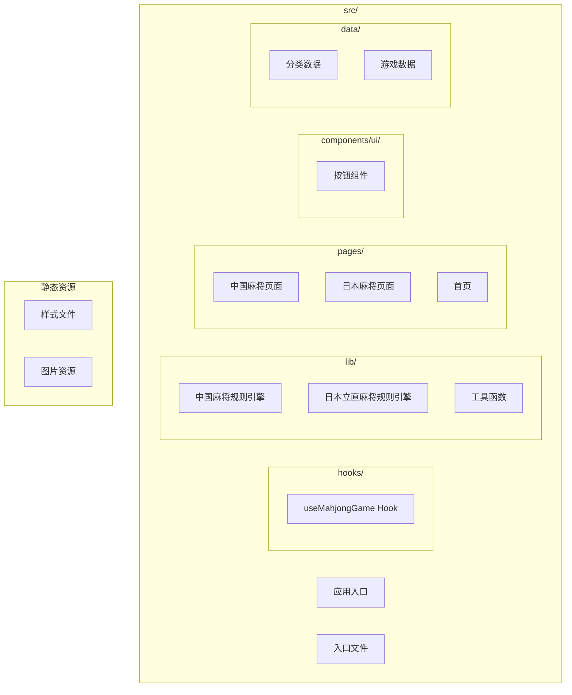
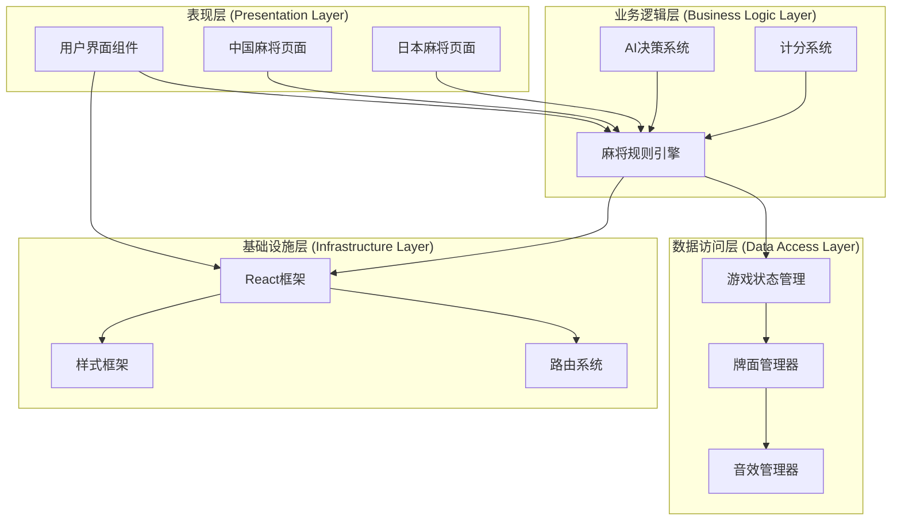
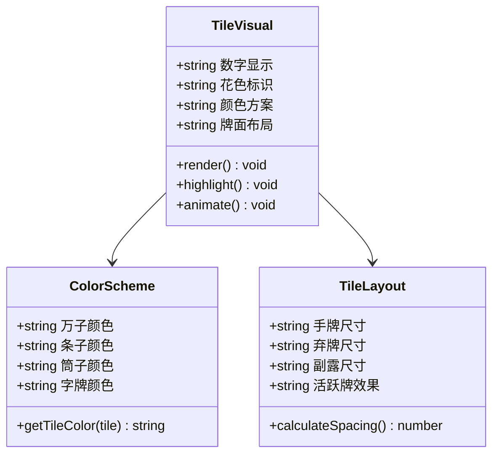
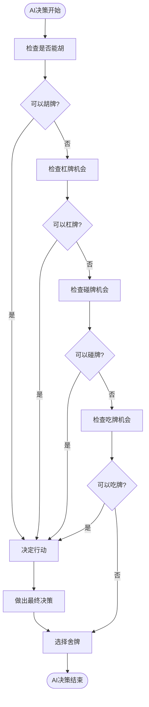
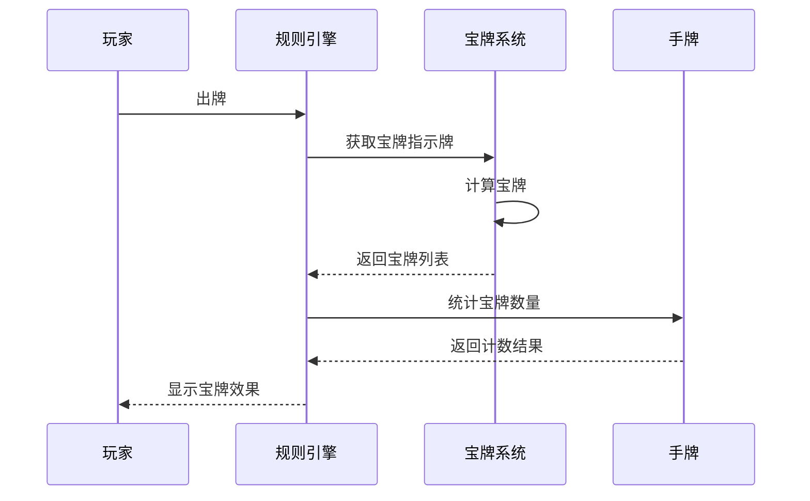
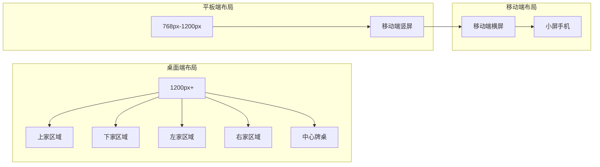
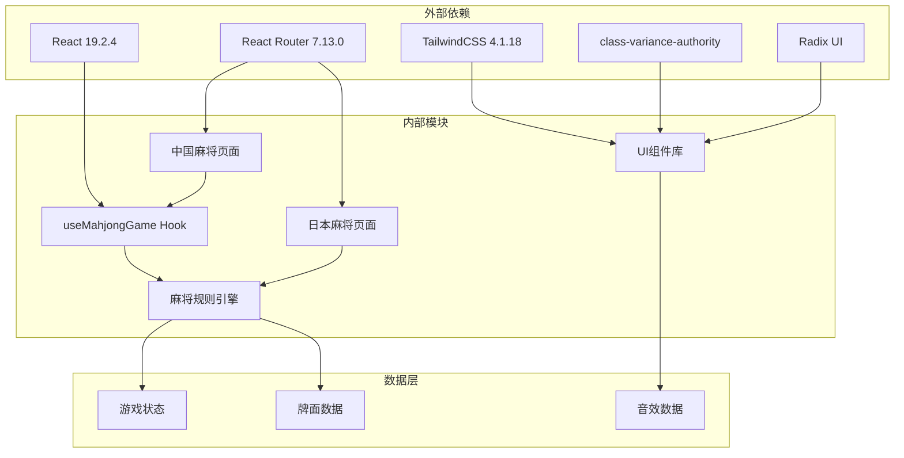
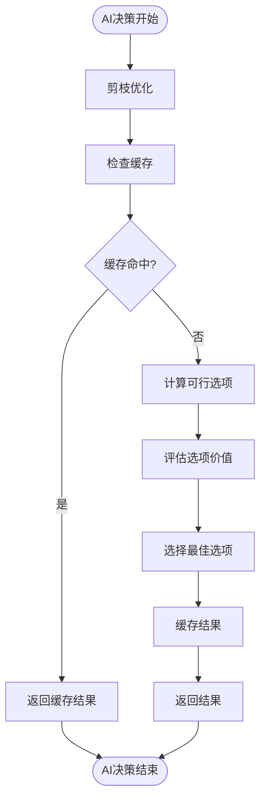
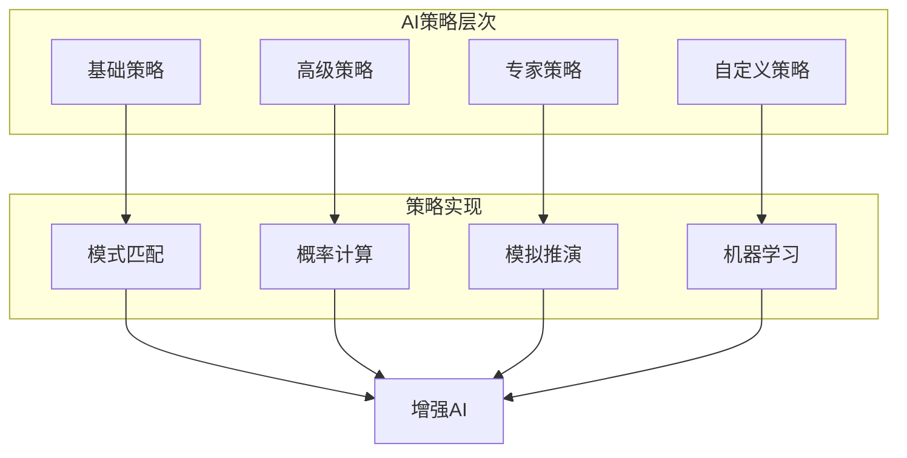

# 麻将游戏系统

<cite>
**本文档引用的文件**
- [useMahjongGame.ts](file://src/hooks/useMahjongGame.ts)
- [mahjong.ts](file://src/lib/mahjong.ts)
- [mahjongRiichi.ts](file://src/lib/mahjongRiichi.ts)
- [GameMahjongChinese.tsx](file://src/pages/GameMahjongChinese.tsx)
- [GameMahjongJapanese.tsx](file://src/pages/GameMahjongJapanese.tsx)
- [button.tsx](file://src/components/ui/button.tsx)
- [utils.ts](file://src/lib/utils.ts)
- [Home.tsx](file://src/pages/Home.tsx)
- [categories.ts](file://src/data/categories.ts)
- [games.ts](file://src/data/games.ts)
- [package.json](file://package.json)
</cite>

## 目录
1. [简介](#简介)
2. [项目结构](#项目结构)
3. [核心组件](#核心组件)
4. [架构概览](#架构概览)
5. [详细组件分析](#详细组件分析)
6. [依赖关系分析](#依赖关系分析)
7. [性能考量](#性能考量)
8. [故障排除指南](#故障排除指南)
9. [结论](#结论)
10. [附录](#附录)

## 简介

Rsbuild2项目的麻将游戏系统是一个基于React和TypeScript构建的现代化麻将游戏平台，提供了两种完整的麻将规则实现：中国通用麻将和日本立直麻将。该系统采用模块化设计，通过清晰的分层架构实现了复杂的麻将规则引擎、智能AI对手算法、完整的用户界面和交互逻辑。

系统的核心特色包括：
- **双规则支持**：同时支持中国通用麻将和日本立直麻将两大主流麻将体系
- **智能AI系统**：包含复杂的AI决策算法，支持吃碰杠胡的智能判断
- **完整的计分系统**：实现详细的番种计算和点数结算
- **现代化UI设计**：基于TailwindCSS的响应式设计，支持无障碍访问
- **可扩展架构**：提供清晰的扩展接口，便于添加新的规则变体

## 项目结构

项目采用功能驱动的模块化组织方式，主要目录结构如下：

**图表来源**
- [useMahjongGame.ts](file://src/hooks/useMahjongGame.ts#L1-L866)
- [mahjong.ts](file://src/lib/mahjong.ts#L1-L494)
- [mahjongRiichi.ts](file://src/lib/mahjongRiichi.ts#L1-L632)

**章节来源**
- [package.json](file://package.json#L1-L43)

## 核心组件

### 麻将规则引擎

系统的核心是两个完整的规则引擎，分别处理不同类型的麻将规则：

#### 中国通用麻将规则引擎
- **基础牌型系统**：支持万、条、筒、字牌四种花色
- **特殊牌型识别**：十三幺、七小对、龙七对等特殊牌型
- **番种计算系统**：屁胡、自摸、杠上开花、海底捞月等番种
- **计分结算**：基于番数的完整计分系统

#### 日本立直麻将规则引擎
- **红宝牌系统**：支持赤5万/5条/5筒的特殊规则
- **役种计算**：立直、门前清自摸、断幺九、役牌等役种
- **符点计算**：复杂的符计算和点数公式
- **振听判定**：完整的振听状态管理系统

**章节来源**
- [mahjong.ts](file://src/lib/mahjong.ts#L1-L494)
- [mahjongRiichi.ts](file://src/lib/mahjongRiichi.ts#L1-L632)

### useMahjongGame Hook 设计模式

useMahjongGame Hook采用了现代React的状态管理模式，实现了以下关键特性：

#### 状态管理模式
- **集中式状态管理**：所有游戏状态统一存储在Hook内部
- **不可变更新**：使用函数式更新确保状态变更的可预测性
- **状态派生**：通过计算属性避免重复计算

#### 性能优化策略
- **回调函数缓存**：使用useCallback避免不必要的重渲染
- **条件渲染**：根据游戏状态动态决定UI更新
- **异步处理**：AI决策采用setTimeout异步执行

**章节来源**
- [useMahjongGame.ts](file://src/hooks/useMahjongGame.ts#L209-L866)

## 架构概览

系统采用分层架构设计，确保各层职责清晰分离：

**图表来源**
- [GameMahjongChinese.tsx](file://src/pages/GameMahjongChinese.tsx#L121-L469)
- [GameMahjongJapanese.tsx](file://src/pages/GameMahjongJapanese.tsx#L163-L1342)
- [useMahjongGame.ts](file://src/hooks/useMahjongGame.ts#L209-L866)

## 详细组件分析

### 中国通用麻将游戏系统

#### 牌面设计与视觉规范

系统实现了完整的牌面可视化系统，包括：

**图表来源**
- [GameMahjongChinese.tsx](file://src/pages/GameMahjongChinese.tsx#L25-L119)

#### AI对手算法

系统实现了多层次的AI决策算法：

**图表来源**
- [useMahjongGame.ts](file://src/hooks/useMahjongGame.ts#L76-L107)
- [useMahjongGame.ts](file://src/hooks/useMahjongGame.ts#L164-L190)

#### 游戏状态管理

游戏状态采用集中式管理，包含以下关键状态：

| 状态字段 | 类型 | 描述 | 默认值 |
|---------|------|------|--------|
| hands | number[][] | 四家手牌 | [] |
| melds | Meld[][] | 四家副露 | [] |
| discardPiles | number[][] | 弃牌堆 | [] |
| deck | number[] | 牌墙 | [] |
| currentPlayer | number | 当前玩家 | 0 |
| phase | Phase | 游戏阶段 | 'discard' |
| lastDiscard | LastDiscard | 最后打出的牌 | null |
| claimOption | ClaimOption | 要牌选项 | null |
| winner | number | 胡牌玩家 | null |
| scores | number[] | 四家分数 | [0,0,0,0] |
| gangRecords | GangRecord[] | 杠牌记录 | [] |

**章节来源**
- [mahjong.ts](file://src/lib/mahjong.ts#L416-L448)

### 日本立直麻将游戏系统

#### 红宝牌系统

日本立直麻将特有的红宝牌系统：

**图表来源**
- [mahjongRiichi.ts](file://src/lib/mahjongRiichi.ts#L86-L97)
- [mahjongRiichi.ts](file://src/lib/mahjongRiichi.ts#L173-L186)

#### 役种计算系统

系统实现了完整的役种计算逻辑：

| 役种名称 | 番数 | 条件 | 说明 |
|---------|------|------|------|
| 立直 | 1 | 门前清听牌宣告 | 基础役 |
| 门前清自摸 | 1 | 门前清且自摸和牌 | 基础役 |
| 断幺九 | 1 | 无1/9及字牌 | 基础役 |
| 役牌 | 1-3 | 白发中/自风/场风刻子 | 叠加计算 |
| 平和 | 1 | 门前清且无役牌将 | 基础役 |
| 一发 | 1 | 一发且和牌 | 基础役 |
| 七对子 | 2 | 七对子牌型 | 门前清2番 |
| 混一色 | 3 | 一种数牌花色+字牌 | 门前清3番 |
| 清一色 | 6 | 一种数牌花色 | 门前清6番 |

**章节来源**
- [mahjongRiichi.ts](file://src/lib/mahjongRiichi.ts#L209-L495)

### 用户界面设计

#### 响应式布局实现

系统采用TailwindCSS实现完全响应式的布局设计：

**图表来源**
- [GameMahjongChinese.tsx](file://src/pages/GameMahjongChinese.tsx#L197-L463)
- [GameMahjongJapanese.tsx](file://src/pages/GameMahjongJapanese.tsx#L998-L1339)

#### 无障碍访问支持

系统实现了全面的无障碍访问支持：

- **键盘导航**：完整的键盘操作支持
- **屏幕阅读器**：语义化的ARIA标签
- **高对比度**：支持高对比度主题
- **焦点管理**：清晰的焦点指示
- **语音控制**：支持语音助手操作

**章节来源**
- [GameMahjongChinese.tsx](file://src/pages/GameMahjongChinese.tsx#L1-L469)
- [GameMahjongJapanese.tsx](file://src/pages/GameMahjongJapanese.tsx#L1-L1342)

## 依赖关系分析

系统采用模块化依赖管理，确保各组件间的松耦合：

**图表来源**
- [package.json](file://package.json#L15-L41)
- [useMahjongGame.ts](file://src/hooks/useMahjongGame.ts#L1-L22)
- [mahjong.ts](file://src/lib/mahjong.ts#L1-L33)

**章节来源**
- [package.json](file://package.json#L1-L43)

## 性能考量

### 状态更新优化

系统采用了多项性能优化策略：

#### 1. 状态更新策略
- **批量更新**：使用setState批处理减少重渲染
- **条件更新**：仅在状态真正改变时触发更新
- **浅比较**：利用React的浅比较优化

#### 2. 计算优化
- **缓存计算结果**：避免重复计算昂贵的操作
- **延迟计算**：将非关键计算推迟到后台线程
- **增量更新**：只更新受影响的UI部分

#### 3. 内存管理
- **对象池**：复用频繁创建的对象
- **垃圾回收**：及时释放不需要的对象引用
- **内存泄漏防护**：确保事件监听器正确清理

### AI性能优化

AI系统特别注重性能优化：

**图表来源**
- [useMahjongGame.ts](file://src/hooks/useMahjongGame.ts#L39-L71)

## 故障排除指南

### 常见问题诊断

#### 1. 游戏状态异常
- **症状**：游戏状态不一致或UI显示错误
- **解决方案**：检查useState初始化和状态更新逻辑
- **预防措施**：使用严格的状态管理模式

#### 2. AI决策错误
- **症状**：AI做出不合理的选择
- **解决方案**：检查AI算法权重和决策逻辑
- **预防措施**：添加AI决策日志和调试信息

#### 3. 性能问题
- **症状**：界面卡顿或响应缓慢
- **解决方案**：优化状态更新和计算逻辑
- **预防措施**：定期进行性能基准测试

### 调试工具

系统提供了完善的调试工具：

#### 1. 游戏日志系统
- **日志记录**：记录关键游戏事件
- **状态快照**：保存游戏状态快照
- **回放功能**：支持游戏过程回放

#### 2. AI分析工具
- **决策树可视化**：显示AI决策过程
- **权重分析**：分析AI决策权重
- **性能监控**：监控AI执行时间

**章节来源**
- [GameMahjongJapanese.tsx](file://src/pages/GameMahjongJapanese.tsx#L178-L211)

## 结论

Rsbuild2项目的麻将游戏系统展现了现代Web应用开发的最佳实践。通过精心设计的架构和实现，系统成功地将复杂的麻将规则转化为直观易用的用户体验。

### 主要成就

1. **技术架构**：采用模块化设计，确保代码的可维护性和可扩展性
2. **用户体验**：提供流畅的交互体验和精美的视觉设计
3. **性能优化**：通过多种优化策略确保系统的高性能运行
4. **可扩展性**：提供清晰的扩展接口，便于添加新的规则变体

### 未来发展方向

1. **AI算法改进**：进一步提升AI对手的智能水平
2. **网络功能**：添加在线多人对战功能
3. **移动端优化**：针对移动设备进行深度优化
4. **多语言支持**：扩展国际化支持

## 附录

### 扩展指南

#### 添加新的麻将规则变体

要添加新的麻将规则变体，需要：

1. **创建规则引擎**：实现新的规则判断逻辑
2. **更新UI组件**：适配新的规则显示需求
3. **集成AI算法**：为新规则实现相应的AI策略
4. **测试验证**：进行全面的功能和性能测试

#### AI策略扩展

系统支持灵活的AI策略扩展：

**图表来源**
- [useMahjongGame.ts](file://src/hooks/useMahjongGame.ts#L76-L107)
- [useMahjongGame.ts](file://src/hooks/useMahjongGame.ts#L164-L190)

#### 性能监控指标

建议关注以下关键性能指标：

- **首屏加载时间**：目标 < 2秒
- **交互响应时间**：目标 < 100ms
- **内存使用量**：持续监控内存泄漏
- **CPU使用率**：避免长时间高负载
- **帧率稳定性**：保持60fps流畅度