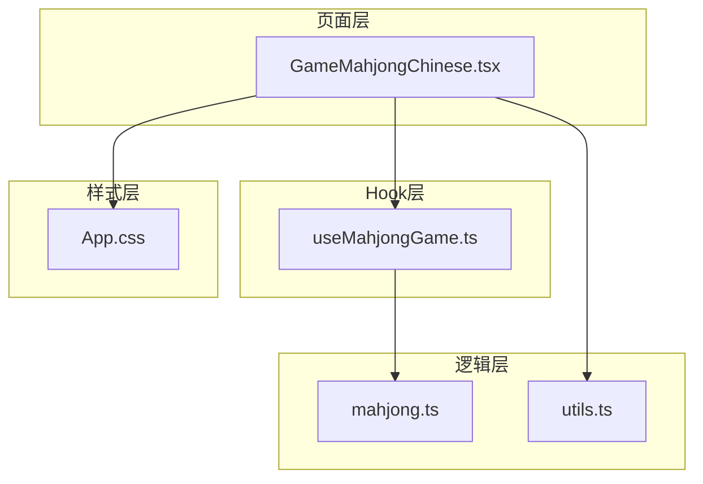
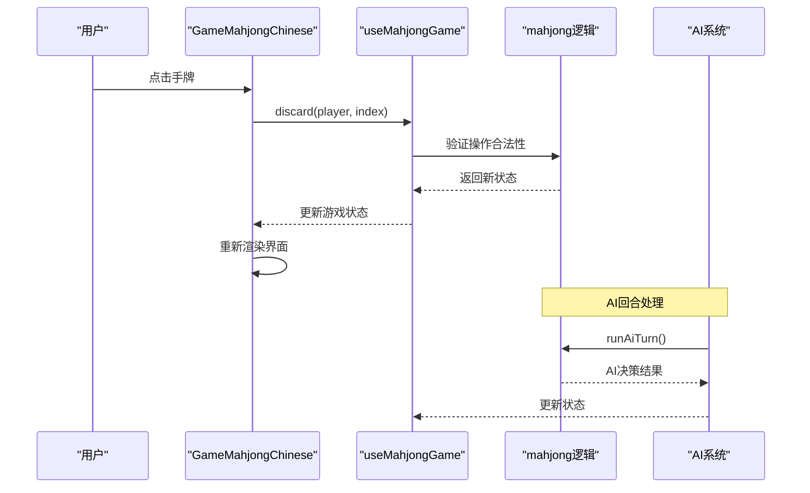
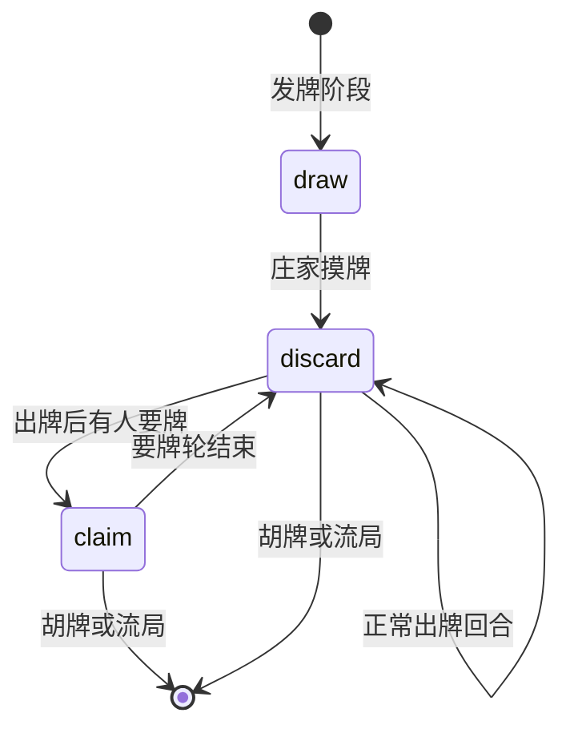
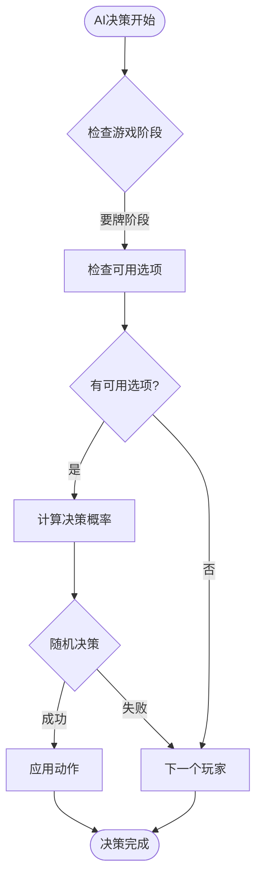
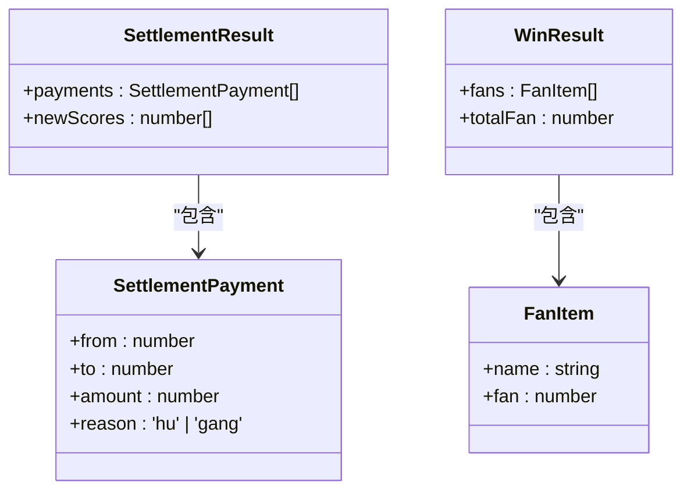
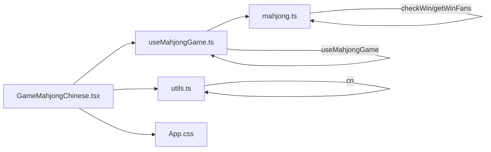

# 中国通用麻将页面

<cite>
**本文档引用的文件**
- [GameMahjongChinese.tsx](file://src/pages/GameMahjongChinese.tsx)
- [useMahjongGame.ts](file://src/hooks/useMahjongGame.ts)
- [mahjong.ts](file://src/lib/mahjong.ts)
- [utils.ts](file://src/lib/utils.ts)
- [App.css](file://src/App.css)
- [package.json](file://package.json)
</cite>

## 目录
1. [简介](#简介)
2. [项目结构](#项目结构)
3. [核心组件](#核心组件)
4. [架构概览](#架构概览)
5. [详细组件分析](#详细组件分析)
6. [依赖关系分析](#依赖关系分析)
7. [性能考量](#性能考量)
8. [故障排除指南](#故障排除指南)
9. [结论](#结论)

## 简介
中国通用麻将页面是Rsbuild2项目中的一个完整麻将游戏实现，基于React和TypeScript构建。该页面实现了标准的中国麻将规则，包括四人对局、完整的牌面渲染系统、智能AI对手、实时计分系统和丰富的视觉效果。

## 项目结构
该项目采用模块化架构，主要文件组织如下：
- `src/pages/` - 页面组件目录
- `src/hooks/` - 自定义React Hooks
- `src/lib/` - 核心游戏逻辑库
- `src/components/ui/` - 可复用UI组件
- `src/data/` - 游戏数据配置
- `src/App.css` - 全局样式和主题



**图表来源**
- [GameMahjongChinese.tsx](file://src/pages/GameMahjongChinese.tsx#L1-L469)
- [useMahjongGame.ts](file://src/hooks/useMahjongGame.ts#L1-L876)
- [mahjong.ts](file://src/lib/mahjong.ts#L1-L562)

**章节来源**
- [GameMahjongChinese.tsx](file://src/pages/GameMahjongChinese.tsx#L1-L50)
- [package.json](file://package.json#L1-L43)

## 核心组件
中国通用麻将页面的核心由三个主要部分构成：

### 1. 视觉渲染组件
- **TileFace组件**：统一的牌面渲染入口
- **TileWan**：万子牌面渲染（红底黑字）
- **TileBamboo**：条子牌面渲染（竹节样式）
- **TileDots**：筒子牌面渲染（圆点图案）

### 2. 游戏状态管理
- **useMahjongGame Hook**：集中管理游戏状态和AI逻辑
- **GameState接口**：完整的游戏状态定义
- **ClaimOption系统**：要牌阶段的决策选项

### 3. 用户交互系统
- **响应式布局**：适配不同屏幕尺寸
- **实时高亮**：当前玩家和可执行操作的视觉反馈
- **禁用状态处理**：确保合法操作

**章节来源**
- [GameMahjongChinese.tsx](file://src/pages/GameMahjongChinese.tsx#L16-L119)
- [useMahjongGame.ts](file://src/hooks/useMahjongGame.ts#L286-L876)
- [mahjong.ts](file://src/lib/mahjong.ts#L484-L516)

## 架构概览
该系统采用分层架构设计，确保了清晰的关注点分离：



**图表来源**
- [GameMahjongChinese.tsx](file://src/pages/GameMahjongChinese.tsx#L318-L339)
- [useMahjongGame.ts](file://src/hooks/useMahjongGame.ts#L845-L843)
- [mahjong.ts](file://src/lib/mahjong.ts#L347-L354)

## 详细组件分析

### 麻将牌面渲染系统

#### 牌面尺寸规范
系统实现了精确的牌面尺寸控制：
- **手牌**：70×96像素，适合手指点击操作
- **弃牌区**：50×68像素，便于查看历史牌
- **小牌**：42×58像素，用于其他玩家的弃牌显示

#### 颜色区分系统
通过颜色编码实现快速识别：
- **万子**：红底黑字，使用`text-red-800 bg-red-50 border-red-400`
- **条子**：绿底墨绿边框，使用`text-green-800 bg-green-50 border-green-500`
- **筒子**：琥珀色底深色边框，使用`text-amber-800 bg-amber-50 border-amber-500`
- **字牌**：石板色底深色边框，使用`text-stone-900 bg-stone-100 border-stone-600`

#### 牌面内容渲染
```mermaid
flowchart TD
Start(["TileFace渲染"]) --> CheckType{"检查牌类型"}
CheckType --> |字牌(≥27)| Zi["显示字牌标签<br/>东/南/西/北/中/发/白"]
CheckType --> |万子(<9)| Wan["显示万子数字<br/>一/二/三/四/五/六/七/八/九"]
CheckType --> |条子(9-17)| Bamboo["渲染竹节样式"]
CheckType --> |筒子(18-26)| Dots["渲染圆点图案"]
Wan --> WanContent["数字 + 万字"]
Bamboo --> BambooPattern["3列竹节排列"]
Dots --> DotPattern["数字对应圆点布局"]
Zi --> ZiText["直接显示文字"]
```

**图表来源**
- [GameMahjongChinese.tsx](file://src/pages/GameMahjongChinese.tsx#L111-L119)
- [GameMahjongChinese.tsx](file://src/pages/GameMahjongChinese.tsx#L38-L70)

**章节来源**
- [GameMahjongChinese.tsx](file://src/pages/GameMahjongChinese.tsx#L16-L35)
- [GameMahjongChinese.tsx](file://src/pages/GameMahjongChinese.tsx#L38-L119)

### 响应式布局设计

#### 网格布局系统
使用CSS Grid实现四人对局的牌桌布局：
- **主网格**：`grid grid-cols-[1fr_2fr_1fr] grid-rows-[auto_1fr_auto]`
- **座位定位**：上家(3)、对家(2)、下家(1)、自家(0)
- **动态间距**：`gap-3`确保适当的牌间距

#### 移动端适配
- **安全区域**：`env(safe-area-inset-left)`确保刘海屏适配
- **弹性容器**：`flex flex-wrap`支持小屏幕下的自动换行
- **字体缩放**：响应式字体大小适应不同设备

#### 阴影和高亮效果
- **牌面高亮**：`-translate-y-3 shadow-xl ring-2 ring-[#ffc107]/60`
- **当前玩家指示**：淡黄色背景和闪烁效果
- **按钮状态**：不同状态使用不同的颜色方案

**章节来源**
- [GameMahjongChinese.tsx](file://src/pages/GameMahjongChinese.tsx#L197-L465)

### 玩家座位系统

#### SEAT_NAMES映射
```typescript
const SEAT_NAMES = ['自家', '下家', '对家', '上家'];
```

#### 座位可视化
每个座位包含以下信息：
- **头像标识**：圆形徽章显示首字母
- **座位名称**：中文标识
- **当前分数**：实时显示
- **弃牌展示**：按座位分行显示

#### 当前玩家指示
- **正在出牌**：显示⏳闪烁标识
- **视觉高亮**：淡黄色背景和边框
- **状态提示**：实时显示当前状态信息

**章节来源**
- [GameMahjongChinese.tsx](file://src/pages/GameMahjongChinese.tsx#L9-L9)
- [GameMahjongChinese.tsx](file://src/pages/GameMahjongChinese.tsx#L268-L347)

### 游戏状态管理

#### GameState接口定义
完整的状态管理包括：
- **手牌和明牌**：`hands: number[][]` 和 `melds: Meld[][]`
- **牌墙和弃牌**：`deck` 和 `discardPiles`
- **游戏阶段**：`phase: 'draw' | 'discard' | 'claim'`
- **玩家信息**：`currentPlayer`、`dealer`、`winner`
- **计分系统**：`scores`、`baseScore`、`lastSettlement`

#### 状态转换流程


**图表来源**
- [mahjong.ts](file://src/lib/mahjong.ts#L347-L354)

**章节来源**
- [mahjong.ts](file://src/lib/mahjong.ts#L484-L516)
- [useMahjongGame.ts](file://src/hooks/useMahjongGame.ts#L286-L316)

### 用户交互逻辑

#### 点击出牌机制
- **手牌点击**：仅在轮到自己且未胡牌时可用
- **高亮反馈**：点击时牌面轻微放大和阴影效果
- **禁用状态**：非轮次或已胡牌时自动禁用

#### 要牌阶段交互
- **胡牌按钮**：仅当满足条件时显示
- **杠牌选项**：根据手牌情况动态显示
- **过牌功能**：允许跳过要牌机会

#### AI对手处理
- **自动决策延迟**：`setTimeout(runAiTurn, 600)`毫秒延迟
- **智能决策**：基于牌型和位置的概率计算
- **回合切换**：自动推进到下一个玩家

**章节来源**
- [GameMahjongChinese.tsx](file://src/pages/GameMahjongChinese.tsx#L376-L406)
- [useMahjongGame.ts](file://src/hooks/useMahjongGame.ts#L140-L151)

### AI对手逻辑

#### 决策概率系统
AI对手采用基于概率的决策机制：



**图表来源**
- [useMahjongGame.ts](file://src/hooks/useMahjongGame.ts#L76-L93)
- [useMahjongGame.ts](file://src/hooks/useMahjongGame.ts#L96-L107)

#### 决策算法
- **碰牌概率**：基于面子数量和对子数量调整
- **杠牌概率**：根据面子数量和残局状态调整
- **吃牌决策**：基于顺子质量和手牌连贯性评分

#### 自动上浮高亮
刚摸到的牌具有特殊的视觉效果：
- **上浮效果**：`-translate-y-3`向上移动3像素
- **阴影效果**：`shadow-xl`添加大阴影
- **边框高亮**：`ring-2 ring-[#ffc107]/60`添加金色光晕

**章节来源**
- [GameMahjongChinese.tsx](file://src/pages/GameMahjongChinese.tsx#L21-L21)
- [useMahjongGame.ts](file://src/hooks/useMahjongGame.ts#L76-L107)

### 游戏规则界面

#### 规则说明面板
提供完整的中国麻将规则说明：
- **基本规则**：四人对局、座位安排、牌数分配
- **操作说明**：自摸、吃、碰、杠、胡的规则
- **番种介绍**：屁胡、自摸、杠上开花等番种说明
- **计分系统**：基础分、番数计算、结算方式

#### 实时计分显示
- **座位分数**：每个玩家的实时分数
- **庄家标识**：显示当前庄家座位
- **局数信息**：显示当前局数和庄家

#### 结算面板


**图表来源**
- [mahjong.ts](file://src/lib/mahjong.ts#L390-L402)
- [mahjong.ts](file://src/lib/mahjong.ts#L449-L482)

**章节来源**
- [GameMahjongChinese.tsx](file://src/pages/GameMahjongChinese.tsx#L198-L235)
- [GameMahjongChinese.tsx](file://src/pages/GameMahjongChinese.tsx#L238-L261)

## 依赖关系分析

### 外部依赖
项目使用现代化的前端技术栈：
- **React 19**：最新版本的React框架
- **Tailwind CSS 4**：原子化CSS框架
- **TypeScript**：类型安全的JavaScript扩展
- **React Router**：客户端路由管理

### 内部模块依赖


**图表来源**
- [GameMahjongChinese.tsx](file://src/pages/GameMahjongChinese.tsx#L1-L11)
- [useMahjongGame.ts](file://src/hooks/useMahjongGame.ts#L1-L22)

**章节来源**
- [package.json](file://package.json#L15-L41)

## 性能考量

### 渲染优化
- **虚拟化**：大量牌面使用CSS Grid进行高效布局
- **条件渲染**：仅在需要时渲染特定UI元素
- **状态最小化**：使用useCallback避免不必要的重渲染

### AI性能优化
- **概率计算缓存**：避免重复计算相同的概率值
- **早期退出**：在不可能的情况下提前终止计算
- **内存管理**：及时清理定时器和事件监听器

### 响应式设计
- **CSS媒体查询**：针对不同屏幕尺寸优化布局
- **弹性布局**：使用Flexbox和Grid实现自适应
- **触摸友好的尺寸**：确保移动端的良好体验

## 故障排除指南

### 常见问题
1. **牌面渲染异常**
   - 检查TileFace组件的类型判断逻辑
   - 验证颜色类名的正确性

2. **AI决策错误**
   - 确认概率计算函数的参数传递
   - 检查随机数生成的范围

3. **状态同步问题**
   - 验证useState的更新逻辑
   - 检查useCallback的依赖数组

### 调试建议
- 使用浏览器开发者工具检查DOM结构
- 在关键函数中添加console.log输出
- 利用React DevTools检查组件状态

**章节来源**
- [GameMahjongChinese.tsx](file://src/pages/GameMahjongChinese.tsx#L140-L151)
- [useMahjongGame.ts](file://src/hooks/useMahjongGame.ts#L845-L856)

## 结论
中国通用麻将页面展现了现代Web麻将游戏的完整实现。通过精心设计的组件架构、完善的AI系统和丰富的视觉效果，该页面提供了流畅的游戏体验。系统的模块化设计确保了代码的可维护性和可扩展性，为未来的功能增强奠定了坚实基础。