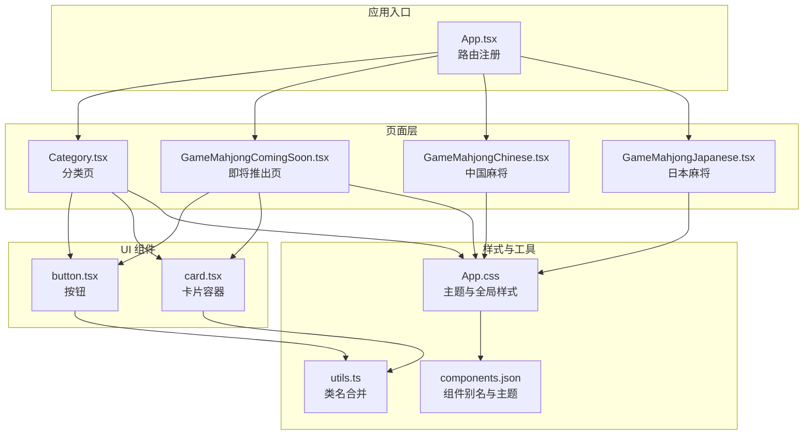
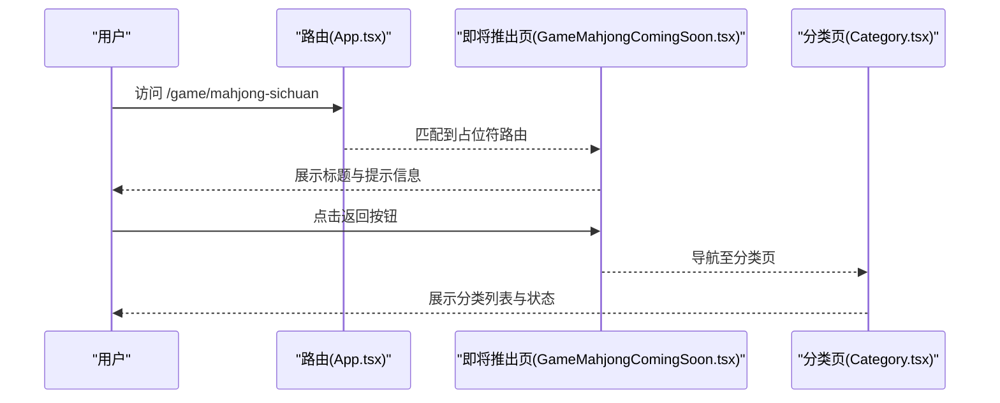
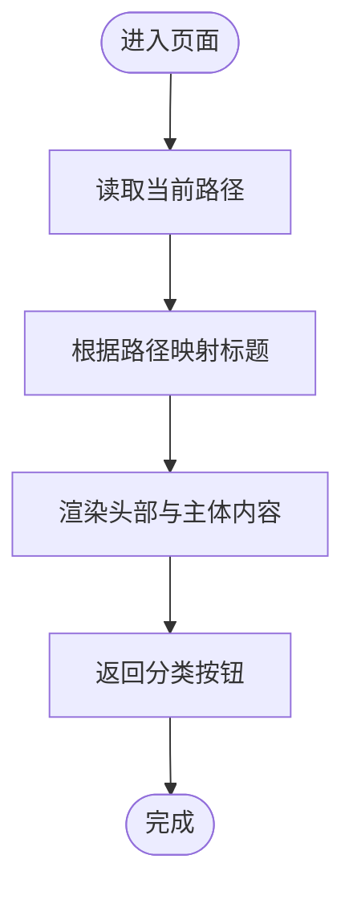
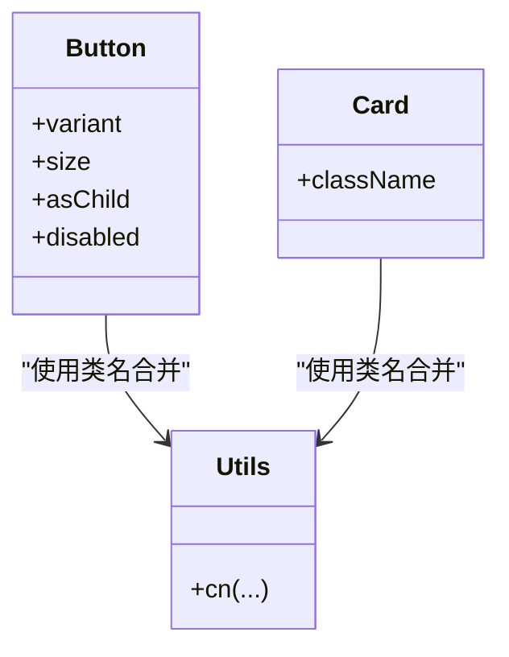
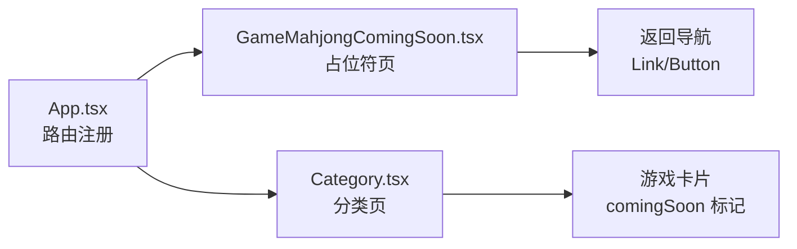
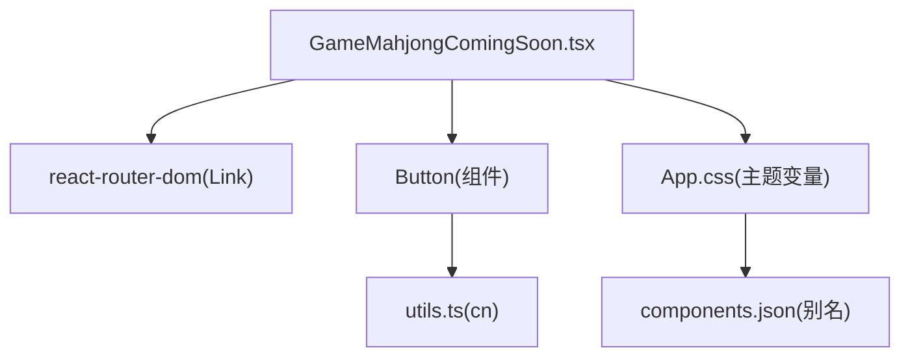

# 即将推出页面

<cite>
**本文引用的文件**
- [GameMahjongComingSoon.tsx](file://src/pages/GameMahjongComingSoon.tsx)
- [App.tsx](file://src/App.tsx)
- [card.tsx](file://src/components/ui/card.tsx)
- [button.tsx](file://src/components/ui/button.tsx)
- [utils.ts](file://src/lib/utils.ts)
- [Category.tsx](file://src/pages/Category.tsx)
- [GameMahjongChinese.tsx](file://src/pages/GameMahjongChinese.tsx)
- [GameMahjongJapanese.tsx](file://src/pages/GameMahjongJapanese.tsx)
- [App.css](file://src/App.css)
- [components.json](file://src/components.json)
- [package.json](file://src/package.json)
</cite>

## 目录
1. [简介](#简介)
2. [项目结构](#项目结构)
3. [核心组件](#核心组件)
4. [架构总览](#架构总览)
5. [组件详解](#组件详解)
6. [依赖关系分析](#依赖关系分析)
7. [性能考量](#性能考量)
8. [故障排查指南](#故障排查指南)
9. [结论](#结论)
10. [附录](#附录)

## 简介
本文件围绕 Rsbuild2 项目中的“麻将游戏即将推出页面”进行系统化技术文档梳理，重点聚焦于 GameMahjongComingSoon.tsx 的设计理念、实现方式与可扩展性。文档将从页面功能定位、用户体验设计、视觉设计、路由集成、品牌一致性、SEO 优化建议以及未来扩展机制等方面展开，帮助开发者与产品人员快速理解该页面在整体产品开发周期中的作用与价值。

## 项目结构
Rsbuild2 采用基于文件系统的路由与模块化组件组织方式：
- 页面层：位于 src/pages，包含各游戏页面与分类页
- 组件层：位于 src/components/ui，提供可复用的基础 UI 组件
- 样式层：使用 Tailwind CSS 与 shadcn/ui 主题变量，集中于 src/App.css
- 工具函数：位于 src/lib/utils，提供类名合并工具
- 配置：components.json 定义组件别名与主题配置

图表来源
- [App.tsx](file://src/App.tsx#L18-L39)
- [GameMahjongComingSoon.tsx](file://src/pages/GameMahjongComingSoon.tsx#L1-L32)
- [Category.tsx](file://src/pages/Category.tsx#L1-L132)
- [GameMahjongChinese.tsx](file://src/pages/GameMahjongChinese.tsx#L1-L469)
- [GameMahjongJapanese.tsx](file://src/pages/GameMahjongJapanese.tsx#L1-L800)
- [button.tsx](file://src/components/ui/button.tsx#L1-L65)
- [card.tsx](file://src/components/ui/card.tsx#L1-L93)
- [utils.ts](file://src/lib/utils.ts#L1-L7)
- [App.css](file://src/App.css#L1-L245)
- [components.json](file://src/components.json#L1-L22)

章节来源
- [App.tsx](file://src/App.tsx#L18-L39)
- [GameMahjongComingSoon.tsx](file://src/pages/GameMahjongComingSoon.tsx#L1-L32)
- [Category.tsx](file://src/pages/Category.tsx#L1-L132)
- [GameMahjongChinese.tsx](file://src/pages/GameMahjongChinese.tsx#L1-L469)
- [GameMahjongJapanese.tsx](file://src/pages/GameMahjongJapanese.tsx#L1-L800)
- [button.tsx](file://src/components/ui/button.tsx#L1-L65)
- [card.tsx](file://src/components/ui/card.tsx#L1-L93)
- [utils.ts](file://src/lib/utils.ts#L1-L7)
- [App.css](file://src/App.css#L1-L245)
- [components.json](file://src/components.json#L1-L22)

## 核心组件
- GameMahjongComingSoon.tsx：占位符页面，负责在特定路径下展示“开发中，敬请期待”的提示，并提供返回导航。
- 路由集成：App.tsx 将 /game/mahjong-sichuan 路由指向该页面，形成占位符机制。
- 导航与交互：使用 react-router-dom 的 Link 组件与自定义 Button 组件，统一风格与交互体验。
- 品牌一致性：通过主题变量与 Tailwind 类名，确保与现有 UI 设计体系一致。

章节来源
- [GameMahjongComingSoon.tsx](file://src/pages/GameMahjongComingSoon.tsx#L1-L32)
- [App.tsx](file://src/App.tsx#L24-L26)
- [button.tsx](file://src/components/ui/button.tsx#L1-L65)
- [utils.ts](file://src/lib/utils.ts#L1-L7)

## 架构总览
占位符页面在路由层面与真实页面并列存在，通过路径映射实现“开发中”的状态展示。其职责包括：
- 功能预览：向用户传达某功能尚未上线，但已在开发中
- 用户期待管理：明确告知“开发中，敬请期待”，降低用户失望感
- 开发进度展示：通过分类页与占位符页的联动，体现产品迭代节奏
- 品牌一致性：统一的导航、按钮与主题风格，保证视觉与交互的一致性

图表来源
- [App.tsx](file://src/App.tsx#L24-L26)
- [GameMahjongComingSoon.tsx](file://src/pages/GameMahjongComingSoon.tsx#L13-L29)
- [Category.tsx](file://src/pages/Category.tsx#L1-L132)

## 组件详解

### GameMahjongComingSoon.tsx 设计与实现
- 路径标题映射：根据当前路径动态选择标题，支持多语言或地区化标题（如四川麻将、日本麻将）。
- 视觉布局：采用全屏最小高度与垂直居中布局，确保在不同设备上的良好体验。
- 导航设计：顶部返回按钮与底部“返回分类”的按钮，形成清晰的层级导航。
- 品牌一致性：使用主题变量与 Tailwind 类名，与现有 UI 组件风格保持一致。

图表来源
- [GameMahjongComingSoon.tsx](file://src/pages/GameMahjongComingSoon.tsx#L9-L29)

章节来源
- [GameMahjongComingSoon.tsx](file://src/pages/GameMahjongComingSoon.tsx#L1-L32)

### UI 组件与样式体系
- Button 组件：提供多种变体与尺寸，支持语义化与无障碍属性，适配占位符页的“返回”按钮。
- Card 组件：提供卡片容器与内容区域，便于在需要时扩展为更丰富的占位符信息。
- 样式与主题：通过 App.css 中的主题变量与 Tailwind 配置，确保全局一致的视觉风格。

图表来源
- [button.tsx](file://src/components/ui/button.tsx#L41-L62)
- [card.tsx](file://src/components/ui/card.tsx#L5-L16)
- [utils.ts](file://src/lib/utils.ts#L4-L6)

章节来源
- [button.tsx](file://src/components/ui/button.tsx#L1-L65)
- [card.tsx](file://src/components/ui/card.tsx#L1-L93)
- [utils.ts](file://src/lib/utils.ts#L1-L7)

### 路由与页面联动
- 路由注册：App.tsx 将 /game/mahjong-sichuan 映射到占位符页面，形成占位符机制。
- 分类页联动：Category.tsx 在分类列表中展示“开发中”状态，与占位符页形成一致的信息传递。

图表来源
- [App.tsx](file://src/App.tsx#L24-L26)
- [Category.tsx](file://src/pages/Category.tsx#L106-L121)
- [GameMahjongComingSoon.tsx](file://src/pages/GameMahjongComingSoon.tsx#L13-L29)

章节来源
- [App.tsx](file://src/App.tsx#L18-L39)
- [Category.tsx](file://src/pages/Category.tsx#L106-L121)

### 视觉设计与品牌一致性
- 渐变背景：App.css 提供全局背景渐变，占位符页继承该风格，保持品牌一致性。
- 主题变量：通过 CSS 变量控制背景、前景、卡片等颜色，确保深色/浅色模式下的统一体验。
- 字体与排版：全局字体设置与标题、段落样式，保证信息层次清晰。

章节来源
- [App.css](file://src/App.css#L123-L128)
- [App.css](file://src/App.css#L7-L76)
- [App.css](file://src/App.css#L1-L245)

### 未来扩展机制
- 易于替换为真实游戏内容：占位符页与真实游戏页共享相同的路由前缀与导航结构，替换时仅需调整路由映射与页面内容。
- 保持品牌一致性：通过主题变量与组件库，确保替换后的页面与现有设计体系一致。
- SEO 优化建议：可在占位符页增加 meta 描述、结构化数据与可访问性标签，提升搜索引擎可见性与可访问性。

章节来源
- [GameMahjongComingSoon.tsx](file://src/pages/GameMahjongComingSoon.tsx#L1-L32)
- [App.css](file://src/App.css#L1-L245)
- [components.json](file://src/components.json#L1-L22)

## 依赖关系分析
- 组件依赖：GameMahjongComingSoon.tsx 依赖 react-router-dom 的 Link 与 Button 组件。
- 样式依赖：依赖 App.css 的主题变量与 Tailwind 类名。
- 工具函数：依赖 utils.ts 的 cn 函数进行类名合并。
- 路由依赖：依赖 App.tsx 的路由注册，形成占位符机制。

图表来源
- [GameMahjongComingSoon.tsx](file://src/pages/GameMahjongComingSoon.tsx#L1-L3)
- [button.tsx](file://src/components/ui/button.tsx#L1-L65)
- [utils.ts](file://src/lib/utils.ts#L1-L7)
- [App.css](file://src/App.css#L1-L245)
- [components.json](file://src/components.json#L1-L22)

章节来源
- [GameMahjongComingSoon.tsx](file://src/pages/GameMahjongComingSoon.tsx#L1-L3)
- [button.tsx](file://src/components/ui/button.tsx#L1-L65)
- [utils.ts](file://src/lib/utils.ts#L1-L7)
- [App.css](file://src/App.css#L1-L245)
- [components.json](file://src/components.json#L1-L22)

## 性能考量
- 路由懒加载：可结合路由懒加载策略，减少初始包体积，提升首屏加载速度。
- 样式优化：通过 Tailwind 的按需生成与主题变量复用，避免重复样式定义。
- 组件复用：Button 与 Card 组件的复用有助于减少 DOM 结构复杂度，提升渲染效率。

## 故障排查指南
- 路由不生效：检查 App.tsx 中 /game/mahjong-sichuan 的路由映射是否正确。
- 样式异常：确认 App.css 的主题变量与 Tailwind 配置是否正确加载。
- 导航失效：检查 Link 组件的 to 属性与目标路径是否匹配。
- 组件样式错乱：确认 Button 与 Card 组件的变体与尺寸参数是否正确传递。

章节来源
- [App.tsx](file://src/App.tsx#L24-L26)
- [GameMahjongComingSoon.tsx](file://src/pages/GameMahjongComingSoon.tsx#L13-L29)
- [button.tsx](file://src/components/ui/button.tsx#L41-L62)
- [card.tsx](file://src/components/ui/card.tsx#L5-L16)
- [App.css](file://src/App.css#L1-L245)

## 结论
GameMahjongComingSoon.tsx 作为 Rsbuild2 项目中的占位符页面，承担着功能预览、用户期待管理与开发进度展示的重要职责。通过统一的路由机制、品牌一致的 UI 组件与主题风格，该页面在不影响用户体验的前提下，为后续真实游戏内容的上线提供了良好的过渡与衔接。未来可通过路由懒加载、SEO 优化与组件扩展，进一步提升性能与可维护性。

## 附录
- 依赖与脚本：项目使用 React、React Router、Tailwind CSS、shadcn/ui 等技术栈，构建与测试脚本见 package.json。
- 组件别名与主题：components.json 定义了组件别名与主题配置，确保开发体验与样式一致性。

章节来源
- [package.json](file://src/package.json#L1-L43)
- [components.json](file://src/components.json#L1-L22)