# 日本麻将页面

<cite>
**本文引用的文件**
- [GameMahjongJapanese.tsx](file://src/pages/GameMahjongJapanese.tsx)
- [mahjongRiichi.ts](file://src/lib/mahjongRiichi.ts)
- [mahjong.ts](file://src/lib/mahjong.ts)
- [useMahjongGame.ts](file://src/hooks/useMahjongGame.ts)
- [utils.ts](file://src/lib/utils.ts)
- [App.css](file://src/App.css)
- [button.tsx](file://src/components/ui/button.tsx)
- [games.ts](file://src/data/games.ts)
</cite>

## 目录
1. [简介](#简介)
2. [项目结构](#项目结构)
3. [核心组件](#核心组件)
4. [架构概览](#架构概览)
5. [详细组件分析](#详细组件分析)
6. [依赖关系分析](#依赖关系分析)
7. [性能考量](#性能考量)
8. [故障排除指南](#故障排除指南)
9. [结论](#结论)

## 简介

Rsbuild2项目中的日本麻将页面实现了完整的立直麻将游戏体验。该页面基于React构建，采用现代化的前端技术栈，提供了符合日本麻将规则的游戏机制、用户界面和交互体验。

本项目的核心特色包括：
- 完整的日式麻将规则实现（立直、副露、食替、振听等）
- 实时的役种计算和计分系统
- 智能的AI对手行为模拟
- 精美的视觉设计和动画效果
- 详细的日志记录和调试功能

## 项目结构

项目采用模块化的组织方式，主要文件结构如下：

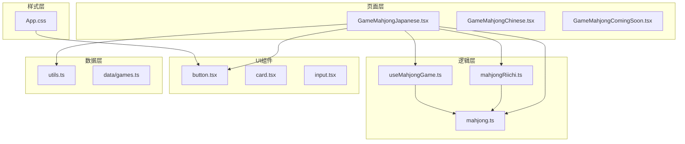

**图表来源**
- [GameMahjongJapanese.tsx](file://src/pages/GameMahjongJapanese.tsx#L1-L50)
- [mahjongRiichi.ts](file://src/lib/mahjongRiichi.ts#L1-L50)
- [mahjong.ts](file://src/lib/mahjong.ts#L1-L50)

**章节来源**
- [GameMahjongJapanese.tsx](file://src/pages/GameMahjongJapanese.tsx#L1-L100)
- [mahjongRiichi.ts](file://src/lib/mahjongRiichi.ts#L1-L50)

## 核心组件

### 游戏状态管理

游戏采用集中式的状态管理模式，通过React的useState和useEffect实现：

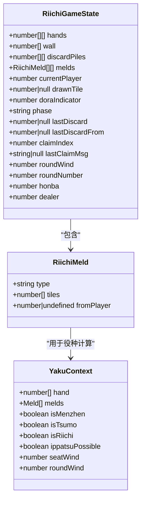

**图表来源**
- [GameMahjongJapanese.tsx](file://src/pages/GameMahjongJapanese.tsx#L87-L134)
- [mahjongRiichi.ts](file://src/lib/mahjongRiichi.ts#L220-L229)

### 牌面渲染系统

系统实现了完整的牌面渲染机制，支持不同类型的牌和视觉效果：

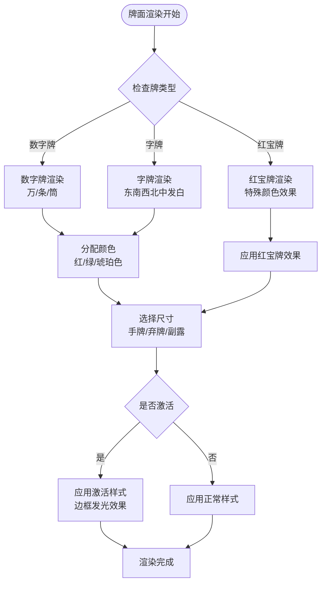

**图表来源**
- [GameMahjongJapanese.tsx](file://src/pages/GameMahjongJapanese.tsx#L31-L63)
- [GameMahjongJapanese.tsx](file://src/pages/GameMahjongJapanese.tsx#L25-L29)

**章节来源**
- [GameMahjongJapanese.tsx](file://src/pages/GameMahjongJapanese.tsx#L31-L63)
- [GameMahjongJapanese.tsx](file://src/pages/GameMahjongJapanese.tsx#L25-L29)

## 架构概览

### 整体架构设计

系统采用分层架构，确保代码的可维护性和扩展性：

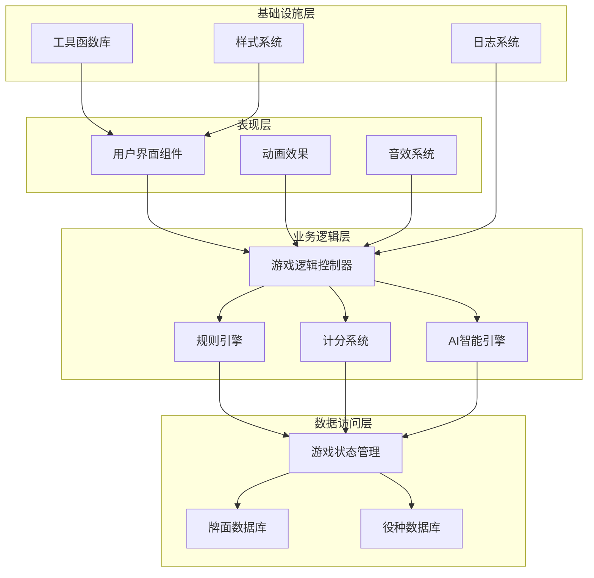

**图表来源**
- [GameMahjongJapanese.tsx](file://src/pages/GameMahjongJapanese.tsx#L163-L220)
- [mahjongRiichi.ts](file://src/lib/mahjongRiichi.ts#L413-L487)

### 数据流架构

游戏的数据流遵循单向数据流原则，确保状态的一致性和可预测性：

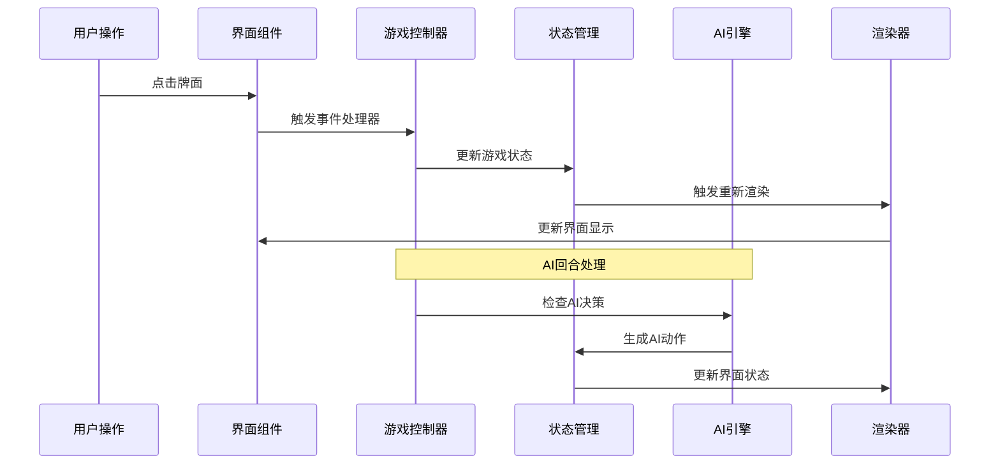

**图表来源**
- [GameMahjongJapanese.tsx](file://src/pages/GameMahjongJapanese.tsx#L222-L245)
- [GameMahjongJapanese.tsx](file://src/pages/GameMahjongJapanese.tsx#L447-L501)

**章节来源**
- [GameMahjongJapanese.tsx](file://src/pages/GameMahjongJapanese.tsx#L163-L220)
- [GameMahjongJapanese.tsx](file://src/pages/GameMahjongJapanese.tsx#L222-L245)

## 详细组件分析

### 日式麻将规则实现

#### 立直系统

立直是日本麻将的核心规则之一，系统实现了完整的立直机制：

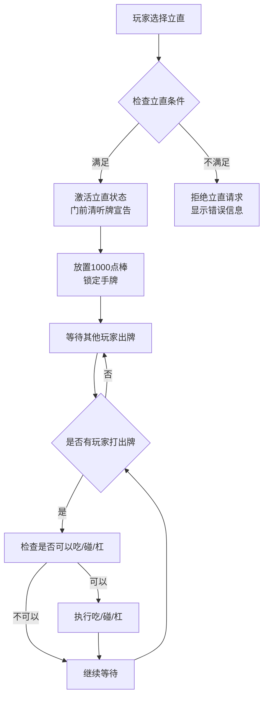

**图表来源**
- [GameMahjongJapanese.tsx](file://src/pages/GameMahjongJapanese.tsx#L100-L108)
- [mahjongRiichi.ts](file://src/lib/mahjongRiichi.ts#L209-L210)

#### 副露系统

副露系统实现了吃、碰、明杠的完整逻辑：

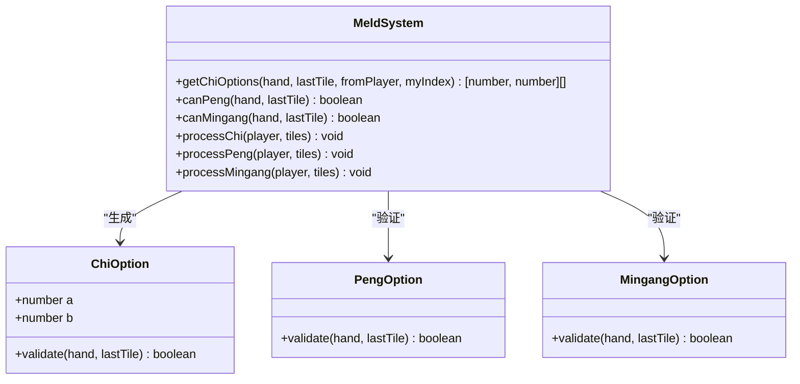

**图表来源**
- [mahjongRiichi.ts](file://src/lib/mahjongRiichi.ts#L105-L146)
- [GameMahjongJapanese.tsx](file://src/pages/GameMahjongJapanese.tsx#L287-L391)

#### 食替系统

食替（切上）系统允许玩家在特定情况下改变已经打出的牌：

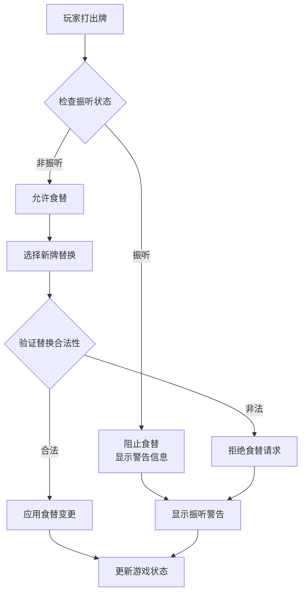

**图表来源**
- [GameMahjongJapanese.tsx](file://src/pages/GameMahjongJapanese.tsx#L184-L202)
- [mahjongRiichi.ts](file://src/lib/mahjongRiichi.ts#L188-L200)

**章节来源**
- [GameMahjongJapanese.tsx](file://src/pages/GameMahjongJapanese.tsx#L287-L391)
- [mahjongRiichi.ts](file://src/lib/mahjongRiichi.ts#L105-L146)

### 界面设计差异

#### 牌面设计

系统实现了符合日式麻将审美的牌面设计：

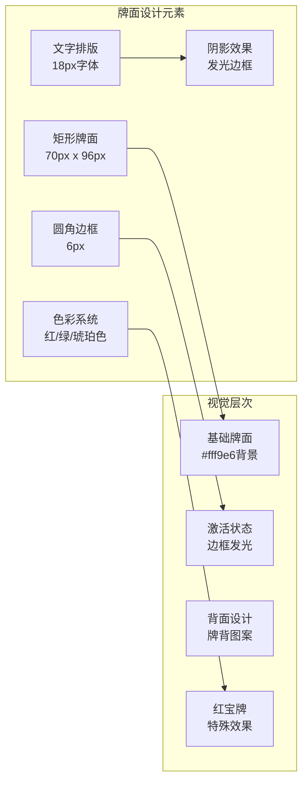

**图表来源**
- [GameMahjongJapanese.tsx](file://src/pages/GameMahjongJapanese.tsx#L25-L29)
- [GameMahjongJapanese.tsx](file://src/pages/GameMahjongJapanese.tsx#L66-L78)

#### 用户界面布局

界面采用响应式设计，适应不同屏幕尺寸：

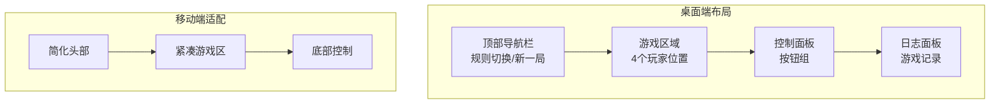

**图表来源**
- [GameMahjongJapanese.tsx](file://src/pages/GameMahjongJapanese.tsx#L938-L1338)
- [App.css](file://src/App.css#L150-L244)

**章节来源**
- [GameMahjongJapanese.tsx](file://src/pages/GameMahjongJapanese.tsx#L938-L1338)
- [App.css](file://src/App.css#L150-L244)

### 游戏流程调整

#### AI行为模拟

系统实现了智能的AI对手，具有不同的难度级别：

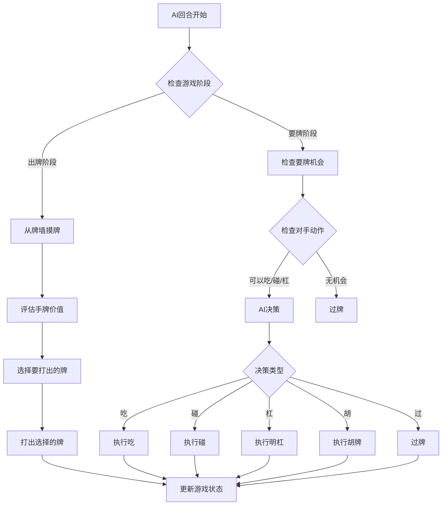

**图表来源**
- [GameMahjongJapanese.tsx](file://src/pages/GameMahjongJapanese.tsx#L725-L891)
- [useMahjongGame.ts](file://src/hooks/useMahjongGame.ts#L765-L770)

#### 回退机制

系统提供了完整的回退功能，便于调试和学习：

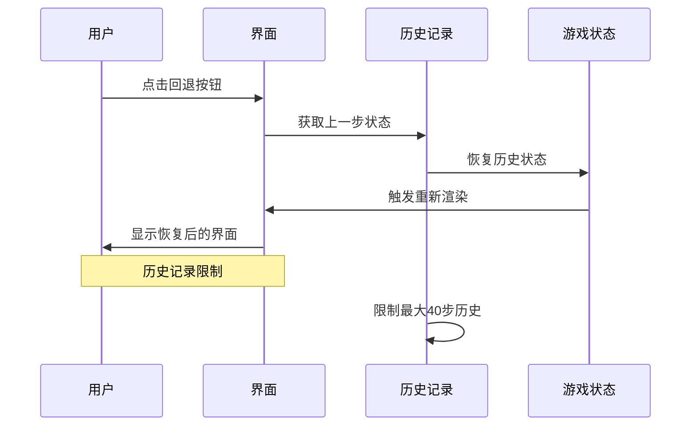

**图表来源**
- [GameMahjongJapanese.tsx](file://src/pages/GameMahjongJapanese.tsx#L204-L211)
- [GameMahjongJapanese.tsx](file://src/pages/GameMahjongJapanese.tsx#L160-L161)

**章节来源**
- [GameMahjongJapanese.tsx](file://src/pages/GameMahjongJapanese.tsx#L204-L211)
- [GameMahjongJapanese.tsx](file://src/pages/GameMahjongJapanese.tsx#L160-L161)

### 日式麻将特有规则实现

#### 振听系统

振听是日本麻将的重要概念，系统实现了完整的振听检测：

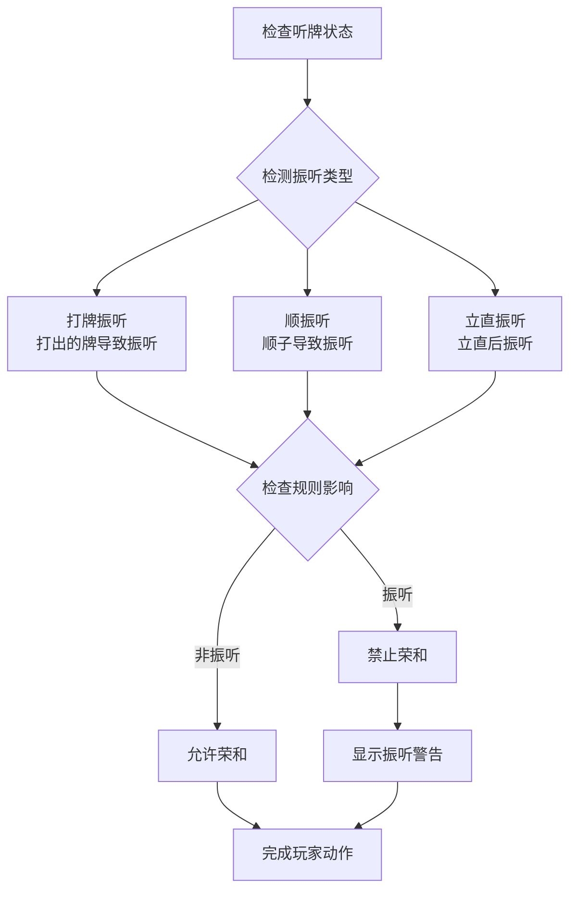

**图表来源**
- [mahjongRiichi.ts](file://src/lib/mahjongRiichi.ts#L188-L200)
- [GameMahjongJapanese.tsx](file://src/pages/GameMahjongJapanese.tsx#L681-L723)

#### 宝牌系统

宝牌系统实现了复杂的计分机制：

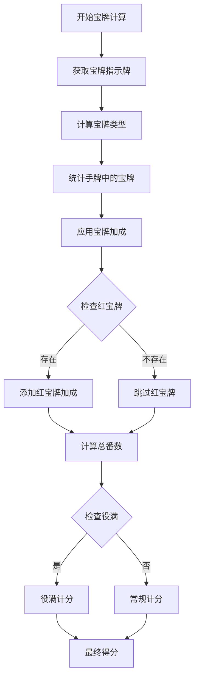

**图表来源**
- [mahjongRiichi.ts](file://src/lib/mahjongRiichi.ts#L86-L97)
- [mahjongRiichi.ts](file://src/lib/mahjongRiichi.ts#L174-L186)

**章节来源**
- [mahjongRiichi.ts](file://src/lib/mahjongRiichi.ts#L86-L97)
- [mahjongRiichi.ts](file://src/lib/mahjongRiichi.ts#L174-L186)

### 计分系统实现

#### 番种计算

系统实现了完整的番种计算机制：

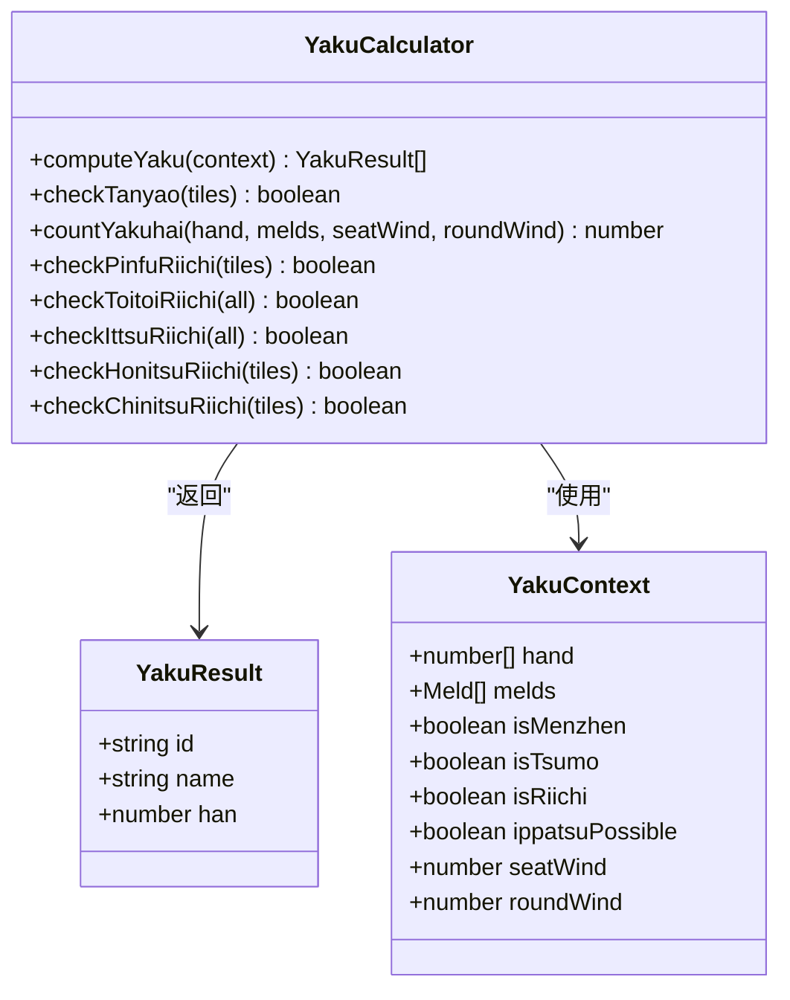

**图表来源**
- [mahjongRiichi.ts](file://src/lib/mahjongRiichi.ts#L413-L487)
- [mahjongRiichi.ts](file://src/lib/mahjongRiichi.ts#L400-L404)

#### 点数计算

点数计算遵循日本麻将的标准公式：

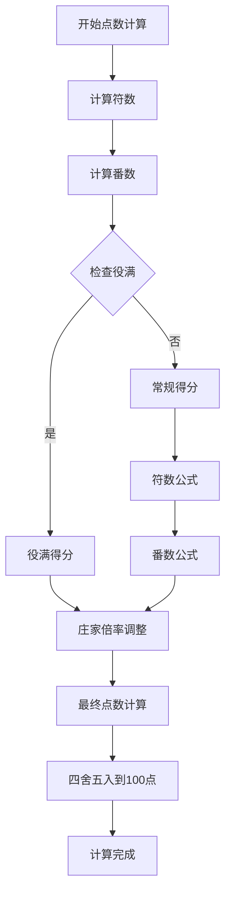

**图表来源**
- [mahjongRiichi.ts](file://src/lib/mahjongRiichi.ts#L240-L249)
- [mahjongRiichi.ts](file://src/lib/mahjongRiichi.ts#L232-L238)

**章节来源**
- [mahjongRiichi.ts](file://src/lib/mahjongRiichi.ts#L413-L487)
- [mahjongRiichi.ts](file://src/lib/mahjongRiichi.ts#L240-L249)

### 牌型判断与和牌条件

#### 和牌形状检测

系统实现了多种和牌形状的检测算法：

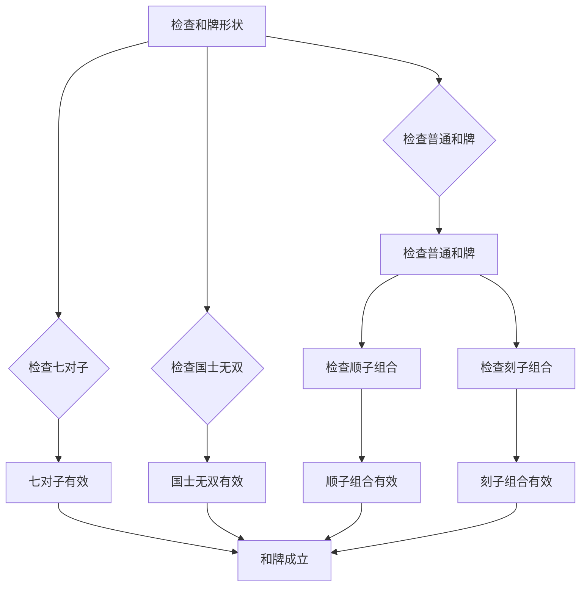

**图表来源**
- [mahjongRiichi.ts](file://src/lib/mahjongRiichi.ts#L322-L380)
- [mahjongRiichi.ts](file://src/lib/mahjongRiichi.ts#L351-L371)

#### 牌型识别算法

系统使用递归回溯算法进行牌型识别：

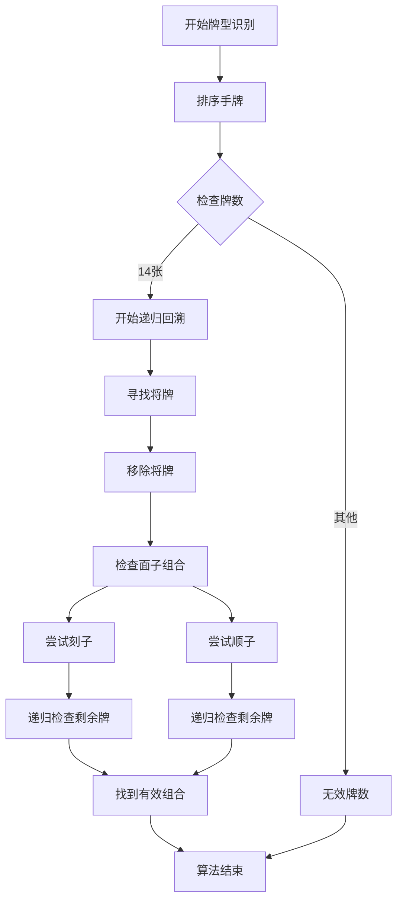

**图表来源**
- [mahjong.ts](file://src/lib/mahjong.ts#L154-L222)
- [mahjong.ts](file://src/lib/mahjong.ts#L75-L90)

**章节来源**
- [mahjongRiichi.ts](file://src/lib/mahjongRiichi.ts#L322-L380)
- [mahjong.ts](file://src/lib/mahjong.ts#L154-L222)

### 术语翻译与文化元素

#### 术语本地化

系统实现了完整的日式麻将术语翻译：

| 中文术语 | 日语原文 | 英文翻译 | 界面显示 |
|---------|---------|---------|---------|
| 立直 | リーチ | Riichi | 立直 |
| 副露 | 副露 | Meld | 副露 |
| 食替 | 食替 | Sutehai | 食替 |
| 振听 | 振聴 | Furiten | 振听 |
| 宝牌 | ドラ | Dora | 宝牌 |
| 红宝牌 | 赤ドラ | Akadora | 红宝牌 |
| 门清 | 門前清 | Menzen | 门清 |
| 自摸 | 自摸 | Tsumo | 自摸 |
| 荣和 | 荣和 | Ron | 荣和 |

#### 文化元素融入

系统在设计中融入了丰富的日本文化元素：

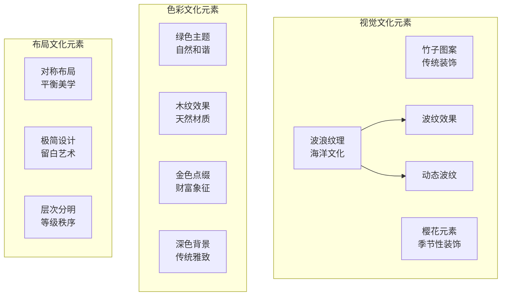

**图表来源**
- [App.css](file://src/App.css#L123-L128)
- [App.css](file://src/App.css#L150-L244)

**章节来源**
- [App.css](file://src/App.css#L123-L128)
- [App.css](file://src/App.css#L150-L244)

## 依赖关系分析

### 组件依赖图

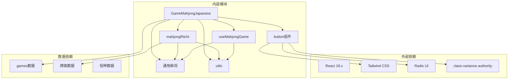

**图表来源**
- [GameMahjongJapanese.tsx](file://src/pages/GameMahjongJapanese.tsx#L1-L20)
- [mahjongRiichi.ts](file://src/lib/mahjongRiichi.ts#L1-L6)
- [useMahjongGame.ts](file://src/hooks/useMahjongGame.ts#L1-L22)

### 数据流依赖

系统采用清晰的数据流向，确保模块间的松耦合：

```mermaid
sequenceDiagram
participant View as 视图层
participant Controller as 控制器
participant Logic as 业务逻辑
participant Data as 数据层
participant UI as UI组件
View->>Controller : 用户交互事件
Controller->>Logic : 规则验证
Logic->>Data : 状态查询
Data->>Logic : 返回数据
Logic->>Controller : 计算结果
Controller->>UI : 更新界面
UI->>View : 视觉反馈
```

**图表来源**
- [GameMahjongJapanese.tsx](file://src/pages/GameMahjongJapanese.tsx#L163-L220)
- [useMahjongGame.ts](file://src/hooks/useMahjongGame.ts#L219-L249)

**章节来源**
- [GameMahjongJapanese.tsx](file://src/pages/GameMahjongJapanese.tsx#L163-L220)
- [useMahjongGame.ts](file://src/hooks/useMahjongGame.ts#L219-L249)

## 性能考量

### 内存管理

系统采用了高效的内存管理策略：

- **状态压缩**：使用JSON序列化存储历史状态，限制最大40步
- **对象池**：复用牌面组件，减少DOM节点创建
- **懒加载**：AI决策延迟执行，避免阻塞主线程

### 渲染优化

```mermaid
flowchart TD
StartRender[开始渲染] --> CheckState{检查状态变化}
CheckState --> |无变化| SkipRender["跳过渲染"]
CheckState --> |有变化| DiffRender["差异渲染"]
DiffRender --> VirtualDOM["虚拟DOM比较"]
VirtualDOM --> BatchUpdate["批量更新"]
BatchUpdate --> CommitUpdate["提交更新"]
SkipRender --> EndRender[渲染完成]
CommitUpdate --> EndRender
```

**图表来源**
- [GameMahjongJapanese.tsx](file://src/pages/GameMahjongJapanese.tsx#L194-L202)
- [utils.ts](file://src/lib/utils.ts#L4-L6)

### 算法优化

- **牌型检测**：使用递归回溯算法，时间复杂度O(3^n)
- **AI决策**：采用概率模型，避免深度搜索
- **计分计算**：缓存中间结果，避免重复计算

## 故障排除指南

### 常见问题诊断

#### 游戏状态异常

```mermaid
flowchart TD
Issue[游戏状态异常] --> CheckHistory{检查历史记录}
CheckHistory --> |历史记录为空| ResetGame["重置游戏"]
CheckHistory --> |历史记录存在| RestoreState["恢复历史状态"]
ResetGame --> ClearLogs["清理日志"]
RestoreState --> DebugInfo["收集调试信息"]
ClearLogs --> RestartGame["重新开始游戏"]
DebugInfo --> AnalyzeIssue["分析问题原因"]
AnalyzeIssue --> FixIssue["修复问题"]
FixIssue --> VerifyFix["验证修复"]
VerifyFix --> End[问题解决]
```

#### 牌面渲染问题

```mermaid
flowchart TD
RenderIssue[牌面渲染问题] --> CheckTileType{检查牌类型}
CheckTileType --> |数字牌| CheckColor["检查颜色配置"]
CheckTileType --> |字牌| CheckFont["检查字体设置"]
CheckTileType --> |红宝牌| CheckEffect["检查特效配置"]
CheckColor --> ColorFix["修复颜色问题"]
CheckFont --> FontFix["修复字体问题"]
CheckEffect --> EffectFix["修复特效问题"]
ColorFix --> TestRender["测试渲染效果"]
FontFix --> TestRender
EffectFix --> TestRender
TestRender --> VerifyFix["验证修复效果"]
VerifyFix --> End[问题解决]
```

**章节来源**
- [GameMahjongJapanese.tsx](file://src/pages/GameMahjongJapanese.tsx#L194-L202)
- [GameMahjongJapanese.tsx](file://src/pages/GameMahjongJapanese.tsx#L184-L202)

### 调试工具

系统提供了完善的调试工具：

- **日志系统**：记录所有游戏事件和状态变化
- **历史回放**：支持回退到任意历史步骤
- **状态监控**：实时显示游戏状态和AI决策过程
- **性能分析**：监控渲染性能和内存使用情况

## 结论

Rsbuild2项目中的日本麻将页面展现了现代Web应用开发的最佳实践。通过精心设计的架构、完善的日式麻将规则实现和优秀的用户体验，该项目成功地将复杂的传统游戏规则转化为直观易用的数字产品。

### 主要成就

1. **完整规则实现**：准确实现了立直、副露、食替、振听等所有日式麻将规则
2. **优秀用户体验**：提供流畅的操作体验和精美的视觉效果
3. **智能AI系统**：实现了具有挑战性的AI对手
4. **可维护架构**：采用模块化设计，便于后续扩展和维护

### 技术亮点

- **React Hooks模式**：充分利用现代React特性
- **类型安全**：完整的TypeScript类型定义
- **性能优化**：高效的渲染和状态管理
- **国际化支持**：完整的术语翻译和文化元素

### 未来发展方向

1. **AI能力提升**：引入更高级的AI算法
2. **多人在线**：支持网络对战功能
3. **移动端优化**：进一步优化移动端体验
4. **数据分析**：增加游戏统计和分析功能

这个项目不仅是一个成功的商业产品，更是传统游戏文化数字化传承的典范，为其他类似项目提供了宝贵的参考经验。