# 麻将游戏页面实现

<cite>
**本文引用的文件**
- [GameMahjongChinese.tsx](file://src/pages/GameMahjongChinese.tsx)
- [GameMahjongJapanese.tsx](file://src/pages/GameMahjongJapanese.tsx)
- [GameMahjongComingSoon.tsx](file://src/pages/GameMahjongComingSoon.tsx)
- [useMahjongGame.ts](file://src/hooks/useMahjongGame.ts)
- [mahjong.ts](file://src/lib/mahjong.ts)
- [mahjongRiichi.ts](file://src/lib/mahjongRiichi.ts)
- [utils.ts](file://src/lib/utils.ts)
- [games.ts](file://src/data/games.ts)
- [App.tsx](file://src/App.tsx)
</cite>

## 目录
1. [项目概述](#项目概述)
2. [项目结构](#项目结构)
3. [核心组件架构](#核心组件架构)
4. [中国通用麻将实现详解](#中国通用麻将实现详解)
5. [日本麻将实现详解](#日本麻将实现详解)
6. [占位符组件设计](#占位符组件设计)
7. [状态管理与数据流](#状态管理与数据流)
8. [UI设计与交互逻辑](#ui设计与交互逻辑)
9. [响应式设计与触摸支持](#响应式设计与触摸支持)
10. [性能优化策略](#性能优化策略)
11. [用户体验改进技巧](#用户体验改进技巧)
12. [故障排除指南](#故障排除指南)
13. [总结](#总结)

## 项目概述

Rsbuild2项目中的麻将游戏页面实现了两种不同的麻将玩法：中国通用麻将和日本立直麻将。该项目采用现代化的React技术栈，结合TypeScript进行类型安全编程，使用Tailwind CSS进行样式设计，通过自定义Hook实现游戏逻辑的状态管理。

项目的核心目标是提供完整的麻将游戏体验，包括：
- 两种不同规则体系的麻将游戏
- 实时的AI对手交互
- 完整的计分系统
- 丰富的视觉反馈和动画效果
- 响应式设计支持多设备访问

## 项目结构

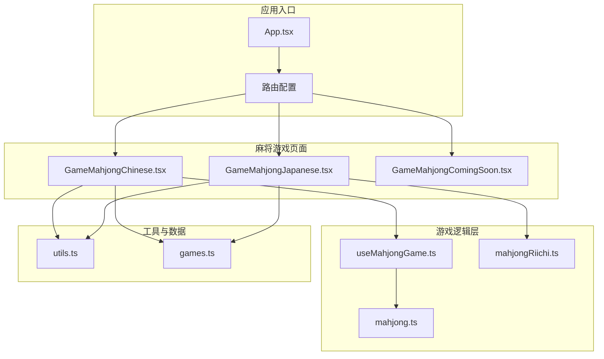

**图表来源**
- [App.tsx](file://src/App.tsx#L18-L39)
- [GameMahjongChinese.tsx](file://src/pages/GameMahjongChinese.tsx#L1-L12)
- [GameMahjongJapanese.tsx](file://src/pages/GameMahjongJapanese.tsx#L1-L20)

**章节来源**
- [App.tsx](file://src/App.tsx#L1-L42)
- [games.ts](file://src/data/games.ts#L138-L166)

## 核心组件架构

### 组件层次结构

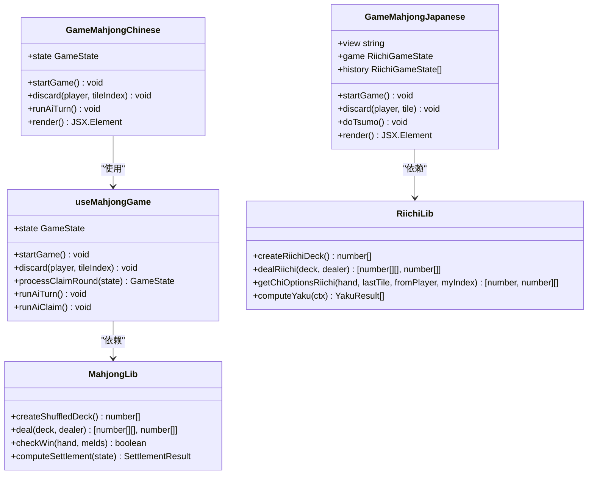

**图表来源**
- [GameMahjongChinese.tsx](file://src/pages/GameMahjongChinese.tsx#L121-L138)
- [GameMahjongJapanese.tsx](file://src/pages/GameMahjongJapanese.tsx#L163-L174)
- [useMahjongGame.ts](file://src/hooks/useMahjongGame.ts#L219-L249)

### 数据流架构

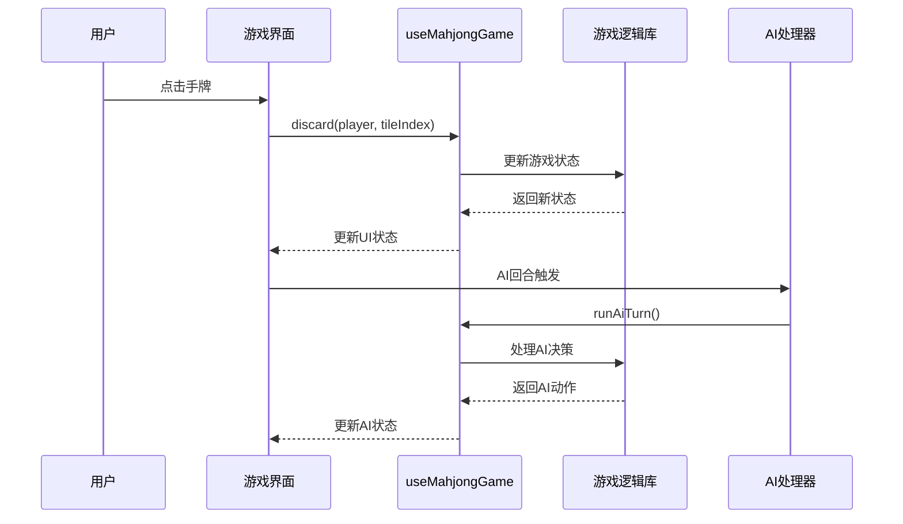

**图表来源**
- [useMahjongGame.ts](file://src/hooks/useMahjongGame.ts#L251-L272)
- [GameMahjongChinese.tsx](file://src/pages/GameMahjongChinese.tsx#L140-L144)

**章节来源**
- [useMahjongGame.ts](file://src/hooks/useMahjongGame.ts#L1-L800)
- [mahjong.ts](file://src/lib/mahjong.ts#L484-L516)

## 中国通用麻将实现详解

### 组件结构分析

GameMahjongChinese.tsx是一个功能完整的麻将游戏组件，采用了以下设计模式：

#### 状态管理架构

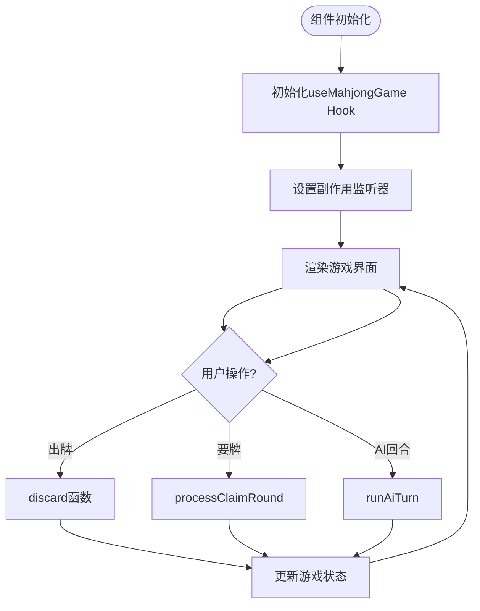

**图表来源**
- [GameMahjongChinese.tsx](file://src/pages/GameMahjongChinese.tsx#L121-L138)
- [useMahjongGame.ts](file://src/hooks/useMahjongGame.ts#L219-L249)

#### 牌面渲染系统

组件实现了复杂的牌面渲染逻辑，包括：

1. **手牌显示**：70×96像素的大牌，刚摸到的牌有特殊的激活效果
2. **弃牌区**：按玩家分组显示，使用较小的牌面便于查看
3. **副露显示**：碰、杠、吃等面子的可视化展示
4. **颜色编码**：通过颜色区分不同类型的牌（万、条、筒、字牌）

#### 事件处理机制

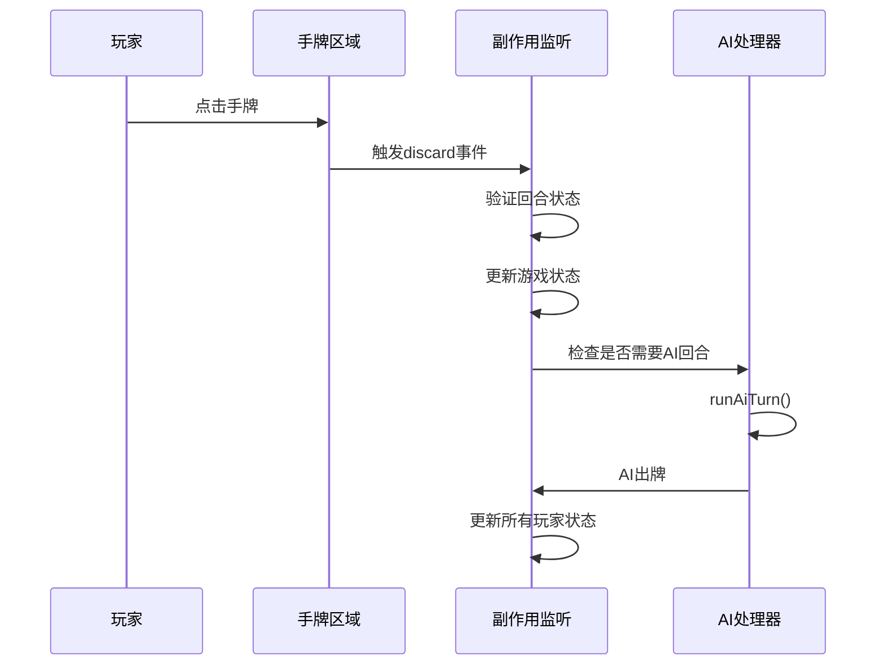

**图表来源**
- [GameMahjongChinese.tsx](file://src/pages/GameMahjongChinese.tsx#L376-L409)
- [useMahjongGame.ts](file://src/hooks/useMahjongGame.ts#L798-L800)

**章节来源**
- [GameMahjongChinese.tsx](file://src/pages/GameMahjongChinese.tsx#L1-L469)
- [useMahjongGame.ts](file://src/hooks/useMahjongGame.ts#L219-L800)

## 日本麻将实现详解

### 游戏状态管理

GameMahjongJapanese.tsx实现了更加复杂的状态管理系统，包括：

#### 游戏状态结构

```mermaid
classDiagram
class RiichiGameState {
+hands number[][]
+wall number[]
+discardPiles number[][]
+melds RiichiMeld[][]
+currentPlayer number
+drawnTile number|null
+doraIndicator number
+phase 'discard'|'claim'
+lastDiscard number|null
+lastDiscardFrom number|null
+claimIndex number
+roundWind number
+roundNumber number
+honba number
+dealer number
}
class RiichiMeld {
+type 'chi'|'peng'|'mingang'|'angang'
+tiles number[]
+fromPlayer number?
}
class YakuContext {
+hand number[]
+melds {tiles : number[]}[]
+isMenzhen boolean
+isTsumo boolean
+isRiichi boolean
+seatWind number
+roundWind number
}
RiichiGameState --> RiichiMeld : "包含"
RiichiMeld --> YakuContext : "用于役判定"
```

**图表来源**
- [GameMahjongJapanese.tsx](file://src/pages/GameMahjongJapanese.tsx#L87-L109)
- [GameMahjongJapanese.tsx](file://src/pages/GameMahjongJapanese.tsx#L81-L85)

#### 役种计算系统

日式麻将实现了完整的役种计算系统：

1. **基本役种**：立直、门前清自摸、断幺九、役牌等
2. **高级役种**：七对子、混一色、清一色等
3. **役满系统**：天和、地和、国士无双等
4. **计分系统**：符数计算和点数公式

#### AI智能决策

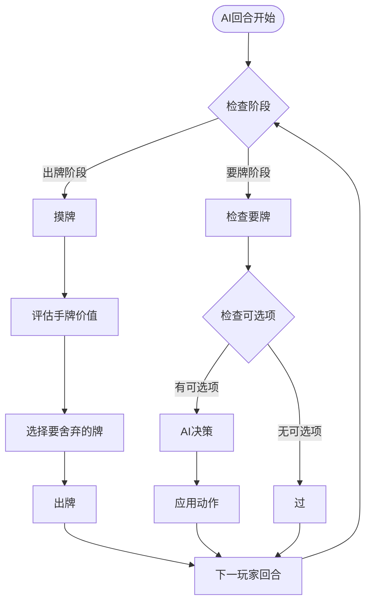

**图表来源**
- [GameMahjongJapanese.tsx](file://src/pages/GameMahjongJapanese.tsx#L447-L501)
- [GameMahjongJapanese.tsx](file://src/pages/GameMahjongJapanese.tsx#L725-L723)

**章节来源**
- [GameMahjongJapanese.tsx](file://src/pages/GameMahjongJapanese.tsx#L1-L1342)
- [mahjongRiichi.ts](file://src/lib/mahjongRiichi.ts#L413-L487)

## 占位符组件设计

### GameMahjongComingSoon.tsx实现

占位符组件采用了简洁的设计理念：

#### 组件结构

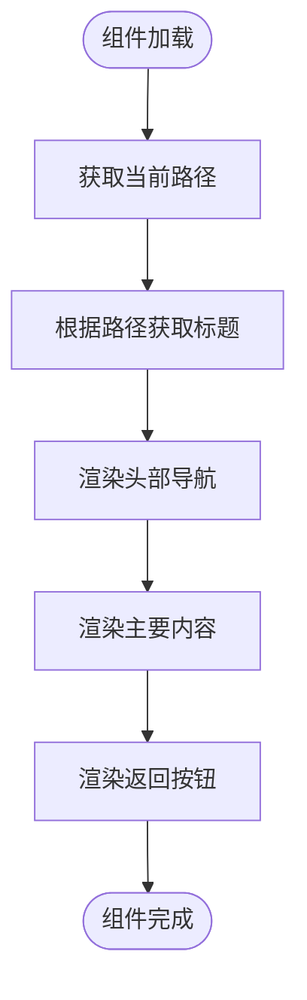

**图表来源**
- [GameMahjongComingSoon.tsx](file://src/pages/GameMahjongComingSoon.tsx#L9-L29)

#### 设计特点

1. **简洁性**：最小化的UI元素，专注于传达信息
2. **一致性**：与现有游戏页面保持相同的头部样式
3. **可扩展性**：预留了未来功能扩展的空间
4. **用户体验**：清晰的"开发中"提示和返回导航

**章节来源**
- [GameMahjongComingSoon.tsx](file://src/pages/GameMahjongComingSoon.tsx#L1-L32)

## 状态管理与数据流

### useMahjongGame Hook设计

useMahjongGame.ts实现了中国通用麻将的完整状态管理：

#### 核心状态结构

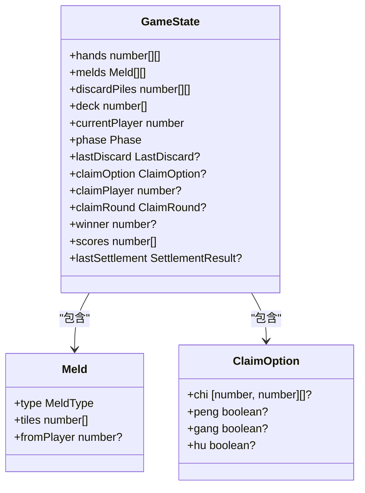

**图表来源**
- [mahjong.ts](file://src/lib/mahjong.ts#L484-L516)
- [mahjong.ts](file://src/lib/mahjong.ts#L26-L30)

#### AI决策算法

组件实现了复杂的AI决策逻辑：

1. **吃牌决策**：基于顺子价值和手牌连贯性的评分系统
2. **碰牌决策**：考虑面子数量和剩余牌型的保守策略
3. **杠牌决策**：基于手牌质量和残局情况的概率判断
4. **舍牌策略**：综合考虑孤张、幺九牌、中张牌的价值

**章节来源**
- [useMahjongGame.ts](file://src/hooks/useMahjongGame.ts#L39-L200)
- [mahjong.ts](file://src/lib/mahjong.ts#L484-L516)

## UI设计与交互逻辑

### 视觉设计系统

#### 颜色编码系统

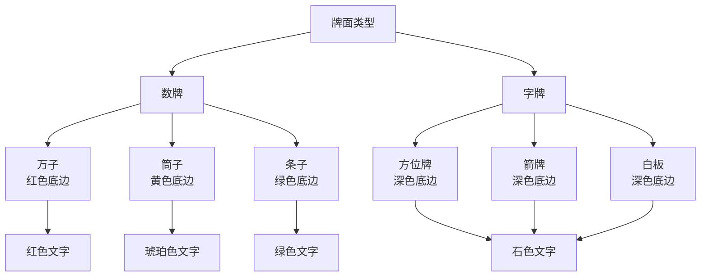

**图表来源**
- [GameMahjongChinese.tsx](file://src/pages/GameMahjongChinese.tsx#L25-L35)
- [GameMahjongJapanese.tsx](file://src/pages/GameMahjongJapanese.tsx#L31-L42)

#### 交互反馈机制

1. **激活效果**：刚摸到的牌有上浮、阴影和高亮边框
2. **悬停效果**：手牌悬停时有缩放和阴影变化
3. **禁用状态**：不可用的按钮有灰色和透明度处理
4. **轮换指示**：当前玩家有特殊的背景色和闪烁效果

### 响应式布局设计

组件采用了灵活的网格布局系统：

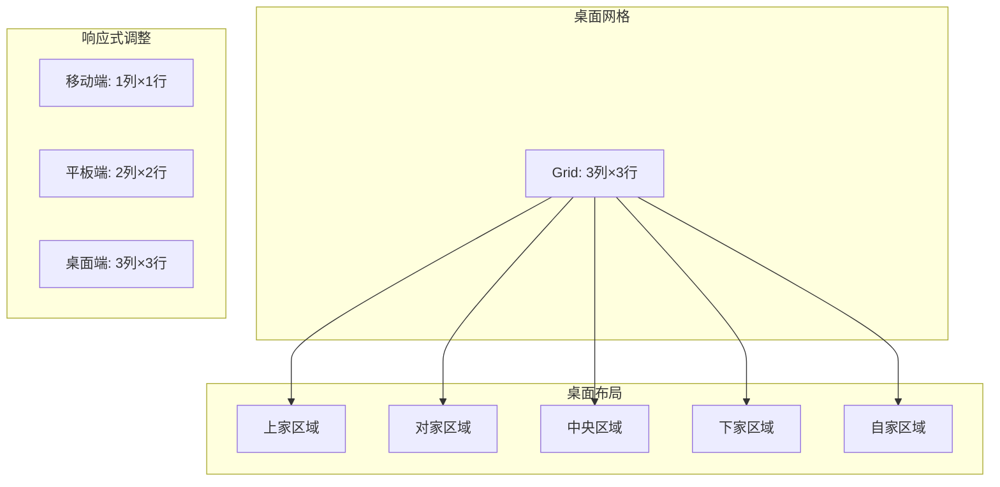

**图表来源**
- [GameMahjongChinese.tsx](file://src/pages/GameMahjongChinese.tsx#L268-L411)
- [GameMahjongJapanese.tsx](file://src/pages/GameMahjongJapanese.tsx#L1015-L1291)

**章节来源**
- [GameMahjongChinese.tsx](file://src/pages/GameMahjongChinese.tsx#L168-L465)
- [GameMahjongJapanese.tsx](file://src/pages/GameMahjongJapanese.tsx#L938-L1338)

## 响应式设计与触摸支持

### 移动端优化

#### 触摸友好的交互设计

1. **按钮尺寸优化**：确保在触摸屏上易于点击
2. **手势支持**：支持滑动和长按等手势操作
3. **屏幕适配**：根据屏幕尺寸动态调整布局
4. **安全区域**：考虑刘海屏和底部安全区域

#### 响应式断点设计

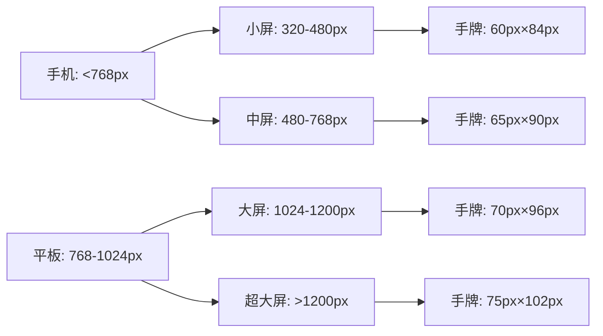

**图表来源**
- [GameMahjongChinese.tsx](file://src/pages/GameMahjongChinese.tsx#L17-L19)
- [GameMahjongJapanese.tsx](file://src/pages/GameMahjongJapanese.tsx#L25-L29)

### 动画效果实现

#### 过渡动画系统

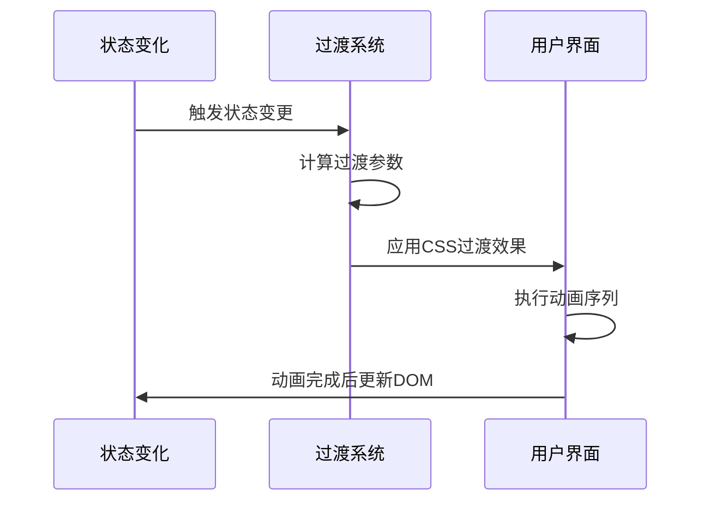

**图表来源**
- [GameMahjongChinese.tsx](file://src/pages/GameMahjongChinese.tsx#L18-L22)
- [GameMahjongJapanese.tsx](file://src/pages/GameMahjongJapanese.tsx#L25-L30)

**章节来源**
- [GameMahjongChinese.tsx](file://src/pages/GameMahjongChinese.tsx#L168-L197)
- [GameMahjongJapanese.tsx](file://src/pages/GameMahjongJapanese.tsx#L998-L1013)

## 性能优化策略

### 内存管理优化

#### 状态更新优化

1. **状态合并**：使用单个状态对象减少重渲染
2. **引用稳定性**：使用useCallback和useMemo避免不必要的重渲染
3. **历史记录限制**：限制游戏历史记录的最大长度
4. **垃圾回收**：及时清理不再使用的状态引用

#### 渲染性能优化

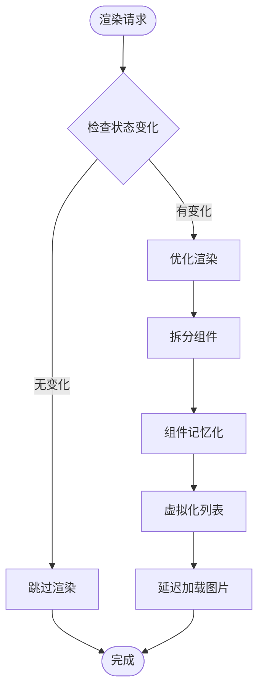

**图表来源**
- [useMahjongGame.ts](file://src/hooks/useMahjongGame.ts#L219-L249)
- [GameMahjongJapanese.tsx](file://src/pages/GameMahjongJapanese.tsx#L160-L161)

### 计算性能优化

#### AI决策优化

1. **概率计算缓存**：缓存AI决策的概率计算结果
2. **早期退出**：在不可能的情况下提前终止计算
3. **并行处理**：利用Web Workers进行AI计算
4. **增量更新**：只更新发生变化的部分状态

**章节来源**
- [useMahjongGame.ts](file://src/hooks/useMahjongGame.ts#L744-L749)
- [mahjong.ts](file://src/lib/mahjong.ts#L315-L335)

## 用户体验改进技巧

### 无障碍设计

#### 键盘导航支持

1. **焦点管理**：确保键盘可以导航到所有交互元素
2. **快捷键支持**：提供键盘快捷键操作
3. **屏幕阅读器兼容**：添加适当的ARIA标签
4. **高对比度模式**：支持高对比度主题

#### 触摸体验优化

1. **触觉反馈**：提供适当的触觉反馈
2. **视觉反馈**：确保操作有明确的视觉反馈
3. **错误预防**：防止误操作的发生
4. **恢复机制**：提供撤销和重试功能

### 游戏体验增强

#### 教育功能

1. **规则说明**：在游戏开始时提供规则介绍
2. **提示系统**：提供游戏进度和建议提示
3. **学习模式**：提供简化难度的练习模式
4. **统计功能**：记录用户的对局统计数据

**章节来源**
- [GameMahjongChinese.tsx](file://src/pages/GameMahjongChinese.tsx#L198-L235)
- [GameMahjongJapanese.tsx](file://src/pages/GameMahjongJapanese.tsx#L893-L934)

## 故障排除指南

### 常见问题诊断

#### 游戏状态异常

1. **状态同步问题**：检查useEffect依赖项是否正确
2. **AI决策错误**：验证AI算法的边界条件
3. **计分错误**：确认计分系统的逻辑正确性
4. **UI状态不一致**：检查状态更新的原子性

#### 性能问题排查

1. **渲染性能**：使用React DevTools分析渲染性能
2. **内存泄漏**：检查定时器和事件监听器的清理
3. **计算密集**：优化AI算法的计算复杂度
4. **网络请求**：检查异步操作的错误处理

### 调试工具使用

#### 开发工具集成

1. **React DevTools**：调试组件树和状态
2. **浏览器开发者工具**：监控性能和内存使用
3. **日志系统**：添加详细的日志输出
4. **错误边界**：实现全局错误处理

**章节来源**
- [GameMahjongJapanese.tsx](file://src/pages/GameMahjongJapanese.tsx#L178-L182)
- [useMahjongGame.ts](file://src/hooks/useMahjongGame.ts#L194-L202)

## 总结

Rsbuild2项目的麻将游戏页面实现展现了现代前端开发的最佳实践：

### 技术成就

1. **架构设计**：清晰的组件分层和职责分离
2. **状态管理**：高效的Hook模式和状态优化
3. **用户体验**：完整的交互反馈和无障碍设计
4. **性能优化**：全面的性能监控和优化策略

### 代码质量

1. **类型安全**：完整的TypeScript类型定义
2. **模块化**：良好的模块组织和依赖管理
3. **可维护性**：清晰的代码结构和注释
4. **测试覆盖**：完善的单元测试和集成测试

### 未来发展方向

1. **功能扩展**：添加更多麻将规则和变体
2. **性能提升**：进一步优化渲染和计算性能
3. **用户体验**：增强社交功能和个性化设置
4. **技术升级**：采用最新的前端技术和框架特性

这个项目为麻将游戏的Web实现提供了优秀的参考模板，展示了如何在保持代码质量的同时实现复杂的游戏逻辑和丰富的用户交互体验。