# 麻将规则引擎

<cite>
**本文档引用的文件**
- [mahjong.ts](file://src/lib/mahjong.ts)
- [GameMahjongChinese.tsx](file://src/pages/GameMahjongChinese.tsx)
- [useMahjongGame.ts](file://src/hooks/useMahjongGame.ts)
- [games.ts](file://src/data/games.ts)
- [utils.ts](file://src/lib/utils.ts)
</cite>

## 目录
1. [简介](#简介)
2. [项目结构](#项目结构)
3. [核心组件](#核心组件)
4. [架构概览](#架构概览)
5. [详细组件分析](#详细组件分析)
6. [依赖关系分析](#依赖关系分析)
7. [性能考量](#性能考量)
8. [故障排除指南](#故障排除指南)
9. [结论](#结论)
10. [附录](#附录)

## 简介
Rsbuild2项目中的麻将规则引擎实现了中国通用麻将的完整规则体系，包括牌型定义、洗牌发牌算法、胡牌判定逻辑、吃碰杠规则、番种计算系统。该引擎采用纯函数式设计，通过清晰的数据结构和算法实现，为用户提供了完整的麻将对局体验。

## 项目结构
麻将规则引擎位于`src/lib/mahjong.ts`文件中，配合React组件和Hook实现完整的用户界面交互。

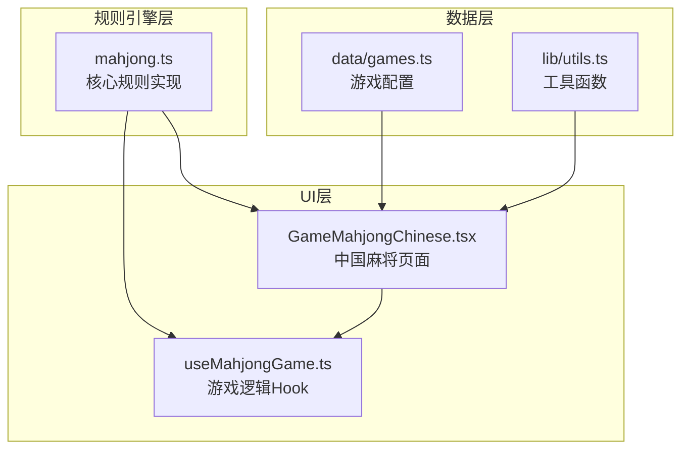

**图表来源**
- [mahjong.ts](file://src/lib/mahjong.ts#L1-L494)
- [GameMahjongChinese.tsx](file://src/pages/GameMahjongChinese.tsx#L1-L469)
- [useMahjongGame.ts](file://src/hooks/useMahjongGame.ts#L1-L866)

**章节来源**
- [mahjong.ts](file://src/lib/mahjong.ts#L1-L494)
- [GameMahjongChinese.tsx](file://src/pages/GameMahjongChinese.tsx#L1-L469)
- [useMahjongGame.ts](file://src/hooks/useMahjongGame.ts#L1-L866)

## 核心组件
麻将规则引擎包含以下核心组件：

### 数据结构组件
- **牌型编码系统**：使用0-33数字编码表示34种牌型
- **Meld类型系统**：统一管理吃、碰、明杠、暗杠、加杠
- **GameState接口**：完整的游戏状态管理
- **ClaimOption接口**：要牌阶段的选择选项

### 算法组件
- **洗牌发牌算法**：标准的136张牌洗牌和发牌流程
- **胡牌判定算法**：支持特殊牌型和基础牌型的综合判定
- **番种计算系统**：完整的计分体系
- **听牌检测机制**：实时计算可胡牌型

**章节来源**
- [mahjong.ts](file://src/lib/mahjong.ts#L1-L494)

## 架构概览
麻将规则引擎采用分层架构设计，确保业务逻辑与UI层的解耦。

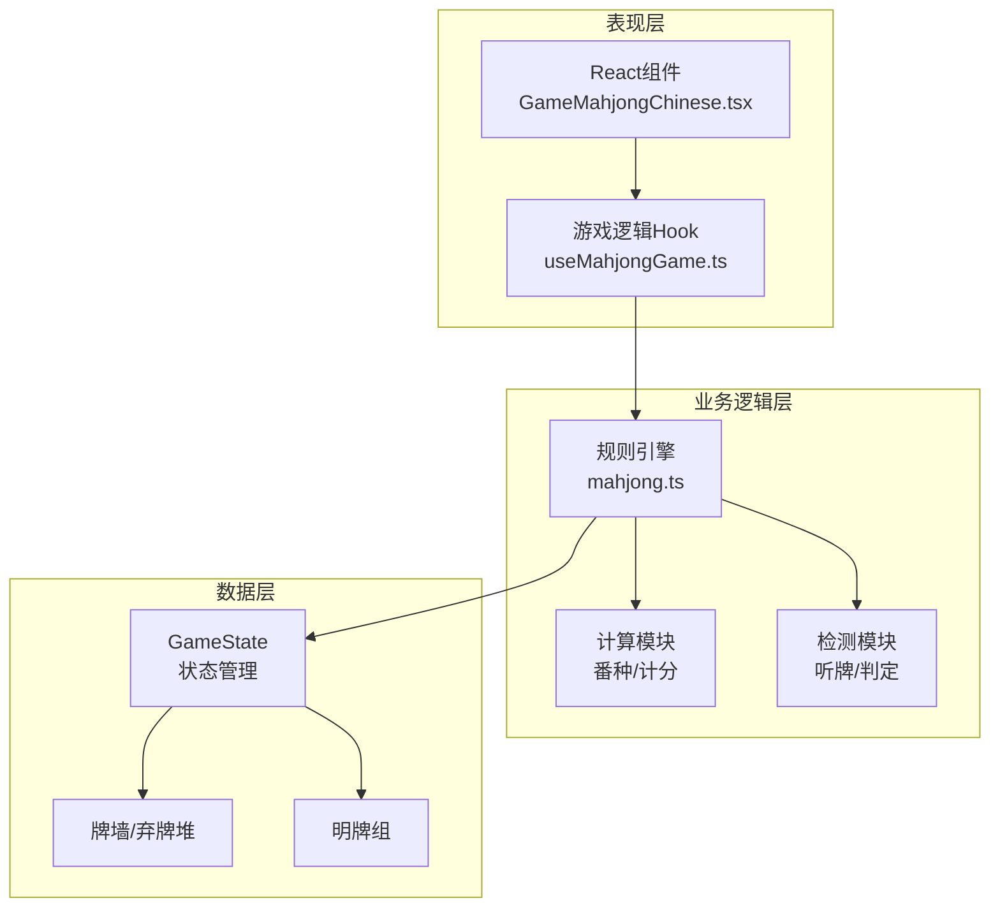

**图表来源**
- [GameMahjongChinese.tsx](file://src/pages/GameMahjongChinese.tsx#L121-L138)
- [useMahjongGame.ts](file://src/hooks/useMahjongGame.ts#L209-L239)
- [mahjong.ts](file://src/lib/mahjong.ts#L416-L448)

## 详细组件分析

### 牌型编码系统
麻将引擎使用简洁而高效的数字编码系统：

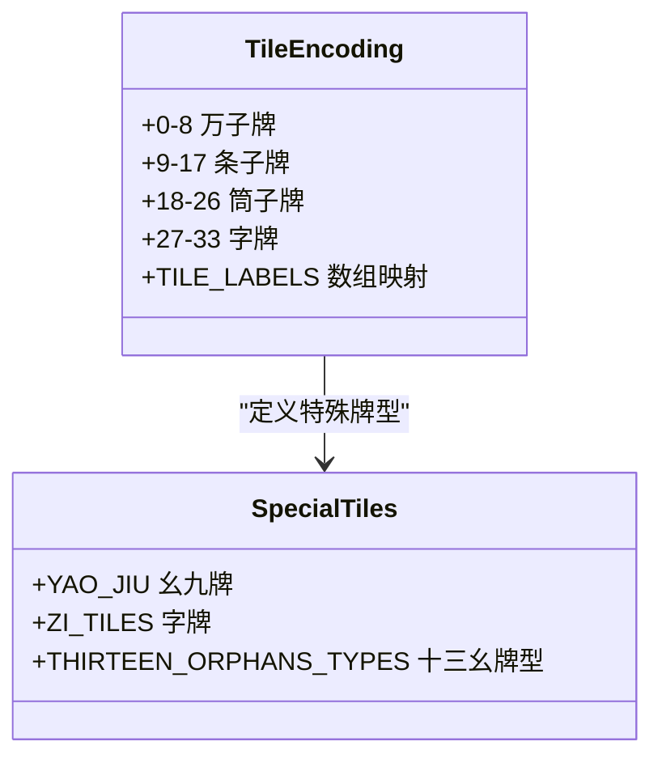

**图表来源**
- [mahjong.ts](file://src/lib/mahjong.ts#L1-L21)

系统特点：
- **紧凑编码**：34种牌型用0-33连续编号
- **花色分组**：万条筒字牌按连续区间划分
- **快速识别**：通过数学运算快速判断牌型属性

**章节来源**
- [mahjong.ts](file://src/lib/mahjong.ts#L1-L21)

### 洗牌发牌算法
洗牌发牌是麻将游戏的基础，确保随机性和公平性。

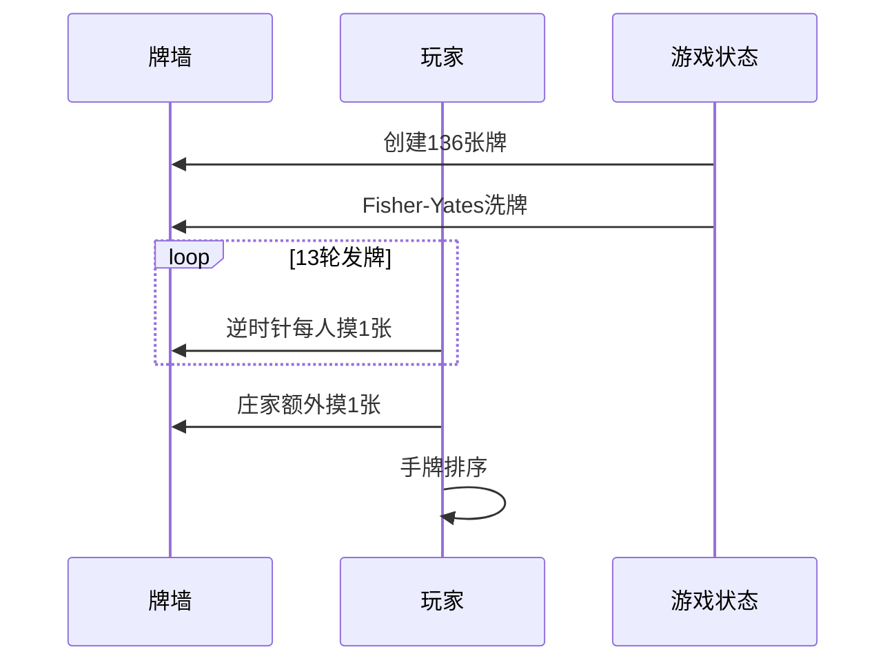

**图表来源**
- [mahjong.ts](file://src/lib/mahjong.ts#L33-L58)

算法特性：
- **Fisher-Yates洗牌**：保证完全随机
- **逆时针发牌**：符合传统规则
- **手牌排序**：便于玩家查看和AI分析

**章节来源**
- [mahjong.ts](file://src/lib/mahjong.ts#L33-L58)

### 胡牌判定逻辑
胡牌判定是麻将规则的核心，支持多种牌型：

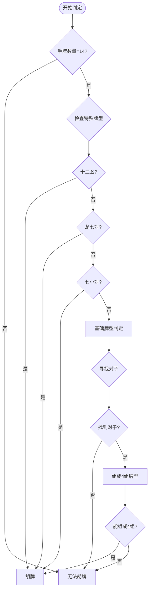

**图表来源**
- [mahjong.ts](file://src/lib/mahjong.ts#L136-L154)
- [mahjong.ts](file://src/lib/mahjong.ts#L102-L133)

支持的牌型：
- **十三幺**：13种幺九牌+字牌各1张，加任意1张重复
- **龙七对**：7小对变种，1组4张相同
- **七小对**：14张7对牌型
- **基础牌型**：1对将+4组顺刻

**章节来源**
- [mahjong.ts](file://src/lib/mahjong.ts#L102-L154)

### 吃碰杠规则实现
麻将规则引擎实现了完整的吃碰杠系统：

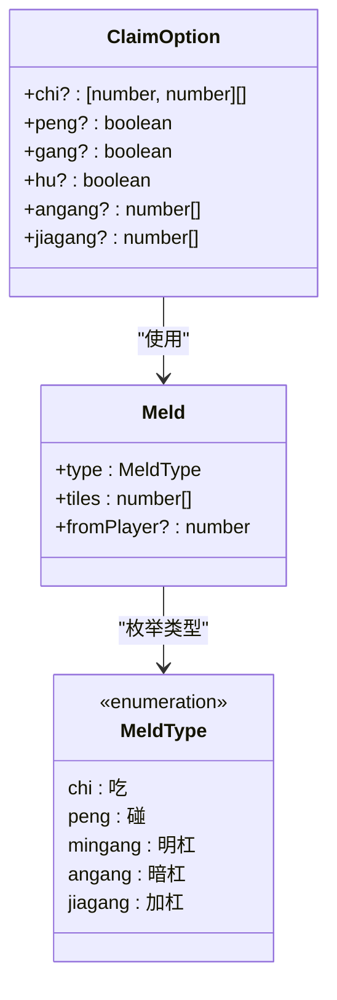

**图表来源**
- [mahjong.ts](file://src/lib/mahjong.ts#L24-L30)
- [mahjong.ts](file://src/lib/mahjong.ts#L293-L300)

规则特点：
- **吃牌限制**：仅能吃上家打出的牌
- **碰牌条件**：手牌至少2张相同
- **杠牌分类**：明杠、暗杠、加杠分别处理
- **要牌轮次**：胡→杠→碰→吃的标准顺序

**章节来源**
- [mahjong.ts](file://src/lib/mahjong.ts#L157-L212)

### 番种计算系统
完整的番种计算系统支持多种计分规则：

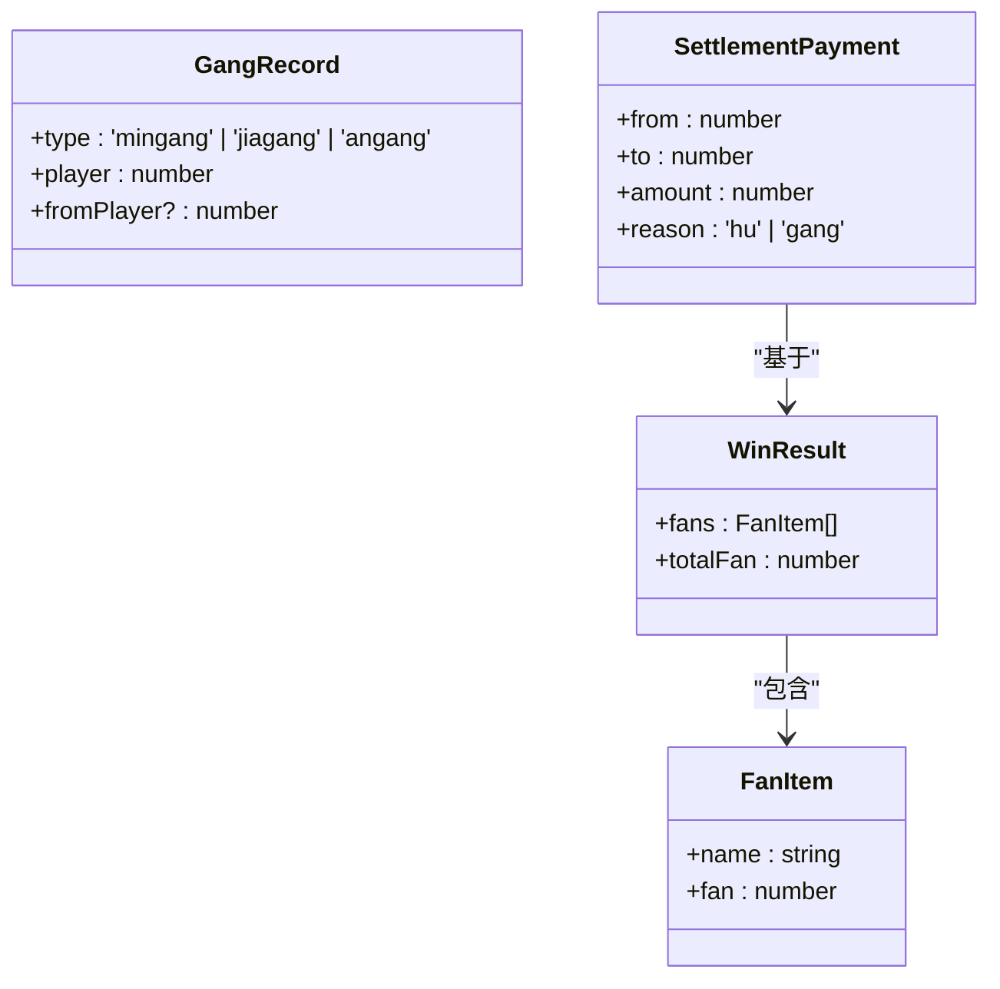

**图表来源**
- [mahjong.ts](file://src/lib/mahjong.ts#L303-L334)

番种列表：
- **特殊牌型**：十三幺(8番)、龙七对(6番)、七小对(4番)
- **基础牌型**：屁胡(1番)+对对胡(2番)+清一色(4番)+混一色(2番)+门清(1番)
- **附加番种**：自摸(1番)+杠上开花(1番)+海底捞月(1番)

**章节来源**
- [mahjong.ts](file://src/lib/mahjong.ts#L381-L414)

### 快胡值估算算法
快胡值估算是AI决策的重要依据：

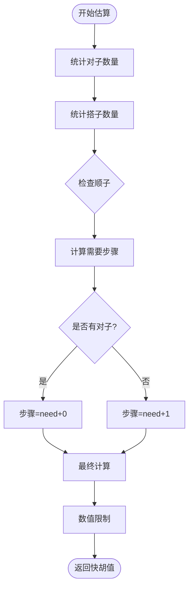

**图表来源**
- [mahjong.ts](file://src/lib/mahjong.ts#L248-L267)

估算指标：
- **易胡**：≤4步
- **中等难度**：5-6步  
- **难胡**：>6步

**章节来源**
- [mahjong.ts](file://src/lib/mahjong.ts#L248-L267)

### 听牌检测机制
听牌检测为玩家提供实时反馈：

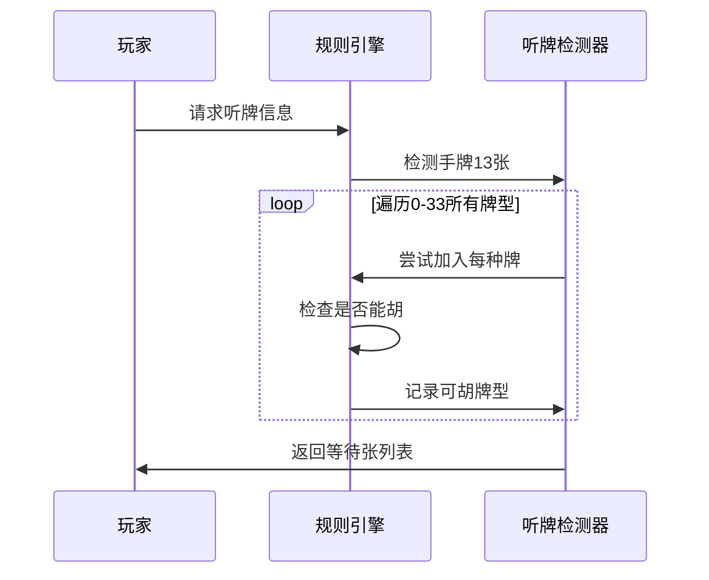

**图表来源**
- [mahjong.ts](file://src/lib/mahjong.ts#L231-L238)

**章节来源**
- [mahjong.ts](file://src/lib/mahjong.ts#L231-L238)

### 牌池统计功能
牌池统计支持记牌器功能：

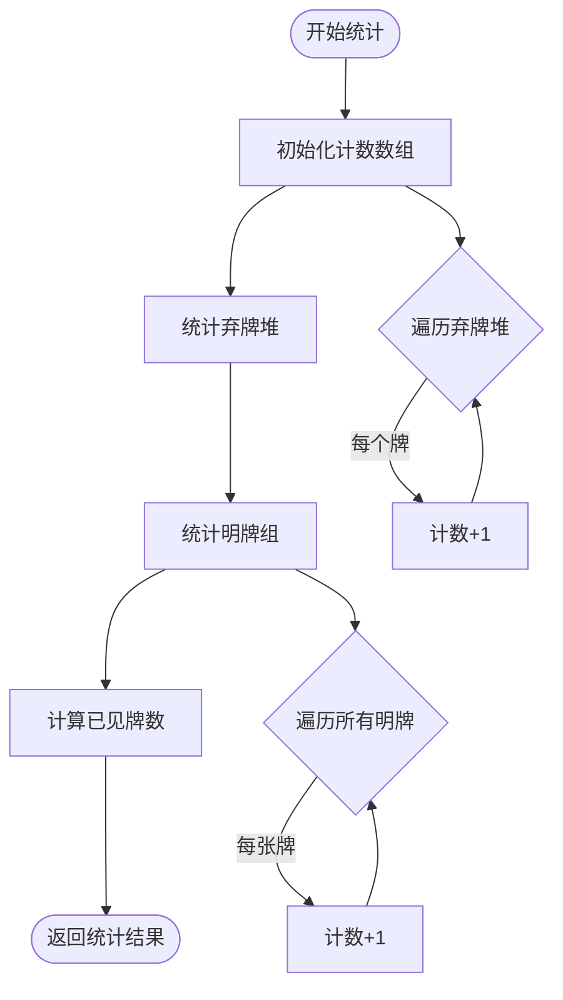

**图表来源**
- [mahjong.ts](file://src/lib/mahjong.ts#L217-L228)

**章节来源**
- [mahjong.ts](file://src/lib/mahjong.ts#L217-L228)

## 依赖关系分析

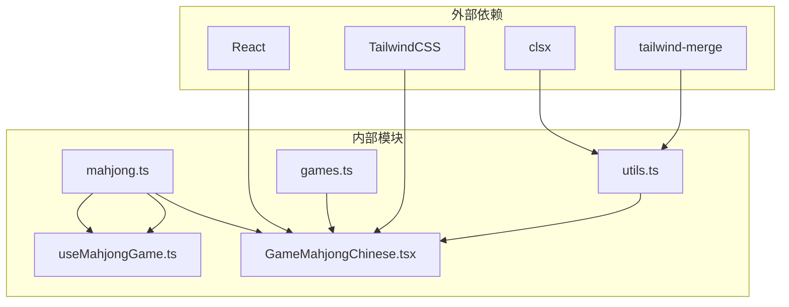

**图表来源**
- [GameMahjongChinese.tsx](file://src/pages/GameMahjongChinese.tsx#L1-L12)
- [useMahjongGame.ts](file://src/hooks/useMahjongGame.ts#L1-L22)
- [utils.ts](file://src/lib/utils.ts#L1-L7)

**章节来源**
- [GameMahjongChinese.tsx](file://src/pages/GameMahjongChinese.tsx#L1-L12)
- [useMahjongGame.ts](file://src/hooks/useMahjongGame.ts#L1-L22)

## 性能考量
麻将规则引擎在性能方面采用了多项优化措施：

### 时间复杂度优化
- **胡牌判定**：使用递归回溯算法，通过早期剪枝减少搜索空间
- **听牌检测**：O(34×14)复杂度，通过预过滤减少无效尝试
- **牌池统计**：线性时间复杂度O(n)，n为已出牌数量

### 空间复杂度优化
- **牌型编码**：使用紧凑的数字编码，减少内存占用
- **状态管理**：通过不可变更新模式，避免不必要的状态复制

### 算法优化技术
- **早期剪枝**：在搜索过程中及时排除不可能的分支
- **缓存机制**：复用计算结果，避免重复计算
- **批量操作**：合并多个状态更新，减少渲染次数

## 故障排除指南

### 常见问题诊断
1. **胡牌判定错误**
   - 检查手牌长度是否为14张
   - 验证牌型编码是否正确
   - 确认特殊牌型检测顺序

2. **AI决策异常**
   - 检查随机种子设置
   - 验证概率阈值配置
   - 确认要牌轮次逻辑

3. **UI状态不同步**
   - 检查状态更新时机
   - 验证事件处理器绑定
   - 确认异步操作处理

### 调试建议
- 使用浏览器开发者工具监控状态变化
- 添加日志输出跟踪关键算法执行
- 实现单元测试覆盖核心算法
- 使用断点调试复杂逻辑分支

**章节来源**
- [useMahjongGame.ts](file://src/hooks/useMahjongGame.ts#L141-L151)
- [useMahjongGame.ts](file://src/hooks/useMahjongGame.ts#L835-L846)

## 结论
Rsbuild2项目的麻将规则引擎实现了中国通用麻将的完整规则体系，具有以下特点：

### 技术优势
- **模块化设计**：清晰的职责分离和接口定义
- **算法优化**：高效的搜索和判定算法
- **扩展性强**：易于添加新的牌型和计分规则
- **性能优秀**：针对麻将规则的专门优化

### 应用价值
- **教育意义**：完整的规则实现便于学习和理解
- **实用价值**：可直接用于实际的麻将应用开发
- **可维护性**：清晰的代码结构和完善的注释

## 附录

### 扩展指南

#### 添加新的牌型规则
1. **定义牌型常量**
   ```typescript
   const NEW_POKER_TYPE = [/* 新牌型编码 */];
   ```

2. **实现判定函数**
   ```typescript
   export function isNewPokerType(tiles: number[]): boolean {
     // 实现新牌型判定逻辑
   }
   ```

3. **更新番种计算**
   ```typescript
   if (isNewPokerType(tiles)) {
     fans.push({ name: '新牌型', fan: 新番数 });
   }
   ```

#### 修改计分系统
1. **调整番种权重**
   - 修改`getWinFans`函数中的番数配置
   - 更新`computeSettlement`函数的计分逻辑

2. **添加计分变体**
   - 支持不同的计分规则
   - 实现动态计分参数配置

#### 性能优化建议
1. **算法层面**
   - 实现更高效的搜索算法
   - 添加缓存机制减少重复计算
   - 优化数据结构提高访问效率

2. **架构层面**
   - 实现异步计算避免阻塞UI
   - 添加计算任务调度机制
   - 优化状态更新策略

**章节来源**
- [mahjong.ts](file://src/lib/mahjong.ts#L381-L414)
- [mahjong.ts](file://src/lib/mahjong.ts#L451-L491)