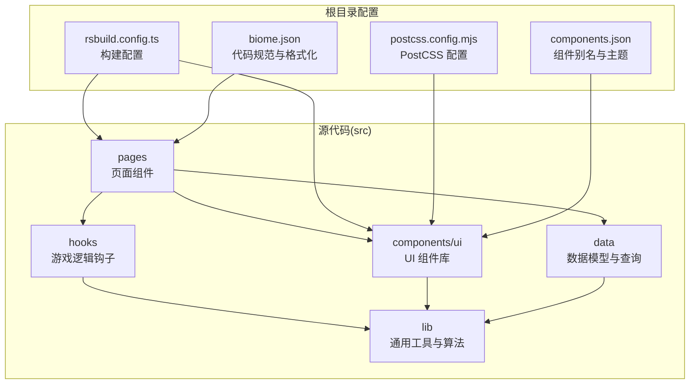
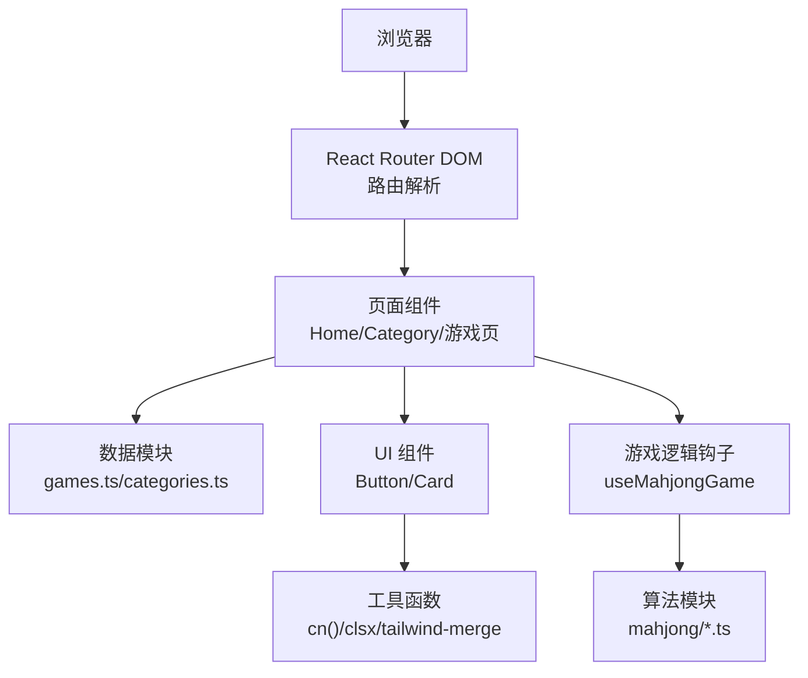
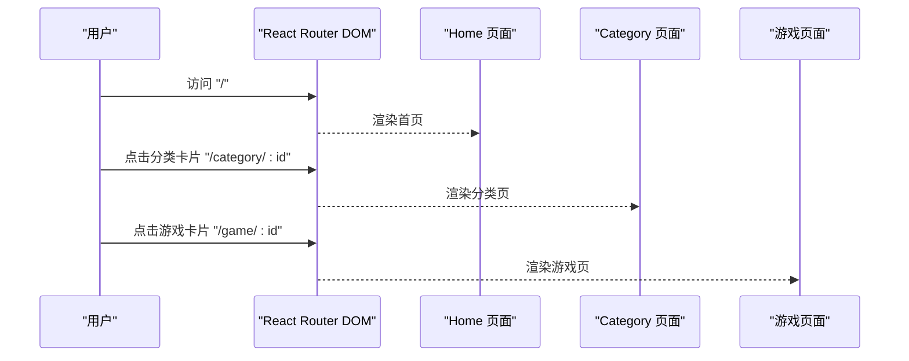
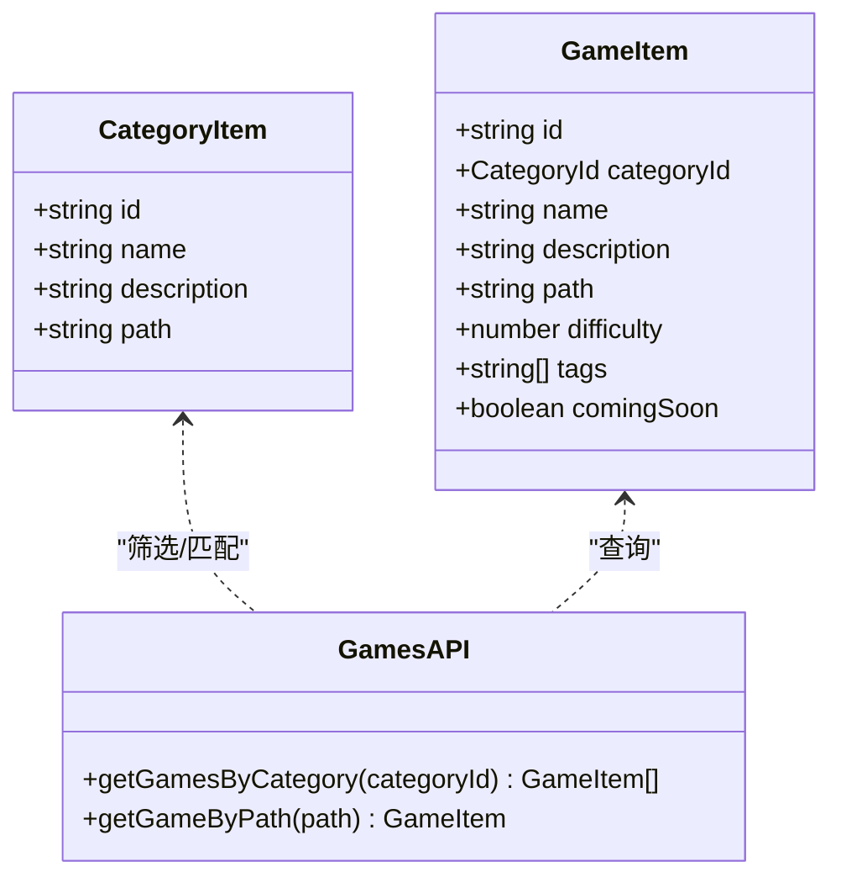
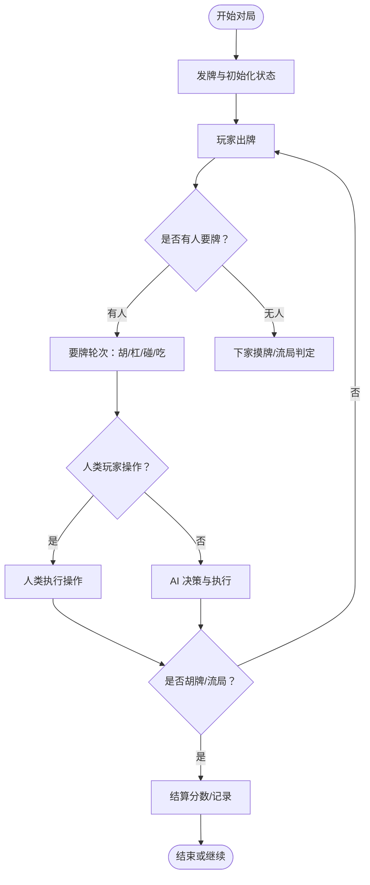
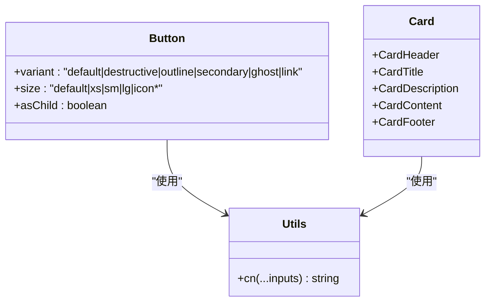
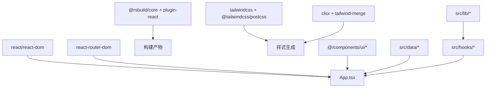

# 项目概述

<cite>
**本文档引用的文件**
- [README.md](file://README.md)
- [package.json](file://package.json)
- [rsbuild.config.ts](file://rsbuild.config.ts)
- [src/App.tsx](file://src/App.tsx)
- [src/pages/Home.tsx](file://src/pages/Home.tsx)
- [src/pages/Category.tsx](file://src/pages/Category.tsx)
- [src/data/games.ts](file://src/data/games.ts)
- [src/data/categories.ts](file://src/data/categories.ts)
- [src/lib/utils.ts](file://src/lib/utils.ts)
- [src/hooks/useMahjongGame.ts](file://src/hooks/useMahjongGame.ts)
- [src/components/ui/button.tsx](file://src/components/ui/button.tsx)
- [src/components/ui/card.tsx](file://src/components/ui/card.tsx)
- [postcss.config.mjs](file://postcss.config.mjs)
- [components.json](file://components.json)
- [biome.json](file://biome.json)
</cite>

## 目录
1. [引言](#引言)
2. [项目结构](#项目结构)
3. [核心组件](#核心组件)
4. [架构总览](#架构总览)
5. [详细组件分析](#详细组件分析)
6. [依赖关系分析](#依赖关系分析)
7. [性能考量](#性能考量)
8. [故障排除指南](#故障排除指南)
9. [结论](#结论)
10. [附录](#附录)

## 引言
本项目是一个基于 React 19.2.4 与 Rsbuild 构建的多功能游戏合集应用，提供多种经典棋牌游戏的在线体验。项目采用现代化前端技术栈，结合组件化架构、响应式设计与清晰的游戏分类导航系统，既适合初学者快速上手，也为有经验的开发者提供了可扩展的技术决策说明。

项目目标是通过统一的路由与数据模型，将“小游戏”“棋类”“扑克”“麻将”四大分类下的游戏进行整合，形成一个易于浏览、易于扩展的游戏平台。用户可以在首页按分类浏览游戏，查看难度标签与标签云，再进入具体游戏页面进行体验。

## 项目结构
项目采用以功能域为中心的组织方式，主要目录如下：
- src/components/ui：可复用 UI 组件（如 Button、Card），配合样式工具实现一致的视觉与交互体验
- src/data：游戏与分类的数据定义及查询函数，提供类型安全的数据访问
- src/hooks：游戏逻辑钩子（如麻将对局状态管理），封装复杂的状态与算法
- src/lib：通用工具函数与游戏算法模块（如麻将规则相关）
- src/pages：页面级组件（Home、Category、各游戏页面），负责页面级布局与业务逻辑
- 根目录配置：Rsbuild 构建配置、PostCSS、Tailwind 集成、Biome 规范等

图表来源
- [rsbuild.config.ts](file://rsbuild.config.ts#L1-L16)
- [postcss.config.mjs](file://postcss.config.mjs#L1-L6)
- [components.json](file://components.json#L1-L22)
- [biome.json](file://biome.json#L1-L35)

章节来源
- [rsbuild.config.ts](file://rsbuild.config.ts#L1-L16)
- [postcss.config.mjs](file://postcss.config.mjs#L1-L6)
- [components.json](file://components.json#L1-L22)
- [biome.json](file://biome.json#L1-L35)

## 核心组件
- 路由与入口
  - 使用 React Router DOM 管理页面路由，App 组件集中声明所有路由路径，涵盖首页、分类页与多个游戏页面
  - 路由配置支持历史 API 回退，便于开发与部署
- 数据层
  - 游戏与分类数据以强类型定义存储，提供按分类筛选与按路径查找的查询函数
  - 分类包含“小游戏”“棋类”“扑克”“麻将”四大板块，便于用户快速定位感兴趣的游戏
- UI 组件库
  - 基于 class-variance-authority 与 radix-ui，提供 Button、Card 等可变体组件，统一风格与交互
  - 通过 Tailwind CSS 与 tailwind-merge 实现灵活的样式组合与冲突合并
- 页面组件
  - Home 展示分类卡片，Category 展示分类下的游戏列表，支持难度标签与标签云
  - 各游戏页面作为独立页面存在，未来可扩展为动态加载或懒加载

章节来源
- [src/App.tsx](file://src/App.tsx#L1-L42)
- [src/pages/Home.tsx](file://src/pages/Home.tsx#L1-L43)
- [src/pages/Category.tsx](file://src/pages/Category.tsx#L1-L132)
- [src/data/games.ts](file://src/data/games.ts#L1-L197)
- [src/data/categories.ts](file://src/data/categories.ts#L1-L34)
- [src/components/ui/button.tsx](file://src/components/ui/button.tsx#L1-L65)
- [src/components/ui/card.tsx](file://src/components/ui/card.tsx#L1-L93)
- [src/lib/utils.ts](file://src/lib/utils.ts#L1-L7)

## 架构总览
系统采用前端单页应用架构，围绕“路由 + 数据 + 组件”的三层结构展开：
- 路由层：集中声明页面路由，支持分类与游戏页面导航
- 数据层：以类型化的数据模型与查询函数为核心，提供稳定的数据访问接口
- 组件层：可复用 UI 组件与页面组件分离职责，提升可维护性与一致性

图表来源
- [src/App.tsx](file://src/App.tsx#L1-L42)
- [src/pages/Home.tsx](file://src/pages/Home.tsx#L1-L43)
- [src/pages/Category.tsx](file://src/pages/Category.tsx#L1-L132)
- [src/data/games.ts](file://src/data/games.ts#L1-L197)
- [src/data/categories.ts](file://src/data/categories.ts#L1-L34)
- [src/components/ui/button.tsx](file://src/components/ui/button.tsx#L1-L65)
- [src/components/ui/card.tsx](file://src/components/ui/card.tsx#L1-L93)
- [src/lib/utils.ts](file://src/lib/utils.ts#L1-L7)
- [src/hooks/useMahjongGame.ts](file://src/hooks/useMahjongGame.ts#L1-L866)

## 详细组件分析

### 路由与导航流程
系统通过集中式路由定义实现清晰的导航结构，从首页到分类再到具体游戏页面，形成完整的用户体验路径。

图表来源
- [src/App.tsx](file://src/App.tsx#L1-L42)
- [src/pages/Home.tsx](file://src/pages/Home.tsx#L1-L43)
- [src/pages/Category.tsx](file://src/pages/Category.tsx#L1-L132)

章节来源
- [src/App.tsx](file://src/App.tsx#L1-L42)
- [src/pages/Home.tsx](file://src/pages/Home.tsx#L1-L43)
- [src/pages/Category.tsx](file://src/pages/Category.tsx#L1-L132)

### 分类与游戏数据模型
数据层以强类型模型与查询函数为核心，确保类型安全与可维护性。

图表来源
- [src/data/categories.ts](file://src/data/categories.ts#L1-L34)
- [src/data/games.ts](file://src/data/games.ts#L1-L197)

章节来源
- [src/data/categories.ts](file://src/data/categories.ts#L1-L34)
- [src/data/games.ts](file://src/data/games.ts#L1-L197)

### 麻将对局状态管理（useMahjongGame）
麻将对局涉及复杂的规则与状态流转，useMahjongGame 将对局状态、玩家操作与 AI 决策封装在 Hook 中，便于在页面中复用。

图表来源
- [src/hooks/useMahjongGame.ts](file://src/hooks/useMahjongGame.ts#L209-L739)

章节来源
- [src/hooks/useMahjongGame.ts](file://src/hooks/useMahjongGame.ts#L1-L866)

### UI 组件与样式体系
- Button 组件提供多种变体与尺寸，支持语义化属性与无障碍增强
- Card 组件提供卡片容器与标题/描述/内容等子组件，便于页面布局
- 工具函数 cn() 结合 clsx 与 tailwind-merge，实现类名的条件组合与冲突合并

图表来源
- [src/components/ui/button.tsx](file://src/components/ui/button.tsx#L1-L65)
- [src/components/ui/card.tsx](file://src/components/ui/card.tsx#L1-L93)
- [src/lib/utils.ts](file://src/lib/utils.ts#L1-L7)

章节来源
- [src/components/ui/button.tsx](file://src/components/ui/button.tsx#L1-L65)
- [src/components/ui/card.tsx](file://src/components/ui/card.tsx#L1-L93)
- [src/lib/utils.ts](file://src/lib/utils.ts#L1-L7)

## 依赖关系分析
- 技术栈选择
  - React 19.2.4：提供组件化与状态管理能力
  - Rsbuild：现代化构建工具，内置 React 插件与别名配置
  - Tailwind CSS：原子化样式框架，结合 tailwind-merge 提升样式组合效率
  - Radix UI + class-variance-authority：提供可组合的 UI 变体与无障碍增强
  - Biome：统一代码格式与质量检查
- 外部依赖与集成
  - @rsbuild/plugin-react：启用 React 生态支持
  - @tailwindcss/postcss：PostCSS 集成，自动扫描与生成样式
  - @rstest：测试适配器，与 Rsbuild 协同工作

图表来源
- [package.json](file://package.json#L15-L41)
- [rsbuild.config.ts](file://rsbuild.config.ts#L1-L16)
- [postcss.config.mjs](file://postcss.config.mjs#L1-L6)
- [components.json](file://components.json#L1-L22)

章节来源
- [package.json](file://package.json#L1-L43)
- [rsbuild.config.ts](file://rsbuild.config.ts#L1-L16)
- [postcss.config.mjs](file://postcss.config.mjs#L1-L6)
- [components.json](file://components.json#L1-L22)

## 性能考量
- 构建优化
  - Rsbuild 默认启用现代打包策略，建议在生产构建中开启压缩与资源分割
  - 别名配置减少路径解析开销，提升开发体验
- 样式优化
  - Tailwind CSS 与 tailwind-merge 配合，避免重复样式与冲突
  - PostCSS 自动扫描，仅生成实际使用的样式
- 代码质量
  - Biome 统一格式化与 Lint 规则，降低维护成本
  - 类型安全的数据模型与组件接口，减少运行时错误

## 故障排除指南
- 开发服务器无法启动
  - 确认已安装依赖并执行开发命令
  - 检查端口占用与网络代理设置
- 样式未生效
  - 确认 Tailwind 配置与 PostCSS 插件正确加载
  - 检查组件是否使用了正确的类名与变体
- 路由跳转异常
  - 确认路由路径与参数与 App 中定义一致
  - 检查 historyApiFallback 配置是否启用
- 测试失败
  - 使用测试适配器与 Rsbuild 协同的命令运行测试
  - 确认测试环境与组件导入路径一致

章节来源
- [README.md](file://README.md#L1-L37)
- [rsbuild.config.ts](file://rsbuild.config.ts#L12-L14)
- [postcss.config.mjs](file://postcss.config.mjs#L1-L6)
- [components.json](file://components.json#L6-L12)

## 结论
本项目以 React 与 Rsbuild 为基础，构建了一个组件化、可扩展的游戏合集应用。通过清晰的路由与数据模型、统一的 UI 组件库与样式体系，以及可维护的游戏逻辑钩子，项目在保证开发效率的同时，也为后续扩展（如新增游戏、规则引擎与 AI 对局）提供了坚实基础。对于初学者，项目提供了直观的页面与数据结构；对于有经验的开发者，项目展示了现代前端工程化的最佳实践。

## 附录
- 快速开始
  - 安装依赖并启动开发服务器，访问本地预览地址
  - 查看构建与预览命令，了解生产流程
- 实际使用场景示例
  - 新增一个“小游戏”：在数据模型中添加条目，创建页面组件并在路由中注册
  - 新增一个“麻将规则”：在 lib 中扩展算法模块，使用 useMahjongGame 管理状态
  - 自定义 UI 主题：调整 components.json 中的主题与颜色变量

章节来源
- [README.md](file://README.md#L1-L37)
- [src/data/games.ts](file://src/data/games.ts#L1-L197)
- [src/hooks/useMahjongGame.ts](file://src/hooks/useMahjongGame.ts#L209-L739)
- [components.json](file://components.json#L3-L11)